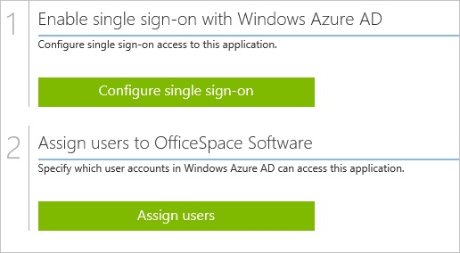
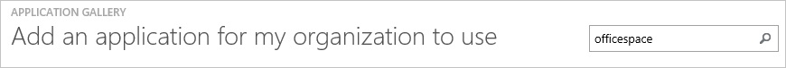
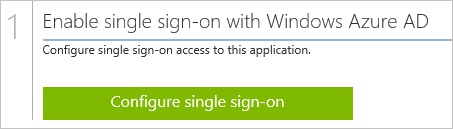
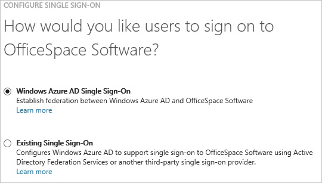
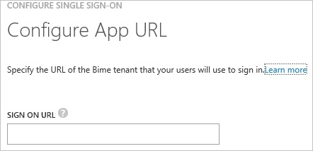
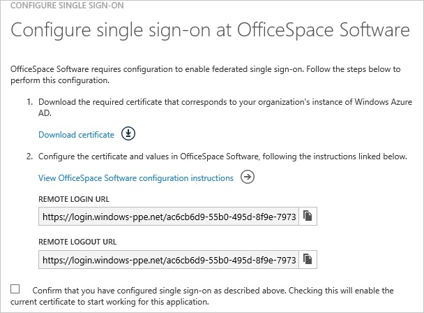
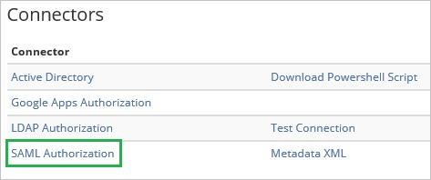
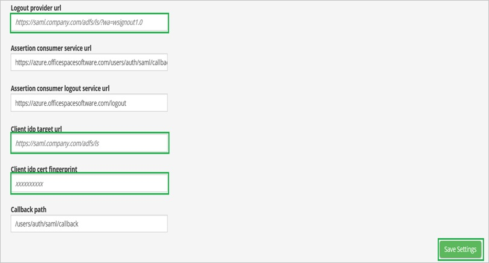
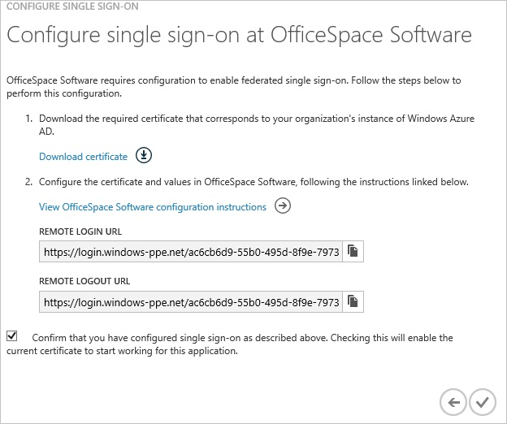
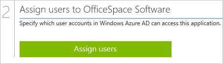

<properties 
    pageTitle="Tutorial: Azure Active Directory integration with OfficeSpace Software | Microsoft Azure" 
    description="Learn how to use OfficeSpace Software with Azure Active Directory to enable single sign-on, automated provisioning, and more!" 
    services="active-directory" 
    authors="jeevansd"  
    documentationCenter="na" 
    manager="femila"/>
<tags 
    ms.service="active-directory" 
    ms.devlang="na" 
    ms.topic="article" 
    ms.tgt_pltfrm="na" 
    ms.workload="identity" 
    ms.date="07/08/2016" 
    ms.author="jeedes" />

#Tutorial: Azure Active Directory integration with OfficeSpace Software
  
The objective of this tutorial is to show the integration of Azure and OfficeSpace Software.  
The scenario outlined in this tutorial assumes that you already have the following items:

-   A valid Azure subscription
-   An OfficeSpace Software single sign-on enabled subscription
  
After completing this tutorial, the Azure AD users you have assigned to OfficeSpace Software will be able to single sign into the application at your OfficeSpace Software company site (service provider initiated sign on), or using the [Introduction to the Access Panel](active-directory-saas-access-panel-introduction.md).
  
The scenario outlined in this tutorial consists of the following building blocks:

1.  Enabling the application integration for OfficeSpace Software
2.  Configuring single sign-on
3.  Configuring user provisioning
4.  Assigning users

##Enabling the application integration for OfficeSpace Software
  
The objective of this section is to outline how to enable the application integration for OfficeSpace Software.

###To enable the application integration for OfficeSpace Software, perform the following steps:

1.  In the Azure classic portal, on the left navigation pane, click **Active Directory**.

    

2.  From the **Directory** list, select the directory for which you want to enable directory integration.

3.  To open the applications view, in the directory view, click **Applications** in the top menu.

    

4.  Click **Add** at the bottom of the page.

    

5.  On the **What do you want to do** dialog, click **Add an application from the gallery**.

    

6.  In the **search box**, type **OfficeSpace Software**.

    

7.  In the results pane, select **OfficeSpace Software**, and then click **Complete** to add the application.

    
##Configuring single sign-on
  
The objective of this section is to outline how to enable users to authenticate to OfficeSpace Software with their account in Azure AD using federation based on the SAML protocol.  
Configuring single sign-on for OfficeSpace Software requires you to retrieve a thumbprint value from a certificate.  
If you are not familiar with this procedure, see [How to retrieve a certificate's thumbprint value](http://youtu.be/YKQF266SAxI).

###To configure single sign-on, perform the following steps:

1.  In the Azure classic portal, on the **OfficeSpace Software** application integration page, click **Configure single sign-on** to open the **Configure Single Sign On ** dialog.

    

2.  On the **How would you like users to sign on to OfficeSpace Software** page, select **Microsoft Azure AD Single Sign-On**, and then click **Next**.

    

3.  On the **Configure App URL** page, in the **OfficeSpace Software Sign On URL** textbox, type the URL used by your users to sign on to your OfficeSpace Software application (e.g.: "*https://company.officespacesoftware.com*"), and then click **Next**.

    

4.  On the **Configure single sign-on at OfficeSpace Software** page, to download your certificate, click **Download certificate**, and then save the certificate file locally on your computer.

    

5.  In a different web browser window, log into your OfficeSpace Software company site as an administrator.

6.  Go to **Admin \> Connectors**.

    

7.  Click **SAML Authorization**.

    

8.  In the **SAML Authorization** section, perform the following steps:

    

    1.  In the Azure classic portal, on the **Configure single sign-on at OfficeSpace Software** dialogue page, copy the **Remote Login URL** value, and then paste it into the **Logout provider url** textbox.
    2.  In the Azure classic portal, on the **Configure single sign-on at OfficeSpace Software** dialogue page, copy the **Remote Logout URL** value, and then paste it into the **Client idp target url** textbox.
    3.  Copy the **Thumbprint** value from the exported certificate, and then paste it into the **Client idp cert fingerprint** textbox.  

        >[AZURE.TIP]
        For more details, see [How to retrieve a certificate's thumbprint value](http://youtu.be/YKQF266SAxI)

    4.  Click **Save Settings**.

9.  On the Azure classic portal, select the single sign-on configuration confirmation, and then click **Complete** to close the **Configure Single Sign On** dialog.

    
##Configuring user provisioning
  
In order to enable Azure AD users to log into OfficeSpace Software, they must be provisioned into OfficeSpace Software. In the case of OfficeSpace Software, provisioning is an automated task.  
There is no action item for you.  
Users are automatically created if necessary during the first single sign-on attempt.

>[AZURE.NOTE]You can use any other OfficeSpace Software user account creation tools or APIs provided by OfficeSpace Software to provision AAD user accounts.

##Assigning users
  
To test your configuration, you need to grant the Azure AD users you want to allow using your application access to it by assigning them.

###To assign users to OfficeSpace Software, perform the following steps:

1.  In the Azure classic portal, create a test account.

2.  On the **OfficeSpace Software **application integration page, click **Assign users**.

    

3.  Select your test user, click **Assign**, and then click **Yes** to confirm your assignment.

    
  
If you want to test your single sign-on settings, open the Access Panel. For more details about the Access Panel, see [Introduction to the Access Panel](active-directory-saas-access-panel-introduction.md).