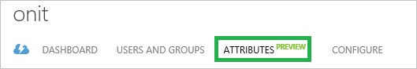
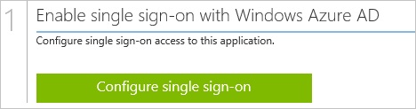
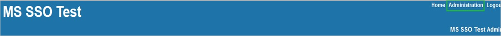
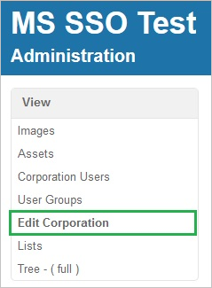
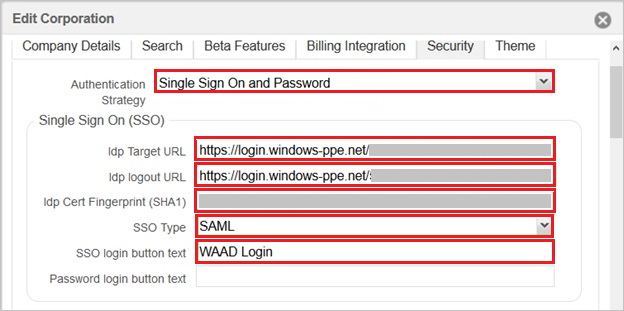
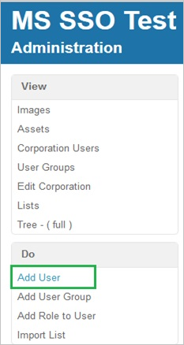
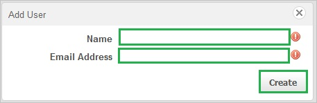

<properties 
    pageTitle="Tutorial: Azure Active Directory integration with Onit | Microsoft Azure" 
    description="Learn how to use Onit with Azure Active Directory to enable single sign-on, automated provisioning, and more!" 
    services="active-directory" 
    authors="jeevansd"  
    documentationCenter="na" 
    manager="femila"/>
<tags 
    ms.service="active-directory" 
    ms.devlang="na" 
    ms.topic="article" 
    ms.tgt_pltfrm="na" 
    ms.workload="identity" 
    ms.date="07/08/2016" 
    ms.author="jeedes" />

#Tutorial: Azure Active Directory integration with Onit
  
The objective of this tutorial is to show the integration of Azure and Onit.  
The scenario outlined in this tutorial assumes that you already have the following items:

-   A valid Azure subscription
-   An Onit single sign-on enabled subscription
  
After completing this tutorial, the Azure AD users you have assigned to Onit will be able to single sign into the application at your Onit company site (service provider initiated sign on), or using the [Introduction to the Access Panel](active-directory-saas-access-panel-introduction.md).
  
The scenario outlined in this tutorial consists of the following building blocks:

1.  Enabling the application integration for Onit
2.  Configuring single sign-on
3.  Configuring user provisioning
4.  Assigning users

##Enabling the application integration for Onit
  
The objective of this section is to outline how to enable the application integration for Onit.

###To enable the application integration for Onit, perform the following steps:

1.  In the Azure classic portal, on the left navigation pane, click **Active Directory**.

    

2.  From the **Directory** list, select the directory for which you want to enable directory integration.

3.  To open the applications view, in the directory view, click **Applications** in the top menu.

    

4.  Click **Add** at the bottom of the page.

    

5.  On the **What do you want to do** dialog, click **Add an application from the gallery**.

    

6.  In the **search box**, type **Onit**.

    

7.  In the results pane, select **Onit**, and then click **Complete** to add the application.

    
##Configuring single sign-on
  
The objective of this section is to outline how to enable users to authenticate to Onit with their account in Azure AD using federation based on the SAML protocol.  
Configuring single sign-on for Onit requires you to retrieve a thumbprint value from a certificate.  
If you are not familiar with this procedure, see [How to retrieve a certificate's thumbprint value](http://youtu.be/YKQF266SAxI).
  
Your Onit application expects the SAML assertions in a specific format, which requires you to add custom attribute mappings to your **saml token attributes** configuration.  
The following screenshot shows an example for this.

###To configure single sign-on, perform the following steps:

1.  In the Azure classic portal, on the **Onit** application integration page, in the menu on the top, click **Attributes** to open the **SAML Token Attributes** dialog.

    

2.  To add the required attribute mappings, perform the following steps:

    
    |Attribute Name|Attribute Value|
	|---|---|
	|name|User.userprincipalname|
    |email|User.mail|

    1.  For each data row in the table above, click **add user attribute**.
    2.  In the **Attribute Name** textbox, type the attribute name shown for that row.
    3.  From the **Attribute Value** list, select the attribute value shown for that row.
    4.  Click **Complete**.

3.  Click **Apply Changes**.

4.  In your browser, click **Back** to open the **Quick Start** dialog again.

5.  Click **Configure single sign-on** to open the **Configure Single Sign On ** dialog.

    

6.  On the **How would you like users to sign on to Onit** page, select **Microsoft Azure AD Single Sign-On**, and then click **Next**.

    

7.  On the **Configure App URL** page, in the **Onit Sign On URL** textbox, type the URL used by your users to sign on to your Onit application (e.g.: "*https://ms-sso-test.onit.com*”), and then click **Next**.

    

8.  On the **Configure single sign-on at Onit** page, to download your certificate, click **Download certificate**, and then save the certificate file locally on your computer.

    

9.  In a different web browser window, log into your Onit company site as an administrator.

10. In the menu on the top, click **Administration**.

    

11. Click **Edit Corporation**.

    

12. Click the **Security** tab.

    

13. On the **Security** tab, perform the following steps:

    

    1.  As **Authentication Strategy**, select **Single Sign On and Password**.
    2.  In the Azure classic portal, on the **Configure single sign-on at Onit** dialog page, copy the **Remote Login URL** value, and then paste it into the **Idp Target URL** textbox.
    3.  In the Azure classic portal, on the **Configure single sign-on at Onit** dialog page, copy the **Remote Logout URL** value, and then paste it into the **Idp logout URL** textbox.
    4.  Copy the **Thumbprint** value from the exported certificate, and then paste it into the **Idp Cert Fingerprint (SHA1)** textbox.  

        >[AZURE.TIP] For more details, see [How to retrieve a certificate's thumbprint value](http://youtu.be/YKQF266SAxI)

    5.  As **SSO Type**, select **SAML**.
    6.  In the **SSO login button text** textbox, type a button text you like.
    7.  Select **Login with SSO: Required for the following domains/users**, type the email address of a test user into the related textbox, and then click **Update**.
        

14. On the Azure classic portal, select the single sign-on configuration confirmation, and then click **Complete** to close the **Configure Single Sign On** dialog.

    
##Configuring user provisioning
  
In order to enable Azure AD users to log into Onit, they must be provisioned into Onit.  
In the case of Onit, provisioning is a manual task.

###To configure user provisioning, perform the following steps:

1.  Sign on to your **Onit** company site as an administrator.

2.  Click **Add User**.

    

3.  On the **Add User** dialog page, perform the following steps:

    

    1.  Type the **Name** and the **Email Address** of a valid AAD account you want to provision into the related textboxes.
    2.  Click **Create**.  

        >[AZURE.NOTE] The account owner will get an email including a link to confirm the account before it becomes active.

>[AZURE.NOTE] You can use any other Onit user account creation tools or APIs provided by Onit to provision AAD user accounts.

##Assigning users
  
To test your configuration, you need to grant the Azure AD users you want to allow using your application access to it by assigning them.

###To assign users to Onit, perform the following steps:

1.  In the Azure classic portal, create a test account.

2.  On the **Onit **application integration page, click **Assign users**.

    

3.  Select your test user, click **Assign**, and then click **Yes** to confirm your assignment.

    
  
If you want to test your single sign-on settings, open the Access Panel. For more details about the Access Panel, see [Introduction to the Access Panel](active-directory-saas-access-panel-introduction.md).