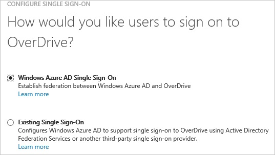
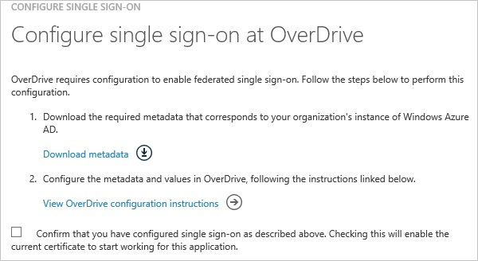

<properties 
    pageTitle="Tutorial: Azure Active Directory integration with Overdrive Books | Microsoft Azure" 
    description="Learn how to use Overdrive Books with Azure Active Directory to enable single sign-on, automated provisioning, and more!" 
    services="active-directory" 
    authors="jeevansd"  
    documentationCenter="na" 
    manager="femila"/>
<tags 
    ms.service="active-directory" 
    ms.devlang="na" 
    ms.topic="article" 
    ms.tgt_pltfrm="na" 
    ms.workload="identity" 
    ms.date="07/08/2016" 
    ms.author="jeedes" />

#Tutorial: Azure Active Directory integration with Overdrive Books
  
The objective of this tutorial is to show the integration of Azure and OverDrive.  
The scenario outlined in this tutorial assumes that you already have the following items:

-   A valid Azure subscription
-   An OverDrive single sign-on enabled subscription
  
After completing this tutorial, the Azure AD users you have assigned to OverDrive will be able to single sign into the application at your OverDrive company site (service provider initiated sign on), or using the [Introduction to the Access Panel](active-directory-saas-access-panel-introduction.md).
  
The scenario outlined in this tutorial consists of the following building blocks:

1.  Enabling the application integration for OverDrive
2.  Configuring single sign-on
3.  Configuring user provisioning
4.  Assigning users

##Enabling the application integration for OverDrive
  
The objective of this section is to outline how to enable the application integration for OverDrive.

###To enable the application integration for OverDrive, perform the following steps:

1.  In the Azure classic portal, on the left navigation pane, click **Active Directory**.

    

2.  From the **Directory** list, select the directory for which you want to enable directory integration.

3.  To open the applications view, in the directory view, click **Applications** in the top menu.

    

4.  Click **Add** at the bottom of the page.

    

5.  On the **What do you want to do** dialog, click **Add an application from the gallery**.

    

6.  In the **search box**, type **OverDrive**.

    

7.  In the results pane, select **OverDrive**, and then click **Complete** to add the application.

    
##Configuring single sign-on
  
The objective of this section is to outline how to enable users to authenticate to OverDrive with their account in Azure AD using federation based on the SAML protocol.

###To configure single sign-on, perform the following steps:

1.  In the Azure classic portal, on the **OverDrive** application integration page, click **Configure single sign-on** to open the **Configure Single Sign On ** dialog.

    

2.  On the **How would you like users to sign on to OverDrive** page, select **Microsoft Azure AD Single Sign-On**, and then click **Next**.

    

3.  On the **Configure App URL** page, in the **OverDrive Sign In URL** textbox, type your URL using the following pattern "*http://mslibrarytest.libraryreserve.com*", and then click **Next**.

    

4.  On the **Configure single sign-on at OverDrive** page, to download the metadata file, and then send it to the OverDrive support team.

    

    >[AZURE.NOTE]The OverDrive support team configures single sign-on for you and sends you a notification when the configuration has been completed.

5.  On the Azure classic portal, select the single sign-on configuration confirmation, and then click **Complete** to close the **Configure Single Sign On** dialog.

    
##Configuring user provisioning
  
There is no action item for you to configure user provisioning to OverDrive.  
When an assigned user tries to log into OverDrive, an OverDrive account is automatically created if necessary.

>[AZURE.NOTE]You can use any other OverDrive user account creation tools or APIs provided by OverDrive to provision AAD user accounts.

##Assigning users
  
To test your configuration, you need to grant the Azure AD users you want to allow using your application access to it by assigning them.

###To assign users to OverDrive, perform the following steps:

1.  In the Azure classic portal, create a test account.

2.  On the **OverDrive **application integration page, click **Assign users**.

    

3.  Select your test user, click **Assign**, and then click **Yes** to confirm your assignment.

    
  
If you want to test your single sign-on settings, open the Access Panel. For more details about the Access Panel, see [Introduction to the Access Panel](active-directory-saas-access-panel-introduction.md).