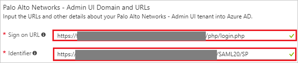
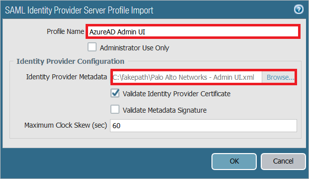
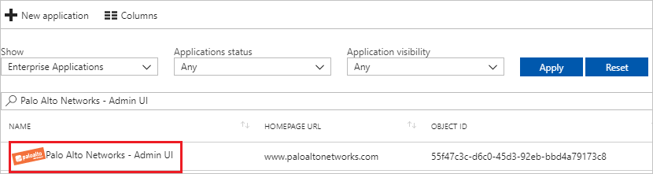

# Tutorial: Azure Active Directory integration with Palo Alto Networks - Admin UI

In this tutorial, you learn how to integrate Palo Alto Networks - Admin UI with Azure Active Directory (Azure AD).

Integrating Palo Alto Networks - Admin UI with Azure AD provides you with the following benefits:

- You can control in Azure AD who has access to Palo Alto Networks - Admin UI.
- You can enable your users to automatically get signed-on to Palo Alto Networks - Admin UI (Single Sign-On) with their Azure AD accounts.
- You can manage your accounts in one central location - the Azure portal.

If you want to know more details about SaaS app integration with Azure AD, see [what is application access and single sign-on with Azure Active Directory](active-directory-appssoaccess-whatis.md).

## Prerequisites

To configure Azure AD integration with Palo Alto Networks - Admin UI, you need the following items:

- An Azure AD subscription
- A Palo Alto Networks - Admin UI single sign-on enabled subscription

> [!NOTE]
> To test the steps in this tutorial, we do not recommend using a production environment.

To test the steps in this tutorial, you should follow these recommendations:

- Do not use your production environment, unless it is necessary.
- If you don't have an Azure AD trial environment, you can [get a one-month trial](https://azure.microsoft.com/pricing/free-trial/).

## Scenario description
In this tutorial, you test Azure AD single sign-on in a test environment. 
The scenario outlined in this tutorial consists of two main building blocks:

1. Adding Palo Alto Networks - Admin UI from the gallery
2. Configuring and testing Azure AD single sign-on

## Adding Palo Alto Networks - Admin UI from the gallery
To configure the integration of Palo Alto Networks - Admin UI into Azure AD, you need to add Palo Alto Networks - Admin UI from the gallery to your list of managed SaaS apps.

**To add Palo Alto Networks - Admin UI from the gallery, perform the following steps:**

1. In the **[Azure portal](https://portal.azure.com)**, on the left navigation panel, click **Azure Active Directory** icon. 

	![The Azure Active Directory button][1]

2. Navigate to **Enterprise applications**. Then go to **All applications**.

	![The Enterprise applications blade][2]
	
3. To add new application, click **New application** button on the top of dialog.

	![The New application button][3]

4. In the search box, type **Palo Alto Networks - Admin UI**, select **Palo Alto Networks - Admin UI** from result panel then click **Add** button to add the application.

	

## Configure and test Azure AD single sign-on

In this section, you configure and test Azure AD single sign-on with Palo Alto Networks - Admin UI based on a test user called "Britta Simon".

For single sign-on to work, Azure AD needs to know what the counterpart user in Palo Alto Networks - Admin UI is to a user in Azure AD. In other words, a link relationship between an Azure AD user and the related user in Palo Alto Networks - Admin UI needs to be established.

In Palo Alto Networks - Admin UI, assign the value of the **user name** in Azure AD as the value of the **Username** to establish the link relationship.

To configure and test Azure AD single sign-on with Palo Alto Networks - Admin UI, you need to complete the following building blocks:

1. **[Configure Azure AD Single Sign-On](#configure-azure-ad-single-sign-on)** - to enable your users to use this feature.
2. **[Create an Azure AD test user](#create-an-azure-ad-test-user)** - to test Azure AD single sign-on with Britta Simon.
3. **[Create a Palo Alto Networks - Admin UI test user](#create-a-palo-alto-networks---admin-ui-test-user)** - to have a counterpart of Britta Simon in Palo Alto Networks - Admin UI that is linked to the Azure AD representation of user.
4. **[Assign the Azure AD test user](#assign-the-azure-ad-test-user)** - to enable Britta Simon to use Azure AD single sign-on.
5. **[Test single sign-on](#test-single-sign-on)** - to verify whether the configuration works.

### Configure Azure AD single sign-on

In this section, you enable Azure AD single sign-on in the Azure portal and configure single sign-on in your Palo Alto Networks - Admin UI application.

**To configure Azure AD single sign-on with Palo Alto Networks - Admin UI, perform the following steps:**

1. In the Azure portal, on the **Palo Alto Networks - Admin UI** application integration page, click **Single sign-on**.

	![Configure single sign-on link][4]

2. On the **Single sign-on** dialog, select **Mode** as	**SAML-based Sign-on** to enable single sign-on.
 
	

3. On the **Palo Alto Networks - Admin UI Domain and URLs** section, perform the following steps:

	

    a. In the **Sign-on URL** textbox, type a URL using the following pattern: `https://<Customer Firewall URL>/php/login.php`

	b. In the **Identifier** textbox, type a URL using the following pattern: `https://<Customer Firewall URL>/SAML20/SP`

	> [!NOTE] 
	> These values are not real. Update these values with the actual Sign-On URL and Identifier. Contact [Palo Alto Networks - Admin UI Client support team](https://support.paloaltonetworks.com/support) to get these values. 
 
4. Palo Alto Networks - Admin UI application expects the SAML assertions in a specific format. Please configure the following claims for this application. You can manage the values of these attributes from the "**User Attributes**" section on application integration page. The following screenshot shows an example for this.
	
	
	
5. In the **User Attributes** section on the **Single sign-on** dialog, configure SAML token attribute as shown in the image above and perform the following steps: Note that attribute values are example only, please map the appropriate values for username and adminrole. There is another optional attribute "accessdomain" which is used to restrict the admin access to specific virtual systems on the firewall.
        
	| Attribute Name | Attribute Value |
	| --- | --- |    
	| username | user.userprincipalname |
	| adminrole | customadmin |

	a. Click **Add attribute** to open the **Add Attribute** dialog.

	

	
	
	b. In the **Name** textbox, type the attribute name shown for that row.
	
	c. From the **Value** list, type the attribute value shown for that row.
	
	d. Click **Ok**

	> [!NOTE]
	> You can refer following articles for more details on the attributes.
	> 1. Administrative Role Profile for Admin UI (adminrole): https://www.paloaltonetworks.com/documentation/80/pan-os/pan-os/firewall-administration/manage-firewall-administrators/configure-an-admin-role-profile
	> 2. Device Access domain for Admin UI (accessdomain): https://www.paloaltonetworks.com/documentation/80/pan-os/web-interface-help/device/device-access-domain

6. On the **SAML Signing Certificate** section, click **Metadata XML** and then save the metadata file on your computer.

	 

7. Click **Save** button.

	

8. Open the Palo Alto site as an administrator in another browser window.

9. Click on **Device**.

	

10. Select **SAML Identity Provider** from the left navigation bar and click "Import" to import the metadata file.

	

11. Perform following actions on the Import window

	

	a. In the **Profile Name** textbox, provide a name e.g Azure AD Admin UI.
	
	b. In **Identity Provider Metadata**, click **Browse** and select the metadata.xml file which you have downloaded from Azure portal
	
	c. Click **OK**

> [!TIP]
> You can now read a concise version of these instructions inside the [Azure portal](https://portal.azure.com), while you are setting up the app!  After adding this app from the **Active Directory > Enterprise Applications** section, simply click the **Single Sign-On** tab and access the embedded documentation through the **Configuration** section at the bottom. You can read more about the embedded documentation feature here: [Azure AD embedded documentation]( https://go.microsoft.com/fwlink/?linkid=845985)
> 

### Create an Azure AD test user

The objective of this section is to create a test user in the Azure portal called Britta Simon.

   ![Create an Azure AD test user][100]

**To create a test user in Azure AD, perform the following steps:**

1. In the Azure portal, in the left pane, click the **Azure Active Directory** button.

    

2. To display the list of users, go to **Users and groups**, and then click **All users**.

    

3. To open the **User** dialog box, click **Add** at the top of the **All Users** dialog box.

    

4. In the **User** dialog box, perform the following steps:

    

    a. In the **Name** box, type **BrittaSimon**.

    b. In the **User name** box, type the email address of user Britta Simon.

    c. Select the **Show Password** check box, and then write down the value that's displayed in the **Password** box.

    d. Click **Create**.
 
### Create a Palo Alto Networks - Admin UI test user

Palo Alto Networks - Admin UI supports Just-in-time user provisioning so a user will be automatically created in the system after the successful authentication if it doesn't already exists. You don't need to perform any action here.

### Assign the Azure AD test user

In this section, you enable Britta Simon to use Azure single sign-on by granting access to Palo Alto Networks - Admin UI.

![Assign the user role][200] 

**To assign Britta Simon to Palo Alto Networks - Admin UI, perform the following steps:**

1. In the Azure portal, open the applications view, and then navigate to the directory view and go to **Enterprise applications** then click **All applications**.

	![Assign User][201] 

2. In the applications list, select **Palo Alto Networks - Admin UI**.

	  

3. In the menu on the left, click **Users and groups**.

	![The "Users and groups" link][202]

4. Click **Add** button. Then select **Users and groups** on **Add Assignment** dialog.

	![The Add Assignment pane][203]

5. On **Users and groups** dialog, select **Britta Simon** in the Users list.

6. Click **Select** button on **Users and groups** dialog.

7. Click **Assign** button on **Add Assignment** dialog.
	
### Test single sign-on

In this section, you test your Azure AD single sign-on configuration using the Access Panel.

When you click the Palo Alto Networks - Admin UI tile in the Access Panel, you should get automatically signed-on to your Palo Alto Networks - Admin UI application.
For more information about the Access Panel, see [Introduction to the Access Panel](active-directory-saas-access-panel-introduction.md). 

## Additional resources

* [List of Tutorials on How to Integrate SaaS Apps with Azure Active Directory](active-directory-saas-tutorial-list.md)
* [What is application access and single sign-on with Azure Active Directory?](active-directory-appssoaccess-whatis.md)

<!--Image references-->

[1]: ./media/active-directory-saas-paloaltoadmin-tutorial/tutorial_general_01.png
[2]: ./media/active-directory-saas-paloaltoadmin-tutorial/tutorial_general_02.png
[3]: ./media/active-directory-saas-paloaltoadmin-tutorial/tutorial_general_03.png
[4]: ./media/active-directory-saas-paloaltoadmin-tutorial/tutorial_general_04.png

[100]: ./media/active-directory-saas-paloaltoadmin-tutorial/tutorial_general_100.png

[200]: ./media/active-directory-saas-paloaltoadmin-tutorial/tutorial_general_200.png
[201]: ./media/active-directory-saas-paloaltoadmin-tutorial/tutorial_general_201.png
[202]: ./media/active-directory-saas-paloaltoadmin-tutorial/tutorial_general_202.png
[203]: ./media/active-directory-saas-paloaltoadmin-tutorial/tutorial_general_203.png

