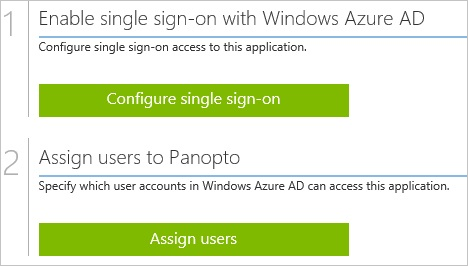
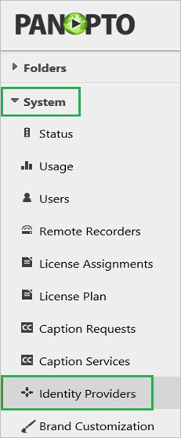
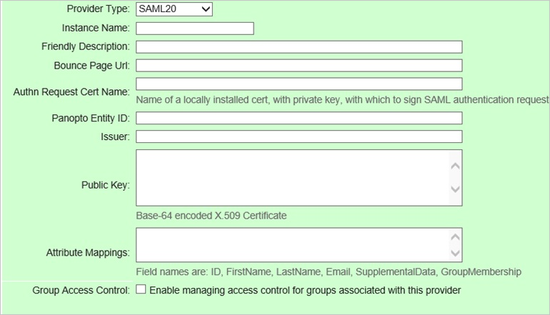

<properties 
    pageTitle="Tutorial: Azure Active Directory integration with Panopto | Microsoft Azure" 
    description="Learn how to use Panopto with Azure Active Directory to enable single sign-on, automated provisioning, and more!" 
    services="active-directory" 
    authors="jeevansd"  
    documentationCenter="na" 
    manager="femila"/>
<tags 
    ms.service="active-directory" 
    ms.devlang="na" 
    ms.topic="article" 
    ms.tgt_pltfrm="na" 
    ms.workload="identity" 
    ms.date="07/08/2016" 
    ms.author="jeedes" />

#Tutorial: Azure Active Directory integration with Panopto
  
The objective of this tutorial is to show the integration of Azure and Panopto.  
The scenario outlined in this tutorial assumes that you already have the following items:

-   A valid Azure subscription
-   A Panopto tenant
  
After completing this tutorial, the Azure AD users you have assigned to Panopto will be able to single sign into the application at your Panopto company site (service provider initiated sign on), or using the [Introduction to the Access Panel](active-directory-saas-access-panel-introduction.md).
  
The scenario outlined in this tutorial consists of the following building blocks:

1.  Enabling the application integration for Panopto
2.  Configuring single sign-on
3.  Configuring user provisioning
4.  Assigning users

##Enabling the application integration for Panopto
  
The objective of this section is to outline how to enable the application integration for Panopto.

###To enable the application integration for Panopto, perform the following steps:

1.  In the Azure classic portal, on the left navigation pane, click **Active Directory**.

    

2.  From the **Directory** list, select the directory for which you want to enable directory integration.

3.  To open the applications view, in the directory view, click **Applications** in the top menu.

    

4.  Click **Add** at the bottom of the page.

    

5.  On the **What do you want to do** dialog, click **Add an application from the gallery**.

    

6.  In the **search box**, type **Panopto**.

    

7.  In the results pane, select **Panopto**, and then click **Complete** to add the application.

    
##Configuring single sign-on
  
The objective of this section is to outline how to enable users to authenticate to Panopto with their account in Azure AD using federation based on the SAML protocol.  
As part of this procedure, you are required to create a base-64 encoded certificate file.  
If you are not familiar with this procedure, see [How to convert a binary certificate into a text file](http://youtu.be/PlgrzUZ-Y1o).

###To configure single sign-on, perform the following steps:

1.  In the Azure classic portal, on the **Panopto** application integration page, click **Configure single sign-on** to open the **Configure Single Sign On ** dialog.

    

2.  On the **How would you like users to sign on to Panopto** page, select **Microsoft Azure AD Single Sign-On**, and then click **Next**.

    

3.  On the **Configure App URL** page, in the **Panopto Sign In URL** textbox, type your URL using the following pattern "*https://\<tenant-name\>. Panopto.com*", and then click **Next**.

    

4.  On the **Configure single sign-on at Panopto** page, to download your certificate, click **Download certificate**, and then save the certificate file on your computer.

    

5.  In a different web browser window, log into your Panopto company site as an administrator.

6.  In the toolbar on the left, click **System**, and then click **Identity Providers**.

    

7.  Click **Add Provider**.

    

8.  In the SAML provider section, perform the following steps:

    

    1.  From the **Provider Type** list, select **SAML20**
    2.  In the **Instance Name** textbox, type a name for the instance.
    3.  In the **Friendly Description** textbox, type a friendly description.
    4.  In the Azure classic portal, on the **Configure single sign-on at Panopto** dialog page, copy the **Issuer URL** value, and then paste it into the **Issuer** textbox.
    5.  In the Azure classic portal, on the **Configure single sign-on at Panopto** dialog page, copy the **SAML SSO URL** value, and then paste it into the **Bounce Page Url** textbox.
    6.  Create a **base-64 encoded** file from your downloaded certificate.  

        >[AZURE.TIP] For more details, see [How to convert a binary certificate into a text file](http://youtu.be/PlgrzUZ-Y1o)

    7.  Open your base-64 encoded certificate in notepad, copy the content of it into your clipboard, and then paste it to the **Public Key** textbox
    8.  Click **Save**.
        

9.  On the Azure classic portal, select the single sign-on configuration confirmation, and then click **Complete** to close the **Configure Single Sign On** dialog.

    
##Configuring user provisioning
  
There is no action item for you to configure user provisioning to Panopto.  
When an assigned user tries to log into Panopto using the access panel, Panopto checks whether the user exists.  
If there is no user account available yet, it is automatically created by Panopto.

>[AZURE.NOTE]You can use any other Panopto user account creation tools or APIs provided by Panopto to provision Azure AD user accounts.

##Assigning users
  
To test your configuration, you need to grant the Azure AD users you want to allow using your application access to it by assigning them.

###To assign users to Panopto, perform the following steps:

1.  In the Azure classic portal, create a test account.

2.  On the **Panopto **application integration page, click **Assign users**.

    

3.  Select your test user, click **Assign**, and then click **Yes** to confirm your assignment.

    
  
If you want to test your single sign-on settings, open the Access Panel. For more details about the Access Panel, see [Introduction to the Access Panel](active-directory-saas-access-panel-introduction.md).