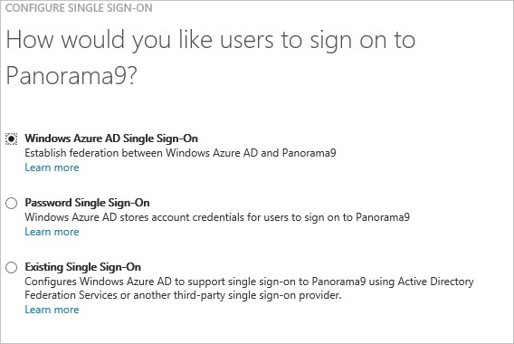
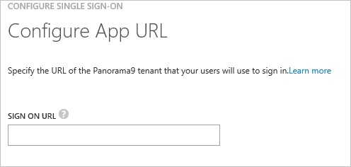
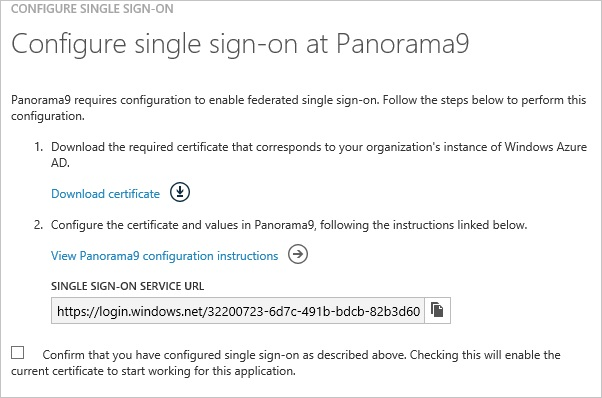
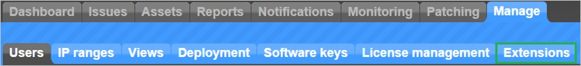
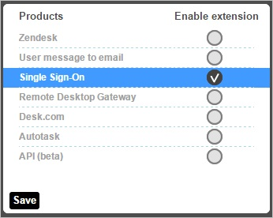
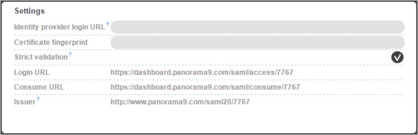
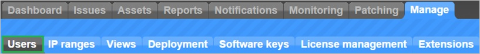
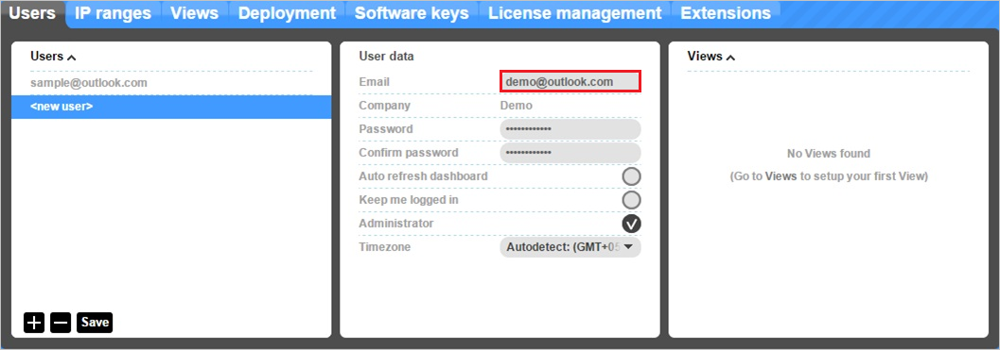
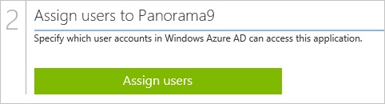

<properties 
    pageTitle="Tutorial: Azure Active Directory integration with Panorama9 | Microsoft Azure" 
    description="Learn how to use Panorama9 with Azure Active Directory to enable single sign-on, automated provisioning, and more!" 
    services="active-directory" 
    authors="jeevansd"  
    documentationCenter="na" 
    manager="femila"/>
<tags 
    ms.service="active-directory" 
    ms.devlang="na" 
    ms.topic="article" 
    ms.tgt_pltfrm="na" 
    ms.workload="identity" 
    ms.date="07/08/2016" 
    ms.author="jeedes" />

#Tutorial: Azure Active Directory integration with Panorama9
  
The objective of this tutorial is to show the integration of Azure and Panorama9.  
The scenario outlined in this tutorial assumes that you already have the following items:

-   A valid Azure subscription
-   A Panorama9 single sign-on enabled subscription
  
After completing this tutorial, the Azure AD users you have assigned to Panorama9 will be able to single sign into the application at your Panorama9 company site (service provider initiated sign on), or using the [Introduction to the Access Panel](active-directory-saas-access-panel-introduction.md).
  
The scenario outlined in this tutorial consists of the following building blocks:

1.  Enabling the application integration for Panorama9
2.  Configuring single sign-on
3.  Configuring user provisioning
4.  Assigning users

##Enabling the application integration for Panorama9
  
The objective of this section is to outline how to enable the application integration for Panorama9.

###To enable the application integration for Panorama9, perform the following steps:

1.  In the Azure classic portal, on the left navigation pane, click **Active Directory**.

    

2.  From the **Directory** list, select the directory for which you want to enable directory integration.

3.  To open the applications view, in the directory view, click **Applications** in the top menu.

    

4.  Click **Add** at the bottom of the page.

    

5.  On the **What do you want to do** dialog, click **Add an application from the gallery**.

    

6.  In the **search box**, type **Panorama9**.

    

7.  In the results pane, select **Panorama9**, and then click **Complete** to add the application.

    
##Configuring single sign-on
  
The objective of this section is to outline how to enable users to authenticate to Panorama9 with their account in Azure AD using federation based on the SAML protocol.  
Configuring single sign-on for Panorama9 requires you to retrieve a thumbprint value from a certificate.  
If you are not familiar with this procedure, see [How to retrieve a certificate's thumbprint value](http://youtu.be/YKQF266SAxI).

###To configure single sign-on, perform the following steps:

1.  In the Azure classic portal, on the **Panorama9** application integration page, click **Configure single sign-on** to open the **Configure Single Sign On ** dialog.

    

2.  On the **How would you like users to sign on to Panorama9** page, select **Microsoft Azure AD Single Sign-On**, and then click **Next**.

    

3.  On the **Configure App URL** page, in the **Panorama9 Sign On URL** textbox, type your URL used by your users to sign in to Panorama9 (e.g.: “*https://dashboard.panorama9.com/saml/access/3262*"), and then click **Next**.

    

4.  On the **Configure single sign-on at Panorama9** page, to download your certificate, click **Download certificate**, and then save it locally on your computer.

    

5.  In a different web browser window, log into your Panorama9 company site as an administrator.

6.  In the toolbar on the top, click **Manage**, and then click **Extensions**.

    

7.  On the **Extensions** dialog, click **Single Sign-On**.

    

8.  In the **Settings** section, perform the following steps:

    

    1.  In the Azure classic portal, on the **Configure single sign-on at Panorama9** dialog page, copy the **Single Sign-On Service URL** value, and then paste it into the **Identity provider URL** textbox.
    2.  Copy the **Thumbprint** value from the exported certificate, and then paste it into the **Certificate fingerprint** textbox.  

        >[AZURE.TIP]For more details, see [How to retrieve a certificate's thumbprint value](http://youtu.be/YKQF266SAxI)

    3.  Click **Save**.

9.  On the Azure AD classic portal, select the single sign-on configuration confirmation, and then click **Complete** to close the **Configure Single Sign On** dialog.

    
##Configuring user provisioning
  
In order to enable Azure AD users to log into Panorama9, they must be provisioned into Panorama9.  
In the case of Panorama9, provisioning is a manual task.

###To configure user provisioning, perform the following steps:

1.  Log in to your **Panorama9** company site as an administrator.

2.  In the menu on the top, click **Manage**, and then click **Users**.

    

3.  Click **+**.

4.  In the User data section, perform the following steps:

    

    1.  In the **Email** textbox, type the email address of a valid Azure Active Directory user you want to provision.
    2.  Click **Save**.

>[AZURE.NOTE]You can use any other Panorama9 user account creation tools or APIs provided by Panorama9 to provision AAD user accounts.

##Assigning users
  
To test your configuration, you need to grant the Azure AD users you want to allow using your application access to it by assigning them.

###To assign users to Panorama9, perform the following steps:

1.  In the Azure classic portal, create a test account.

2.  On the **Panorama9** application integration page, click **Assign users**.

    

3.  Select your test user, click **Assign**, and then click **Yes** to confirm your assignment.

    
  
If you want to test your single sign-on settings, open the Access Panel. For more details about the Access Panel, see [Introduction to the Access Panel](active-directory-saas-access-panel-introduction.md).