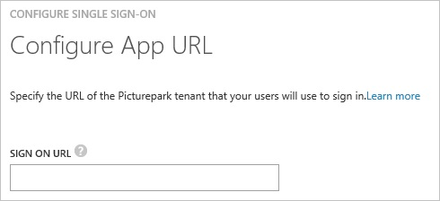
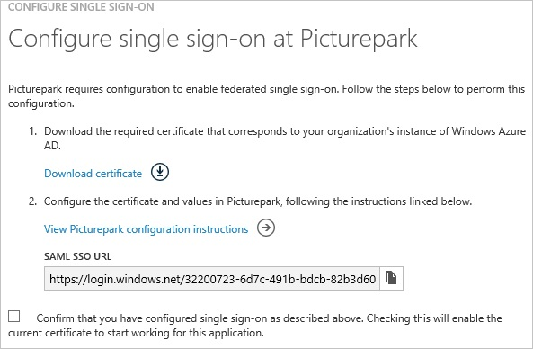
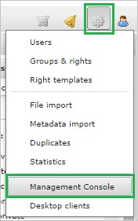
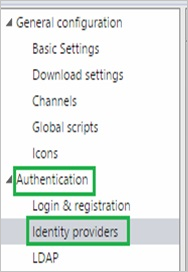
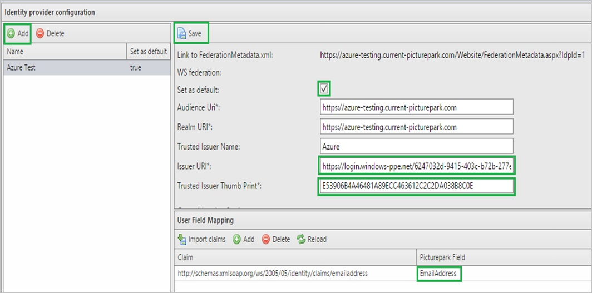
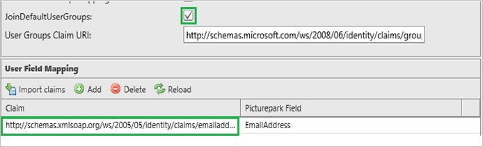
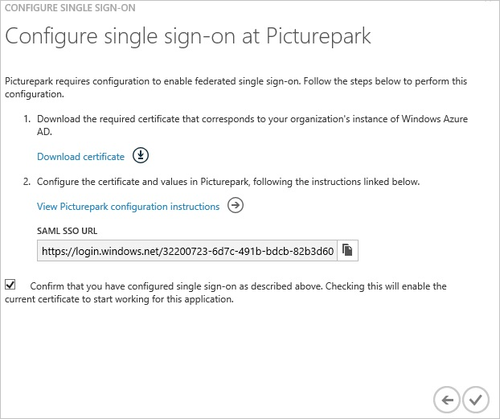
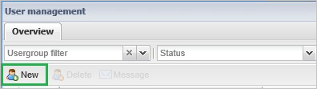
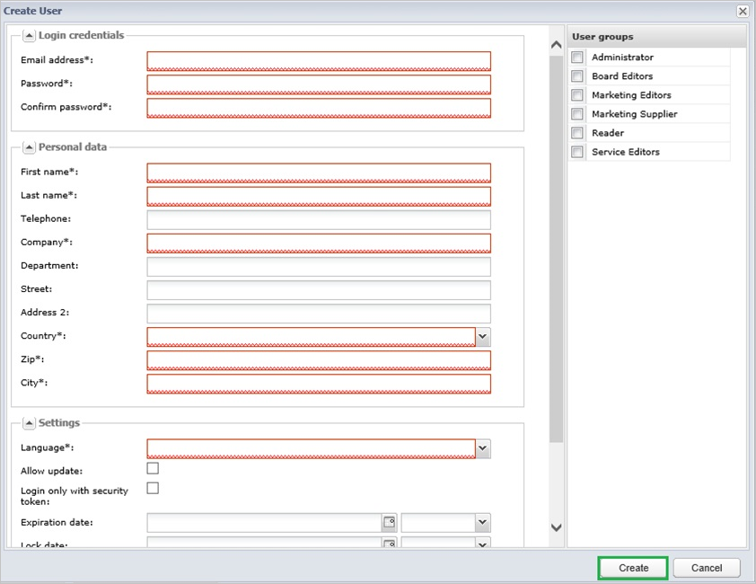

<properties 
    pageTitle="Tutorial: Azure Active Directory Integration with Picturepark | Microsoft Azure" 
    description="Learn how to use Picturepark with Azure Active Directory to enable single sign-on, automated provisioning, and more!" 
    services="active-directory" 
    authors="jeevansd"  
    documentationCenter="na" 
    manager="femila"/>
<tags 
    ms.service="active-directory" 
    ms.devlang="na" 
    ms.topic="article" 
    ms.tgt_pltfrm="na" 
    ms.workload="identity" 
    ms.date="07/07/2016" 
    ms.author="jeedes" />

#Tutorial: Azure Active Directory Integration with Picturepark
  
The objective of this tutorial is to show the integration of Azure and Picturepark.  
The scenario outlined in this tutorial assumes that you already have the following items:

-   A valid Azure subscription
-   A Picturepark tenant
  
After completing this tutorial, the Azure AD users you have assigned to Picturepark will be able to single sign into the application at your Picturepark company site (service provider initiated sign on), or using the [Introduction to the Access Panel](active-directory-saas-access-panel-introduction.md).
  
The scenario outlined in this tutorial consists of the following building blocks:

1.  Enabling the application integration for Picturepark
2.  Configuring single sign-on
3.  Configuring user provisioning
4.  Assigning users

##Enabling the application integration for Picturepark
  
The objective of this section is to outline how to enable the application integration for Picturepark.

###To enable the application integration for Picturepark, perform the following steps:

1.  In the Azure classic portal, on the left navigation pane, click **Active Directory**.

    

2.  From the **Directory** list, select the directory for which you want to enable directory integration.

3.  To open the applications view, in the directory view, click **Applications** in the top menu.

    

4.  Click **Add** at the bottom of the page.

    

5.  On the **What do you want to do** dialog, click **Add an application from the gallery**.

    

6.  In the **search box**, type **Picturepark**.

    

7.  In the results pane, select **Picturepark**, and then click **Complete** to add the application.

    

##Configuring single sign-on
  
The objective of this section is to outline how to enable users to authenticate to Picturepark with their account in Azure AD using federation based on the SAML protocol.  
Configuring single sign-on for Picturepark requires you to retrieve a thumbprint value from a certificate.  
If you are not familiar with this procedure, see [How to retrieve a certificate's thumbprint value](http://youtu.be/YKQF266SAxI)..

###To configure single sign-on, perform the following steps:

1.  In the Azure classic portal, on the **Picturepark** application integration page, click **Configure single sign-on** to open the **Configure Single Sign On ** dialog.

    

2.  On the **How would you like users to sign on to Picturepark** page, select **Microsoft Azure AD Single Sign-On**, and then click **Next**.

    

3.  On the **Configure App URL** page, in the **Picturepark Sign On URL** textbox, type your URL using the following pattern "*http://company.picturepark.com*", and then click **Next**.

    

4.  On the **Configure single sign-on at Picturepark** page, to download your certificate, click **Download certificate**, and then save the certificate file locally on your computer.

    

5.  In a different web browser window, log into your Picturepark company site as an administrator.

6.  In the toolbar on the top, click **Administrative tools**, and then click **Management Console**.

    

7.  Click **Authentication**, and then click **Identity providers**.

    

8.  In the **Identity provider configuration** section, perform the following steps:

    

    1.  Click **Add**.
    2.  Type a name for your configuration.
    3.  Select **Set as default**.
    4.  In the Azure classic portal, on the **Configure single sign-on at Picturepark** dialog page, copy the **SAML SSO URL** value, and then paste it into the **Issuer URI** textbox.
    5.  Copy the **Thumbprint** value from the exported certificate, and then paste it into the **Trusted Issuer Thumb Print** textbox.  

        >[AZURE.TIP]For more details, see [How to retrieve a certificate's thumbprint value](http://youtu.be/YKQF266SAxI)

    6.  Click **JoinDefaultUsersGroup**.
    7.  To set the **Emailaddress** attribute in the **Claim** textbox, type **http://schemas.xmlsoap.org/ws/2005/05/identity/claims/emailaddress**.
        
    8.  Click **Save**.

9.  On the Azure classic portal, select the single sign-on configuration confirmation, and then click **Complete** to close the **Configure Single Sign On** dialog.

    

##Configuring user provisioning
  
In order to enable Azure AD users to log into Picturepark, they must be provisioned into Picturepark.  
In the case of Picturepark, provisioning is a manual task.

###To provision a user accounts, perform the following steps:

1.  Log in to your **Picturepark** tenant.

2.  In the toolbar on the top, click **Administrative tools**, and then click **Users**.

    

3.  In the **Users overview** tab, click **New**.

    

4.  On the **Create User** dialog, perform the following steps:

    

    1.  Type the : **Email Address**, **Password**, **Confirm Password**, **First Name**, **Last Name**, **Company**, **Country**, **ZIP**, **City** of a valid Azure Active Directory User you want ot provision into the related textboxes.
    2.  Select a **Language**.
    3.  Click **Create**.

>[AZURE.NOTE]You can use any other Picturepark user account creation tools or APIs provided by Picturepark to provision AAD user accounts.

##Assigning users
  
To test your configuration, you need to grant the Azure AD users you want to allow using your application access to it by assigning them.

###To assign users to Picturepark, perform the following steps:

1.  In the Azure classic portal, create a test account.

2.  On the **Picturepark **application integration page, click **Assign users**.

    

3.  Select your test user, click **Assign**, and then click **Yes** to confirm your assignment.

    
  
If you want to test your single sign-on settings, open the Access Panel. For more details about the Access Panel, see [Introduction to the Access Panel](active-directory-saas-access-panel-introduction.md).