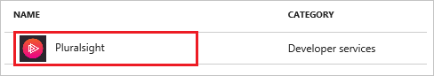
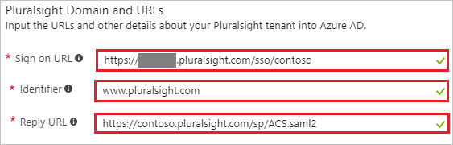
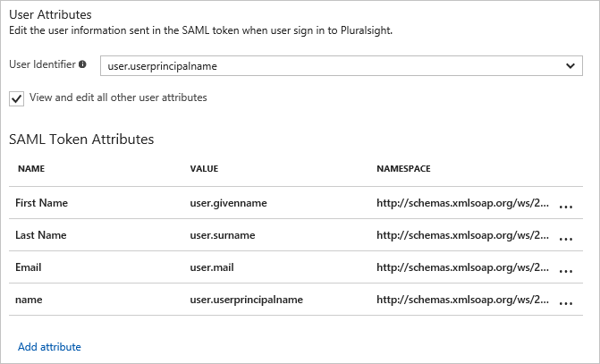
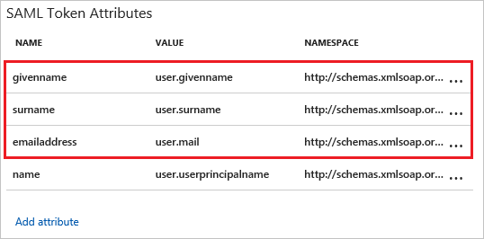
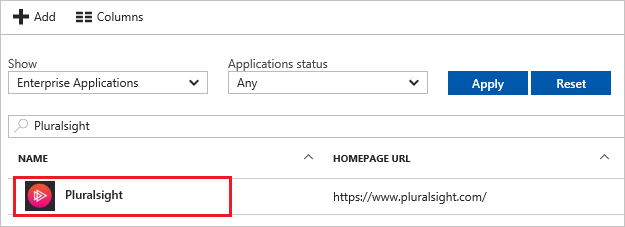

# Tutorial: Azure Active Directory integration with Pluralsight

In this tutorial, you learn how to integrate Pluralsight with Azure Active Directory (Azure AD).

Integrating Pluralsight with Azure AD provides you with the following benefits:

- You can control in Azure AD who has access to Pluralsight
- You can enable your users to automatically get signed-on to Pluralsight (Single Sign-On) with their Azure AD accounts
- You can manage your accounts in one central location - the Azure portal

If you want to know more details about SaaS app integration with Azure AD, see [what is application access and single sign-on with Azure Active Directory](active-directory-appssoaccess-whatis.md).

## Prerequisites

To configure Azure AD integration with Pluralsight, you need the following items:

- An Azure AD subscription
- A Pluralsight single sign-on enabled subscription

> [!NOTE]
> To test the steps in this tutorial, we do not recommend using a production environment.

To test the steps in this tutorial, you should follow these recommendations:

- Do not use your production environment, unless it is necessary.
- If you don't have an Azure AD trial environment, you can get a one-month trial [here](https://azure.microsoft.com/pricing/free-trial/).

## Scenario description
In this tutorial, you test Azure AD single sign-on in a test environment. 
The scenario outlined in this tutorial consists of two main building blocks:

1. Adding Pluralsight from the gallery
2. Configuring and testing Azure AD single sign-on

## Adding Pluralsight from the gallery
To configure the integration of Pluralsight into Azure AD, you need to add Pluralsight from the gallery to your list of managed SaaS apps.

**To add Pluralsight from the gallery, perform the following steps:**

1. In the **[Azure portal](https://portal.azure.com)**, on the left navigation panel, click **Azure Active Directory** icon. 

	![Active Directory][1]

2. Navigate to **Enterprise applications**. Then go to **All applications**.

	![Applications][2]
	
3. To add new application, click **New application** button on the top of dialog.

	![Applications][3]

4. In the search box, type **Pluralsight**.

	

5. In the results panel, select **Pluralsight**, and then click **Add** button to add the application.

	

##  Configuring and testing Azure AD single sign-on
In this section, you configure and test Azure AD single sign-on with Pluralsight based on a test user called "Britta Simon".

For single sign-on to work, Azure AD needs to know what the counterpart user in Pluralsight is to a user in Azure AD. In other words, a link relationship between an Azure AD user and the related user in Pluralsight needs to be established.

In Pluralsight, assign the value of the **user name** in Azure AD as the value of the **Username** to establish the link relationship.

To configure and test Azure AD single sign-on with Pluralsight, you need to complete the following building blocks:

1. **[Configuring Azure AD Single Sign-On](#configuring-azure-ad-single-sign-on)** - to enable your users to use this feature.
2. **[Creating an Azure AD test user](#creating-an-azure-ad-test-user)** - to test Azure AD single sign-on with Britta Simon.
3. **[Creating a Pluralsight test user](#creating-a-pluralsight-test-user)** - to have a counterpart of Britta Simon in Pluralsight that is linked to the Azure AD representation of user.
4. **[Assigning the Azure AD test user](#assigning-the-azure-ad-test-user)** - to enable Britta Simon to use Azure AD single sign-on.
5. **[Testing Single Sign-On](#testing-single-sign-on)** - to verify whether the configuration works.

### Configuring Azure AD single sign-on

In this section, you enable Azure AD single sign-on in the Azure portal and configure single sign-on in your Pluralsight application.

**To configure Azure AD single sign-on with Pluralsight, perform the following steps:**

1. In the Azure portal, on the **Pluralsight** application integration page, click **Single sign-on**.

	![Configure Single Sign-On][4]

2. On the **Single sign-on** dialog, select **Mode** as	**SAML-based Sign-on** to enable single sign-on.
 
	

3. On the **Pluralsight Domain and URLs** section, perform the following:

	

    In the **Sign-on URL** textbox, type a URL using the following pattern: `https://<instance name>.pluralsight.com/sso/<company name>`

	> [!NOTE] 
	> This value is not real. Update this value with the actual Sign-On URL. Contact [Pluralsight Client support team](mailto:support@pluralsight.com) to get this value. 
 

4. On the **SAML Signing Certificate** section, click **Metadata XML** and then save the metadata file on your computer.

	 

5. The objective of this section is to enable Azure AD single sign-on in the Azure portal and to configure SSO in the Pluralsight application.

    The Pluralsight application expects the SAML assertions in a specific format, which requires you to add custom attribute mappings to your SAML token attributes configuration. The following screenshot shows an example for this.

    

    >[!NOTE]
    >You can also add the **"Unique ID"** attribute with the appropriate value like EmployeeID or something else which suits for your organization. Also note that this is not the required attribute; however, you can add it to  identify the unique user.

6. To remove the redundant **SAML token attributes**, perform the following steps: 
   
     
  
    For each user attribute in the red box of the table above, click on the **three dots** over the attribute, and then click **Delete**. 

7. To add the required **SAML token attributes**, for each row shown in the table below, perform the following steps:
   
   | Attribute Name | Attribute Value |
   | ---| --- |
   | First Name |user.givenname |
   | Last Name |user.surname |
   | Email |user.mail |
   
    a. Click **add user attribute** to open the **Add User Attribure** dialog.
    
    
  
    b. In the **Attribute Name** textbox, type the attribute name shown for that row.
  
    c. From the **Attribute Value** list, select the attribute value shown for that row.
  
    d. Click **Ok**.    

8. Click **Save** button.

	

9. To get SSO configured for your application, contact [Pluralsight Professional Services](mailTo:professionalservices@pluralsight.com) team and provide the downloaded metadata file.

> [!TIP]
> You can now read a concise version of these instructions inside the [Azure portal](https://portal.azure.com), while you are setting up the app!  After adding this app from the **Active Directory > Enterprise Applications** section, simply click the **Single Sign-On** tab and access the embedded documentation through the **Configuration** section at the bottom. You can read more about the embedded documentation feature here: [Azure AD embedded documentation]( https://go.microsoft.com/fwlink/?linkid=845985)
> 

### Creating an Azure AD test user
The objective of this section is to create a test user in the Azure portal called Britta Simon.

![Create Azure AD User][100]

**To create a test user in Azure AD, perform the following steps:**

1. In the **Azure portal**, on the left navigation pane, click **Azure Active Directory** icon.

	 

2. To display the list of users, go to **Users and groups** and click **All users**.
	
	 

3. To open the **User** dialog, click **Add** on the top of the dialog.
 
	 

4. On the **User** dialog page, perform the following steps:
 
	 

    a. In the **Name** textbox, type **BrittaSimon**.

    b. In the **User name** textbox, type the **email address** of BrittaSimon.

	c. Select **Show Password** and write down the value of the **Password**.

    d. Click **Create**.
 
### Creating a Pluralsight test user

The objective of this section is to create a user called Britta Simon in Pluralsight. Please work with [Pluralsight Client support team](mailto:support@pluralsight.com) to add the users in the Pluralsight account. 

### Assigning the Azure AD test user

In this section, you enable Britta Simon to use Azure single sign-on by granting access to Pluralsight.

![Assign User][200] 

**To assign Britta Simon to Pluralsight, perform the following steps:**

1. In the Azure portal, open the applications view, and then navigate to the directory view and go to **Enterprise applications** then click **All applications**.

	![Assign User][201] 

2. In the applications list, select **Pluralsight**.

	 

3. In the menu on the left, click **Users and groups**.

	![Assign User][202] 

4. Click **Add** button. Then select **Users and groups** on **Add Assignment** dialog.

	![Assign User][203]

5. On **Users and groups** dialog, select **Britta Simon** in the Users list.

6. Click **Select** button on **Users and groups** dialog.

7. Click **Assign** button on **Add Assignment** dialog.
	
### Testing single sign-on

The objective of this section is to test your Azure AD single sign-on configuration using the Access Panel.

When you click the Pluralsight tile in the Access Panel, you should get automatically signed-on to your Pluralsight application. For more information about the Access Panel, see [Introduction to the Access Panel](active-directory-saas-access-panel-introduction.md).

## Additional resources

* [List of Tutorials on How to Integrate SaaS Apps with Azure Active Directory](active-directory-saas-tutorial-list.md)
* [What is application access and single sign-on with Azure Active Directory?](active-directory-appssoaccess-whatis.md)

<!--Image references-->

[1]: ./media/active-directory-saas-pluralsight-tutorial/tutorial_general_01.png
[2]: ./media/active-directory-saas-pluralsight-tutorial/tutorial_general_02.png
[3]: ./media/active-directory-saas-pluralsight-tutorial/tutorial_general_03.png
[4]: ./media/active-directory-saas-pluralsight-tutorial/tutorial_general_04.png

[100]: ./media/active-directory-saas-pluralsight-tutorial/tutorial_general_100.png

[200]: ./media/active-directory-saas-pluralsight-tutorial/tutorial_general_200.png
[201]: ./media/active-directory-saas-pluralsight-tutorial/tutorial_general_201.png
[202]: ./media/active-directory-saas-pluralsight-tutorial/tutorial_general_202.png
[203]: ./media/active-directory-saas-pluralsight-tutorial/tutorial_general_203.png

