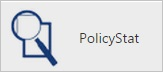
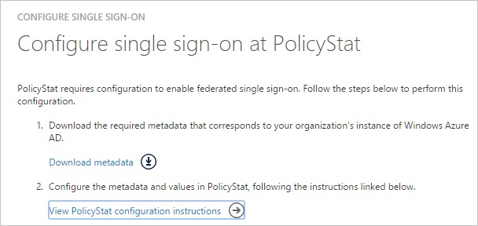
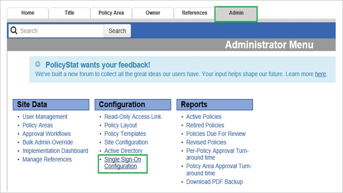
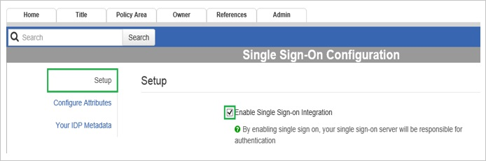
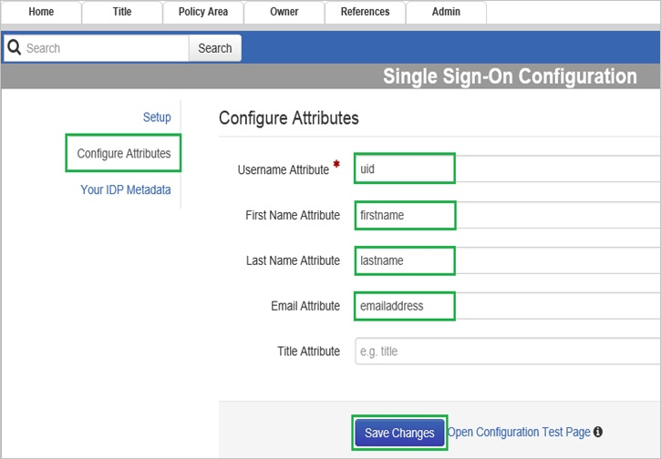
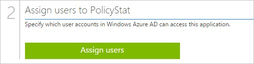

<properties 
    pageTitle="Tutorial: Azure Active Directory Integration with PolicyStat | Microsoft Azure" 
    description="Learn how to use PolicyStat with Azure Active Directory to enable single sign-on, automated provisioning, and more!" 
    services="active-directory" 
    authors="jeevansd"  
    documentationCenter="na" 
    manager="femila"/>
<tags 
    ms.service="active-directory" 
    ms.devlang="na" 
    ms.topic="article" 
    ms.tgt_pltfrm="na" 
    ms.workload="identity" 
    ms.date="07/07/2016" 
    ms.author="jeedes" />

#Tutorial: Azure Active Directory Integration with PolicyStat
  
The objective of this tutorial is to show the integration of Azure and PolicyStat.  
The scenario outlined in this tutorial assumes that you already have the following items:

-   A valid Azure subscription
-   A PolicyStat tenant
  
After completing this tutorial, the Azure AD users you have assigned to PolicyStat will be able to single sign into the application at your PolicyStat company site (service provider initiated sign on), or using the [Introduction to the Access Panel](active-directory-saas-access-panel-introduction.md).
  
The scenario outlined in this tutorial consists of the following building blocks:

1.  Enabling the application integration for PolicyStat
2.  Configuring single sign-on
3.  Configuring user provisioning
4.  Assigning users

##Enabling the application integration for PolicyStat
  
The objective of this section is to outline how to enable the application integration for PolicyStat.

###To enable the application integration for PolicyStat, perform the following steps:

1.  In the Azure classic portal, on the left navigation pane, click **Active Directory**.

    

2.  From the **Directory** list, select the directory for which you want to enable directory integration.

3.  To open the applications view, in the directory view, click **Applications** in the top menu.

    

4.  Click **Add** at the bottom of the page.

    

5.  On the **What do you want to do** dialog, click **Add an application from the gallery**.

    

6.  In the **search box**, type **PolicyStat**.

    

7.  In the results pane, select **PolicyStat**, and then click **Complete** to add the application.

    
##Configuring single sign-on
  
The objective of this section is to outline how to enable users to authenticate to PolicyStat with their account in Azure AD using federation based on the SAML protocol.  
Your PolicyStat application expects the SAML assertions in a specific format, which requires you to add custom attribute mappings to your **saml token attributes** configuration.  
The following screenshot shows an example for this.

###To configure single sign-on, perform the following steps:

1.  In the Azure classic portal, on the **PolicyStat** application integration page, click **Configure single sign-on** to open the **Configure Single Sign On ** dialog.

    

2.  On the **How would you like users to sign on to PolicyStat** page, select **Microsoft Azure AD Single Sign-On**, and then click **Next**.

    

3.  On the **Configure App Settings** page, in the **Sign On URL** textbox, type the URL used by your users to sign-on to your URL PolicyStat application (e.g.: *“https://demo-azure.policystat.com”*), and then click **Next**.

    

4.  On the **Configure single sign-on at PolicyStat** page, click **Download metadata**, and then save the metadata file on your computer.

    

5.  In a different web browser window, log into your PolicyStat company site as an administrator.

6.  Click the **Admin** tab, and then click **Single Sign-On Configuration** in left navigation pane.

    

7.  In the **Setup** section, select **Enable Single Sign-on Integration**.

    

8.  Click **Configure Attributes**, and then, in the **Configure Attributes** section, perform the following steps:

    

    1.  In the **Username Attribute** textbox, type **uid**.
    2.  In the **First Name Attribute** textbox, type **firstname**.
    3.  In the **Last Name Attribute** textbox, type **lastname**.
    4.  In the **Email Attribute** textbox, type **emailaddress**.
    5.  Click **Save Changes**.

9.  Click **Your IDP Metadata**, and then, in the **Your IDP Metadata** section, perform the following steps:

    

    1.  Open your downloaded metadata file, copy the content, and then paste it into the **Your Identity Provider Metadata** textbox
    2.  Click **Save Changes**.

10. On the Azure classic portal, select the single sign-on configuration confirmation, and then click **Complete** to close the **Configure Single Sign On** dialog.

    

11. 12. In the menu on the top, click **Attributes** to open the **SAML Token Attributes** dialog.

    

13. To add the required attribute mappings, perform the following steps:

    

    1.  Click **add user attribute**.
    2.  In the **Attribute Name** textbox, type **uid**.
    3.  In the **Attribute Value** textbox, select **ExtractMailPrefix()**.
    4.  From the **Mail** list, select **User.mail**.
    5.  Click **Complete**.
##Configuring user provisioning
  
In order to enable Azure AD users to log into PolicyStat, they must be provisioned into PolicyStat.  
PolicyStat supports just in time user provisioning. This means, you do not need to add the users manually to PolicyStat.  
The users will get added automatically on their first login through single sign on.

>[AZURE.NOTE]You can use any other PolicyStat user account creation tools or APIs provided by PolicyStat to provision AAD user accounts.

##Assigning users
  
To test your configuration, you need to grant the Azure AD users you want to allow using your application access to it by assigning them.

###To assign users to PolicyStat, perform the following steps:

1.  In the Azure classic portal, create a test account.

2.  On the **PolicyStat **application integration page, click **Assign users**.

    

3.  Select your test user, click **Assign**, and then click **Yes** to confirm your assignment.

    
  
If you want to test your single sign-on settings, open the Access Panel. For more details about the Access Panel, see [Introduction to the Access Panel](active-directory-saas-access-panel-introduction.md).