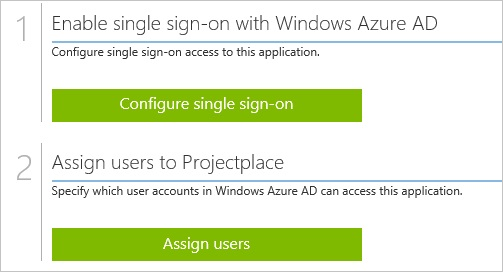
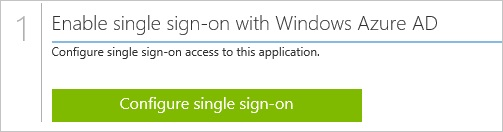
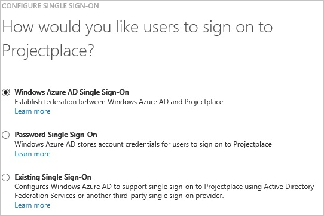
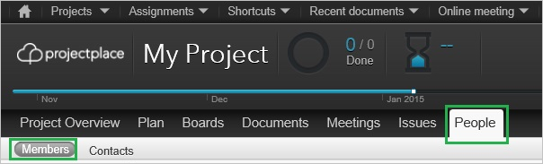
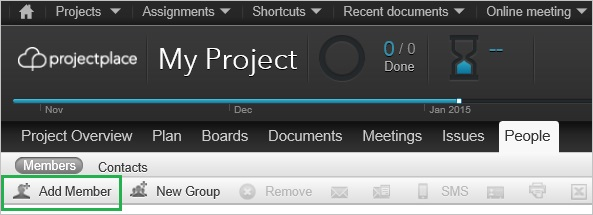
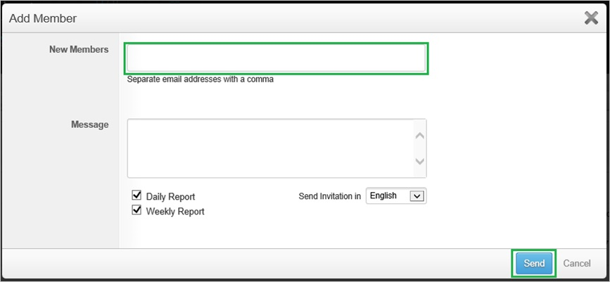
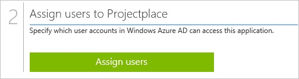

<properties 
    pageTitle="Tutorial: Azure Active Directory integration with Projectplace | Microsoft Azure" 
    description="Learn how to use Projectplace with Azure Active Directory to enable single sign-on, automated provisioning, and more!" 
    services="active-directory" 
    authors="jeevansd"  
    documentationCenter="na" 
    manager="femila"/>
<tags 
    ms.service="active-directory" 
    ms.devlang="na" 
    ms.topic="article" 
    ms.tgt_pltfrm="na" 
    ms.workload="identity" 
    ms.date="07/07/2016" 
    ms.author="jeedes" />

#Tutorial: Azure Active Directory integration with Projectplace
  
The objective of this tutorial is to show the integration of Azure and Projectplace.  
The scenario outlined in this tutorial assumes that you already have the following items:

-   A valid Azure subscription
-   A Projectplace single sign-on enabled subscription
  
After completing this tutorial, the Azure AD users you have assigned to Projectplace will be able to single sign into the application at your Projectplace company site (service provider initiated sign on), or using the [Introduction to the Access Panel](active-directory-saas-access-panel-introduction.md).
  
The scenario outlined in this tutorial consists of the following building blocks:

1.  Enabling the application integration for Projectplace
2.  Configuring single sign-on
3.  Configuring user provisioning
4.  Assigning users

##Enabling the application integration for Projectplace
  
The objective of this section is to outline how to enable the application integration for Projectplace.

###To enable the application integration for Projectplace, perform the following steps:

1.  In the Azure classic portal, on the left navigation pane, click **Active Directory**.

    

2.  From the **Directory** list, select the directory for which you want to enable directory integration.

3.  To open the applications view, in the directory view, click **Applications** in the top menu.

    

4.  Click **Add** at the bottom of the page.

    

5.  On the **What do you want to do** dialog, click **Add an application from the gallery**.

    

6.  In the **search box**, type **Projectplace**.

    

7.  In the results pane, select **Projectplace**, and then click **Complete** to add the application.

    
##Configuring single sign-on
  
The objective of this section is to outline how to enable users to authenticate to Projectplace with their account in Azure AD using federation based on the SAML protocol.

###To configure single sign-on, perform the following steps:

1.  In the Azure classic portal, on the **Projectplace** application integration page, click **Configure single sign-on** to open the **Configure Single Sign On ** dialog.

    

2.  On the **How would you like users to sign on to Projectplace** page, select **Microsoft Azure AD Single Sign-On**, and then click **Next**.

    

3.  On the **Configure App URL** page, in the **Projectplace Sign On URL** textbox, type your ProjectPlace tenant URL (e.g.: "*http://company.projectplace.com*"), and then click **Next**.

    

4.  On the **Configure single sign-on at Projectplace** page, click **Download metadata**, and then save the metadata file on your computer.

    

5.  Send the metadatafile to the Projectplace support team.

    >[AZURE.NOTE] The single sign-on configuration has to be performed by the Projectplace support team. You will get a notification as soon as the configuration has been completed.

6.  On the Azure classic portal, select the single sign-on configuration confirmation, and then click **Complete** to close the **Configure Single Sign On** dialog.

    
##Configuring user provisioning
  
In order to enable Azure AD users to log into Projectplace, they must be provisioned into Projectplace.  
In the case of Projectplace, provisioning is a manual task.

###To provision a user accounts, perform the following steps:

1.  Log in to your **Projectplace** company site as an administrator.

2.  Go to **People**, and then click **Members**.

    

3.  Click **Add Member**.

    

4.  In the **Add Member** section, perform the following steps:

    

    1.  In the **New Members** textbox, type the email address of a valid AAD account you want to provision into the related textboxes.
    2.  Click **Send**

	    >[AZURE.NOTE] An email including a link to confirm the account before it becomes active is sent to the Azure Active Directory account holder.
    
>[AZURE.NOTE]You can use any other Projectplace user account creation tools or APIs provided by Projectplace to provision AAD user accounts.

##Assigning users
  
To test your configuration, you need to grant the Azure AD users you want to allow using your application access to it by assigning them.

###To assign users to Projectplace, perform the following steps:

1.  In the Azure classic portal, create a test account.

2.  On the **Projectplace **application integration page, click **Assign users**.

    

3.  Select your test user, click **Assign**, and then click **Yes** to confirm your assignment.

    
  
If you want to test your single sign-on settings, open the Access Panel. For more details about the Access Panel, see [Introduction to the Access Panel](active-directory-saas-access-panel-introduction.md).