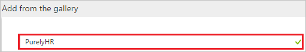
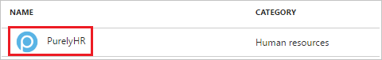
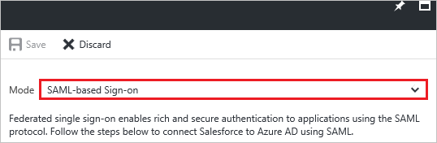
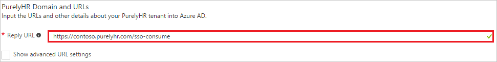
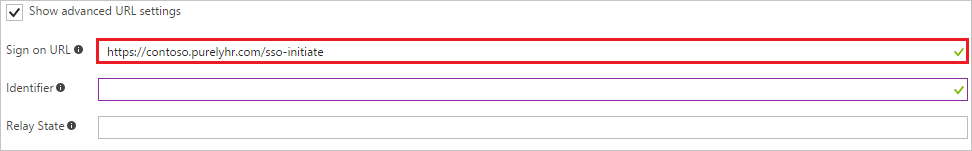
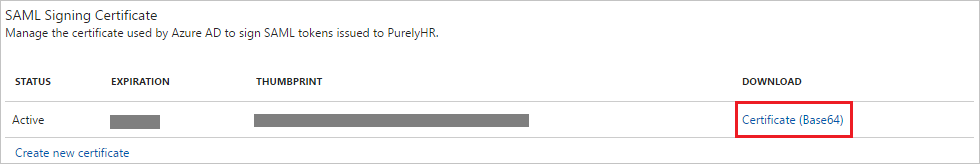
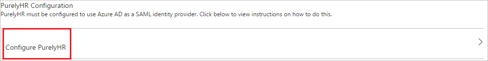
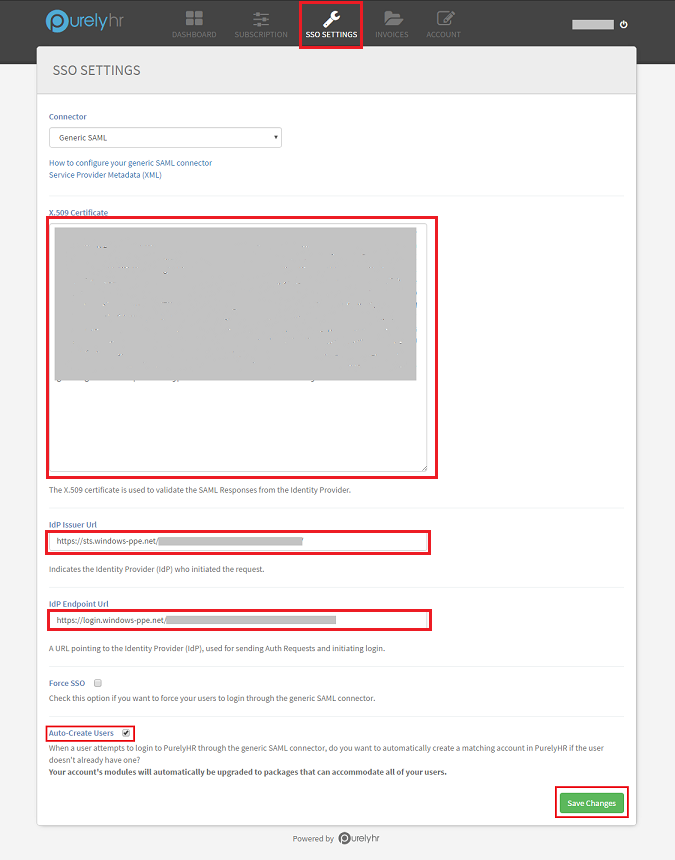
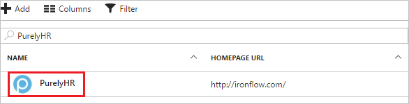

# Tutorial: Azure Active Directory integration with PurelyHR

In this tutorial, you learn how to integrate PurelyHR with Azure Active Directory (Azure AD).

Integrating PurelyHR with Azure AD provides you with the following benefits:

- You can control in Azure AD who has access to PurelyHR
- You can enable your users to automatically get signed-on to PurelyHR (Single Sign-On) with their Azure AD accounts
- You can manage your accounts in one central location - the Azure portal

If you want to know more details about SaaS app integration with Azure AD, see [What is application access and single sign-on with Azure Active Directory](active-directory-appssoaccess-whatis.md).

<!--## Overview

To enable single sign-on with PurelyHR, it must be configured to use Azure Active Directory as an identity provider. This guide provides information and tips on how to perform this configuration in PurelyHR.

>[!Note]: 
>This embedded guide is brand new in the new Azure portal, and we’d love to hear your thoughts. Use the Feedback ? button at the top of the portal to provide feedback. The older guide for using the [Azure classic portal](https://manage.windowsazure.com) to configure this application can be found [here](https://github.com/Azure/AzureAD-App-Docs/blob/master/articles/en-us/_/sso_configure.md).-->

## Prerequisites

To configure Azure AD integration with PurelyHR, you need the following items:

- An Azure AD subscription
- A PurelyHR single-sign on enabled subscription

> [!NOTE]
> To test the steps in this tutorial, we do not recommend using a production environment.

To test the steps in this tutorial, you should follow these recommendations:

- You should not use your production environment, unless this is necessary.
- If you don't have an Azure AD trial environment, you can get an one-month trial [here](https://azure.microsoft.com/pricing/free-trial/).

## Scenario description
In this tutorial, you test Azure AD single sign-on in a test environment. 
The scenario outlined in this tutorial consists of two main building blocks:

1. Adding PurelyHR from the gallery
2. Configuring and testing Azure AD single sign-on

## Adding PurelyHR from the gallery
To configure the integration of PurelyHR into Azure AD, you need to add PurelyHR from the gallery to your list of managed SaaS apps.

**To add PurelyHR from the gallery, perform the following steps:**

1. In the **[Azure Portal](https://portal.azure.com)**, on the left navigation panel, click **Azure Active Directory** icon. 

	![Active Directory][1]

2. Navigate to **Enterprise applications**. Then go to **All applications**.

	![Applications][2]
	
3. Click **Add** button on the top of the dialog.

	![Applications][3]

4. In the search box, type **PurelyHR**.

	

5. In the results panel, select **PurelyHR**, and then click **Add** button to add the application.

	

##  Configuring and testing Azure AD single sign-on
In this section, you configure and test Azure AD single sign-on with PurelyHR based on a test user called "Britta Simon".

For single sign-on to work, Azure AD needs to know what the counterpart user in PurelyHR is to a user in Azure AD. In other words, a link relationship between an Azure AD user and the related user in PurelyHR needs to be established.

This link relationship is established by assigning the value of the **user name** in Azure AD as the value of the **Username** in PurelyHR.

To configure and test Azure AD single sign-on with PurelyHR, you need to complete the following building blocks:

1. **[Configuring Azure AD Single Sign-On](#configuring-azure-ad-single-sign-on)** - to enable your users to use this feature.
2. **[Creating an Azure AD test user](#creating-an-azure-ad-test-user)** - to test Azure AD single sign-on with Britta Simon.
3. **[Creating a PurelyHR test user](#creating-a-purelyhr-test-user)** - to have a counterpart of Britta Simon in PurelyHR that is linked to the Azure AD representation of her.
4. **[Assigning the Azure AD test user](#assigning-the-azure-ad-test-user)** - to enable Britta Simon to use Azure AD single sign-on.
5. **[Testing Single Sign-On](#testing-single-sign-on)** - to verify whether the configuration works.

### Configuring Azure AD single sign-on

In this section, you enable Azure AD single sign-on in the Azure portal and configure single sign-on in your PurelyHR application.

**To configure Azure AD single sign-on with PurelyHR, perform the following steps:**

1. In the Azure portal, on the **PurelyHR** application integration page, click **Single sign-on**.

	![Configure Single Sign-On][4]

2. On the **Single sign-on** dialog, as **Mode** select **SAML-based Sign-on** to enable single sign on.
 
	

3. On the **PurelyHR Domain and URLs** section, perform the following steps if you wish to configure the application in **IDP** initiated mode:

	
   
	In the **Reply URL** textbox, type a URL using the following pattern:
`https://<companyID>.purelyhr.com/sso-consume`

4. Check **Show advanced URL settings**, if you wish to configure the application in **SP** initiated mode:

	
    
	In the **Sign-on URL** textbox, type the value using the following pattern: `https://<companyID>.purelyhr.com/sso-initiate`
	 
	> [!NOTE] 
	> Please note that these are not the real values. You have to update these values with the actual Reply URL and Sign-On URL. Contact [PurelyHR Client support team](support.purelyhr.com/) to get these values. 

5. On the **SAML Signing Certificate** section, click **Certificate (Base64)** and then save the certificate file on your computer.

	 

6. Click **Save** button.

	
	
7. On the **PurelyHR Configuration** section, click **Configure PurelyHR** to open **Configure sign-on** window. Copy the **SAML Entity ID and SAML Single Sign-On Service URL** from the **Quick Reference section.**

	 

8. To configure single sign-on on **PurelyHR** side, login to their website as an administrator.

9. Open the **Dashboard** from the options in the toolbar and click on **SSO Settings**.

10. Paste the values in the boxes as described below-

		

	a. Open the **Certificate(Bas64)** downloaded above from the Azure portal in notepad and copy the certficate value. Paste the copied value into the **X.509 Certificate** box.

	b. In the **Idp Issuer URL** box, paste the **SAML Entity ID** copied from the Azure portal.

	c. In the **Idp Endpoint URL** box, paste the **SAML Single Sign-On Service URL** copied from the Azure portal. 

	d. Check the **Auto-Create Users** checkbox to enable automatic user provisioning in PurelyHR.

	e. Click on **Save Changes** to save the settings.

<!--### Next steps

To ensure users can sign-in to PurelyHR after it has been configured to use Azure Active Directory, review the following tasks and topics:

- User accounts must be pre-provisioned into PurelyHR prior to sign-in. To set this up, see Provisioning.
 
- Users must be assigned access to PurelyHR in Azure AD to sign-in. To assign users, see Users.
 
- To configure access polices for PurelyHR users, see Access Policies.
 
- For additional information on deploying single sign-on to users, see [this article](https://docs.microsoft.com/en-us/azure/active-directory/active-directory-appssoaccess-whatis#deploying-azure-ad-integrated-applications-to-users).-->

### Creating an Azure AD test user
The objective of this section is to create a test user in the Azure Portal called Britta Simon.

![Create Azure AD User][100]

**To create a test user in Azure AD, perform the following steps:**

1. In the **Azure portal**, on the left navigation pane, click **Azure Active Directory** icon.

	 

2. Go to **Users and groups** and click **All users** to display the list of users.
	
	 

3. At the top of the dialog click **Add** to open the **User** dialog.
 
	 

4. On the **User** dialog page, perform the following steps:
 
	 

    a. In the **Name** textbox, type **BrittaSimon**.

    b. In the **User name** textbox, type the **email address** of BrittaSimon.

	c. Select **Show Password** and write down the value of the **Password**.

    d. Click **Create**.
 
### Creating a PurelyHR test user

In order to enable Azure AD users to log into PurelyHR, they must be provisioned into PurelyHR. In case of PurelyHR, provisioning is an automatic task and no manual steps are required when Automatic user provisioning is enabled.

### Assigning the Azure AD test user

In this section, you enable Britta Simon to use Azure single sign-on by granting her access to PurelyHR.

![Assign User][200] 

**To assign Britta Simon to PurelyHR, perform the following steps:**

1. In the Azure portal, open the applications view, and then navigate to the directory view and go to **Enterprise applications** then click **All applications**.

	![Assign User][201] 

2. In the applications list, select **PurelyHR**.

	 

3. In the menu on the left, click **Users and groups**.

	![Assign User][202] 

4. Click **Add** button. Then select **Users and groups** on **Add Assignment** dialog.

	![Assign User][203]

5. On **Users and groups** dialog, select **Britta Simon** in the Users list.

6. Click **Select** button on **Users and groups** dialog.

7. Click **Assign** button on **Add Assignment** dialog.
	
### Testing single sign-on

In this section, you test your Azure AD single sign-on configuration using the Access Panel.

If you want to test your single sign-on settings, open the Access Panel. For more details about the Access Panel, see [Introduction to the Access Panel](https://msdn.microsoft.com/library/dn308586). 

## Additional resources

* [List of Tutorials on How to Integrate SaaS Apps with Azure Active Directory](active-directory-saas-tutorial-list.md)
* [What is application access and single sign-on with Azure Active Directory?](active-directory-appssoaccess-whatis.md)

<!--Image references-->

[1]: ./media/active-directory-saas-purelyhr-tutorial/tutorial_general_01.png
[2]: ./media/active-directory-saas-purelyhr-tutorial/tutorial_general_02.png
[3]: ./media/active-directory-saas-purelyhr-tutorial/tutorial_general_03.png
[4]: ./media/active-directory-saas-purelyhr-tutorial/tutorial_general_04.png

[100]: ./media/active-directory-saas-purelyhr-tutorial/tutorial_general_100.png

[200]: ./media/active-directory-saas-purelyhr-tutorial/tutorial_general_200.png
[201]: ./media/active-directory-saas-purelyhr-tutorial/tutorial_general_201.png
[202]: ./media/active-directory-saas-purelyhr-tutorial/tutorial_general_202.png
[203]: ./media/active-directory-saas-purelyhr-tutorial/tutorial_general_203.png

