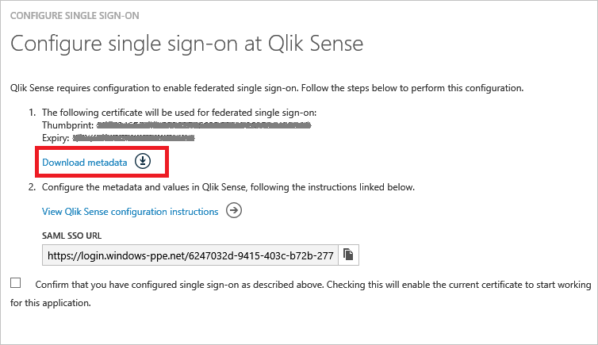

# Tutorial: Azure Active Directory integration with Qlik Sense Enterprise
In this tutorial, you learn how to integrate Qlik Sense Enterprise with Azure Active Directory (Azure AD).

Integrating Qlik Sense Enterprise with Azure AD provides you with the following benefits:

* You can control in Azure AD who has access to Qlik Sense Enterprise
* You can enable your users to automatically get signed-on to Qlik Sense Enterprise (Single Sign-On) with their Azure AD accounts
* You can manage your accounts in one central location - the Azure classic portal

If you want to know more details about SaaS app integration with Azure AD, see [What is application access and single sign-on with Azure Active Directory](active-directory-appssoaccess-whatis.md).

## Prerequisites
To configure Azure AD integration with Qlik Sense Enterprise, you need the following items:

* An Azure AD subscription
* A Qlik Sense Enterprise single-sign on enabled subscription

> [!NOTE]
> To test the steps in this tutorial, we do not recommend using a production environment.
> 
> 

To test the steps in this tutorial, you should follow these recommendations:

* You should not use your production environment, unless this is necessary.
* If you don't have an Azure AD trial environment, you can get a one-month trial [here](https://azure.microsoft.com/pricing/free-trial/).

## Scenario description
In this tutorial, you test Azure AD single sign-on in a test environment.

The scenario outlined in this tutorial consists of two main building blocks:

1. Adding Qlik Sense Enterprise from the gallery
2. Configuring and testing Azure AD single sign-on

## Adding Qlik Sense Enterprise from the gallery
To configure the integration of Qlik Sense Enterprise into Azure AD, you need to add Qlik Sense Enterprise from the gallery to your list of managed SaaS apps.

**To add Qlik Sense Enterprise from the gallery, perform the following steps:**

1. In the **Azure classic portal**, on the left navigation pane, click **Active Directory**.
   
    ![Active Directory][1]

2. From the **Directory** list, select the directory for which you want to enable directory integration.
3. To open the applications view, in the directory view, click **Applications** in the top menu.
   
    ![Applications][2]

4. Click **Add** at the bottom of the page.
   
    ![Applications][3]

5. On the **What do you want to do** dialog, click **Add an application from the gallery**.
   
    ![Applications][4]

6. In the search box, type **Qlik Sense Enterprise**.
   
    

7. In the results pane, select **Qlik Sense Enterprise**, and then click **Complete** to add the application.
   
    

## Configuring and testing Azure AD single sign-on
In this section, you configure and test Azure AD single sign-on with Qlik Sense Enterprise based on a test user called "Britta Simon".

For single sign-on to work, Azure AD needs to know what the counterpart user in Qlik Sense Enterprise is to a user in Azure AD. In other words, a link relationship between an Azure AD user and the related user in Qlik Sense Enterprise needs to be established.

This link relationship is established by assigning the value of the **user name** in Azure AD as the value of the **Username** in Qlik Sense Enterprise.

To configure and test Azure AD single sign-on with Qlik Sense Enterprise, you need to complete the following building blocks:

1. **[Configuring Azure AD Single Sign-On](#configuring-azure-ad-single-sign-on)** - to enable your users to use this feature.
2. **[Creating an Azure AD test user](#creating-an-azure-ad-test-user)** - to test Azure AD single sign-on with Britta Simon.
3. **[Creating a Qlik Sense Enterprise test user](#creating-a-qliksense-enterprise-test-user)** - to have a counterpart of Britta Simon in Qlik Sense Enterprise that is linked to the Azure AD representation of her.
4. **[Assigning the Azure AD test user](#assigning-the-azure-ad-test-user)** - to enable Britta Simon to use Azure AD single sign-on.
5. **[Testing Single Sign-On](#testing-single-sign-on)** - to verify whether the configuration works.

### Configuring Azure AD single sign-on
In this section, you enable Azure AD single sign-on in the classic portal and configure single sign-on in your Qlik Sense Enterprise application.

**To configure Azure AD single sign-on with Qlik Sense Enterprise, perform the following steps:**

1. In the classic portal, on the **Qlik Sense Enterprise** application integration page, click **Configure single sign-on** to open the **Configure Single Sign-On**  dialog.
   
    ![Configure Single Sign-On][6] 

2. On the **How would you like users to sign on to Qlik Sense Enterprise** page, select **Azure AD Single Sign-On**, and then click **Next**.
   
     

3. On the **Configure App Settings** dialog page, perform the following steps:
   
     
   
    a. In the **Sign On URL** textbox, type the URL used by your users to sign-on to your Qlik Sense Enterprise application using the following pattern: **https://\<Qlik Sense Fully Qualifed Hostname\>:443/<Virtual Proxy Prefix\>/samlauthn/**.
   
    > [!NOTE]
    > Note the trailing slash at the end of this URI.  It is required.
    > 
    > 
   
    b. click **Next**

4. On the **Configure single sign-on at Qlik Sense Enterprise** page, perform the following steps:
   
    
   
    a. Click **Download metadata**, and then save the file on your computer.  Be prepared to edit this metadata file before uploading to the Qlik Sense server.
   
    b. Click **Next**.

5. Prepare the Federation Metadata XML file so that you can upload that to Qlik Sense server.
   
    > [!NOTE]
    > Before uploading the IdP metadata to the Qlik Sense server, the file needs to be edited to remove information to ensure proper operation between Azure AD and Qlik Sense server.
    > 
    > 
   
    ![QlikSense][qs24]
   
    a. Open the FederationMetaData.xml file downloaded from Azure in a text editor.
   
    b. Search for the value **RoleDescriptor**.  There will be four entries (two pairs of opening and closing element tags).
   
    c. Delete the RoleDescriptor tags and all information in between from the file.
   
    d. Save the file and keep it nearby for use later in this document.
6. Navigate to the Qlik Sense Qlik Management Console (QMC) as a user who can create virtual proxy configurations.
7. In the QMC, click on the Virtual Proxy menu item.
   
    ![QlikSense][qs6] 
8. At the bottom of the screen, click the Create new button.
   
    ![QlikSense][qs7]
9. The Virtual proxy edit screen appears.  On the right side of the screen is a menu for making configuration options visible.
   
    ![QlikSense][qs9]
10. With the Identification menu option checked, enter the identifying information for the Azure virtual proxy configuration.
    
    ![QlikSense][qs8]  
    
    a. The Description field is a friendly name for the virtual proxy configuration.  Enter a value for a description.
    
    b. The Prefix field identifies the virtual proxy endpoint for connecting to Qlik Sense with Azure AD Single Sign-On.  Enter a unique prefix name for this virtual proxy.
    
    c. Session inactivity timeout (minutes) is the timeout for connections through this virtual proxy.
    
    d. The Session cookie header name is the cookie name storing the session identifier for the Qlik Sense session a user receives after successful authentication.  This name must be unique.
11. Click on the Authentication menu option to make it visible.  The Authentication screen appears.
    
    ![QlikSense][qs10]
    
    a. The **Anonymous access mode** drop down determines if anonymous users may access Qlik Sense through the virtual proxy.  The default option is No anonymous user.
    
    b. The **Authentication method** drop down determines the authentication scheme the virtual proxy will use.  Select SAML from the drop down list.  More options will appear as a result.
    
    c. In the **SAML host URI field**, input the hostname users will enter to access Qlik Sense through this SAML virtual proxy.  The hostname is the uri of the Qlik Sense server.
    
    d. In the **SAML entity ID**, enter the same value entered for the SAML host URI field.
    
    e. The **SAML IdP metadata** is the file edited earlier in the **Edit Federation Metadata from Azure AD Configuration** section.  **Before uploading the IdP metadata, the file needs to be edited** to remove information to ensure proper operation between Azure AD and Qlik Sense server.  **Please refer to the instructions above if the file has yet to be edited.**  If the file has been edited click on the Browse button and select the edited metadata file to upload it to the virtual proxy configuration.
    
    f. Enter the attribute name or schema reference for the SAML attribute representing the **UserID** Azure AD will send to the Qlik Sense server.  Schema reference information is available in the Azure app screens post configuration.  To use the name attribute, **enter http://schemas.xmlsoap.org/ws/2005/05/identity/claims/name**.
    
    g. Enter the value for the **user directory** that will be attached to users when they authenticate to Qlik Sense server through Azure AD.  Hardcoded values must be surrounded by **square brackets []**.  To use an attribute sent in the Azure AD SAML assertion, enter the name of the attribute in this text box **without** square brackets.
    
    h. The **SAML signing algorithm** sets the service provider (in this case Qlik Sense server) certificate signing for the virtual proxy configuration.  If Qlik Sense server uses a trusted certificate generated using Microsoft Enhanced RSA and AES Cryptographic Provider, change the SAML signing algorithm to **SHA-256**.
    
    i. The SAML attribute mapping section allows for additional attributes like groups to be sent to Qlik Sense for use in security rules.
12. Click on the Load balancing menu option to make it visible.  The Load Balancing screen appears.
    
    ![QlikSense][qs11]
13. Click on the Add new server node button, select engine node or nodes Qlik Sense will send sessions to for load balancing purposes, and click the Add button.
    
    ![QlikSense][qs12]
14. Click on the Advanced menu option to make it visible. The Advanced screen appears.
    
    ![QlikSense][qs13]
    
    a. The Host white list identifies hostnames that are accepted when connecting to the Qlik Sense server.  **Enter the hostname users will specify when connecting to Qlik Sense server.** The hostname is the same value as the SAML host uri without the https://.
15. Click the Apply button.
    
    ![QlikSense][qs14]
16. Click OK to accept the warning message that states proxies linked to the virtual proxy will be restarted.
    
    ![QlikSense][qs15]
17. On the right side of the screen, the Associated items menu appears.  Click on the Proxies menu option.
    
    ![QlikSense][qs16]
18. The proxy screen appears.  Click the Link button at the bottom to link a proxy to the virtual proxy.
    
    ![QlikSense][qs17]
19. Select the proxy node that will support this virtual proxy connection and click the Link button.  After linking, the proxy will be listed under associated proxies.
    
    ![QlikSense][qs18]
    ![QlikSense][qs19]
20. After about five to ten seconds, the Refresh QMC message will appear.  Click the Refresh QMC button.
    
    ![QlikSense][qs20]
21. When the QMC refreshes, click on the Virtual proxies menu item. The new SAML virtual proxy entry is listed in the table on the screen.  Single click on the virtual proxy entry.
    
    ![QlikSense][qs51]
22. At the bottom of the screen, the Download SP metadata button will activate.  Click the Download SP metadata button to save the metadata to a file.
    
    ![QlikSense][qs52]
23. Open the sp metadata file.  Observe the **entityID** entry and the **AssertionConsumerService** entry.  These values are equivalent to the **Identifier** and the **Sign on URL** in the Azure AD application configuration. If they are not matching then you should replace them in the Azure AD App configuration wizard.
    
    ![QlikSense][qs53]
24. In the classic portal, select the single sign-on configuration confirmation, and then click **Next**.
    
    ![Azure AD Single Sign-On][10]
25. On the **Single sign-on confirmation** page, click **Complete**.  
    
    ![Azure AD Single Sign-On][11]

### Creating an Azure AD test user
In this section, you create a test user in the classic portal called Britta Simon.

![Create Azure AD User][20]

**To create a test user in Azure AD, perform the following steps:**

1. In the **Azure classic portal**, on the left navigation pane, click **Active Directory**.
   
     

2. From the **Directory** list, select the directory for which you want to enable directory integration.

3. To display the list of users, in the menu on the top, click **Users**.
   
     

4. To open the **Add User** dialog, in the toolbar on the bottom, click **Add User**.
   
     

5. On the **Tell us about this user** dialog page, perform the following steps:
     
   
    a. As Type Of User, select New user in your organization.
   
    b. In the User Name **textbox**, type **BrittaSimon**.
   
    c. Click **Next**.

6. On the **User Profile** dialog page, perform the following steps:

     
   
    a. In the **First Name** textbox, type **Britta**.  
   
    b. In the **Last Name** textbox, type, **Simon**.
   
    c. In the **Display Name** textbox, type **Britta Simon**.
   
    d. In the **Role** list, select **User**.
   
    e. Click **Next**.

7. On the **Get temporary password** dialog page, click **create**.
   
     

8. On the **Get temporary password** dialog page, perform the following steps:
   
     
   
    a. Write down the value of the **New Password**.
   
    b. Click **Complete**.   

### Creating an Qlik Sense Enterprise test user
In this section, you create a user called Britta Simon in Qlik Sense Enterprise. Please work with Qlik Sense Enterprise support team to add the users in the Qlik Sense Enterprise platform.

### Assigning the Azure AD test user
In this section, you enable Britta Simon to use Azure single sign-on by granting her access to Qlik Sense Enterprise.

![Assign User][200] 

**To assign Britta Simon to Qlik Sense Enterprise, perform the following steps:**

1. On the classic portal, to open the applications view, in the directory view, click **Applications** in the top menu.
   
    ![Assign User][201] 

2. In the applications list, select **Qlik Sense Enterprise**.
   
     

3. In the menu on the top, click **Users**.
   
    ![Assign User][203]

4. In the Users list, select **Britta Simon**.

5. In the toolbar on the bottom, click **Assign**.
   
    ![Assign User][205]

## Testing single sign-On
In this section, you test your Azure AD single sign-on configuration using the Access Panel.

When you click the Qlik Sense Enterprise tile in the Access Panel, you should get automatically signed-on to your Qlik Sense Enterprise application.

## Additional resources
* [List of Tutorials on How to Integrate SaaS Apps with Azure Active Directory](active-directory-saas-tutorial-list.md)
* [What is application access and single sign-on with Azure Active Directory?](active-directory-appssoaccess-whatis.md)

<!--Image references-->

[1]: ./media/active-directory-saas-qliksense-enterprise-tutorial/tutorial_general_01.png
[2]: ./media/active-directory-saas-qliksense-enterprise-tutorial/tutorial_general_02.png
[3]: ./media/active-directory-saas-qliksense-enterprise-tutorial/tutorial_general_03.png
[4]: ./media/active-directory-saas-qliksense-enterprise-tutorial/tutorial_general_04.png

[6]: ./media/active-directory-saas-qliksense-enterprise-tutorial/tutorial_general_05.png
[10]: ./media/active-directory-saas-qliksense-enterprise-tutorial/tutorial_general_06.png
[11]: ./media/active-directory-saas-qliksense-enterprise-tutorial/tutorial_general_07.png
[20]: ./media/active-directory-saas-qliksense-enterprise-tutorial/tutorial_general_100.png

[200]: ./media/active-directory-saas-qliksense-enterprise-tutorial/tutorial_general_200.png
[201]: ./media/active-directory-saas-qliksense-enterprise-tutorial/tutorial_general_201.png
[203]: ./media/active-directory-saas-qliksense-enterprise-tutorial/tutorial_general_203.png
[204]: ./media/active-directory-saas-qliksense-enterprise-tutorial/tutorial_general_204.png
[205]: ./media/active-directory-saas-qliksense-enterprise-tutorial/tutorial_general_205.png

[qs6]: ./media/active-directory-saas-qliksense-enterprise-tutorial/tutorial_qliksenseenterprise_06.png
[qs7]: ./media/active-directory-saas-qliksense-enterprise-tutorial/tutorial_qliksenseenterprise_07.png
[qs8]: ./media/active-directory-saas-qliksense-enterprise-tutorial/tutorial_qliksenseenterprise_08.png
[qs9]: ./media/active-directory-saas-qliksense-enterprise-tutorial/tutorial_qliksenseenterprise_09.png
[qs10]: ./media/active-directory-saas-qliksense-enterprise-tutorial/tutorial_qliksenseenterprise_10.png
[qs11]: ./media/active-directory-saas-qliksense-enterprise-tutorial/tutorial_qliksenseenterprise_11.png
[qs12]: ./media/active-directory-saas-qliksense-enterprise-tutorial/tutorial_qliksenseenterprise_12.png
[qs13]: ./media/active-directory-saas-qliksense-enterprise-tutorial/tutorial_qliksenseenterprise_13.png
[qs14]: ./media/active-directory-saas-qliksense-enterprise-tutorial/tutorial_qliksenseenterprise_14.png
[qs15]: ./media/active-directory-saas-qliksense-enterprise-tutorial/tutorial_qliksenseenterprise_15.png
[qs16]: ./media/active-directory-saas-qliksense-enterprise-tutorial/tutorial_qliksenseenterprise_16.png
[qs17]: ./media/active-directory-saas-qliksense-enterprise-tutorial/tutorial_qliksenseenterprise_17.png
[qs18]: ./media/active-directory-saas-qliksense-enterprise-tutorial/tutorial_qliksenseenterprise_18.png
[qs19]: ./media/active-directory-saas-qliksense-enterprise-tutorial/tutorial_qliksenseenterprise_19.png
[qs20]: ./media/active-directory-saas-qliksense-enterprise-tutorial/tutorial_qliksenseenterprise_20.png
[qs21]: ./media/active-directory-saas-qliksense-enterprise-tutorial/tutorial_qliksenseenterprise_21.png
[qs22]: ./media/active-directory-saas-qliksense-enterprise-tutorial/tutorial_qliksenseenterprise_22.png
[qs23]: ./media/active-directory-saas-qliksense-enterprise-tutorial/tutorial_qliksenseenterprise_23.png
[qs24]: ./media/active-directory-saas-qliksense-enterprise-tutorial/tutorial_qliksenseenterprise_24.png
[qs25]: ./media/active-directory-saas-qliksense-enterprise-tutorial/tutorial_qliksenseenterprise_25.png
[qs26]: ./media/active-directory-saas-qliksense-enterprise-tutorial/tutorial_qliksenseenterprise_26.png
[qs51]: ./media/active-directory-saas-qliksense-enterprise-tutorial/tutorial_qliksenseenterprise_51.png
[qs52]: ./media/active-directory-saas-qliksense-enterprise-tutorial/tutorial_qliksenseenterprise_52.png
[qs53]: ./media/active-directory-saas-qliksense-enterprise-tutorial/tutorial_qliksenseenterprise_53.png
