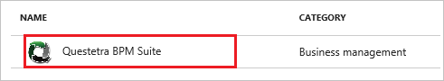
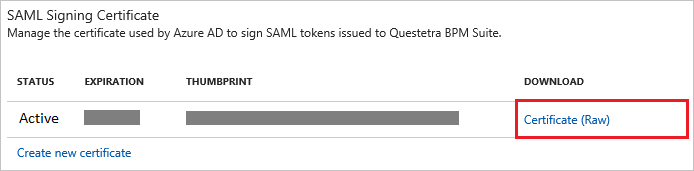
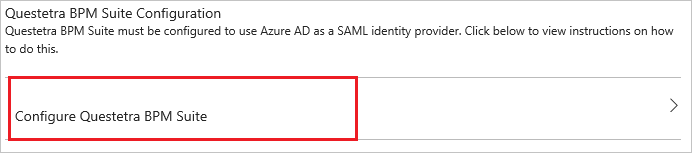

# Tutorial: Azure Active Directory integration with Questetra BPM Suite

In this tutorial, you learn how to integrate Questetra BPM Suite with Azure Active Directory (Azure AD).

Integrating Questetra BPM Suite with Azure AD provides you with the following benefits:

- You can control in Azure AD who has access to Questetra BPM Suite
- You can enable your users to automatically get signed-on to Questetra BPM Suite (Single Sign-On) with their Azure AD accounts
- You can manage your accounts in one central location - the Azure portal

If you want to know more details about SaaS app integration with Azure AD, see [what is application access and single sign-on with Azure Active Directory](active-directory-appssoaccess-whatis.md).

## Prerequisites

To configure Azure AD integration with Questetra BPM Suite, you need the following items:

- An Azure AD subscription
- A Questetra BPM Suite single sign-on enabled subscription

> [!NOTE]
> To test the steps in this tutorial, we do not recommend using a production environment.

To test the steps in this tutorial, you should follow these recommendations:

- Do not use your production environment, unless it is necessary.
- If you don't have an Azure AD trial environment, you can [get a one-month trial](https://azure.microsoft.com/pricing/free-trial/).

## Scenario description
In this tutorial, you test Azure AD single sign-on in a test environment. 
The scenario outlined in this tutorial consists of two main building blocks:

1. Add Questetra BPM Suite from the gallery
2. Configure and test Azure AD single sign-on

## Add Questetra BPM Suite from the gallery
To configure the integration of Questetra BPM Suite into Azure AD, you need to add Questetra BPM Suite from the gallery to your list of managed SaaS apps.

**To add Questetra BPM Suite from the gallery, perform the following steps:**

1. In the **[Azure portal](https://portal.azure.com)**, on the left navigation panel, click **Azure Active Directory** icon. 

	![Active Directory][1]

2. Navigate to **Enterprise applications**. Then go to **All applications**.

	![Applications][2]
	
3. To add new application, click **New application** button on the top of dialog.

	![Applications][3]

4. In the search box, type **Questetra BPM Suite**, select **Questetra BPM Suite** from result panel and then click **Add** button to add the application.

	

##  Configure and test Azure AD single sign-on
In this section, you configure and test Azure AD single sign-on with Questetra BPM Suite based on a test user called "Britta Simon".

For single sign-on to work, Azure AD needs to know what the counterpart user in Questetra BPM Suite is to a user in Azure AD. In other words, a link relationship between an Azure AD user and the related user in Questetra BPM Suite needs to be established.

In Questetra BPM Suite, assign the value of the **user name** in Azure AD as the value of the **Username** to establish the link relationship.

To configure and test Azure AD single sign-on with Questetra BPM Suite, you need to complete the following building blocks:

1. **[Configure Azure AD Single Sign-On](#configure-azure-ad-single-sign-on)** - to enable your users to use this feature.
2. **[Create an Azure AD test user](#create-an-azure-ad-test-user)** - to test Azure AD single sign-on with Britta Simon.
3. **[Create a Questetra BPM Suite test user](#create-a-questetra-bpm-suite-test-user)** - to have a counterpart of Britta Simon in Questetra BPM Suite that is linked to the Azure AD representation of user.
4. **[Assign the Azure AD test user](#assign-the-azure-ad-test-user)** - to enable Britta Simon to use Azure AD single sign-on.
5. **[Test Single Sign-On](#test-single-sign-on)** - to verify whether the configuration works.

### Configure Azure AD single sign-on

In this section, you enable Azure AD single sign-on in the Azure portal and configure single sign-on in your Questetra BPM Suite application.

**To configure Azure AD single sign-on with Questetra BPM Suite, perform the following steps:**

1. In the Azure portal, on the **Questetra BPM Suite** application integration page, click **Single sign-on**.

	![Configure Single Sign-On][4]

2. On the **Single sign-on** dialog, select **Mode** as	**SAML-based Sign-on** to enable single sign-on.
 
	

3. On the **Questetra BPM Suite Domain and URLs** section, perform the following steps:

	

    a. In the **Sign-on URL** textbox, type a URL using the following pattern: `https://<subdomain>.questetra.net/saml/SSO/alias/bpm`

	b. In the **Identifier** textbox, type a URL using the following pattern: `https://<subdomain>.questetra.net/`

	> [!NOTE] 
	> These values are not real. Update these values with the actual Sign-On URL and Identifier. You can get these values from **SP Information** section on your **Questetra BPM Suite** company site, which is explained later in the tutorial or contact [Questetra BPM Suite Client support team](https://www.questetra.com/contact/). 
 
4. On the **SAML Signing Certificate** section, click **Certificate (Base 64)** and then save the certificate file on your computer.

	 

5. Click **Save** button.

	

6. On the **Questetra BPM Suite Configuration** section, click **Configure Questetra BPM Suite** to open **Configure sign-on** window. Copy the **Sign-Out URL, SAML Entity ID, and SAML Single Sign-On Service URL** from the **Quick Reference section.**

	 

7. In a different web browser window, log into your **Questetra BPM Suite** company site as an administrator.

8. In the menu on the top, click **System Settings**. 
   
    ![Azure AD Single Sign-On][10]

9. To open the **SingleSignOnSAML** page, click **SSO (SAML)**. 
   
    ![Azure AD Single Sign-On][11]

10. On your **Questetra BPM Suite** company site, in the **SP Information** section, perform the following steps:

	a. Copy the **ACS URL**, and then paste it into the **Sign On URL** textbox in the **Questetra BPM Suite Domain and URLs** section from Azure portal.
	
	b. Copy the **Entity ID**, and then paste it into the **Identifier** textbox in the **Questetra BPM Suite Domain and URLs** section from Azure portal.

11. On your **Questetra BPM Suite** company site, perform the following steps: 
   
    ![Configure Single Sign-On][15]
   
	a. Select **Enable Single Sign-On**.
   
	b. In **Entity ID** textbox, paste the value of **SAML Entity ID** which you have copied from Azure portal.
	
	c. In **Sign-in page URL** textbox, paste the value of **SAML Single Sign-On Service URL** which you have copied from Azure portal.
	
	d. In **Sign-out page URL** textbox, paste the value of **Sign-Out URL** which you have copied from Azure portal.
	
	e. In the **NameID format** textbox, type `urn:oasis:names:tc:SAML:1.1:nameid-format:emailAddress`.

    f. Open your **Base-64** encoded certificate in notepad downloaded from Azure portal, copy the content of it into your clipboard, and then paste it into the **Validation certificate** textbox. 

    g. Click **Save**.

> [!TIP]
> You can now read a concise version of these instructions inside the [Azure portal](https://portal.azure.com), while you are setting up the app!  After adding this app from the **Active Directory > Enterprise Applications** section, simply click the **Single Sign-On** tab and access the embedded documentation through the **Configuration** section at the bottom. You can read more about the embedded documentation feature here: [Azure AD embedded documentation]( https://go.microsoft.com/fwlink/?linkid=845985)
> 

### Create an Azure AD test user
The objective of this section is to create a test user in the Azure portal called Britta Simon.

![Create Azure AD User][100]

**To create a test user in Azure AD, perform the following steps:**

1. In the **Azure portal**, on the left navigation pane, click **Azure Active Directory** icon.

	 

2. To display the list of users, go to **Users and groups** and click **All users**.
	
	 

3. To open the **User** dialog, click **Add** on the top of the dialog.
 
	 

4. On the **User** dialog page, perform the following steps:
 
	 

    a. In the **Name** textbox, type **BrittaSimon**.

    b. In the **User name** textbox, type the **email address** of BrittaSimon.

	c. Select **Show Password** and write down the value of the **Password**.

    d. Click **Create**.
 
### Create a Questetra BPM Suite test user

The objective of this section is to create a user called Britta Simon in Questetra BPM Suite.

**To create a user called Britta Simon in Questetra BPM Suite, perform the following steps:**

1. Sign on to your Questetra BPM Suite company site as an administrator.
2. Go to **System Settings > User List > New User**. 
3. On the New User dialog, perform the following steps: 
   
	![Create test user][300] 
   
    a. In the **Name** textbox, type **name** of the user **britta.simon@contoso.com**.
   
    b. In the **Email** textbox, type **email** of the user **britta.simon@contoso.com**
   
    c. In the **Password** textbox, type a **password** of the user.
	
	d. Click **Add new user**.

### Assign the Azure AD test user

In this section, you enable Britta Simon to use Azure single sign-on by granting access to Questetra BPM Suite.

![Assign User][200] 

**To assign Britta Simon to Questetra BPM Suite, perform the following steps:**

1. In the Azure portal, open the applications view, and then navigate to the directory view and go to **Enterprise applications** then click **All applications**.

	![Assign User][201] 

2. In the applications list, select **Questetra BPM Suite**.

	 

3. In the menu on the left, click **Users and groups**.

	![Assign User][202] 

4. Click **Add** button. Then select **Users and groups** on **Add Assignment** dialog.

	![Assign User][203]

5. On **Users and groups** dialog, select **Britta Simon** in the Users list.

6. Click **Select** button on **Users and groups** dialog.

7. Click **Assign** button on **Add Assignment** dialog.
	
### Test single sign-on

In this section, you test your Azure AD single sign-on configuration using the Access Panel.

When you click the Questetra BPM Suite tile in the Access Panel, you should get automatically signed-on to your Questetra BPM Suite application.
For more information about the Access Panel, see [Introduction to the Access Panel](active-directory-saas-access-panel-introduction.md).

## Additional resources

* [List of Tutorials on How to Integrate SaaS Apps with Azure Active Directory](active-directory-saas-tutorial-list.md)
* [What is application access and single sign-on with Azure Active Directory?](active-directory-appssoaccess-whatis.md)

<!--Image references-->

[1]: ./media/active-directory-saas-questetra-bpm-suite-tutorial/tutorial_general_01.png
[2]: ./media/active-directory-saas-questetra-bpm-suite-tutorial/tutorial_general_02.png
[3]: ./media/active-directory-saas-questetra-bpm-suite-tutorial/tutorial_general_03.png
[4]: ./media/active-directory-saas-questetra-bpm-suite-tutorial/tutorial_general_04.png
[10]: ./media/active-directory-saas-questetra-bpm-suite-tutorial/questera_bpm_suite_03.png
[11]: ./media/active-directory-saas-questetra-bpm-suite-tutorial/questera_bpm_suite_04.png
[15]: ./media/active-directory-saas-questetra-bpm-suite-tutorial/questera_bpm_suite_08.png

[100]: ./media/active-directory-saas-questetra-bpm-suite-tutorial/tutorial_general_100.png

[200]: ./media/active-directory-saas-questetra-bpm-suite-tutorial/tutorial_general_200.png
[201]: ./media/active-directory-saas-questetra-bpm-suite-tutorial/tutorial_general_201.png
[202]: ./media/active-directory-saas-questetra-bpm-suite-tutorial/tutorial_general_202.png
[203]: ./media/active-directory-saas-questetra-bpm-suite-tutorial/tutorial_general_203.png
[300]: ./media/active-directory-saas-questetra-bpm-suite-tutorial/questera_bpm_suite_11.png 

