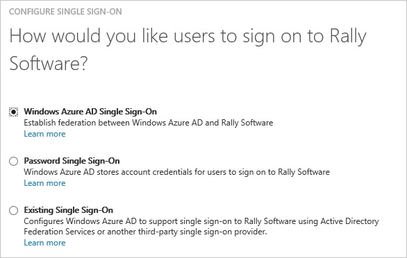
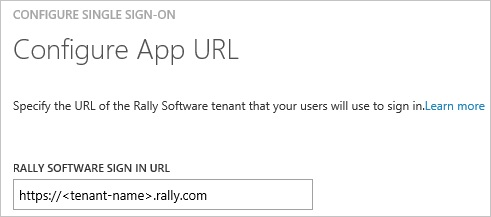
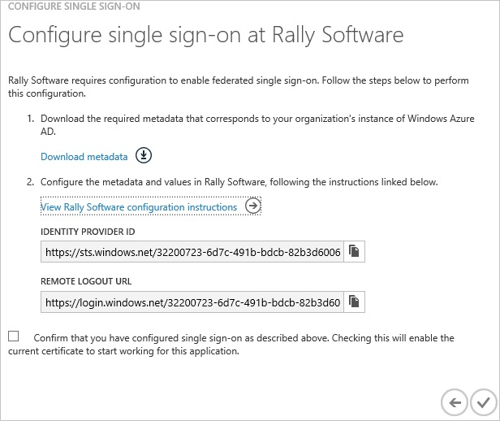
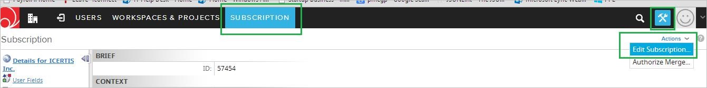
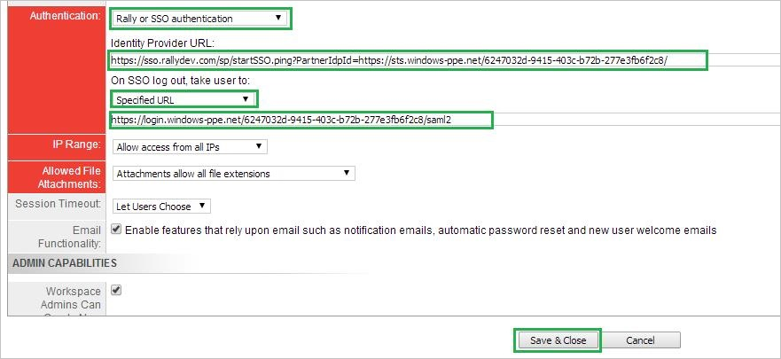
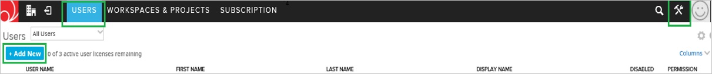

<properties 
    pageTitle="Tutorial: Azure Active Directory Integration with Rally Software | Microsoft Azure" 
    description="Learn how to use Rally Software with Azure Active Directory to enable single sign-on, automated provisioning, and more!" 
    services="active-directory" 
    authors="jeevansd"  
    documentationCenter="na" 
    manager="femila"/>
<tags 
    ms.service="active-directory" 
    ms.devlang="na" 
    ms.topic="article" 
    ms.tgt_pltfrm="na" 
    ms.workload="identity" 
    ms.date="07/07/2016" 
    ms.author="jeedes" />

#Tutorial: Azure Active Directory Integration with Rally Software
  
The objective of this tutorial is to show the integration of Azure and Rally Software.  
The scenario outlined in this tutorial assumes that you already have the following items:

-   A valid Azure subscription
-   A Rally Software tenant
  
The scenario outlined in this tutorial consists of the following building blocks:

1.  Enabling the application integration for Rally Software
2.  Configuring single sign-on
3.  Configuring user provisioning
4.  Assigning users

##Enabling the application integration for Rally Software
  
The objective of this section is to outline how to enable the application integration for Rally Software.

###To enable the application integration for Rally Software, perform the following steps:

1.  In the Azure classic portal, on the left navigation pane, click **Active Directory**.

    

2.  From the **Directory** list, select the directory for which you want to enable directory integration.

3.  To open the applications view, in the directory view, click **Applications** in the top menu.

    

4.  Click **Add** at the bottom of the page.

    

5.  On the **What do you want to do** dialog, click **Add an application from the gallery**.

    

6.  In the **search box**, type **rally**.

    

7.  In the results pane, select **Rally Software**, and then click **Complete** to add the application.

    
##Configuring single sign-on
  
The objective of this section is to outline how to enable users to authenticate to Rally Software with their account in Azure AD using federation based on the SAML protocol.  
As part of this procedure, you are required to upload a certificate to Rally Software.

###To configure single sign-on, perform the following steps:

1.  In the Azure classic portal, on the **Rally Software **application integration page, click **Configure single sign-on** to open the **Configure Single Sign On ** dialog.

    

2.  On the **How would you like users to sign on to Rally** page, select **Microsoft Azure AD Single Sign-On**, and then click **Next**.

    

3.  On the **Configure App URL** page, in the **Rally Software Tenant URL** textbox, type your URL using the following pattern "*https://\<tenant-name\>.rally.com*", and then click **Next**.

    

4.  On the **Configure single sign-on at Rally** page, click Download metadata, and then save it on your computer.

    

5.  Log in to your **Rally Software** tenant.

6.  In the toolbar on the top, click **Setup**, and then select **Subscription**.

    

7.  Click the **Action** button In the tool bar on the top at the right side and then select **Edit Subscription**.

8.  On the **Subscription** dialog page, perform the following steps, and then click **Save & Close**:

    

    1.  Select **Rally or SSO authentication** from Authentication dropdown
    2.  In the Azure classic portal, on the **Configure single sign-on at Rally Software** dialog page, copy the **Identity Provider ID** value, and then paste it into the **Identity Provider URL** textbox
    3.  In the Azure classic portal, on the **Configure single sign-on at Rally Software** dialog page, copy the **Remote Logout URL** value.

9.  On the Azure classic portal, select the single sign-on configuration confirmation, and then click **Complete** to close the **Configure Single Sign On** dialog.

    
##Configuring user provisioning
  
For AAD users to be able to sign in, they must be provisioned to the Rally Software application using their Azure Active Directory user names.

###To configure user provisioning, perform the following steps:

1.  Log in to your Rally Software tenant.

2.  Go to **Setup \> USERS**, and then click **+ Add New**.

    

3.  Type the name in the New User textbox, and then click **Add with Details**.

4.  In the **Create User** section, perform the following steps:

    

    1.  In the **User Name** textbox, type the name of the Azure AD user you want to provision.
    2.  In the **Email Address** textbox, type the email address of the Azure AD user you want to provision.
    3.  Click **Save & Close**.

>[AZURE.NOTE]You can use any other Rally Software user account creation tools or APIs provided by Rally Software to provision AAD user accounts.

##Assigning users
  
To test your configuration, you need to grant the Azure AD users you want to allow using your application access to it by assigning them.

###To assign users to Rally Software, perform the following steps:

1.  In the Azure classic portal, create a test account.

2.  On the **Rally Software** application integration page, click **Assign users**.

    

3.  Select your test user, click **Assign**, and then click **Yes** to confirm your assignment.

    
  
If you want to test your single sign-on settings, open the Access Panel. For more details about the Access Panel, see [Introduction to the Access Panel](active-directory-saas-access-panel-introduction.md).

