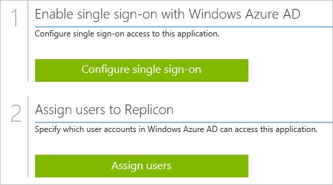
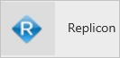
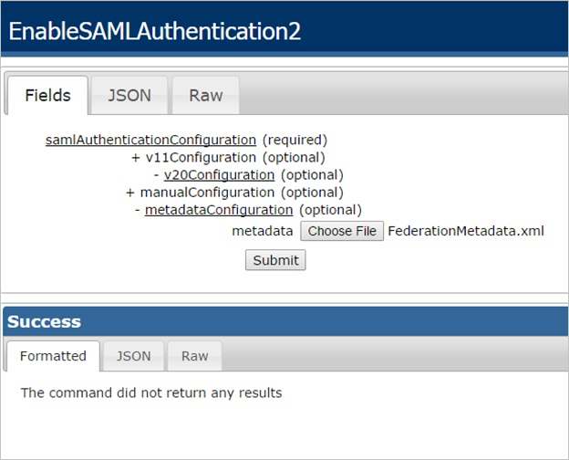
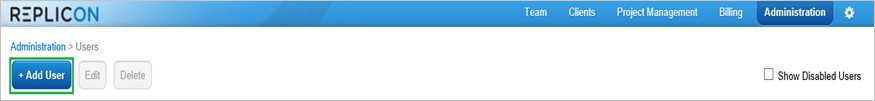
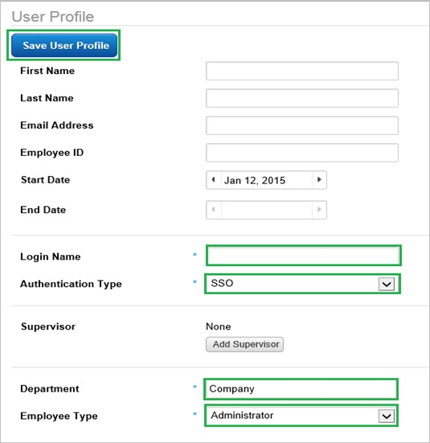

<properties 
    pageTitle="Tutorial: Azure Active Directory integration with Replicon | Microsoft Azure" 
    description="Learn how to use Replicon with Azure Active Directory to enable single sign-on, automated provisioning, and more!" 
    services="active-directory" 
    authors="jeevansd"  
    documentationCenter="na" 
    manager="femila"/>
<tags 
    ms.service="active-directory" 
    ms.devlang="na" 
    ms.topic="article" 
    ms.tgt_pltfrm="na" 
    ms.workload="identity" 
    ms.date="07/07/2016" 
    ms.author="jeedes" />

#Tutorial: Azure Active Directory integration with Replicon
  
The objective of this tutorial is to show the integration of Azure and Replicon. The scenario outlined in this tutorial assumes that you already have the following items:

-   A valid Azure subscription
-   A Replicon tenant
  
After completing this tutorial, the Azure AD users you have assigned to Replicon will be able to single sign into the application at your Replicon company site (service provider initiated sign on), or using the [Introduction to the Access Panel](active-directory-saas-access-panel-introduction.md).
  
The scenario outlined in this tutorial consists of the following building blocks:

1.  Enabling the application integration for Replicon
2.  Configuring single sign-on
3.  Configuring user provisioning
4.  Assigning users

##Enabling the application integration for Replicon
  
The objective of this section is to outline how to enable the application integration for Replicon.

###To enable the application integration for Replicon, perform the following steps:

1.  In the Azure classic portal, on the left navigation pane, click **Active Directory**.

    

2.  From the **Directory** list, select the directory for which you want to enable directory integration.

3.  To open the applications view, in the directory view, click **Applications** in the top menu.

    

4.  Click **Add** at the bottom of the page.

    

5.  On the **What do you want to do** dialog, click **Add an application from the gallery**.

    

6.  In the **search box**, type **Replicon**.

    

7.  In the results pane, select **Replicon**, and then click **Complete** to add the application.

    
##Configuring single sign-on
  
The objective of this section is to outline how to enable users to authenticate to Replicon with their account in Azure AD using federation based on the SAML protocol.

###To configure single sign-on, perform the following steps:

1.  In the Azure classic portal, on the **Replicon** application integration page, click **Configure single sign-on** to open the **Configure Single Sign On ** dialog.

    

2.  On the **How would you like users to sign on to Replicon** page, select **Microsoft Azure AD Single Sign-On**, and then click **Next**.

    

3.  On the **Configure App URL** page, perform the following steps:

    

    1.  In the **Replicon Sign On URL** textbox, type your Replicon tenant URL (e.g.: *https://na2.replicon.com/company/saml2/sp-sso/post*).
    2.  In the **Replicon Reply URL** textbox, type your Replicon **AssertionConsumerService** URL(e.g.: *https://global.replicon.com/!/saml2/company/sso/post*).  

        >[AZURE.NOTE] You can get the URL from the Replicon metadata at:
        **https://global.replicon.com/!/saml2/\<YourCompanyKey\>**.

    3.  Click **Next**

4.  On the **Configure single sign-on at Replicon** page, to download your metadata, click **Download metadata**, and then save the metadata on your computer.

    

5.  In a different web browser window, log into your Replicon company site as an administrator.

6.  To configure SAML 2.0, perform the following steps:

    

    1.  To display the **EnableSAML Authentication2** dialog, append the following to your URL, after your company key:  
        **/services/SecurityService1.svc/help/test/EnableSAMLAuthentication2**  
        The following shows the schema of the complete URL:  
        **https://na2.replicon.com/\<YourCompanyKey\>/services/SecurityService1.svc/help/test/EnableSAMLAuthentication2**
    2.  Click the **+** to expand the **v20Configuration** section.
    3.  Click the **+** to expand the **metaDataConfiguration** section.
    4.  Click **Choose File**, to select your identity provider metadata XML file, and click **Submit**.

7.  On the Azure classic portal, select the single sign-on configuration confirmation, and then click **Complete** to close the **Configure Single Sign On** dialog.

    
##Configuring user provisioning
  
In order to enable Azure AD users to log into Replicon, they must be provisioned into Replicon.  
In the case of Replicon, provisioning is a manual task.

###To configure user provisioning, perform the following steps:

1.  In a web browser window, log into your Replicon company site as an administrator.

2.  Go to **Administration \> Users**.

    

3.  Click **+Add User**.

    

4.  In the **User Profile** section, perform the following steps:

    

    1.  In the **Login Name** textbox, type the Azure AD email address of the Azure AD user you want to provision.
    2.  As **Authentication Type**, select **SSO**.
    3.  In the **Department** textbox, type the user’s department.
    4.  As **Employee Type**, select **Administrator**.
    5.  Click **Save User Profile**.

>[AZURE.NOTE]You can use any other Replicon user account creation tools or APIs provided by Replicon to provision AAD user accounts.

##Assigning users
  
To test your configuration, you need to grant the Azure AD users you want to allow using your application access to it by assigning them.

###To assign users to Replicon, perform the following steps:

1.  In the Azure classic portal, create a test account.

2.  On the **Replicon **application integration page, click **Assign users**.

    

3.  Select your test user, click **Assign**, and then click **Yes** to confirm your assignment.

    
  
If you want to test your single sign-on settings, open the Access Panel. For more details about the Access Panel, see [Introduction to the Access Panel](active-directory-saas-access-panel-introduction.md).