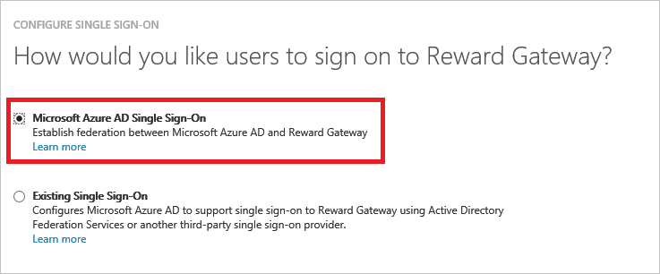

# Tutorial: Azure Active Directory integration with Reward Gateway
In this tutorial, you learn how to integrate Reward Gateway with Azure Active Directory (Azure AD).

Integrating Reward Gateway with Azure AD provides you with the following benefits:

* You can control in Azure AD who has access to Reward Gateway
* You can enable your users to automatically get signed-on to Reward Gateway single sign-on (SSO) with their Azure AD accounts
* You can manage your accounts in one central location - the Azure classic portal

If you want to know more details about SaaS app integration with Azure AD, see [What is application access and single sign-on with Azure Active Directory](active-directory-appssoaccess-whatis.md).

## Prerequisites
To configure Azure AD integration with Reward Gateway, you need the following items:

* An Azure AD subscription
* A Reward Gateway SSO enabled subscription

>[!NOTE]
>To test the steps in this tutorial, we do not recommend using a production environment. 
> 

To test the steps in this tutorial, you should follow these recommendations:

* You should not use your production environment, unless this is necessary.
* If you don't have an Azure AD trial environment, you can get a [one-month trial](https://azure.microsoft.com/pricing/free-trial/).

## Scenario description
In this tutorial, you test Azure AD single sign-on in a test environment.

The scenario outlined in this tutorial consists of two main building blocks:

1. Adding Reward Gateway from the gallery
2. Configuring and testing Azure AD SSO

## Add Reward Gateway from the gallery
To configure the integration of Reward Gateway into Azure AD, you need to add Reward Gateway from the gallery to your list of managed SaaS apps.

**To add Reward Gateway from the gallery, perform the following steps:**

1. In the **Azure classic portal**, on the left navigation pane, click **Active Directory**.
   
    ![Active Directory][1]
2. From the **Directory** list, select the directory for which you want to enable directory integration.
3. To open the applications view, in the directory view, click **Applications** in the top menu.
   
    ![Applications][2]
4. Click **Add** at the bottom of the page.
   
    ![Applications][3]
5. On the **What do you want to do** dialog, click **Add an application from the gallery**.
   
    ![Applications][4]
6. In the search box, type **Reward Gateway**.
   
    
7. In the results pane, select **Reward Gateway**, and then click **Complete** to add the application.
   
    

## Configure and test Azure AD SSO
In this section, you configure and test Azure AD single sign-on with Reward Gateway based on a test user called "Britta Simon".

For SSO to work, Azure AD needs to know what the counterpart user in Reward Gateway is to a user in Azure AD. In other words, a link relationship between an Azure AD user and the related user in Reward Gateway needs to be established.

This link relationship is established by assigning the value of the **user name** in Azure AD as the value of the **Username** in Reward Gateway.

To configure and test Azure AD SSO with Reward Gateway, you need to complete the following building blocks:

1. **[Configuring Azure AD single sign-on](#configuring-azure-ad-single-sign-on)** - to enable your users to use this feature.
2. **[Creating an Azure AD test user](#creating-an-azure-ad-test-user)** - to test Azure AD single sign-on with Britta Simon.
3. **[Creating a Reward Gateway test user](#creating-a-reward-gateway-test-user)** - to have a counterpart of Britta Simon in Reward Gateway that is linked to the Azure AD representation of her.
4. **[Assigning the Azure AD test user](#assigning-the-azure-ad-test-user)** - to enable Britta Simon to use Azure AD single sign-on.
5. **[Testing single sign-on](#testing-single-sign-on)** - to verify whether the configuration works.

### Configure Azure AD SSO
In this section, you enable Azure AD SSO in the classic portal and configure SSO in your Reward Gateway application.

**To configure Azure AD single sign-on with Reward Gateway, perform the following steps:**

1. In the classic portal, on the **Reward Gateway** application integration page, click **Configure single sign-on** to open the **Configure Single Sign-On**  dialog.
   
    ![Configure Single Sign-On][6] 
2. On the **How would you like users to sign on to Reward Gateway** page, select **Azure AD Single Sign-On**, and then click **Next**.
   
     
3. On the **Configure App Settings** dialog page, perform the following steps:
   
     
  1. In the **Identifier URL** textbox, type the URL used by your users to sign-on to your Reward Gateway application using the following pattern: 
   
    | Identifier URL |
    | --- |
    | `https://<company name>.rewardgateway.com/` |
    | `https://<company name>.rewardgateway.co.uk/` |
    | `https://<company name>.rewardgateway.co.nz/` |
    | `https://<company name>.rewardgateway.com.au/` |
  2. In the **Reply URL** textbox, type the URL using the following pattern: 

    | Reply URL |
    | --- |
    | `https://<company name>.rewardgateway.com/Authentication/EndLogin?idp=<Unique Id>` |
    | `https://<company name>.rewardgateway.co.uk/Authentication/EndLogin?idp=<Unique Id>` |
    | `https://<company name>.rewardgateway.co.nz/Authentication/EndLogin?idp=<Unique Id>` |
    | `https://<company name>.rewardgateway.com.au/Authentication/EndLogin?idp=<Unique Id>` |

  3. click **Next**.

4. On the **Configure single sign-on at Reward Gateway** page, perform the following steps:
   
    
  * Click **Download metadata**, and then save the file on your computer.
5. To get SSO configured for your application, contact Reward Gateway [support team](mailTo:clientsupport@rewardgateway.com) and provide them with the following:
   
    • The downloaded **metadata**
6. In the classic portal, select the single sign-on configuration confirmation, and then click **Next**.
   
    ![Azure AD Single Sign-On][10]
6. On the **Single sign-on confirmation** page, click **Complete**.  
   
    ![Azure AD Single Sign-On][11]

### Create an Azure AD test user
In this section, you create a test user in the classic portal called Britta Simon.

![Create Azure AD User][20]

**To create a test user in Azure AD, perform the following steps:**

1. In the **Azure classic portal**, on the left navigation pane, click **Active Directory**.
   
     
2. From the **Directory** list, select the directory for which you want to enable directory integration.
3. To display the list of users, in the menu on the top, click **Users**.
   
     
4. To open the **Add User** dialog, in the toolbar on the bottom, click **Add User**.
   
     
5. On the **Tell us about this user** dialog page, perform the following steps:

        
  1. As Type Of User, select New user in your organization.
  2. In the User Name **textbox**, type **BrittaSimon**.
  3. Click **Next**.
6. On the **User Profile** dialog page, perform the following steps:

       
  1. In the **First Name** textbox, type **Britta**.   
  2. In the **Last Name** textbox, type, **Simon**. 
  3. In the **Display Name** textbox, type **Britta Simon**.
  4. In the **Role** list, select **User**.
  5. Click **Next**.
7. On the **Get temporary password** dialog page, click **create**.
   
     
8. On the **Get temporary password** dialog page, perform the following steps:
   
     
  1. Write down the value of the **New Password**. 
  2. Click **Complete**.   

### Create an Reward Gateway test user
In this section, you create a user called Britta Simon in Reward Gateway. Please work with Reward Gateway [support team](mailTo:clientsupport@rewardgateway.com) to add the users in the Reward Gateway platform.

### Assign the Azure AD test user
In this section, you enable Britta Simon to use Azure single sign-on by granting her access to Reward Gateway.

![Assign User][200] 

**To assign Britta Simon to Reward Gateway, perform the following steps:**

1. On the classic portal, to open the applications view, in the directory view, click **Applications** in the top menu.
   
    ![Assign User][201] 
2. In the applications list, select **Reward Gateway**.
   
     
3. In the menu on the top, click **Users**.
   
    ![Assign User][203]
4. In the Users list, select **Britta Simon**.
5. In the toolbar on the bottom, click **Assign**.
   
    ![Assign User][205]

### Test single sign-on
In this section, you test your Azure AD single sign-on configuration using the Access Panel.

When you click the Reward Gateway tile in the Access Panel, you should get automatically signed-on to your Reward Gateway application.

## Additional resources
* [List of Tutorials on How to Integrate SaaS Apps with Azure Active Directory](active-directory-saas-tutorial-list.md)
* [What is application access and single sign-on with Azure Active Directory?](active-directory-appssoaccess-whatis.md)

<!--Image references-->

[1]: ./media/active-directory-saas-reward-gateway-tutorial/tutorial_general_01.png
[2]: ./media/active-directory-saas-reward-gateway-tutorial/tutorial_general_02.png
[3]: ./media/active-directory-saas-reward-gateway-tutorial/tutorial_general_03.png
[4]: ./media/active-directory-saas-reward-gateway-tutorial/tutorial_general_04.png

[6]: ./media/active-directory-saas-reward-gateway-tutorial/tutorial_general_05.png
[10]: ./media/active-directory-saas-reward-gateway-tutorial/tutorial_general_06.png
[11]: ./media/active-directory-saas-reward-gateway-tutorial/tutorial_general_07.png
[20]: ./media/active-directory-saas-reward-gateway-tutorial/tutorial_general_100.png

[200]: ./media/active-directory-saas-reward-gateway-tutorial/tutorial_general_200.png
[201]: ./media/active-directory-saas-reward-gateway-tutorial/tutorial_general_201.png
[203]: ./media/active-directory-saas-reward-gateway-tutorial/tutorial_general_203.png
[204]: ./media/active-directory-saas-reward-gateway-tutorial/tutorial_general_204.png
[205]: ./media/active-directory-saas-reward-gateway-tutorial/tutorial_general_205.png
