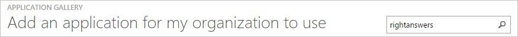
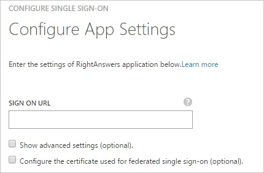

<properties 
    pageTitle="Tutorial: Azure Active Directory integration with RightAnswers | Microsoft Azure" 
    description="Learn how to use RightAnswers with Azure Active Directory to enable single sign-on, automated provisioning, and more!" 
    services="active-directory" 
    authors="jeevansd"  
    documentationCenter="na" 
	manager="femila"/>
<tags 
    ms.service="active-directory" 
    ms.devlang="na" 
    ms.topic="article" 
    ms.tgt_pltfrm="na" 
    ms.workload="identity" 
    ms.date="07/07/2016" 
    ms.author="jeedes" />

#Tutorial: Azure Active Directory integration with RightAnswers
  
The objective of this tutorial is to show the integration of Azure and RightAnswers. The scenario outlined in this tutorial assumes that you already have the following items:

-   A valid Azure subscription
-   A RightAnswers single sign-on enabled subscription
  
After completing this tutorial, the Azure AD users you have assigned to RightAnswers will be able to single sign into the application using the [Introduction to the Access Panel](active-directory-saas-access-panel-introduction.md).
  
The scenario outlined in this tutorial consists of the following building blocks:

1.  Enabling the application integration for RightAnswers
2.  Configuring single sign-on
3.  Configuring user provisioning
4.  Assigning users

##Enabling the application integration for RightAnswers
  
The objective of this section is to outline how to enable the application integration for RightAnswers.

###To enable the application integration for RightAnswers, perform the following steps:

1.  In the Azure classic portal, on the left navigation pane, click **Active Directory**.

    

2.  From the **Directory** list, select the directory for which you want to enable directory integration.

3.  To open the applications view, in the directory view, click **Applications** in the top menu.

    

4.  Click **Add** at the bottom of the page.

    

5.  On the **What do you want to do** dialog, click **Add an application from the gallery**.

    

6.  In the **search box**, type **RightAnswers**.

    

7.  In the results pane, select **RightAnswers**, and then click **Complete** to add the application.
##Configuring single sign-on
  
The objective of this section is to outline how to enable users to authenticate to RightAnswers with their account in Azure AD using federation based on the SAML protocol.

###To configure single sign-on, perform the following steps:

1.  In the Azure classic portal, on the **RightAnswers** application integration page, click **Configure single sign-on** to open the **Configure Single Sign On ** dialog.

    

2.  On the **How would you like users to sign on to RightAnswers** page, select **Microsoft Azure AD Single Sign-On**, and then click **Next**.

    

3.  On the **Configure App Settings** page, in the **Sign On URL** textbox, type the URL used by your users to sign-on to your RightAnswers application (e.g.: *https://fortify.rightanswers.com/portal/ss/*), and then click **Next**.

    

4.  On the **Configure single sign-on at RightAnswers** page, to download your metadata, click **Download metadata**, and then save the metadata file locally on your computer.

    

5.  Send the downloaded metadata file to your RightAnswers support team.

    >[AZURE.NOTE] Your RightAnswers support team has to do the actual SSO configuration.
    You will get a notification when SSO has been enabled for your subscription.

6.  On the Azure classic portal, select the single sign-on configuration confirmation, and then click **Complete** to close the **Configure Single Sign On** dialog.

    
##Configuring user provisioning
  
In order to enable Azure AD users to log into RightAnswers, they must be provisioned into RightAnswers.  
In the case of RightAnswers, provisioning is an automated task.  
There is no action item for you.
  
Users are automatically created if necessary during the first single sign-on attempt.

>[AZURE.NOTE]You can use any other RightAnswers user account creation tools or APIs provided by RightAnswers to provision AAD user accounts.

##Assigning users
  
To test your configuration, you need to grant the Azure AD users you want to allow using your application access to it by assigning them.

###To assign users to RightAnswers, perform the following steps:

1.  In the Azure classic portal, create a test account.

2.  On the **RightAnswers **application integration page, click **Assign users**.

    

3.  Select your test user, click **Assign**, and then click **Yes** to confirm your assignment.

    
  
If you want to test your single sign-on settings, open the Access Panel. For more details about the Access Panel, see [Introduction to the Access Panel](active-directory-saas-access-panel-introduction.md).