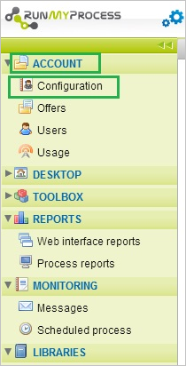
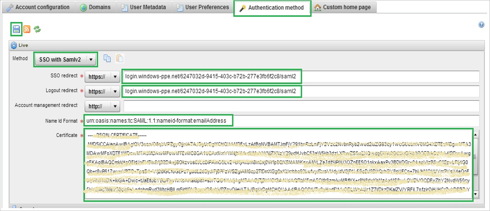
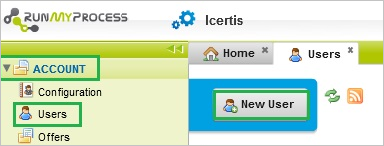
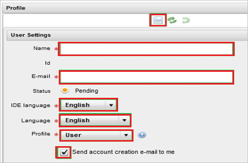

# Tutorial: Azure Active Directory integration with RunMyProcess
The objective of this tutorial is to show you how to integrate RunMyProcess with Azure Active Directory (Azure AD).

Integrating RunMyProcess with Azure AD provides you with the following benefits:

* You can control in Azure AD who has access to RunMyProcess
* You can enable your users to automatically get signed-on to RunMyProcess single sign-on (SSO) with their Azure AD accounts
* You can manage your accounts in one central location - the Azure classic portal

If you want to know more details about SaaS app integration with Azure AD, see [What is application access and single sign-on with Azure Active Directory](active-directory-appssoaccess-whatis.md).

## Prerequisites
To configure Azure AD integration with RunMyProcess, you need the following items:

* An Azure AD subscription
* A RunMyProcess SSO enabled subscription

>[!NOTE]
>To test the steps in this tutorial, we do not recommend using a production environment. 
> 

To test the steps in this tutorial, you should follow these recommendations:

* You should not use your production environment, unless this is necessary.
* If you don't have an Azure AD trial environment, you can get a [one-month trial](https://azure.microsoft.com/pricing/free-trial/).

## Scenario description
The objective of this tutorial is to enable you to test Azure AD SSO in a test environment.

The scenario outlined in this tutorial consists of two main building blocks:

1. Adding RunMyProcess from the gallery
2. Configuring and testing Azure AD SSO

## Add RunMyProcess from the gallery
To configure the integration of RunMyProcess into Azure AD, you need to add RunMyProcess from the gallery to your list of managed SaaS apps.

**To add RunMyProcess from the gallery, perform the following steps:**

1. In the **Azure classic portal**, on the left navigation pane, click **Active Directory**.
   
    ![Active Directory][1]
2. From the **Directory** list, select the directory for which you want to enable directory integration.
3. To open the applications view, in the directory view, click **Applications** in the top menu.
   
    ![Applications][2]
4. Click **Add** at the bottom of the page.
   
    ![Applications][3]
5. On the **What do you want to do** dialog, click **Add an application from the gallery**.
   
    ![Applications][4]
6. In the search box, type **RunMyProcess**.
   
    
7. In the results pane, select **RunMyProcess**, and then click **Complete** to add the application.
   
    

## Configure and test Azure AD SSo
The objective of this section is to show you how to configure and test Azure AD single sign-on with RunMyProcess based on a test user called "Britta Simon".

For single sign-on to work, Azure AD needs to know what the counterpart user in RunMyProcess is to a user in Azure AD is. In other words, a link relationship between an Azure AD user and the related user in RunMyProcess needs to be established.

This link relationship is established by assigning the value of the **user name** in Azure AD as the value of the **Username** in RunMyProcess.

To configure and test Azure AD SSO with RunMyProcess, you need to complete the following building blocks:

1. **[Configuring Azure AD single sign-on](#configuring-azure-ad-single-sign-on)** - to enable your users to use this feature.
2. **[Creating an Azure AD test user](#creating-an-azure-ad-test-user)** - to test Azure AD single sign-on with Britta Simon.
3. **[Creating a RunMyProcess test user](#creating-a-runmyprocess-test-user)** - to have a counterpart of Britta Simon in RunMyProcess that is linked to the Azure AD representation of her.
4. **[Assigning the Azure AD test user](#assigning-the-azure-ad-test-user)** - to enable Britta Simon to use Azure AD single sign-on.
5. **[Testing single sign-on](#testing-single-sign-on)** - to verify whether the configuration works.

### Configure Azure AD SSO
In this section, you enable Azure AD single sign-on in the classic portal and configure SSO in your RunMyProcess application.

**To configure Azure AD SSO with RunMyProcess, perform the following steps:**

1. In the classic portal, on the **RunMyProcess** application integration page, click **Configure single sign-on** to open the **Configure Single Sign-On**  dialog.
   
    ![Configure Single Sign-On][6] 
2. On the **How would you like users to sign on to RunMyProcess** page, select **Azure AD Single Sign-On**, and then click **Next**.
   
     
3. On the **Configure App Settings** dialog page, perform the following steps:
   
     
  1. In the **Sign On URL** textbox, type a URL using the following pattern: `https://live.runmyprocess.com/live/<tenant id>`. 
  2. click **Next**.
    >[!NOTE]
    >Please note that you have to update the value with the actual Sign On URL. To get this value, contact RunMyProcess support team via <mailto:support@runmyprocess.com>.
    >  
4. On the **Configure single sign-on at RunMyProcess** page, click **Download Certificate** and then save the file on your computer:
   
    
5. In a different web browser window, sign-on to your RunMyProcess tenant as an administrator.
6. In left navigation panel, click **Account** and select **Configuration**.
   
    
7. Go to **Authentication method** section and perform below steps:
   
    
  1. As **Method**, select **SSO with Samlv2**. 
  2. In the **SSO redirect** textbox put the value of **SAML SSO URL** from Azure AD application configuration wizard.
  3. In the **Logout redirect** textbox put the value of **Single Sign-Out Service URL** from Azure AD application configuration wizard.
  4. In the **Name Id Format** textbox put the value of **Name Identifier Format** from Azure AD application configuration wizard.
  5. Copy the content of the downloaded certificate file and then paste it into the **Certificate** textbox. 
  6. Click **Save** icon.
8. In the classic portal, select the single sign-on configuration confirmation, and then click **Next**.
   
    ![Azure AD Single Sign-On][10]
9. On the **Single sign-on confirmation** page, click **Complete**.  
   
    ![Azure AD Single Sign-On][11]

### Create an Azure AD test user
The objective of this section is to create a test user in the classic portal called Britta Simon.

![Create Azure AD User][20]

**To create a test user in Azure AD, perform the following steps:**

1. In the **Azure classic portal**, on the left navigation pane, click **Active Directory**.
   
     
2. From the **Directory** list, select the directory for which you want to enable directory integration.
3. To display the list of users, in the menu on the top, click **Users**.
   
     
4. To open the **Add User** dialog, in the toolbar on the bottom, click **Add User**.
   
     
5. On the **Tell us about this user** dialog page, perform the following steps:

     
 1. As Type Of User, select New user in your organization.  
 2. In the User Name **textbox**, type **BrittaSimon**. 
 3. Click **Next**.
6. On the **User Profile** dialog page, perform the following steps:

     
 1. In the **First Name** textbox, type **Britta**.   
 2. In the **Last Name** textbox, type, **Simon**. 
 3. In the **Display Name** textbox, type **Britta Simon**. 
 4. In the **Role** list, select **User**. 
 5. Click **Next**.
7. On the **Get temporary password** dialog page, click **create**.
   
     
8. On the **Get temporary password** dialog page, perform the following steps:
   
      
 1. Write down the value of the **New Password**.
 2. Click **Complete**.   

### Create a RunMyProcess test user
In order to enable Azure AD users to log into RunMyProcess, they must be provisioned into RunMyProcess. In the case of RunMyProcess, provisioning is a manual task.

**To provision a user accounts, perform the following steps:**

1. Log in to your RunMyProcess company site as an administrator.
2. Click **Account** and select **Users** in left navigation panel, then click **New User**.
   
   
3. In the **User Settings** section, perform the following steps:
   
      
 1. Type the **Name** and **E-mail** of a valid AAD account you want to provision into the related textboxes. 
 2. Select an **IDE language**, a **Language** and a **Profile**. 
 3. Select **Send account creation e-mail to me**. 
 4. Click **Save**.
   
   >[!NOTE]
   >You can use any other RunMyProcess user account creation tools or APIs provided by RunMyProcess to provision Azure Active Directory user accounts. 
   > 

### Assign the Azure AD test user
The objective of this section is to enabling Britta Simon to use Azure SSO by granting her access to RunMyProcess.

![Assign User][200] 

**To assign Britta Simon to RunMyProcess, perform the following steps:**

1. On the classic portal, to open the applications view, in the directory view, click **Applications** in the top menu.
   
    ![Assign User][201] 
2. In the applications list, select **RunMyProcess**.
   
     
3. In the menu on the top, click **Users**.
   
    ![Assign User][203]
4. In the Users list, select **Britta Simon**.
5. bar on the bottom, click **Assign**.
   
    ![Assign User][205]

### Test single sign-on
The objective of this section is to test your Azure AD SSO configuration using the Access Panel.

When you click the RunMyProcess tile in the Access Panel, you should get automatically signed-on to your RunMyProcess application.

## Additional resources
* [List of Tutorials on How to Integrate SaaS Apps with Azure Active Directory](active-directory-saas-tutorial-list.md)
* [What is application access and single sign-on with Azure Active Directory?](active-directory-appssoaccess-whatis.md)

<!--Image references-->

[1]: ./media/active-directory-saas-runmyprocess-tutorial/tutorial_general_01.png
[2]: ./media/active-directory-saas-runmyprocess-tutorial/tutorial_general_02.png
[3]: ./media/active-directory-saas-runmyprocess-tutorial/tutorial_general_03.png
[4]: ./media/active-directory-saas-runmyprocess-tutorial/tutorial_general_04.png

[6]: ./media/active-directory-saas-runmyprocess-tutorial/tutorial_general_05.png
[10]: ./media/active-directory-saas-runmyprocess-tutorial/tutorial_general_06.png
[11]: ./media/active-directory-saas-runmyprocess-tutorial/tutorial_general_07.png
[20]: ./media/active-directory-saas-runmyprocess-tutorial/tutorial_general_100.png

[200]: ./media/active-directory-saas-runmyprocess-tutorial/tutorial_general_200.png
[201]: ./media/active-directory-saas-runmyprocess-tutorial/tutorial_general_201.png
[203]: ./media/active-directory-saas-runmyprocess-tutorial/tutorial_general_203.png
[204]: ./media/active-directory-saas-runmyprocess-tutorial/tutorial_general_204.png
[205]: ./media/active-directory-saas-runmyprocess-tutorial/tutorial_general_205.png
