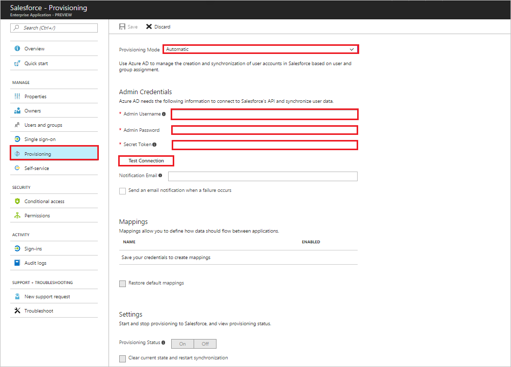
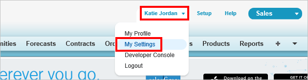
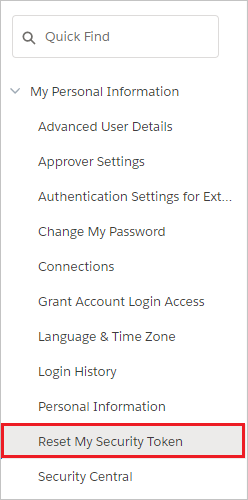

# Tutorial: Configuring Salesforce for Automatic User Provisioning

The objective of this tutorial is to show the steps required to perform in Salesforce and Azure AD to automatically provision and de-provision user accounts from Azure AD to Salesforce.

## Prerequisites

The scenario outlined in this tutorial assumes that you already have the following items:

*   An Azure Active directory tenant.
*   You must have a valid tenant for Salesforce for Work or Salesforce for Education. You may use a free trial     account for either service.
*   A user account in Salesforce with Team Admin permissions.

## Assigning users to Salesforce

Azure Active Directory uses a concept called "assignments" to determine which users should receive access to selected apps. In the context of automatic user account provisioning, only the users and groups that have been "assigned" to an application in Azure AD is synchronized.

Before configuring and enabling the provisioning service, you need to decide what users and/or groups in Azure AD represent the users who need access to your Salesforce app. Once decided, you can assign these users to your Salesforce app by following the instructions here:

[Assign a user or group to an enterprise app](https://docs.microsoft.com/azure/active-directory/active-directory-coreapps-assign-user-azure-portal)

### Important tips for assigning users to Salesforce

*   It is recommended that a single Azure AD user is assigned to Salesforce to test the provisioning configuration. Additional users and/or groups may be assigned later.

*  When assigning a user to Salesforce, you must select a valid user role. The "Default Access" role does not work for provisioning

    > [!NOTE]
    > This app imports custom roles from Salesforce as part of the provisioning process, which the customer may want to select when assigning users

## Enable Automated User Provisioning

This section guides you through connecting your Azure AD to Salesforce's user account provisioning API, and configuring the provisioning service to create, update, and disable assigned user accounts in Salesforce based on user and group assignment in Azure AD.

>[!Tip]
>You may also choose to enabled SAML-based Single Sign-On for Salesforce, following the instructions provided in [Azure portal](https://portal.azure.com). Single sign-on can be configured independently of automatic provisioning, though these two features compliment each other.

### To configure automatic user account provisioning:

The objective of this section is to outline how to enable user provisioning of Active Directory user accounts to Salesforce.

1. In the [Azure portal](https://portal.azure.com), browse to the **Azure Active Directory > Enterprise Apps > All applications** section.

2. If you have already configured Salesforce for single sign-on, search for your instance of Salesforce using the search field. Otherwise, select **Add** and search for **Salesforce** in the application gallery. Select Salesforce from the search results, and add it to your list of applications.

3. Select your instance of Salesforce, then select the **Provisioning** tab.

4. Set the **Provisioning Mode** to **Automatic**. 

5. Under the **Admin Credentials** section, provide the following configuration settings:
   
    a. In the **Admin User Name** textbox, type a Salesforce account name that has the **System Administrator** profile in Salesforce.com assigned.
   
    b. In the **Admin Password** textbox, type the password for this account.

6. To get your Salesforce security token, open a new tab and sign into the same Salesforce admin account. On the top right corner of the page, click your name, and then click **My Settings**.

     
7. On the left navigation pane, click **Personal** to expand the related section, and then click **Reset My Security Token**.
  
    
8. On the **Reset My Security Token** page, click **Reset Security Token** button.

    
9. Check the email inbox associated with this admin account. Look for an email from Salesforce.com that contains the new security token.
10. Copy the token, go to your Azure AD window, and paste it into the **Socket Token** field.

11. In the Azure portal, click **Test Connection** to ensure Azure AD can connect to your Salesforce app.

12. In the **Notification Email** field, enter the email address of a person or group who should receive provisioning error notifications, and check the checkbox below.

13. Click **Save.**  
    
14.  Under the Mappings section, select **Synchronize Azure Active Directory Users to Salesforce.**

15. In the **Attribute Mappings** section, review the user attributes that are synchronized from Azure AD to Salesforce. Note that the attributes selected as **Matching** properties are used to match the user accounts in Salesforce for update operations. Select the Save button to commit any changes.

16. To enable the Azure AD provisioning service for Salesforce, change the **Provisioning Status** to **On** in the Settings section

17. Click **Save.**

This starts the initial synchronization of any users and/or groups assigned to Salesforce in the Users and Groups section. Note that the initial sync takes longer to perform than subsequent syncs, which occur approximately every 20 minutes as long as the service is running. You can use the **Synchronization Details** section to monitor progress and follow links to provisioning activity reports, which describe all actions performed by the provisioning service on your Salesforce app.

You can now create a test account. Wait for up to 20 minutes to verify that the account has been synchronized to Salesforce.

## Additional resources

* [Managing user account provisioning for Enterprise Apps](active-directory-saas-tutorial-list.md)
* [What is application access and single sign-on with Azure Active Directory?](active-directory-appssoaccess-whatis.md)
* [Configure Single Sign-on](active-directory-saas-salesforce-tutorial.md)