# Tutorial: Azure Active Directory integration with Salesforce

In this tutorial, you learn how to integrate Salesforce with Azure Active Directory (Azure AD).

Integrating Salesforce with Azure AD provides you with the following benefits:

- You can control in Azure AD who has access to Salesforce
- You can enable your users to automatically get signed-on to Salesforce (Single Sign-On) with their Azure AD accounts
- You can manage your accounts in one central location - the Azure portal

If you want to know more details about SaaS app integration with Azure AD, see [what is application access and single sign-on with Azure Active Directory](active-directory-appssoaccess-whatis.md).

## Prerequisites

To configure Azure AD integration with Salesforce, you need the following items:

- An Azure AD subscription
- A Salesforce single-sign on enabled subscription

> [!NOTE]
> To test the steps in this tutorial, we do not recommend using a production environment.

To test the steps in this tutorial, you should follow these recommendations:

- Do not use your production environment, unless it is necessary.
- If you don't have an Azure AD trial environment, you can get a one-month trial [here](https://azure.microsoft.com/pricing/free-trial/).

## Scenario description
In this tutorial, you test Azure AD single sign-on in a test environment. 
The scenario outlined in this tutorial consists of two main building blocks:

1. Adding Salesforce from the gallery
2. Configuring and testing Azure AD single sign-on

## Adding Salesforce from the gallery
To configure the integration of Salesforce into Azure AD, you need to add Salesforce from the gallery to your list of managed SaaS apps.

**To add Salesforce from the gallery, perform the following steps:**

1. In the **[Azure portal](https://portal.azure.com)**, on the left navigation panel, click **Azure Active Directory** icon. 

	![Active Directory][1]

2. Navigate to **Enterprise applications**. Then go to **All applications**.

	![Applications][2]
	
3. Click **New application** button on the top of the dialog.

	![Applications][3]

4. In the search box, type **Salesforce**.

	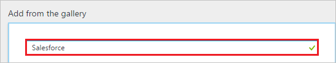

5. In the results panel, select **Salesforce**, and then click **Add** button to add the application.

	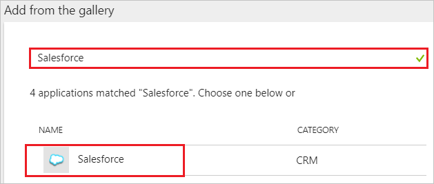

##  Configuring and testing Azure AD single sign-on
In this section, you configure and test Azure AD single sign-on with Salesforce based on a test user called "Britta Simon."

For single sign-on to work, Azure AD needs to know what the counterpart user in Salesforce is to a user in Azure AD. In other words, a link relationship between an Azure AD user and the related user in Salesforce needs to be established.

This link relationship is established by assigning the value of the **user name** in Azure AD as the value of the **Username** in Salesforce.

To configure and test Azure AD single sign-on with Salesforce, you need to complete the following building blocks:

1. **[Configuring Azure AD Single Sign-On](#configuring-azure-ad-single-sign-on)** - to enable your users to use this feature.
2. **[Creating an Azure AD test user](#creating-an-azure-ad-test-user)** - to test Azure AD single sign-on with Britta Simon.
3. **[Creating a Salesforce test user](#creating-a-salesforce-test-user)** - to have a counterpart of Britta Simon in Salesforce that is linked to the Azure AD representation of user.
4. **[Assigning the Azure AD test user](#assigning-the-azure-ad-test-user)** - to enable Britta Simon to use Azure AD single sign-on.
5. **[Testing Single Sign-On](#testing-single-sign-on)** - to verify whether the configuration works.

### Configuring Azure AD single sign-on

In this section, you enable Azure AD single sign-on in the Azure portal and configure single sign-on in your Salesforce application.

**To configure Azure AD single sign-on with Salesforce, perform the following steps:**

1. In the Azure portal, on the **Salesforce** application integration page, click **Single sign-on**.

	![Configure Single Sign-On][4]

2. On the **Single sign-on** dialog, select **Mode** as	**SAML-based Sign-on** to enable single sign-on.
 
	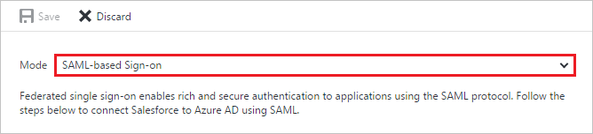

3. On the **Salesforce Domain and URLs** section, perform the following steps:

	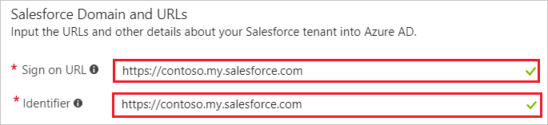

    In the **Sign-on URL** textbox, type the value using the following pattern: 
   * Enterprise account: `https://<subdomain>.my.salesforce.com`
   * Developer account: `https://<subdomain>-dev-ed.my.salesforce.com`

	> [!NOTE] 
	> These values are not the real. Update these values with the actual Sign-on URL. Contact [Salesforce Client support team](https://help.salesforce.com/support) to get these values. 
 
4. On the **SAML Signing Certificate** section, click **Certificate** and then save the certificate file on your computer.

	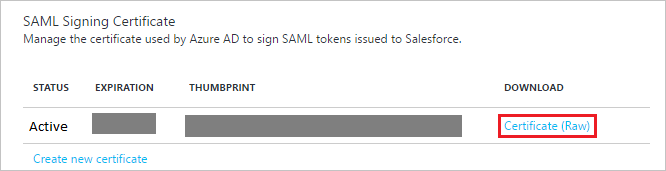 

5. Click **Save** button.

	

6. On the **Salesforce Configuration** section, click **Configure Salesforce** to open **Configure sign-on** window. Copy the **SAML Entity ID and SAML Single Sign-On Service URL** from the **Quick Reference section.** 

	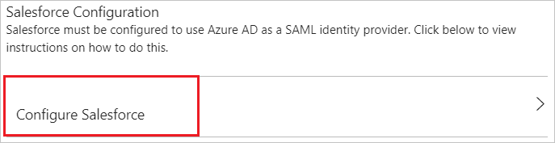 
<CS>
7.  Open a new tab in your browser and log in to your Salesforce administrator account.

8.  Under the **Administrator** navigation pane, click **Security Controls** to expand the related section. Then click **Single Sign-On Settings**.

    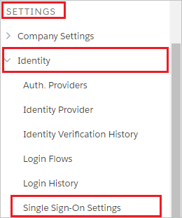

9.  On the **Single Sign-On Settings** page, click the **Edit** button.
    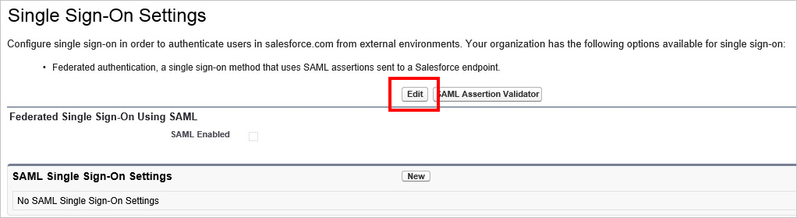

      > [!NOTE]
      > If you are unable to enable Single Sign-On settings for your Salesforce account, you may need to contact [Salesforce Client support team](https://help.salesforce.com/support). 

10. Select **SAML Enabled**, and then click **Save**.

      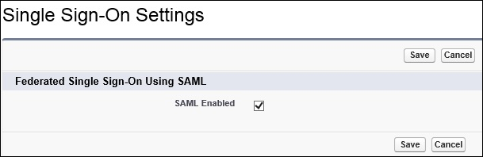
11. To configure your SAML single sign-on settings, click **New**.

    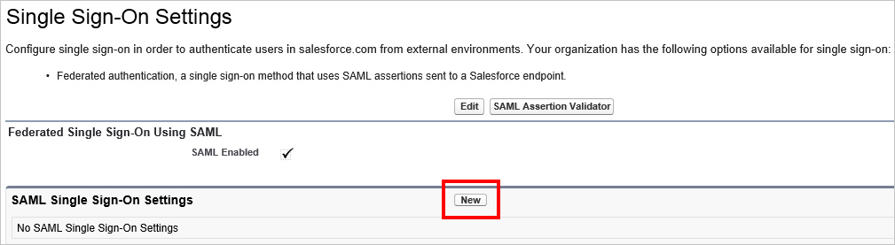

12. On the **SAML Single Sign-On Setting Edit** page, make the following configurations:

    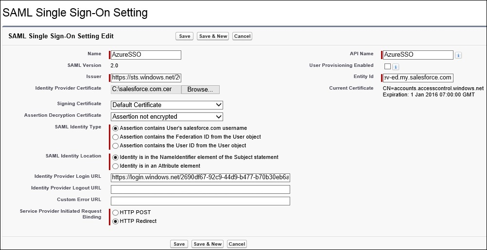

    a. For the **Name** field, type in a friendly name for this configuration. Providing a value for **Name** automatically populate the **API Name** textbox.

    b. Paste **SMAL Entity ID** value into the **Issuer** field in Salesforce.

    c. In the **Entity Id textbox**, type your Salesforce domain name using the following pattern:
      
      * Enterprise account: `https://<subdomain>.my.salesforce.com`
      * Developer account: `https://<subdomain>-dev-ed.my.salesforce.com`
      
    d. Click **Browse** or **Choose File** to open the **Choose File to Upload** dialog, select your Salesforce certificate, and then click **Open** to upload the certificate.

    e. For **SAML Identity Type**, select **Assertion contains User's salesforce.com username**.

    f. For **SAML Identity Location**, select **Identity is in the NameIdentifier element of the Subject statement**

    g. Paste **Single Sign-On Service URL** into the **Identity Provider Login URL** field in Salesforce.
    
    h. For **Service Provider Initiated Request Binding**, select **HTTP Redirect**.
    
    i. Finally, click **Save** to apply your SAML single sign-on settings.

13. On the left navigation pane in Salesforce, click **Domain Management** to expand the related section, and then click **My Domain**.

    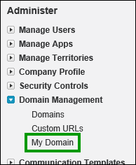

14. Scroll down to the **Authentication Configuration** section, and click the **Edit** button.

    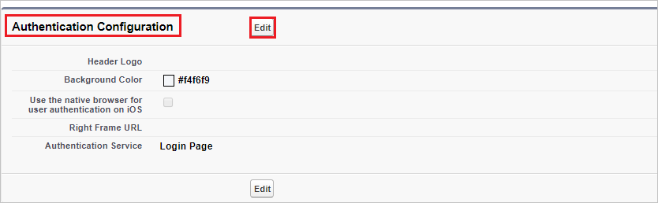

15. In the **Authentication Service** section, select the friendly name of your SAML SSO configuration, and then click **Save**.

    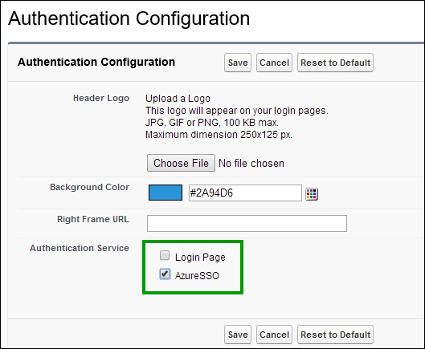

    > [!NOTE]
    > If more than one authentication service is selected, users are prompted to select which authentication service they like to sign in with while initiating single sign-on to your Salesforce environment. If you don’t want it to happen, then you should **leave all other authentication services unchecked**.
<CE>    
> [!TIP]
> You can now read a concise version of these instructions inside the [Azure portal](https://portal.azure.com), while you are setting up the app!  After adding this app from the **Active Directory > Enterprise Applications** section, simply click **Single Sign-On** tab and access the embedded documentation through the **Configuration** section at the bottom. You can read more about the embedded documentation feature here: [Azure AD embedded documentation]( https://go.microsoft.com/fwlink/?linkid=845985)

### Creating an Azure AD test user
The objective of this section is to create a test user in the Azure portal called Britta Simon.

![Create Azure AD User][100]

**To create a test user in Azure AD, perform the following steps:**

1. On the left navigation pane in the **Azure portal**, click **Azure Active Directory** icon.

	 

2. To display the list of users, Go to **Users and groups** and click **All users**.
	
	 

3. At the top of the dialog, click **Add** to open the **User** dialog.
 
	 

4. On the **User** dialog page, perform the following steps:
 
	 

    a. In the **Name** textbox, type **BrittaSimon**.

    b. In the **User name** textbox, type the **email address** of BrittaSimon.

	c. Select **Show Password** and write down the value of the **Password**.

    d. Click **Create**.
 
### Creating a Salesforce test user

In this section, a user called Britta Simon is created in Salesforce. Salesforce supports just-in-time provisioning, which is enabled by default.
There is no action item for you in this section. If a user doesn't already exist in Salesforce, a new one is created when you attempt to access Salesforce.

### Assigning the Azure AD test user

In this section, you enable Britta Simon to use Azure single sign-on by granting access to Salesforce.

![Assign User][200] 

**To assign Britta Simon to Salesforce, perform the following steps:**

1. In the Azure portal, open the applications view, and then navigate to the directory view and go to **Enterprise applications** then click **All applications**.

	![Assign User][201] 

2. In the applications list, select **Salesforce**.

	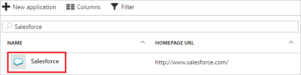 

3. In the menu on the left, click **Users and groups**.

	![Assign User][202] 

4. Click **Add** button. Then select **Users and groups** on **Add Assignment** dialog.

	![Assign User][203]

5. On **Users and groups** dialog, select **Britta Simon** in the Users list.

6. Click **Select** button on **Users and groups** dialog.

7. Click **Assign** button on **Add Assignment** dialog.
	
### Testing single sign-on

To test your single sign-on settings, open the Access Panel at [https://myapps.microsoft.com](https://myapps.microsoft.com/), then sign into the test account, and click **Salesforce**.

## Additional resources

* [List of Tutorials on How to Integrate SaaS Apps with Azure Active Directory](active-directory-saas-tutorial-list.md)
* [What is application access and single sign-on with Azure Active Directory?](active-directory-appssoaccess-whatis.md)
* [Configure User Provisioning](active-directory-saas-salesforce-provisioning-tutorial.md)

<!--Image references-->

[1]: ./media/active-directory-saas-salesforce-tutorial/tutorial_general_01.png
[2]: ./media/active-directory-saas-salesforce-tutorial/tutorial_general_02.png
[3]: ./media/active-directory-saas-salesforce-tutorial/tutorial_general_03.png
[4]: ./media/active-directory-saas-salesforce-tutorial/tutorial_general_04.png

[100]: ./media/active-directory-saas-salesforce-tutorial/tutorial_general_100.png

[200]: ./media/active-directory-saas-salesforce-tutorial/tutorial_general_200.png
[201]: ./media/active-directory-saas-salesforce-tutorial/tutorial_general_201.png
[202]: ./media/active-directory-saas-salesforce-tutorial/tutorial_general_202.png
[203]: ./media/active-directory-saas-salesforce-tutorial/tutorial_general_203.png

