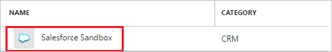
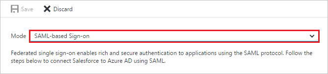
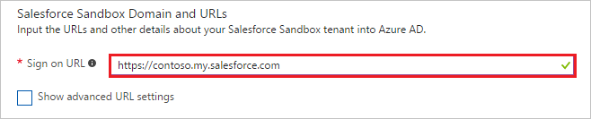
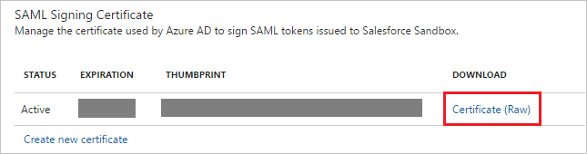
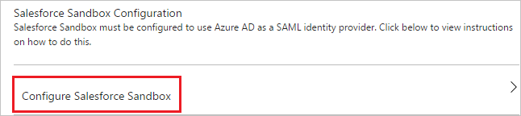

# Tutorial: Azure Active Directory integration with Salesforce Sandbox

In this tutorial, you learn how to integrate Salesforce Sandbox with Azure Active Directory (Azure AD).

Integrating Salesforce Sandbox with Azure AD provides you with the following benefits:

- You can control in Azure AD who has access to Salesforce Sandbox
- You can enable your users to automatically get signed-on to Salesforce Sandbox (Single Sign-On) with their Azure AD accounts
- You can manage your accounts in one central location - the Azure portal

If you want to know more details about SaaS app integration with Azure AD, see [what is application access and single sign-on with Azure Active Directory](active-directory-appssoaccess-whatis.md).

## Prerequisites

To configure Azure AD integration with Salesforce Sandbox, you need the following items:

- An Azure AD subscription
- A Salesforce Sandbox single-sign on enabled subscription

> [!NOTE]
> To test the steps in this tutorial, we do not recommend using a production environment.

To test the steps in this tutorial, you should follow these recommendations:

- Do not use your production environment, unless it is necessary.
- If you don't have an Azure AD trial environment, you can get a one-month trial [here](https://azure.microsoft.com/pricing/free-trial/).

## Scenario description
In this tutorial, you test Azure AD single sign-on in a test environment. 
The scenario outlined in this tutorial consists of two main building blocks:

1. Adding Salesforce Sandbox from the gallery
2. Configuring and testing Azure AD single sign-on

## Adding Salesforce Sandbox from the gallery
To configure the integration of Salesforce Sandbox into Azure AD, you need to add Salesforce Sandbox from the gallery to your list of managed SaaS apps.

**To add Salesforce Sandbox from the gallery, perform the following steps:**

1. In the **[Azure portal](https://portal.azure.com)**, on the left navigation panel, click **Azure Active Directory** icon. 

	![Active Directory][1]

2. Navigate to **Enterprise applications**. Then go to **All applications**.

	![Applications][2]
	
3. Click **New application** button on the top of the dialog.

	![Applications][3]

4. In the search box, type **Salesforce Sandbox**.

	

5. In the results panel, select **Salesforce Sandbox**, and then click **Add** button to add the application.

	

##  Configuring and testing Azure AD single sign-on
In this section, you configure and test Azure AD single sign-on with Salesforce Sandbox based on a test user called "Britta Simon."

For single sign-on to work, Azure AD needs to know what the counterpart user in Salesforce Sandbox is to a user in Azure AD. In other words, a link relationship between an Azure AD user and the related user in Salesforce Sandbox needs to be established.

This link relationship is established by assigning the value of the **user name** in Azure AD as the value of the **Username** in Salesforce Sandbox.

To configure and test Azure AD single sign-on with Salesforce Sandbox, you need to complete the following building blocks:

1. **[Configuring Azure AD Single Sign-On](#configuring-azure-ad-single-sign-on)** - to enable your users to use this feature.
2. **[Creating an Azure AD test user](#creating-an-azure-ad-test-user)** - to test Azure AD single sign-on with Britta Simon.
3. **[Creating a Salesforce Sandbox test user](#creating-a-salesforce-sandbox-test-user)** - to have a counterpart of Britta Simon in Salesforce Sandbox that is linked to the Azure AD representation of user.
4. **[Assigning the Azure AD test user](#assigning-the-azure-ad-test-user)** - to enable Britta Simon to use Azure AD single sign-on.
5. **[Testing Single Sign-On](#testing-single-sign-on)** - to verify whether the configuration works.

### Configuring Azure AD single sign-on

In this section, you enable Azure AD single sign-on in the Azure portal and configure single sign-on in your Salesforce Sandbox application.

**To configure Azure AD single sign-on with Salesforce Sandbox, perform the following steps:**

1. In the Azure portal, on the **Salesforce Sandbox** application integration page, click **Single sign-on**.

	![Configure Single Sign-On][4]

2. On the **Single sign-on** dialog, select **Mode** as	**SAML-based Sign-on** to enable single sign-on.
 
	

3. On the **Salesforce Sandbox Domain and URLs** section, perform the following steps:

	

     In the **Sign-on URL** textbox, type the value using the following pattern: `https://<subdomain>.my.salesforce.com`

	> [!NOTE] 
	> This value is not the real. Update this value with the actual Sign-on URL.Contact [Salesforce Sandbox Client support team](https://help.salesforce.com/support) to get this value.

4. If you have already configured single sign-on for another Salesforce Sandbox instance in your directory, then you must also configure the **Identifier** to have the same value as the **Sign on URL**. 
    
    >[!Note]
    >The **Identifier** field can be found by checking the **Show advanced settings** checkbox on the **Configure App URL** page of the dialog 

5. On the **SAML Signing Certificate** section, click **Certificate** and then save the certificate file on your computer.

	 

6. Click **Save** button.

	

7. On the **Salesforce Sandbox Configuration** section, click **Configure Salesforce Sandbox** to open **Configure sign-on** window. Copy the **SAML Entity ID and SAML Single Sign-On Service URL** from the **Quick Reference section.**

	 
<CS>
8. Open a new tab in your browser and log in to your Salesforce Sandbox administrator account.

9. In the menu on the top, click **Setup**.

    
10. In the navigation pane on the left, click **Security Controls**, and then click **Single Sign-On Settings**.

    
11. On the Single Sign-On Settings section, perform the following steps:
     
     
     a.  Select **SAML Enabled**. 

     b.  Click **New**.

12. On the SAML Single Sign-On Settings section, perform the following steps:

    

    a.In the Name textbox, type the name of the configuration (e.g.: *SPSSOWAAD\_Test*). 

    b. Paste **SMAL Entity ID** value into the **Issuer** textbox.

    c. In the **Entity Id** textbox, type **https://test.salesforce.com** if it is the first Salesforce Sandbox instance that you are adding to your directory. If you have already added an instance of Salesforce Sandbox, then for the **Entity ID** type in the **Sign On URL**, which should be in this format: `http://company.my.salesforce.com`  
 
    d. Click **Browse** to upload the downloaded certificate.  

    e. As **SAML Identity Type**, select **Assertion contains the Federation ID from the User object**.
 
	f. As **SAML Identity Location**, select **Identity is in the NameIdentifier element of the Subject statement**.

    g. Paste **Single Sign-On Service URL** into the **Identity Provider Login URL** textbox. 

    h. SFDC does not support SAML logout.  As a workaround, paste 'https://login.microsoftonline.com/common/wsfederation?wa=wsignout1.0' it into the **Identity Provider Logout URL** textbox.

    i. As **Service Provider Initiated Request Binding**, select **HTTP POST**. 

    j. Click **Save**.

### Enable your domain
This section assumes that you already have created a domain.  For more information, see [Defining Your Domain Name](https://help.salesforce.com/HTViewHelpDoc?id=domain_name_define.htm&language=en_US).

**To enable your domain, perform the following steps:**

1. In the left navigation pane, click **Domain Management**, and then click **My Domain.**
   
     
   
   >[!NOTE]
   >Please make sure that your domain has been configured correctly. 

2. In the **Login Page Settings** section, click **Edit**, then, as **Authentication Service**, select the name of the SAML Single Sign-On Setting from the previous section, and finally click **Save**.
   
   

As soon as you have a domain configured, your users should use the domain URL to login to the Salesforce sandbox.  

To get the value of the URL, click the SSO profile you have created in the previous section.    

> [!TIP]
> You can now read a concise version of these instructions inside the [Azure portal](https://portal.azure.com), while you are setting up the app!  After adding this app from the **Active Directory > Enterprise Applications** section, simply click the **Single Sign-On** tab and access the embedded documentation through the **Configuration** section at the bottom. You can read more about the embedded documentation feature here: [Azure AD embedded documentation]( https://go.microsoft.com/fwlink/?linkid=845985)

### Creating an Azure AD test user
The objective of this section is to create a test user in the Azure portal called Britta Simon.

![Create Azure AD User][100]

**To create a test user in Azure AD, perform the following steps:**

1. In the **Azure portal**, on the left navigation pane, click **Azure Active Directory** icon.

	 

2. to display the list of users go to **Users and groups** and click **All users**.
	
	 

3. At the top of the dialog, click **Add** to open the **User** dialog.
 
	 

4. On the **User** dialog page, perform the following steps:
 
	 

    a. In the **Name** textbox, type **BrittaSimon**.

    b. In the **User name** textbox, type the **email address** of BrittaSimon.

	c. Select **Show Password** and write down the value of the **Password**.

    d. Click **Create**.
 
### Creating a Salesforce Sandbox test user

In this section, a user called Britta Simon is created in Salesforce Sandbox. Salesforce Sandbox supports just-in-time provisioning, which is enabled by default.
There is no action item for you in this section. If a user doesn't already exist in Salesforce Sandbox, a new one is created when you attempt to access Salesforce Sandbox.

### Assigning the Azure AD test user

In this section, you enable Britta Simon to use Azure single sign-on by granting access to Salesforce Sandbox.

![Assign User][200] 

**To assign Britta Simon to Salesforce Sandbox, perform the following steps:**

1. In the Azure portal, open the applications view, and then navigate to the directory view and go to **Enterprise applications** then click **All applications**.

	![Assign User][201] 

2. In the applications list, select **Salesforce Sandbox**.

	 

3. In the menu on the left, click **Users and groups**.

	![Assign User][202] 

4. Click **Add** button. Then select **Users and groups** on **Add Assignment** dialog.

	![Assign User][203]

5. On **Users and groups** dialog, select **Britta Simon** in the Users list.

6. Click **Select** button on **Users and groups** dialog.

7. Click **Assign** button on **Add Assignment** dialog.
	
### Testing single sign-on

If you want to test your SSO settings, open the Access Panel. For more details about the Access Panel, see [Introduction to the Access Panel](active-directory-saas-access-panel-introduction.md).

## Additional resources

* [List of Tutorials on How to Integrate SaaS Apps with Azure Active Directory](active-directory-saas-tutorial-list.md)
* [What is application access and single sign-on with Azure Active Directory?](active-directory-appssoaccess-whatis.md)
* [Configure User Provisioning](active-directory-saas-salesforce-sandbox-provisioning-tutorial.md)

<!--Image references-->

[1]: ./media/active-directory-saas-salesforcesandbox-tutorial/tutorial_general_01.png
[2]: ./media/active-directory-saas-salesforcesandbox-tutorial/tutorial_general_02.png
[3]: ./media/active-directory-saas-salesforcesandbox-tutorial/tutorial_general_03.png
[4]: ./media/active-directory-saas-salesforcesandbox-tutorial/tutorial_general_04.png

[100]: ./media/active-directory-saas-salesforcesandbox-tutorial/tutorial_general_100.png

[200]: ./media/active-directory-saas-salesforcesandbox-tutorial/tutorial_general_200.png
[201]: ./media/active-directory-saas-salesforcesandbox-tutorial/tutorial_general_201.png
[202]: ./media/active-directory-saas-salesforcesandbox-tutorial/tutorial_general_202.png
[203]: ./media/active-directory-saas-salesforcesandbox-tutorial/tutorial_general_203.png

