<properties 
    pageTitle="Tutorial: Azure Active Directory Integration with Samanage | Microsoft Azure" 
    description="Learn how to use Samanage with Azure Active Directory to enable single sign-on, automated provisioning, and more!" 
    services="active-directory" 
    authors="jeevansd"  
    documentationCenter="na" 
    manager="femila"/>
<tags 
    ms.service="active-directory" 
    ms.devlang="na" 
    ms.topic="article" 
    ms.tgt_pltfrm="na" 
    ms.workload="identity" 
    ms.date="08/10/2016" 
    ms.author="jeedes" />

#Tutorial: Azure Active Directory Integration with Samanage
  
The objective of this tutorial is to show the integration of Azure and Samanage.  
The scenario outlined in this tutorial assumes that you already have the following items:

-   A valid Azure subscription
-   A Samanage tenant
  
After completing this tutorial, the Azure AD users you have assigned to Samanage will be able to single sign into the application at your Samanage company site (service provider initiated sign on), or using the [Introduction to the Access Panel](active-directory-saas-access-panel-introduction.md).
  
The scenario outlined in this tutorial consists of the following building blocks:

1.  Enabling the application integration for Samanage
2.  Configuring single sign-on
3.  Configuring user provisioning
4.  Assigning users

##Enabling the application integration for Samanage
  
The objective of this section is to outline how to enable the application integration for Samanage.

###To enable the application integration for Samanage, perform the following steps:

1.  In the Azure classic portal, on the left navigation pane, click **Active Directory**.

    

2.  From the **Directory** list, select the directory for which you want to enable directory integration.

3.  To open the applications view, in the directory view, click **Applications** in the top menu.

    

4.  Click **Add** at the bottom of the page.

    

5.  On the **What do you want to do** dialog, click **Add an application from the gallery**.

    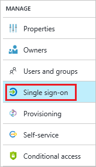

6.  In the **search box**, type **Samanage**.

    

7.  In the results pane, select **Samanage**, and then click **Complete** to add the application.

    
##Configuring single sign-on
  
The objective of this section is to outline how to enable users to authenticate to Samanage with their account in Azure AD using federation based on the SAML protocol.  
As part of this procedure, you are required to create a base-64 encoded certificate file.  
If you are not familiar with this procedure, see [How to convert a binary certificate into a text file](http://youtu.be/PlgrzUZ-Y1o).

###To configure single sign-on, perform the following steps:

1.  In the Azure classic portal, on the **Samanage** application integration page, click **Configure single sign-on** to open the **Configure Single Sign On ** dialog.

    

2.  On the **How would you like users to sign on to Samanage** page, select **Microsoft Azure AD Single Sign-On**, and then click **Next**.

    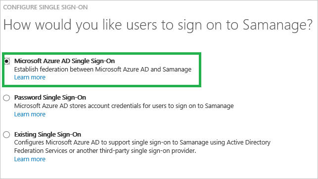

3.  On the Configure App Settings dialog page, perform the following steps:

    

    a. In the **Sign On URL** textbox, type the URL used by your users to sign-on to your Samanage application using the following pattern: `https://<Company Name>.samanage.com/saml_login/<Company Name>`.
	
	b. click **Next**

4.  On the **Configure single sign-on at Samanage** page, click **Download certificate**, and then save the certificate file on your computer.

    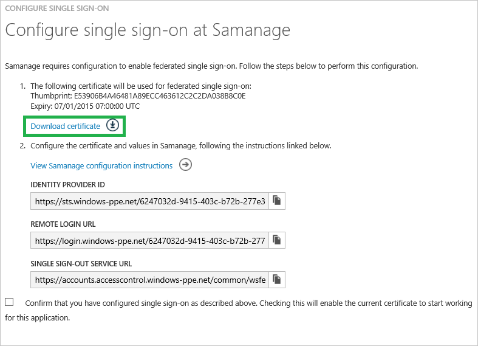

5.  In a different web browser window, log into your Samanage company site as an administrator.

6.  Click **Dashboard** and select **Setup** in left navigation pane.

    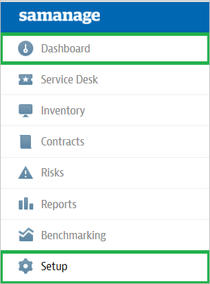

7.  Click **Single Sign-On**.

    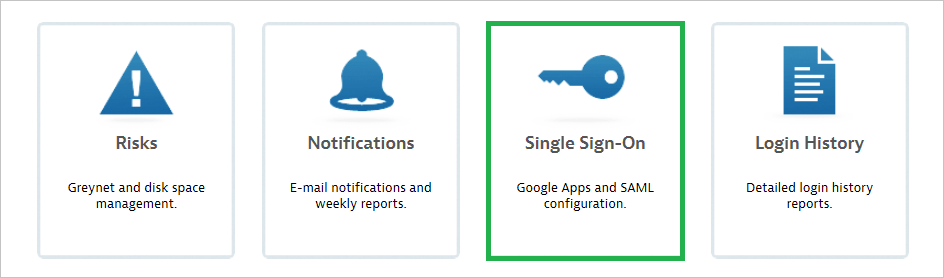

8.  On the **Login using SAML** dialog page, perform the following steps, and then click **Save Changes**:

    a.  Click **Enable Single Sign-On with SAML**.
    
    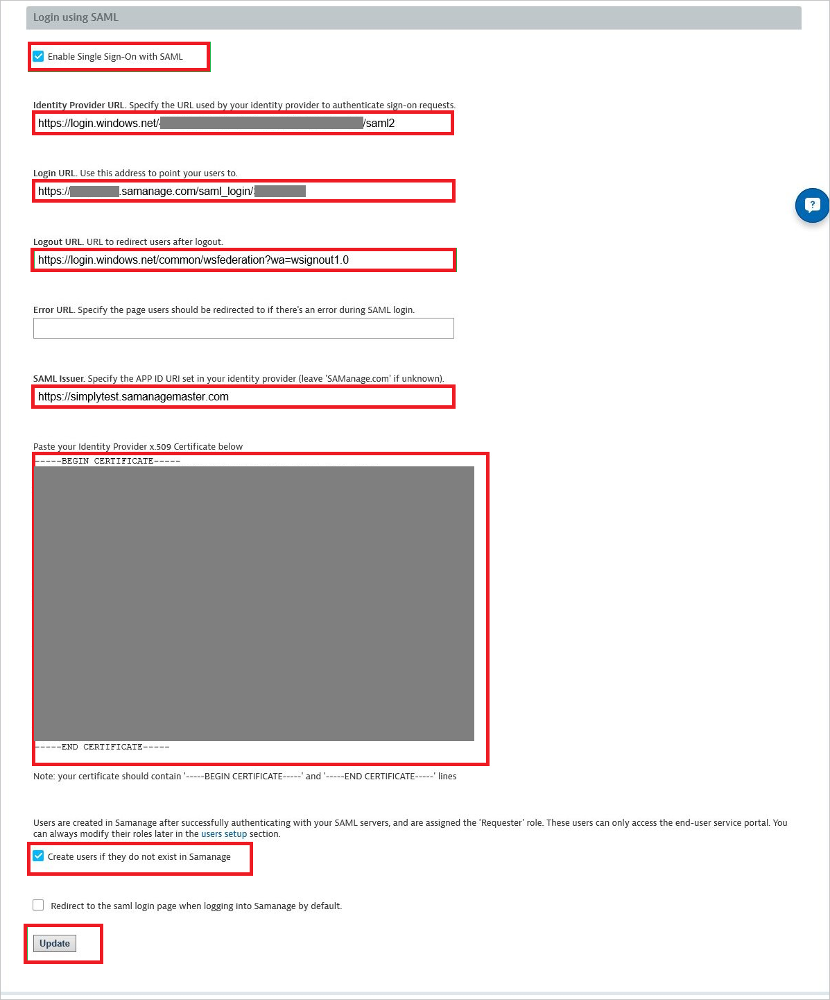

    b.  In the Azure classic portal, on the **Configure single sign-on at Samanage** dialog page, copy the **Identity Provider ID** value, and then paste it into the **Identity Provider URL ** textbox.
    
    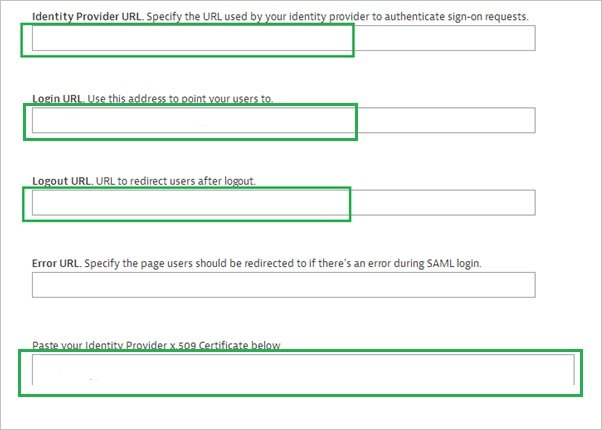

    c.  In the Azure classic portal, on the **Configure single sign-on at Samanage** dialog page, copy the **Remote Login URL** value, and then paste it into the **Login URL** textbox.
    
	d.  In the Azure classic portal, on the **Configure single sign-on at Samanage** dialog page, copy the **Remote Logout URL** value, and then paste it into the **Logout URL** textbox.
    
	e.  Create a **base-64 encoded** file from your downloaded certificate.  

    >[AZURE.TIP] For more details, see [How to convert a binary certificate into a text file](http://youtu.be/PlgrzUZ-Y1o)

    f.  Open your base-64 encoded certificate in notepad, copy the content of it into your clipboard, and then paste it to the **X.509 Certificate** textbox
    
	g.  Click **Create users if they do not exist in Samanage**.

    
    
	h.  Click **Update**.

9.  On the Azure classic portal, select the single sign-on configuration confirmation, and then click **Complete** to close the **Configure Single Sign On** dialog.

    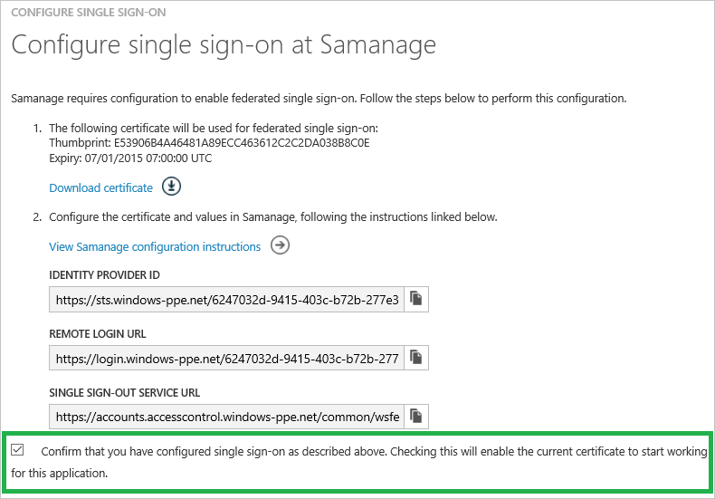
##Configuring user provisioning
  
In order to enable Azure AD users to log into Samanage, they must be provisioned into Samanage.  
In the case of Samanage, provisioning is a manual task.

###To provision a user accounts, perform the following steps:

1.  Log in to your **Samanage** tenant.

2.  Go to **Dashboard \> Setup**.

    

3.  Click the **Users** tab

    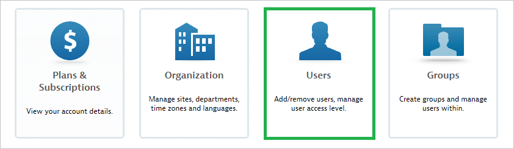

4.  Click **New User**.

    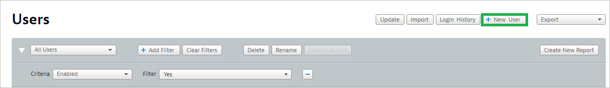

5.  Type the **Email Address** and the **Name** of an Azure AD account you want to provision and click **Create user**.

    >[AZURE.NOTE]The AAD account holder will receive an email and follow a link to confirm their account before it becomes active.

    

>[AZURE.NOTE]You can use any other Samanage user account creation tools or APIs provided by Samanage to provision AAD user accounts.

##Assigning users
  
To test your configuration, you need to grant the Azure AD users you want to allow using your application access to it by assigning them.

###To assign users to Samanage, perform the following steps:

1.  In the Azure classic portal, create a test account.

2.  On the **Samanage **application integration page, click **Assign accounts**.

    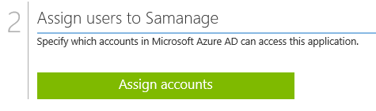

3.  Select your test user, click **Assign**, and then click **Yes** to confirm your assignment.

    
  
If you want to test your single sign-on settings, open the Access Panel. For more details about the Access Panel, see [Introduction to the Access Panel](active-directory-saas-access-panel-introduction.md).