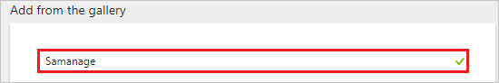
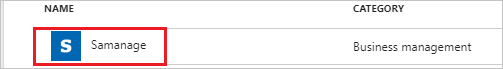
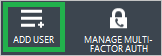

# Tutorial: Azure Active Directory integration with Samanage

In this tutorial, you learn how to integrate Samanage with Azure Active Directory (Azure AD).

Integrating Samanage with Azure AD provides you with the following benefits:

- You can control in Azure AD who has access to Samanage
- You can enable your users to automatically get signed-on to Samanage (Single Sign-On) with their Azure AD accounts
- You can manage your accounts in one central location - the Azure portal

If you want to know more details about SaaS app integration with Azure AD, see [what is application access and single sign-on with Azure Active Directory](active-directory-appssoaccess-whatis.md).

## Prerequisites

To configure Azure AD integration with Samanage, you need the following items:

- An Azure AD subscription
- A Samanage single sign-on enabled subscription

> [!NOTE]
> To test the steps in this tutorial, we do not recommend using a production environment.

To test the steps in this tutorial, you should follow these recommendations:

- Do not use your production environment, unless it is necessary.
- If you don't have an Azure AD trial environment, you can get a one-month trial [here](https://azure.microsoft.com/pricing/free-trial/).

## Scenario description
In this tutorial, you test Azure AD single sign-on in a test environment. 
The scenario outlined in this tutorial consists of two main building blocks:

1. Adding Samanage from the gallery
2. Configuring and testing Azure AD single sign-on

## Adding Samanage from the gallery
To configure the integration of Samanage into Azure AD, you need to add Samanage from the gallery to your list of managed SaaS apps.

**To add Samanage from the gallery, perform the following steps:**

1. In the **[Azure portal](https://portal.azure.com)**, on the left navigation panel, click **Azure Active Directory** icon. 

	![Active Directory][1]

2. Navigate to **Enterprise applications**. Then go to **All applications**.

	![Applications][2]
	
3. To add new application, click **New application** button on the top of dialog.

	![Applications][3]

4. In the search box, type **Samanage**.

	

5. In the results panel, select **Samanage**, and then click **Add** button to add the application.

	

##  Configuring and testing Azure AD single sign-on
In this section, you configure and test Azure AD single sign-on with Samanage based on a test user called "Britta Simon".

For single sign-on to work, Azure AD needs to know what the counterpart user in Samanage is to a user in Azure AD. In other words, a link relationship between an Azure AD user and the related user in Samanage needs to be established.

In Samanage, assign the value of the **user name** in Azure AD as the value of the **Username** to establish the link relationship.

To configure and test Azure AD single sign-on with Samanage, you need to complete the following building blocks:

1. **[Configuring Azure AD Single Sign-On](#configuring-azure-ad-single-sign-on)** - to enable your users to use this feature.
2. **[Creating an Azure AD test user](#creating-an-azure-ad-test-user)** - to test Azure AD single sign-on with Britta Simon.
3. **[Creating a Samanage test user](#creating-a-samanage-test-user)** - to have a counterpart of Britta Simon in Samanage that is linked to the Azure AD representation of user.
4. **[Assigning the Azure AD test user](#assigning-the-azure-ad-test-user)** - to enable Britta Simon to use Azure AD single sign-on.
5. **[Testing Single Sign-On](#testing-single-sign-on)** - to verify whether the configuration works.

### Configuring Azure AD single sign-on

In this section, you enable Azure AD single sign-on in the Azure portal and configure single sign-on in your Samanage application.

**To configure Azure AD single sign-on with Samanage, perform the following steps:**

1. In the Azure portal, on the **Samanage** application integration page, click **Single sign-on**.

	![Configure Single Sign-On][4]

2. On the **Single sign-on** dialog, select **Mode** as	**SAML-based Sign-on** to enable single sign-on.
 
	

3. On the **Samanage Domain and URLs** section, perform the following steps:

	

    a. In the **Sign-on URL** textbox, type a URL using the following pattern: `https://<Company Name>.samanage.com/saml_login/<Company Name>`

	b. In the **Identifier** textbox, type a URL using the following pattern: `https://<Company Name>.samanage.com`

	> [!NOTE] 
	> These values are not real. Update these values with the actual Sign-On URL and Identifier. Contact [Samanage Client support team](https://www.samanage.com/support) to get these values. 
 
4. On the **SAML Signing Certificate** section, click **Certificate(Base64)** and then save the certificate file on your computer.

	 

5. Click **Save** button.

	

6. On the **Samanage Configuration** section, click **Configure Samanage** to open **Configure sign-on** window. Copy the **Sign-Out URL, and SAML Entity ID** from the **Quick Reference section.**

	 

7. In a different web browser window, log into your Samanage company site as an administrator.

8. Click **Dashboard** and select **Setup** in left navigation pane.
   
    

9. Click **Single Sign-On**.
   
    

10. Navigate to **Login using SAML** section, perform the following steps:
   
    
 
    a. Click **Enable Single Sign-On with SAML**.  
 
    b. In the **Identity Provider URL** textbox, paste the value of **SAML Entity ID** which you have copied from Azure portal.    
 
    c. Confirm the **Login URL** matches the **Sign On URL** of **Samanage Domain and URLs** section in Azure portal.
 
    d. In the **Logout URL** textbox, enter the value of **Sign-Out URL** which you have copied from Azure portal.
 
    e. In the **SAML Issuer** textbox, type the value of **Identifier** set in **Samanage Domain and URLs** section on Azure portal.
 
    f. Open your base-64 encoded certificate in notepad, copy the content of it into your clipboard, and then paste it to the **Paste your Identity Provider x.509 Certificate below** textbox.
 
    g. Click **Create users if they do not exist in Samanage**.
 
    h. Click **Update**.

> [!TIP]
> You can now read a concise version of these instructions inside the [Azure portal](https://portal.azure.com), while you are setting up the app!  After adding this app from the **Active Directory > Enterprise Applications** section, simply click the **Single Sign-On** tab and access the embedded documentation through the **Configuration** section at the bottom. You can read more about the embedded documentation feature here: [Azure AD embedded documentation]( https://go.microsoft.com/fwlink/?linkid=845985)
 
### Creating an Azure AD test user
The objective of this section is to create a test user in the Azure portal called Britta Simon.

![Create Azure AD User][100]

**To create a test user in Azure AD, perform the following steps:**

1. In the **Azure portal**, on the left navigation pane, click **Azure Active Directory** icon.

	 

2. To display the list of users, go to **Users and groups** and click **All users**.
	
	 

3. To open the **User** dialog, click **Add** on the top of the dialog.
 
	 

4. On the **User** dialog page, perform the following steps:
 
	 

    a. In the **Name** textbox, type **BrittaSimon**.

    b. In the **User name** textbox, type the **email address** of BrittaSimon.

	c. Select **Show Password** and write down the value of the **Password**.

    d. Click **Create**.
 
### Creating a Samanage test user

To enable Azure AD users to log in to Samanage, they must be provisioned into Samanage.  
In the case of Samanage, provisioning is a manual task.

**To provision a user account, perform the following steps:**

1. Log into your Samanage company site as an administrator.

2. Click **Dashboard** and select **Setup** in left navigation pan.
   
    

3. Click the **Users** tab
   
    

4. Click **New User**.
   
    

5. Type the **Name** and the **Email Address** of an Azure Active Directory account you want to provision and click **Create user**.
   
    
   
   >[!NOTE]
   >The Azure Active Directory account holder will receive an email and follow a link to confirm their account before it becomes active. You can use any other Samanage user account creation tools or APIs provided by Samanage to provision Azure Active Directory user accounts.

### Assigning the Azure AD test user

In this section, you enable Britta Simon to use Azure single sign-on by granting access to Samanage.

![Assign User][200] 

**To assign Britta Simon to Samanage, perform the following steps:**

1. In the Azure portal, open the applications view, and then navigate to the directory view and go to **Enterprise applications** then click **All applications**.

	![Assign User][201] 

2. In the applications list, select **Samanage**.

	 

3. In the menu on the left, click **Users and groups**.

	![Assign User][202] 

4. Click **Add** button. Then select **Users and groups** on **Add Assignment** dialog.

	![Assign User][203]

5. On **Users and groups** dialog, select **Britta Simon** in the Users list.

6. Click **Select** button on **Users and groups** dialog.

7. Click **Assign** button on **Add Assignment** dialog.
	
### Testing single sign-on

In this section, you test your Azure AD single sign-on configuration using the Access Panel.

When you click the Samanage tile in the Access Panel, you should get automatically signed-on to your Samanage application.
For more information about the Access Panel, see [Introduction to the Access Panel](active-directory-saas-access-panel-introduction.md).

## Additional resources

* [List of Tutorials on How to Integrate SaaS Apps with Azure Active Directory](active-directory-saas-tutorial-list.md)
* [What is application access and single sign-on with Azure Active Directory?](active-directory-appssoaccess-whatis.md)

<!--Image references-->

[1]: ./media/active-directory-saas-samanage-tutorial/tutorial_general_01.png
[2]: ./media/active-directory-saas-samanage-tutorial/tutorial_general_02.png
[3]: ./media/active-directory-saas-samanage-tutorial/tutorial_general_03.png
[4]: ./media/active-directory-saas-samanage-tutorial/tutorial_general_04.png

[100]: ./media/active-directory-saas-samanage-tutorial/tutorial_general_100.png

[200]: ./media/active-directory-saas-samanage-tutorial/tutorial_general_200.png
[201]: ./media/active-directory-saas-samanage-tutorial/tutorial_general_201.png
[202]: ./media/active-directory-saas-samanage-tutorial/tutorial_general_202.png
[203]: ./media/active-directory-saas-samanage-tutorial/tutorial_general_203.png

