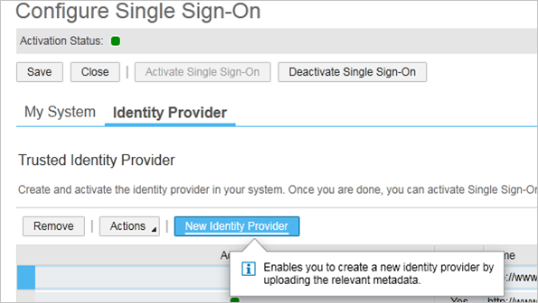
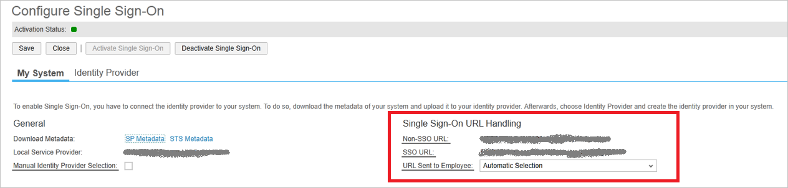

<properties
	pageTitle="Tutorial: Azure Active Directory integration with SAP Cloud for Customer | Microsoft Azure"
	description="Learn how to configure single sign-on between Azure Active Directory and SAP Cloud for Customer."
	services="active-directory"
	documentationCenter=""
	authors="jeevansd"
	manager="femila"
	editor=""/>

<tags
	ms.service="active-directory"
	ms.workload="identity"
	ms.tgt_pltfrm="na"
	ms.devlang="na"
	ms.topic="article"
	ms.date="06/20/2016"
	ms.author="jeedes"/>

# Tutorial: Azure Active Directory integration with SAP Cloud for Customer

In this tutorial, you learn how to integrate SAP Cloud for Customer with Azure Active Directory (Azure AD).

Integrating SAP Cloud for Customer with Azure AD provides you with the following benefits:

- You can control in Azure AD who has access to SAP Cloud for Customer
- You can enable your users to automatically get signed-on to SAP Cloud for Customer (Single Sign-On) with their Azure AD accounts
- You can manage your accounts in one central location - the Azure classic portal

If you want to know more details about SaaS app integration with Azure AD, see [What is application access and single sign-on with Azure Active Directory](active-directory-appssoaccess-whatis.md).

## Prerequisites

To configure Azure AD integration with SAP Cloud for Customer, you need the following items:

- An Azure AD subscription
- A SAP Cloud for Customer single-sign on enabled subscription

> [AZURE.NOTE] To test the steps in this tutorial, we do not recommend using a production environment.

To test the steps in this tutorial, you should follow these recommendations:

- You should not use your production environment, unless this is necessary.
- If you don't have an Azure AD trial environment, you can get a one-month trial [here](https://azure.microsoft.com/pricing/free-trial/).

## Scenario description
In this tutorial, you test Azure AD single sign-on in a test environment.

The scenario outlined in this tutorial consists of two main building blocks:

1. Adding SAP Cloud for Customer from the gallery
2. Configuring and testing Azure AD single sign-on

## Adding SAP Cloud for Customer from the gallery
To configure the integration of SAP Cloud for Customer into Azure AD, you need to add SAP Cloud for Customer from the gallery to your list of managed SaaS apps.

**To add SAP Cloud for Customer from the gallery, perform the following steps:**

1. In the **Azure classic portal**, on the left navigation pane, click **Active Directory**.

	![Active Directory][1]

2. From the **Directory** list, select the directory for which you want to enable directory integration.

3. To open the applications view, in the directory view, click **Applications** in the top menu.

	![Applications][2]

4. Click **Add** at the bottom of the page.

	![Applications][3]

5. On the **What do you want to do** dialog, click **Add an application from the gallery**.

	![Applications][4]

6. In the search box, type **SAP Cloud for Customer**.

	

7. In the results pane, select **SAP Cloud for Customer**, and then click **Complete** to add the application.

	

##  Configuring and testing Azure AD single sign-on

In this section, you configure and test Azure AD single sign-on with SAP Cloud for Customer based on a test user called "Britta Simon".

For single sign-on to work, Azure AD needs to know what the counterpart user in SAP Cloud for Customer is to a user in Azure AD. In other words, a link relationship between an Azure AD user and the related user in SAP Cloud for Customer needs to be established.

To configure and test Azure AD single sign-on with SAP Cloud for Customer, you need to complete the following building blocks:

1. **[Configuring Azure AD Single Sign-On](#configuring-azure-ad-single-sign-on)** - to enable your users to use this feature.
2. **[Creating an Azure AD test user](#creating-an-azure-ad-test-user)** - to test Azure AD single sign-on with Britta Simon.
3. **[Creating a SAP Cloud for Customer test user](#creating-an-sap-business-bydesign-test-user)** - to have a counterpart of Britta Simon in SAP Cloud for Customer that is linked to the Azure AD representation of her.
4. **[Assigning the Azure AD test user](#assigning-the-azure-ad-test-user)** - to enable Britta Simon to use Azure AD single sign-on.
5. **[Testing Single Sign-On](#testing-single-sign-on)** - to verify whether the configuration works.

### Configuring Azure AD single sign-on

In this section, you enable Azure AD single sign-on in the classic portal and configure single sign-on in your SAP Cloud for Customer application. 

**To configure Azure AD single sign-on with SAP Cloud for Customer, perform the following steps:**

1. In the Azure classic portal, on the **SAP Cloud for Customer** application integration page, in the menu on the top, click **Attributes**.

	 

2. In the attributes SAML token attributes list, select the nameidentifier attribute, and then click **Edit**.

	 

3. On the **Edit User Attribute** dialog, perform the following steps:

	 

	a. From the **Attribute Value** list, select the **ExtractMailPrefix()** fuction.
	
	b. From the **Mail** list, select the user attribute you want to use for your implementation. 
	For example, if you want to use the EmployeeID as unique user identifier and you have stored the attribute value in the ExtensionAttribute2, then select user.extensionattribute2. 

	c. Click **Complete**. 
	

4. In the classic portal, on the **SAP Cloud for Customer** application integration page, click **Configure single sign-on**.
	 
	![Configure Single Sign-On][6] 

5. On the **How would you like users to sign on to SAP Cloud for Customer** page, select **Azure AD Single Sign-On**, and then click **Next**.

	 

6. On the **Configure App Settings** dialog page, perform the following steps:

	 

    a. In the **Sign On URL** textbox, type the URL used by your users to sign-on to your SAP Cloud for Customer application using the following pattern: `https://<server name>.crm.ondemand.com`
	
	b. click **Next**
 
7. On the **Configure single sign-on at SAP Cloud for Customer** page, perform the following steps:

	

    a. Click **Download metadata**, and then save the file on your computer.

    b. Click **Next**.

8. To get SSO configured, perform the following steps:

	a. Login into SAP Cloud for Customer portal with administrator rights.

	b. Navigate to the **Application and User Management Common Task** and click the **Identity Provider** tab.

	c. Click **New Identity Provider** and select the metadata XML file you have downloaded from the Azure classic portal. By importing the metadata, the system automatically uploads the required signature certificate and encryption certificate.

	

	d. Azure AD requires the element Assertion Consumer Service URL in the SAML request, so select the **Include Assertion Consumer Service URL** checkbox.

	e. Click **Activate Single Sign-On**.

	f. Save your changes.

	g. Click the **My System** tab.

	

	h. Copy the **SSO URL** and paste it into the **Azure AD Sign On URL** textbox.

	

	i. Specify whether the employee can manually choose between logging on with user ID and password or SSO by selecting the **Manual Identity Provider Selection**.

	j. In the **SSO URL** section, specify the URL that should be used by your employees to sign on to the system. 
	In the **URL Sent to Employee** list, you can choose between the following options:
	
	**Non-SSO URL**
 
	The system sends only the normal system URL to the employee. The employee cannot log on using SSO, and must use password or certificate instead.

	**SSO URL** 

	The system sends only the SSO URL to the employee. The employee can log on using SSO. Authentication request is redirected through the IdP.

	**Automatic Selection**
 
	If SSO is not active, the system sends the normal system URL to the employee. If SSO is active, the system checks whether the employee has a password. If a password is available, both SSO URL and Non-SSO URL are sent to the employee. However, if the employee has no password, only the SSO URL is sent to the employee.

	k. Save your changes.

9. In the classic portal, select the single sign-on configuration confirmation, and then click **Next**.
	
	![Azure AD Single Sign-On][10]

10. On the **Single sign-on confirmation** page, click **Complete**.  
 
	![Azure AD Single Sign-On][11]

### Creating an Azure AD test user
In this section, you create a test user in the Azure classic portal called Britta Simon.

![Create Azure AD User][20]

**To create a test user in Azure AD, perform the following steps:**

1. In the **Azure classic portal**, on the left navigation pane, click **Active Directory**.

	 

2. From the **Directory** list, select the directory for which you want to enable directory integration.

3. To display the list of users, in the menu on the top, click **Users**.

	 

4. To open the **Add User** dialog, in the toolbar on the bottom, click **Add User**.

	 

5. On the **Tell us about this user** dialog page, perform the following steps:
	 

    a. As Type Of User, select New user in your organization.

    b. In the User Name **textbox**, type **BrittaSimon**.

    c. Click **Next**.

6.  On the **User Profile** dialog page, perform the following steps:
	 

    a. In the **First Name** textbox, type **Britta**.  

    b. In the **Last Name** textbox, type, **Simon**.

    c. In the **Display Name** textbox, type **Britta Simon**.

    d. In the **Role** list, select **User**.

    e. Click **Next**.

7. On the **Get temporary password** dialog page, click **create**.

	 

8. On the **Get temporary password** dialog page, perform the following steps:

	 

    a. Write down the value of the **New Password**.

    b. Click **Complete**.   

### Creating an SAP Cloud for Customer test user

In this section, you create a user called Britta Simon in SAP Cloud for Customer. Please work with SAP Cloud for Customer support team to add the users in the SAP Cloud for Customer platform. 

> [AZURE.NOTE] Please make sure that NameID value should match with the username field in the SAP Cloud for Customer platform.

### Assigning the Azure AD test user

In this section, you enable Britta Simon to use Azure single sign-on by granting her access to SAP Cloud for Customer.

![Assign User][200] 

**To assign Britta Simon to SAP Cloud for Customer, perform the following steps:**

1. On the classic portal, to open the applications view, in the directory view, click **Applications** in the top menu.

	![Assign User][201] 

2. In the applications list, select **SAP Cloud for Customer**.

	 

3. In the menu on the top, click **Users**.

	![Assign User][203]

4. In the Users list, select **Britta Simon**.

5. In the toolbar on the bottom, click **Assign**.

	![Assign User][205]

### Testing single sign-on

In this section, you test your Azure AD single sign-on configuration using the Access Panel.

When you click the SAP Cloud for Customer tile in the Access Panel, you should get automatically signed-on to your SAP Cloud for Customer application.

## Additional resources

* [List of Tutorials on How to Integrate SaaS Apps with Azure Active Directory](active-directory-saas-tutorial-list.md)
* [What is application access and single sign-on with Azure Active Directory?](active-directory-appssoaccess-whatis.md)

<!--Image references-->

[1]: ./media/active-directory-saas-sapcloudforcustomer-tutorial/tutorial_general_01.png
[2]: ./media/active-directory-saas-sapcloudforcustomer-tutorial/tutorial_general_02.png
[3]: ./media/active-directory-saas-sapcloudforcustomer-tutorial/tutorial_general_03.png
[4]: ./media/active-directory-saas-sapcloudforcustomer-tutorial/tutorial_general_04.png

[6]: ./media/active-directory-saas-sapcloudforcustomer-tutorial/tutorial_general_05.png
[10]: ./media/active-directory-saas-sapcloudforcustomer-tutorial/tutorial_general_06.png
[11]: ./media/active-directory-saas-sapcloudforcustomer-tutorial/tutorial_general_07.png
[20]: ./media/active-directory-saas-sapcloudforcustomer-tutorial/tutorial_general_100.png

[200]: ./media/active-directory-saas-sapcloudforcustomer-tutorial/tutorial_general_200.png
[201]: ./media/active-directory-saas-sapcloudforcustomer-tutorial/tutorial_general_201.png
[203]: ./media/active-directory-saas-sapcloudforcustomer-tutorial/tutorial_general_203.png
[204]: ./media/active-directory-saas-sapcloudforcustomer-tutorial/tutorial_general_204.png
[205]: ./media/active-directory-saas-sapcloudforcustomer-tutorial/tutorial_general_205.png
