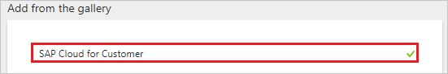
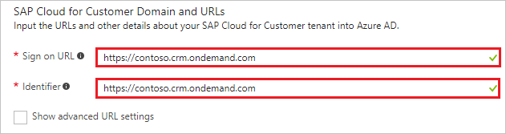
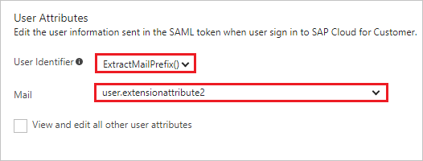
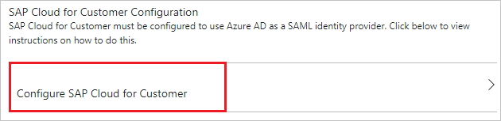
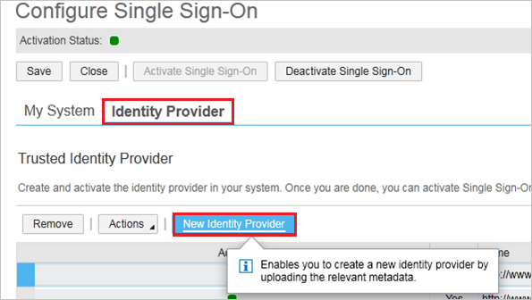
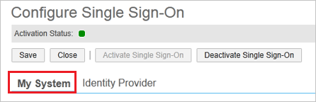
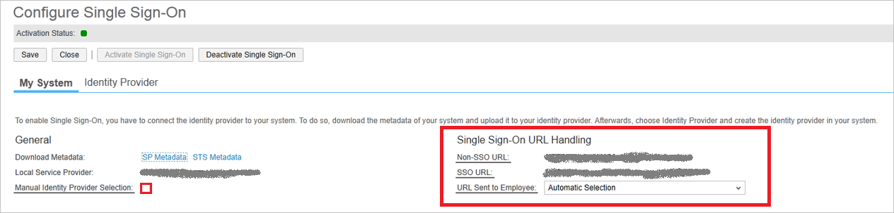

# Tutorial: Azure Active Directory integration with SAP Cloud for Customer

In this tutorial, you learn how to integrate SAP Cloud for Customer with Azure Active Directory (Azure AD).

Integrating SAP Cloud for Customer with Azure AD provides you with the following benefits:

- You can control in Azure AD who has access to SAP Cloud for Customer
- You can enable your users to automatically get signed-on to SAP Cloud for Customer (Single Sign-On) with their Azure AD accounts
- You can manage your accounts in one central location - the Azure portal

If you want to know more details about SaaS app integration with Azure AD, see [what is application access and single sign-on with Azure Active Directory](active-directory-appssoaccess-whatis.md).

## Prerequisites

To configure Azure AD integration with SAP Cloud for Customer, you need the following items:

- An Azure AD subscription
- A SAP Cloud for Customer single sign-on enabled subscription

> [!NOTE]
> To test the steps in this tutorial, we do not recommend using a production environment.

To test the steps in this tutorial, you should follow these recommendations:

- Do not use your production environment, unless it is necessary.
- If you don't have an Azure AD trial environment, you can get a one-month trial here: [Trial offer](https://azure.microsoft.com/pricing/free-trial/).

## Scenario description
In this tutorial, you test Azure AD single sign-on in a test environment. 
The scenario outlined in this tutorial consists of two main building blocks:

1. Adding SAP Cloud for Customer from the gallery
2. Configuring and testing Azure AD single sign-on

## Adding SAP Cloud for Customer from the gallery
To configure the integration of SAP Cloud for Customer into Azure AD, you need to add SAP Cloud for Customer from the gallery to your list of managed SaaS apps.

**To add SAP Cloud for Customer from the gallery, perform the following steps:**

1. In the **[Azure portal](https://portal.azure.com)**, on the left navigation panel, click **Azure Active Directory** icon. 

	![Active Directory][1]

2. Navigate to **Enterprise applications**. Then go to **All applications**.

	![Applications][2]
	
3. To add new application, click **New application** button on the top of dialog.

	![Applications][3]

4. In the search box, type **SAP Cloud for Customer**.

	

5. In the results panel, select **SAP Cloud for Customer**, and then click **Add** button to add the application.

	

##  Configuring and testing Azure AD single sign-on
In this section, you configure and test Azure AD single sign-on with SAP Cloud for Customer based on a test user called "Britta Simon".

For single sign-on to work, Azure AD needs to know what the counterpart user in SAP Cloud for Customer is to a user in Azure AD. In other words, a link relationship between an Azure AD user and the related user in SAP Cloud for Customer needs to be established.

In SAP Cloud for Customer, assign the value of the **user name** in Azure AD as the value of the **Username** to establish the link relationship.

To configure and test Azure AD single sign-on with SAP Cloud for Customer, you need to complete the following building blocks:

1. **[Configuring Azure AD Single Sign-On](#configuring-azure-ad-single-sign-on)** - to enable your users to use this feature.
2. **[Creating an Azure AD test user](#creating-an-azure-ad-test-user)** - to test Azure AD single sign-on with Britta Simon.
3. **[Creating a SAP Cloud for Customer test user](#creating-a-sap-cloud-for-customer-test-user)** - to have a counterpart of Britta Simon in SAP Cloud for Customer that is linked to the Azure AD representation of user.
4. **[Assigning the Azure AD test user](#assigning-the-azure-ad-test-user)** - to enable Britta Simon to use Azure AD single sign-on.
5. **[Testing Single Sign-On](#testing-single-sign-on)** - to verify whether the configuration works.

### Configuring Azure AD single sign-on

In this section, you enable Azure AD single sign-on in the Azure portal and configure single sign-on in your SAP Cloud for Customer application.

**To configure Azure AD single sign-on with SAP Cloud for Customer, perform the following steps:**

1. In the Azure portal, on the **SAP Cloud for Customer** application integration page, click **Single sign-on**.

	![Configure Single Sign-On][4]

2. On the **Single sign-on** dialog, select **Mode** as	**SAML-based Sign-on** to enable single sign-on.
 
	

3. On the **SAP Cloud for Customer Domain and URLs** section, perform the following steps:

	

    a. In the **Sign-on URL** textbox, type a URL using the following pattern: `https://<server name>.crm.ondemand.com`

	b. In the **Identifier** textbox, type a URL using the following pattern: `https://<server name>.crm.ondemand.com`

	> [!NOTE] 
	> These values are not real. Update these values with the actual Sign-On URL and Identifier. Contact [SAP Cloud for Customer Client support team](https://www.sap.com/about/agreements.sap-cloud-services-customers.html) to get these values. 

4. On the **User Attributes** section, perform the following steps:

    

    a. In **User Identifier** list, select the **ExtractMailPrefix()** function.

    b. From the **Mail** list, select the user attribute you want to use for your implementation.
    For example, if you want to use the EmployeeID as unique user identifier and you have stored the attribute value in the ExtensionAttribute2, then select user.extensionattribute2.  

5. On the **SAML Signing Certificate** section, click **Metadata XML** and then save the metadata file on your computer.

	 

6. Click **Save** button.

	

7. On the **SAP Cloud for Customer Configuration** section, click **Configure SAP Cloud for Customer** to open **Configure sign-on** window. Copy the **SAML Single Sign-On Service URL** from the **Quick Reference section.**

	 

8. To get SSO configured, perform the following steps:
   
    a. Login into SAP Cloud for Customer portal with administrator rights.
   
    b. Navigate to the **Application and User Management Common Task** and click the **Identity Provider** tab.
   
    c. Click **New Identity Provider** and select the metadata XML file you have downloaded from the Azure portal. By importing the metadata, the system automatically uploads the required signature certificate and encryption certificate.
   
    
   
    d. Azure Active Directory requires the element Assertion Consumer Service URL in the SAML request, so select the **Include Assertion Consumer Service URL** checkbox.
   
    e. Click **Activate Single Sign-On**.
   
    f. Save your changes.
   
    g. Click the **My System** tab.
   
    
   
    h. In **Azure AD Sign On URL** textbox, paste **SAML Single Sign-On Service URL** which you have copied from Azure portal.
   
    
   
    i. Specify whether the employee can manually choose between logging on with user ID and password or SSO by selecting the **Manual Identity Provider Selection**.
   
    j. In the **SSO URL** section, specify the URL that should be used by your employees to sign on to the system. 
    In the **URL Sent to Employee** list, you can choose between the following options:
   
    **Non-SSO URL**
   
    The system sends only the normal system URL to the employee. The employee cannot log on using SSO, and must use password or certificate instead.
   
    **SSO URL** 
   
    The system sends only the SSO URL to the employee. The employee can log on using SSO. Authentication request is redirected through the IdP.
   
    **Automatic Selection**
   
    If SSO is not active, the system sends the normal system URL to the employee. If SSO is active, the system checks whether the employee has a password. If a password is available, both SSO URL and Non-SSO URL are sent to the employee. However, if the employee has no password, only the SSO URL is sent to the employee.
   
    k. Save your changes.

> [!TIP]
> You can now read a concise version of these instructions inside the [Azure portal](https://portal.azure.com), while you are setting up the app!  After adding this app from the **Active Directory > Enterprise Applications** section, simply click the **Single Sign-On** tab and access the embedded documentation through the **Configuration** section at the bottom. You can read more about the embedded documentation feature here: [Azure AD embedded documentation]( https://go.microsoft.com/fwlink/?linkid=845985)
> 

### Creating an Azure AD test user
The objective of this section is to create a test user in the Azure portal called Britta Simon.

![Create Azure AD User][100]

**To create a test user in Azure AD, perform the following steps:**

1. In the **Azure portal**, on the left navigation pane, click **Azure Active Directory** icon.

	 

2. To display the list of users, go to **Users and groups** and click **All users**.
	
	 

3. To open the **User** dialog, click **Add** on the top of the dialog.
 
	 

4. On the **User** dialog page, perform the following steps:
 
	 

    a. In the **Name** textbox, type **BrittaSimon**.

    b. In the **User name** textbox, type the **email address** of BrittaSimon.

	c. Select **Show Password** and write down the value of the **Password**.

    d. Click **Create**.
 
### Creating a SAP Cloud for Customer test user

In this section, you create a user called Britta Simon in SAP Cloud for Customer. Please work with [SAP Cloud for Customer support team](https://www.sap.com/about/agreements.sap-cloud-services-customers.html) to add the users in the SAP Cloud for Customer platform. 

> [!NOTE]
> Please make sure that NameID value should match with the username field in the SAP Cloud for Customer platform.

### Assigning the Azure AD test user

In this section, you enable Britta Simon to use Azure single sign-on by granting access to SAP Cloud for Customer.

![Assign User][200] 

**To assign Britta Simon to SAP Cloud for Customer, perform the following steps:**

1. In the Azure portal, open the applications view, and then navigate to the directory view and go to **Enterprise applications** then click **All applications**.

	![Assign User][201] 

2. In the applications list, select **SAP Cloud for Customer**.

	 

3. In the menu on the left, click **Users and groups**.

	![Assign User][202] 

4. Click **Add** button. Then select **Users and groups** on **Add Assignment** dialog.

	![Assign User][203]

5. On **Users and groups** dialog, select **Britta Simon** in the Users list.

6. Click **Select** button on **Users and groups** dialog.

7. Click **Assign** button on **Add Assignment** dialog.
	
### Testing single sign-on

In this section, you test your Azure AD single sign-on configuration using the Access Panel.

When you click the SAP Cloud for Customer tile in the Access Panel, you should get automatically signed-on to your SAP Cloud for Customer application.
For more information about the Access Panel, see [Introduction to the Access Panel](active-directory-saas-access-panel-introduction.md).

## Additional resources

* [List of Tutorials on How to Integrate SaaS Apps with Azure Active Directory](active-directory-saas-tutorial-list.md)
* [What is application access and single sign-on with Azure Active Directory?](active-directory-appssoaccess-whatis.md)

<!--Image references-->

[1]: ./media/active-directory-saas-sap-customer-cloud-tutorial/tutorial_general_01.png
[2]: ./media/active-directory-saas-sap-customer-cloud-tutorial/tutorial_general_02.png
[3]: ./media/active-directory-saas-sap-customer-cloud-tutorial/tutorial_general_03.png
[4]: ./media/active-directory-saas-sap-customer-cloud-tutorial/tutorial_general_04.png

[100]: ./media/active-directory-saas-sap-customer-cloud-tutorial/tutorial_general_100.png

[200]: ./media/active-directory-saas-sap-customer-cloud-tutorial/tutorial_general_200.png
[201]: ./media/active-directory-saas-sap-customer-cloud-tutorial/tutorial_general_201.png
[202]: ./media/active-directory-saas-sap-customer-cloud-tutorial/tutorial_general_202.png
[203]: ./media/active-directory-saas-sap-customer-cloud-tutorial/tutorial_general_203.png

