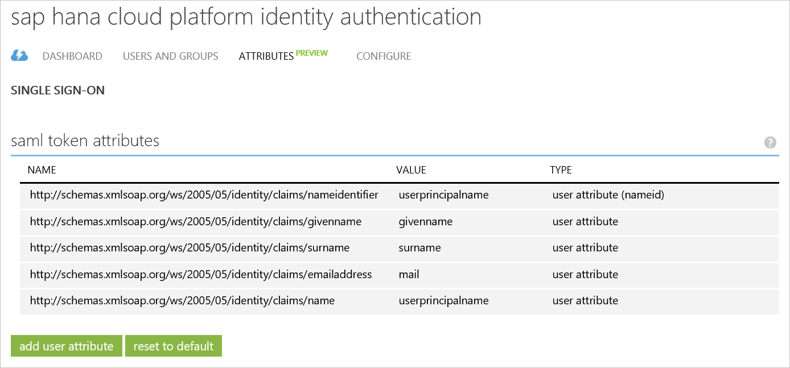
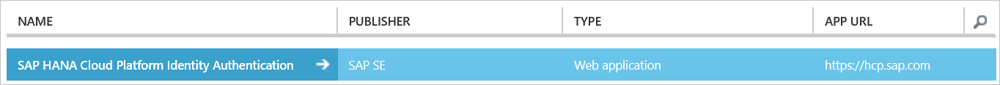

# Tutorial: Azure Active Directory integration with SAP HANA Cloud Platform Identity Authentication

In this tutorial, you learn how to integrate SAP HANA Cloud Platform Identity Authentication with Azure Active Directory (Azure AD). SAP HANA Cloud Platform Identity Authentication is used as a proxy IdP to access SAP applications using Azure AD as the main IdP.

Integrating SAP HANA Cloud Platform Identity Authentication with Azure AD provides you with the following benefits:

- You can control in Azure AD who has access to SAP application
- You can enable your users to automatically get signed-on to SAP applications(Single Sign-On) with their Azure AD accounts
- You can manage your accounts in one central location - the Azure classic portal

If you want to know more details about SaaS app integration with Azure AD, see [What is application access and single sign-on with Azure Active Directory](active-directory-appssoaccess-whatis.md).

## Prerequisites

To configure Azure AD integration with SAP HANA Cloud Platform Identity Authentication, you need the following items:

- An Azure AD subscription
- A **SAP HANA Cloud Platform Identity Authentication** single-sign on enabled subscription

>[!NOTE] 
>To test the steps in this tutorial, we do not recommend using a production environment.

To test the steps in this tutorial, you should follow these recommendations:

- You should not use your production environment, unless this is necessary.
- If you don't have an Azure AD trial environment, you can get a one-month trial [here](https://azure.microsoft.com/pricing/free-trial/).

## Scenario description
In this tutorial, you test Azure AD single sign-on in a test environment.

The scenario outlined in this tutorial consists of two main building blocks:

1. Adding SAP HANA Cloud Platform Identity Authentication from the gallery
2. Configuring and testing Azure AD single sign-on

Before digging into the technical details, it is vital to understand the concepts you're going to look at. The SAP HANA Cloud Platform Identity Authentication and Azure Active Directory federation enables you to implement single-sign-on across applications or services protected by AAD (as an IdP) with SAP applications and services protected by SAP HANA Cloud Platform Identity Authentication.

Currently, SAP HANA Cloud Platform Identity Authentication acts as a Proxy Identity Provider to SAP-applications. Azure Active Directory in turn acts as the leading Identity Provider in this setup. The following diagram illustrates that:    

With this setup, your SAP HANA Cloud Platform Identity Authentication tenant will be configured as a trusted application in Azure Active Directory. 

All SAP applications and services you want to protect through this way are subsequently configured in the SAP HANA Cloud Platform Identity Authentication management console!

This is very important to understand! It means that authorization for granting access to SAP applications and services needs to take place in SAP HANA Cloud Platform Identity Authentication for such a setup (as opposed to configuring authorization in Azure Active Directory).

By configuring SAP HANA Cloud Platform Identity Authentication as an application through the Azure Active Directory Marketplace, you don't need to take care of configuring needed individual claims / SAML assertions and transformations needed to produce a valid authentication token for SAP applications.

>[!NOTE] 
>Currently Web SSO has been tested by both parties, only. Flows needed for App-to-API or API-to-API communication should work but have not been tested, yet. They will be tested as part of subsequent activities. Documentation will be updated accordingly after successful validation.

## Adding SAP HANA Cloud Platform Identity Authentication from the gallery
To configure the integration of SAP HANA Cloud Platform Identity Authentication into Azure AD, you need to add SAP HANA Cloud Platform Identity Authentication from the gallery to your list of managed SaaS apps.

**To add SAP HANA Cloud Platform Identity Authentication from the gallery, perform the following steps:**

1. In the **Azure classic portal**, on the left navigation pane, click **Active Directory**. 

	![Active Directory][1]

2. From the **Directory** list, select the directory for which you want to enable directory integration.

3. To open the applications view, in the directory view, click **Applications** in the top menu.

	![Applications][2]

4. Click **Add** at the bottom of the page.

	![Applications][3]

5. On the **What do you want to do** dialog, click **Add an application from the gallery**.

	![Applications][4]

6. In the search box, type **SAP HANA Cloud Platform Identity Authentication**.

	

7. In the results pane, select **SAP HANA Cloud Platform Identity Authentication**, and then click **Complete** to add the application.

	

##  Configuring and testing Azure AD single sign-on
In this section, you configure and test Azure AD single sign-on with SAP HANA Cloud Platform Identity Authentication based on a test user called "Britta Simon".

For single sign-on to work, Azure AD needs to know what the counterpart user in SAP HANA Cloud Platform Identity Authentication is to a user in Azure AD. In other words, a link relationship between an Azure AD user and the related user in SAP HANA Cloud Platform Identity Authentication needs to be established.
This link relationship is established by assigning the value of the **user name** in Azure AD as the value of the **Username** in SAP HANA Cloud Platform Identity Authentication. To configure and test Azure AD single sign-on with SAP HANA Cloud Platform Identity Authentication, you need to complete the following building blocks:

1. **[Configuring Azure AD Single Sign-On](#configuring-azure-ad-single-single-sign-on)** - to enable your users to use this feature.
2. **[Creating an Azure AD test user](#creating-an-azure-ad-test-user)** - to test Azure AD single sign-on with Britta Simon.
4. **[Creating a SAP HANA Cloud Platform Identity Authentication test user](#creating-a-sap-hana-cloud-platform-identity-authentication-test-user)** - to have a counterpart of Britta Simon in SAP HANA Cloud Platform Identity Authentication that is linked to the Azure AD representation of her.
5. **[Assigning the Azure AD test user](#assigning-the-azure-ad-test-user)** - to enable Britta Simon to use Azure AD single sign-on.
5. **[Testing Single Sign-On](#testing-single-sign-on)** - to verify whether the configuration works.

### Configuring Azure AD single sign-on

The objective of this section is to enable Azure AD single sign-on in the Azure classic portal and to configure single sign-on in your SAP HANA Cloud Platform Identity Authentication application.

The SAP application expects specific SAML assertions that you have configured. You can manage the values of these attributes that Azure AD sends to the SAP application from the **"Atrributes"** tab. The following screenshot shows an example for this. 

**To configure Azure AD single sign-on with SAP HANA Cloud Platform Identity Authentication, perform the following steps:**

1. In the Azure classic portal, on the **SAP HANA Cloud Platform Identity Authentication** application integration page, in the menu on the top, click **Attributes**.

	![Configure Single Sign-On][5]

2. For example, if your SAP application expects an attribute "firstName". On the SAML token attributes dialog, add the "firstName" attribute.

	a. Click **add user attribute** to open the **Add User Attribute** dialog. 
	
	

	b. In the **Attribute Name** textbox, type the attribute name "firstName".

	c. From the **Attribute Value** list, select the attribute value "user.givenname".

	d. Click **Complete**.
 
3. In the menu on the top, click **Quick Start**.

	![Configure Single Sign-On][6]

4. In the classic portal, on the **SAP HANA Cloud Platform Identity Authentication** application integration page, click **Configure single sign-on** to open the **Configure Single Sign-On**  dialog.

	![Configure Single Sign-On][7] 

5. On the **How would you like users to sign on to SAP HANA Cloud Platform Identity Authentication** page, select **Azure AD Single Sign-On**, and then click **Next**.
 	
	

6. On the **Configure App Settings** dialog page, perform the following steps

	

	a. In the **Identifier** textbox, type the value following pattern: `<entity-id>.accounts.ondemand.com`. If you don't know this value, please follow the SAP HANA Cloud Platform Identity Authentication documentation on [Tenant SAML 2.0 Configuration](https://help.hana.ondemand.com/cloud_identity/frameset.htm?e81a19b0067f4646982d7200a8dab3ca.html)
	
	b. click **Next**

7. If you are configuring SAP HANA Cloud Platform Identity Authentication for accessing a single SAP application. You can add the Sign in URL for the SAP application. On the **Configure App Settings** dialog page, perform the following steps:

	a. Click on **Show Advanced settings (optional)**.

	b. In the **Sign On URL** textbox, type the sign in URL for the SAP application.

	c. Click **Next**

9.  On the **Configure single sign-on at SAP HANA Cloud Platform Identity Authentication** page, Click **Download metadata**, and then save the file on your computer.

	

8. To get SSO configured for your application, go to SAP HANA Cloud Platform Identity Authentication Administration Console. The URL has the following pattern: `https://<tenant-id>.accounts.ondemand.com/admin`. Then, follow the documentation on SAP HANA Cloud Platform Identity Authentication to [Configure Microsoft Azure AD as Corporate Identity Provider at SAP HANA Cloud Platform Identity Authentication](https://help.hana.ondemand.com/cloud_identity/frameset.htm?626b17331b4d4014b8790d3aea70b240.html) 
 
9. In the classic portal, select the single sign-on configuration confirmation, and then click **Next**.
	
	![Azure AD Single Sign-On][10]

10. On the **Single sign-on confirmation** page, click **Complete**.  
  	
	![Azure AD Single Sign-On][11]

### Creating an Azure AD test user
In this section, you create a test user in the classic portal called Britta Simon.

![Create Azure AD User][20]

**To create a test user in Azure AD, perform the following steps:**

1. In the **Azure classic portal**, on the left navigation pane, click **Active Directory**.
	
	 

2. From the **Directory** list, select the directory for which you want to enable directory integration.

3. To display the list of users, in the menu on the top, click **Users**.
	
	 

4. To open the **Add User** dialog, in the toolbar on the bottom, click **Add User**.

	 

5. On the **Tell us about this user** dialog page, perform the following steps:
 
	 

    a. As Type Of User, select New user in your organization.

    b. In the User Name **textbox**, type **BrittaSimon**.

    c. Click **Next**.

6.  On the **User Profile** dialog page, perform the following steps:

	 

    a. In the **First Name** textbox, type **Britta**.  

    b. In the **Last Name** textbox, type, **Simon**.

    c. In the **Display Name** textbox, type **Britta Simon**.

    d. In the **Role** list, select **User**.

    e. Click **Next**.

7. On the **Get temporary password** dialog page, click **create**.

	 

8. On the **Get temporary password** dialog page, perform the following steps:

	 

    a. Write down the value of the **New Password**.

    b. Click **Complete**.   

### Creating an SAP HANA Cloud Platform Identity Authentication test user

You don't need to create an user on SAP HANA Cloud Platform Identity Authentication. Users who are in the Azure AD user store can use the single sign-on (SSO) functionality.

SAP HANA Cloud Platform Identity Authentication supports the Identity Federation option. This option allows the application to check if the users authenticated by the corporate identity provider exist in the user store of SAP HANA Cloud Platform Identity Authentication. In the default setting, the Identity Federation option is disabled. If Identity Federation is enabled, only the users that are imported in SAP HANA Cloud Platform Identity Authentication are able to access the application. For more information about how to enable or disable Identity Federation with SAP HANA Cloud Platform Identity Authentication, see Enable Identity Federation with SAP HANA Cloud Platform Identity Authentication in [Configure Identity Federation with the User Store of SAP HANA Cloud Platform Identity Authentication.](https://help.hana.ondemand.com/cloud_identity/frameset.htm?c029bbbaefbf4350af15115396ba14e2.html)

### Assigning the Azure AD test user

In this section, you enable Britta Simon to use Azure single sign-on by granting her access to SAP HANA Cloud Platform Identity Authentication.

![Assign User][200] 

**To assign Britta Simon to SAP HANA Cloud Platform Identity Authentication, perform the following steps:**

1. On the classic portal, to open the applications view, in the directory view, click **Applications** in the top menu.

	![Assign User][201] 

2. In the applications list, select **SAP HANA Cloud Platform Identity Authentication**.

	 

3. In the menu on the top, click **Users**.

	![Assign User][203]

4. In the Users list, select **Britta Simon**.

5. In the toolbar on the bottom, click **Assign**.

	![Assign User][205]

### Testing single sign-on

In this section, you test your Azure AD single sign-on configuration using the SAP application.

Go to your SAP application home page and login using your Azure AD credentials. You should get automatically signed-on to your SAP application.

## Additional resources

* [List of Tutorials on How to Integrate SaaS Apps with Azure Active Directory](active-directory-saas-tutorial-list.md)
* [What is application access and single sign-on with Azure Active Directory?](active-directory-appssoaccess-whatis.md)

<!--Image references-->

[1]: ./media/active-directory-saas-sap-hana-cloud-platform-identity-authentication-tutorial/tutorial_general_01.png
[2]: ./media/active-directory-saas-sap-hana-cloud-platform-identity-authentication-tutorial/tutorial_general_02.png
[3]: ./media/active-directory-saas-sap-hana-cloud-platform-identity-authentication-tutorial/tutorial_general_03.png
[4]: ./media/active-directory-saas-sap-hana-cloud-platform-identity-authentication-tutorial/tutorial_general_04.png

[5]: ./media/active-directory-saas-sap-hana-cloud-platform-identity-authentication-tutorial/tutorial_general_05.png
[6]: ./media/active-directory-saas-sap-hana-cloud-platform-identity-authentication-tutorial/tutorial_general_06.png
[7]:  ./media/active-directory-saas-sap-hana-cloud-platform-identity-authentication-tutorial/tutorial_general_050.png
[10]: ./media/active-directory-saas-sap-hana-cloud-platform-identity-authentication-tutorial/tutorial_general_060.png
[11]: ./media/active-directory-saas-sap-hana-cloud-platform-identity-authentication-tutorial/tutorial_general_070.png
[20]: ./media/active-directory-saas-sap-hana-cloud-platform-identity-authentication-tutorial/tutorial_general_100.png

[200]: ./media/active-directory-saas-sap-hana-cloud-platform-identity-authentication-tutorial/tutorial_general_200.png
[201]: ./media/active-directory-saas-sap-hana-cloud-platform-identity-authentication-tutorial/tutorial_general_201.png
[203]: ./media/active-directory-saas-sap-hana-cloud-platform-identity-authentication-tutorial/tutorial_general_203.png
[204]: ./media/active-directory-saas-sap-hana-cloud-platform-identity-authentication-tutorial/tutorial_general_204.png
[205]: ./media/active-directory-saas-sap-hana-cloud-platform-identity-authentication-tutorial/tutorial_general_205.png