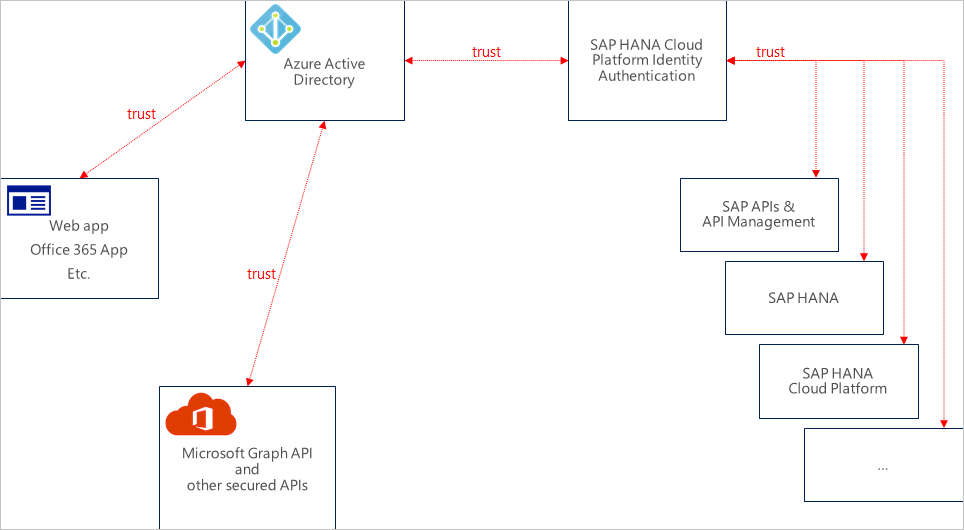
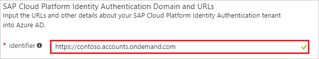
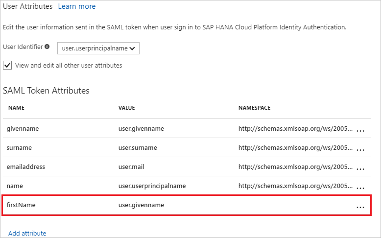
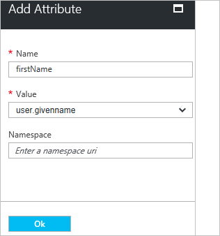
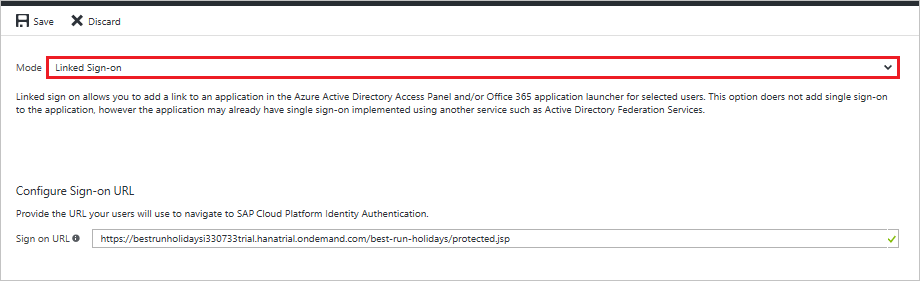
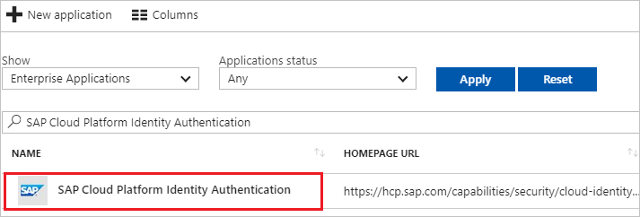

# Tutorial: Azure Active Directory integration with SAP Cloud Platform Identity Authentication

In this tutorial, you learn how to integrate SAP Cloud Platform Identity Authentication with Azure Active Directory (Azure AD). SAP Cloud Platform Identity Authentication is used as a proxy IdP to access SAP applications using Azure AD as the main IdP.

Integrating SAP Cloud Platform Identity Authentication with Azure AD provides you with the following benefits:

- You can control in Azure AD who has access to SAP Application.
- You can enable your users to automatically get signed-on to SAP applications single sign-on (SSO)) with their Azure AD accounts.
- You can manage your accounts in one central location - the Azure portal.

If you want to know more details about SaaS app integration with Azure AD, see [what is application access and single sign-on with Azure Active Directory](active-directory-appssoaccess-whatis.md).

## Prerequisites

To configure Azure AD integration with SAP Cloud Platform Identity Authentication, you need the following items:

- An Azure AD subscription
- An SAP Cloud Platform Identity Authentication single sign-on enabled subscription

> [!NOTE]
> To test the steps in this tutorial, we do not recommend using a production environment.

To test the steps in this tutorial, you should follow these recommendations:

- Do not use your production environment, unless it is necessary.
- If you don't have an Azure AD trial environment, you can [get a one-month trial](https://azure.microsoft.com/pricing/free-trial/).

## Scenario description
In this tutorial, you test Azure AD single sign-on in a test environment. 
The scenario outlined in this tutorial consists of two main building blocks:

1. Adding SAP Cloud Platform Identity Authentication from the gallery
2. Configuring and testing Azure AD single sign-on

Before diving into the technical details, it is vital to understand the concepts you're going to look at. The SAP Cloud Platform Identity Authentication and Azure Active Directory federation enables you to implement SSO across applications or services protected by AAD (as an IdP) with SAP applications and services protected by SAP Cloud Platform Identity Authentication.

Currently, SAP Cloud Platform Identity Authentication acts as a Proxy Identity Provider to SAP-applications. Azure Active Directory in turn acts as the leading Identity Provider in this setup. 

The following diagram illustrates this:

With this setup, your SAP Cloud Platform Identity Authentication tenant will be configured as a trusted application in Azure Active Directory. 

All SAP applications and services you want to protect through this way are subsequently configured in the SAP Cloud Platform Identity Authentication management console!

This means that authorization for granting access to SAP applications and services needs to take place in SAP Cloud Platform Identity Authentication for such a setup (as opposed to configuring authorization in Azure Active Directory).

By configuring SAP Cloud Platform Identity Authentication as an application through the Azure Active Directory Marketplace, you don't need to take care of configuring needed individual claims / SAML assertions and transformations needed to produce a valid authentication token for SAP applications.

>[!NOTE] 
>Currently Web SSO has been tested by both parties, only. Flows needed for App-to-API or API-to-API communication should work but have not been tested, yet. They will be tested as part of subsequent activities.
>

## Adding SAP Cloud Platform Identity Authentication from the gallery
To configure the integration of SAP Cloud Platform Identity Authentication into Azure AD, you need to add SAP Cloud Platform Identity Authentication from the gallery to your list of managed SaaS apps.

**To add SAP Cloud Platform Identity Authentication from the gallery, perform the following steps:**

1. In the **[Azure portal](https://portal.azure.com)**, on the left navigation panel, click **Azure Active Directory** icon. 

	![The Azure Active Directory button][1]

2. Navigate to **Enterprise applications**. Then go to **All applications**.

	![The Enterprise applications blade][2]
	
3. To add new application, click **New application** button on the top of dialog.

	![The New application button][3]

4. In the search box, type **SAP Cloud Platform Identity Authentication**, select **SAP Cloud Platform Identity Authentication** from result panel then click **Add** button to add the application.

	

## Configure and test Azure AD single sign-on

In this section, you configure and test Azure AD single sign-on with SAP Cloud Platform Identity Authentication based on a test user called "Britta Simon".

For single sign-on to work, Azure AD needs to know what the counterpart user in SAP Cloud Platform Identity Authentication is to a user in Azure AD. In other words, a link relationship between an Azure AD user and the related user in SAP Cloud Platform Identity Authentication needs to be established.

In SAP Cloud Platform Identity Authentication, assign the value of the **user name** in Azure AD as the value of the **Username** to establish the link relationship.

To configure and test Azure AD single sign-on with SAP Cloud Platform Identity Authentication, you need to complete the following building blocks:

1. **[Configure Azure AD Single Sign-On](#configure-azure-ad-single-sign-on)** - to enable your users to use this feature.
2. **[Create an Azure AD test user](#create-an-azure-ad-test-user)** - to test Azure AD single sign-on with Britta Simon.
3. **[Create an SAP Cloud Platform Identity Authentication test user](#create-an-sap-cloud-platform-identity-authentication-test-user)** - to have a counterpart of Britta Simon in SAP Cloud Platform Identity Authentication that is linked to the Azure AD representation of user.
4. **[Assign the Azure AD test user](#assign-the-azure-ad-test-user)** - to enable Britta Simon to use Azure AD single sign-on.
5. **[Test single sign-on](#test-single-sign-on)** - to verify whether the configuration works.

### Configure Azure AD single sign-on

In this section, you enable Azure AD single sign-on in the Azure portal and configure single sign-on in your SAP Cloud Platform Identity Authentication application.

**To configure Azure AD single sign-on with SAP Cloud Platform Identity Authentication, perform the following steps:**

1. In the Azure portal, on the **SAP Cloud Platform Identity Authentication** application integration page, click **Single sign-on**.

	![Configure single sign-on link][4]

2. On the **Single sign-on** dialog, select **Mode** as	**SAML-based Sign-on** to enable single sign-on.
 
	

3. On the **SAP Cloud Platform Identity Authentication Domain and URLs** section, perform the following steps:

	

    In the **Identifier** textbox, type a URL using the following pattern: `https://<entity-id>.accounts.ondemand.com`

	> [!NOTE] 
	> This value is not real. Update this value with the actual Identifier. Contact [SAP Cloud Platform Identity Authentication Client support team](https://cloudplatform.sap.com/capabilities/security/trustcenter.html) to get this value. If you don't know this value, please follow the SAP Cloud Platform Identity Authentication documentation on [Tenant SAML 2.0 Configuration](https://help.hana.ondemand.com/cloud_identity/frameset.htm?e81a19b0067f4646982d7200a8dab3ca.html). 

4. On the **SAML Signing Certificate** section, click **Metadata XML** and then save the metadata file on your computer.

	

5. SAP Cloud Platform Identity Authentication application expects the SAML assertions in a specific format. You can manage the values of these attributes from the "**User Attributes**" section on application integration page. The following screenshot shows an example for this. 

	

6. In the **User Attributes** section on the **Single sign-on** dialog, if your SAP application expects an attribute for example "firstName". On the SAML token attributes dialog, add the "firstName" attribute. configure SAML token attribute as shown in the preceding image and perform the following steps:

	| Attribute Name | Attribute Value |
	| ------------------- | -------------------- |
	| firstName | user.givenname |
	
	a. Click **Add attribute** to open the **Add Attribute** dialog.
	
	
	
	
	
	b. In the **Name** textbox, type the attribute name shown for that row.
	
	c. From the **Value** list, type the attribute value shown for that row.
	
	d. Click **Ok**.

7. Click **Save** button.

	

8. On the **SAP Cloud Platform Identity Authentication Configuration** section, click **Configure SAP Cloud Platform Identity Authentication** to open **Configure sign-on** window. Copy the **Sign-Out URL, SAML Entity ID, and SAML Single Sign-On Service URL** from the **Quick Reference section.**

	 

9. To get SSO configured for your application, go to SAP Cloud Platform Identity Authentication Administration Console. The URL has the following pattern: `https://<tenant-id>.accounts.ondemand.com/admin`. Then, follow the documentation on SAP Cloud Platform Identity Authentication to [Configure Microsoft Azure AD as Corporate Identity Provider at SAP Cloud Platform Identity Authentication](https://help.hana.ondemand.com/cloud_identity/frameset.htm?626b17331b4d4014b8790d3aea70b240.html). 

10. In the Azure portal, click **Save** button.

11. Continue the following steps only if you want to add and enable SSO for another SAP application. Repeat steps under the section “Adding SAP Cloud Platform Identity Authentication from the gallery” to add another instance of SAP Cloud Platform Identity Authentication.

12. In the Azure portal, on the **SAP Cloud Platform Identity Authentication** application integration page, click **Linked Sign-on**.

 	

13. Save the configuration.

>[!NOTE] 
>The new application will leverage the SSO configuration for the previous SAP application. Please make sure you use the same Corporate Identity Providers in the SAP Cloud Platform Identity Authentication Administration Console.
>

> [!TIP]
> You can now read a concise version of these instructions inside the [Azure portal](https://portal.azure.com), while you are setting up the app!  After adding this app from the **Active Directory > Enterprise Applications** section, simply click the **Single Sign-On** tab and access the embedded documentation through the **Configuration** section at the bottom. You can read more about the embedded documentation feature here: [Azure AD embedded documentation]( https://go.microsoft.com/fwlink/?linkid=845985)
> 

### Create an Azure AD test user

The objective of this section is to create a test user in the Azure portal called Britta Simon.

   ![Create an Azure AD test user][100]

**To create a test user in Azure AD, perform the following steps:**

1. In the Azure portal, in the left pane, click the **Azure Active Directory** button.

    

2. To display the list of users, go to **Users and groups**, and then click **All users**.

    

3. To open the **User** dialog box, click **Add** at the top of the **All Users** dialog box.

    

4. In the **User** dialog box, perform the following steps:

    

    a. In the **Name** box, type **BrittaSimon**.

    b. In the **User name** box, type the email address of user Britta Simon.

    c. Select the **Show Password** check box, and then write down the value that's displayed in the **Password** box.

    d. Click **Create**.
 
### Create an SAP Cloud Platform Identity Authentication test user

You don't need to create an user on SAP Cloud Platform Identity Authentication. Users who are in the Azure AD user store can use the SSO functionality.

SAP Cloud Platform Identity Authentication supports the Identity Federation option. This option allows the application to check if the users authenticated by the corporate identity provider exist in the user store of SAP Cloud Platform Identity Authentication. 

In the default setting, the Identity Federation option is disabled. If Identity Federation is enabled, only the users that are imported in SAP Cloud Platform Identity Authentication are able to access the application. 

For more information about how to enable or disable Identity Federation with SAP Cloud Platform Identity Authentication, see Enable Identity Federation with SAP Cloud Platform Identity Authentication in [Configure Identity Federation with the User Store of SAP Cloud Platform Identity Authentication](https://help.hana.ondemand.com/cloud_identity/frameset.htm?c029bbbaefbf4350af15115396ba14e2.html).

### Assign the Azure AD test user

In this section, you enable Britta Simon to use Azure single sign-on by granting access to SAP Cloud Platform Identity Authentication.

![Assign the user role][200] 

**To assign Britta Simon to SAP Cloud Platform Identity Authentication, perform the following steps:**

1. In the Azure portal, open the applications view, and then navigate to the directory view and go to **Enterprise applications** then click **All applications**.

	![Assign User][201] 

2. In the applications list, select **SAP Cloud Platform Identity Authentication**.

	  

3. In the menu on the left, click **Users and groups**.

	![The "Users and groups" link][202]

4. Click **Add** button. Then select **Users and groups** on **Add Assignment** dialog.

	![The Add Assignment pane][203]

5. On **Users and groups** dialog, select **Britta Simon** in the Users list.

6. Click **Select** button on **Users and groups** dialog.

7. Click **Assign** button on **Add Assignment** dialog.
	
### Test single sign-on

In this section, you test your Azure AD single sign-on configuration using the Access Panel.

When you click the SAP Cloud Platform Identity Authentication tile in the Access Panel, you should get automatically signed-on to your SAP Cloud Platform Identity Authentication application.
For more information about the Access Panel, see [Introduction to the Access Panel](active-directory-saas-access-panel-introduction.md). 

## Additional resources

* [List of Tutorials on How to Integrate SaaS Apps with Azure Active Directory](active-directory-saas-tutorial-list.md)
* [What is application access and single sign-on with Azure Active Directory?](active-directory-appssoaccess-whatis.md)

<!--Image references-->

[1]: ./media/active-directory-saas-sapcloudauth-tutorial/tutorial_general_01.png
[2]: ./media/active-directory-saas-sapcloudauth-tutorial/tutorial_general_02.png
[3]: ./media/active-directory-saas-sapcloudauth-tutorial/tutorial_general_03.png
[4]: ./media/active-directory-saas-sapcloudauth-tutorial/tutorial_general_04.png

[100]: ./media/active-directory-saas-sapcloudauth-tutorial/tutorial_general_100.png

[200]: ./media/active-directory-saas-sapcloudauth-tutorial/tutorial_general_200.png
[201]: ./media/active-directory-saas-sapcloudauth-tutorial/tutorial_general_201.png
[202]: ./media/active-directory-saas-sapcloudauth-tutorial/tutorial_general_202.png
[203]: ./media/active-directory-saas-sapcloudauth-tutorial/tutorial_general_203.png

