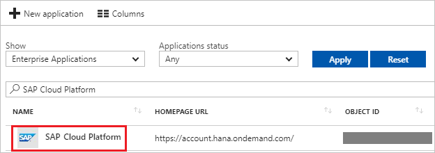

# Tutorial: Azure Active Directory integration with SAP Cloud Platform

In this tutorial, you learn how to integrate SAP Cloud Platform with Azure Active Directory (Azure AD).

Integrating SAP Cloud Platform with Azure AD provides you with the following benefits:

- You can control in Azure AD who has access to SAP Cloud Platform.
- You can enable your users to automatically get signed-on to SAP Cloud Platform (Single Sign-On) with their Azure AD accounts.
- You can manage your accounts in one central location - the Azure portal.

If you want to know more details about SaaS app integration with Azure AD, see [what is application access and single sign-on with Azure Active Directory](active-directory-appssoaccess-whatis.md).

## Prerequisites

To configure Azure AD integration with SAP Cloud Platform, you need the following items:

- An Azure AD subscription
- A SAP Cloud Platform single sign-on enabled subscription

After completing this tutorial, the Azure AD users you have assigned to SAP Cloud Platform will be able to single sign into the application using the [Introduction to the Access Panel](active-directory-saas-access-panel-introduction.md).

>[!IMPORTANT]
>You need to deploy your own application or subscribe to an application on your SAP Cloud Platform account to test single sign on. In this tutorial, an application is deployed in the account.
> 

To test the steps in this tutorial, you should follow these recommendations:

- Do not use your production environment, unless it is necessary.
- If you don't have an Azure AD trial environment, you can [get a one-month trial](https://azure.microsoft.com/pricing/free-trial/).

## Scenario description
In this tutorial, you test Azure AD single sign-on in a test environment. 
The scenario outlined in this tutorial consists of two main building blocks:

1. Adding SAP Cloud Platform from the gallery
2. Configuring and testing Azure AD single sign-on

## Adding SAP Cloud Platform from the gallery
To configure the integration of SAP Cloud Platform into Azure AD, you need to add SAP Cloud Platform from the gallery to your list of managed SaaS apps.

**To add SAP Cloud Platform from the gallery, perform the following steps:**

1. In the **[Azure portal](https://portal.azure.com)**, on the left navigation panel, click **Azure Active Directory** icon. 

	![The Azure Active Directory button][1]

2. Navigate to **Enterprise applications**. Then go to **All applications**.

	![The Enterprise applications blade][2]
	
3. To add new application, click **New application** button on the top of dialog.

	![The New application button][3]

4. In the search box, type **SAP Cloud Platform**, select **SAP Cloud Platform** from result panel then click **Add** button to add the application.

	

## Configure and test Azure AD single sign-on

In this section, you configure and test Azure AD single sign-on with SAP Cloud Platform based on a test user called "Britta Simon".

For single sign-on to work, Azure AD needs to know what the counterpart user in SAP Cloud Platform is to a user in Azure AD. In other words, a link relationship between an Azure AD user and the related user in SAP Cloud Platform needs to be established.

In SAP Cloud Platform, assign the value of the **user name** in Azure AD as the value of the **Username** to establish the link relationship.

To configure and test Azure AD single sign-on with SAP Cloud Platform, you need to complete the following building blocks:

1. **[Configure Azure AD Single Sign-On](#configure-azure-ad-single-sign-on)** - to enable your users to use this feature.
2. **[Create an Azure AD test user](#create-an-azure-ad-test-user)** - to test Azure AD single sign-on with Britta Simon.
3. **[Create a SAP Cloud Platform test user](#create-a-sap-cloud-platform-test-user)** - to have a counterpart of Britta Simon in SAP Cloud Platform that is linked to the Azure AD representation of user.
4. **[Assign the Azure AD test user](#assign-the-azure-ad-test-user)** - to enable Britta Simon to use Azure AD single sign-on.
5. **[Test single sign-on](#test-single-sign-on)** - to verify whether the configuration works.

### Configure Azure AD single sign-on

In this section, you enable Azure AD single sign-on in the Azure portal and configure single sign-on in your SAP Cloud Platform application.

**To configure Azure AD single sign-on with SAP Cloud Platform, perform the following steps:**

1. In the Azure portal, on the **SAP Cloud Platform** application integration page, click **Single sign-on**.

	![Configure single sign-on link][4]

2. On the **Single sign-on** dialog, select **Mode** as	**SAML-based Sign-on** to enable single sign-on.
 
	

3. On the **SAP Cloud Platform Domain and URLs** section, perform the following steps:

	

    a. In the **Sign On URL** textbox, type the URL used by your users to sign into your **SAP Cloud Platform** application. This is the account-specific URL of a protected resource in your SAP Cloud Platform application. The URL is based on the following pattern: `https://\<applicationName\>\<accountName\>.\<landscape host\>.ondemand.com/\<path\_to\_protected\_resource\>`
      
     >[!NOTE]
     >This is the URL in your SAP Cloud Platform application that requires the user to authenticate.
     > 

    | |
    |--|
    | `https://<subdomain>.hanatrial.ondemand.com/<instancename>` |
    | `https://<subdomain>.hana.ondemand.com/<instancename>` |

	b. In the **Identifier** textbox, type a URL using the following pattern: 
	| |
	|--|
	| `https://hanatrial.ondemand.com/<instancename>` |
	| `https://hana.ondemand.com/<instancename>` |
	| `https://us1.hana.ondemand.com/<instancename>` |
	| `https://ap1.hana.ondemand.com/<instancename>` |

	c. In the **Reply URL** textbox, type a URL using the following pattern:
	| |
	|--|
	| `https://<subdomain>.hanatrial.ondemand.com/<instancename>` |
	| `https://<subdomain>.hana.ondemand.com/<instancename>` |
	| `https://<subdomain>.us1.hana.ondemand.com/<instancename>` |
	| `https://<subdomain>.dispatcher.us1.hana.ondemand.com/<instancename>` |
	| `https://<subdomain>.ap1.hana.ondemand.com/<instancename>` |
	| `https://<subdomain>.dispatcher.ap1.hana.ondemand.com/<instancename>` |
	| `https://<subdomain>.dispatcher.hana.ondemand.com/<instancename>` |

	> [!NOTE] 
	> These values are not real. Update these values with the actual Sign-On URL, Identifier, and Reply URL. Contact [SAP Cloud Platform Client support team](https://help.sap.com/viewer/65de2977205c403bbc107264b8eccf4b/Cloud/5dd739823b824b539eee47b7860a00be.html) to get Sign-On URL and Identifier. Reply URL you can get from trust management section which is explained later in the tutorial.
	> 
	 
4. On the **SAML Signing Certificate** section, click **Metadata XML** and then save the metadata file on your computer.

	 

5. Click **Save** button.

	

6. In a different web browser window, sign on to the SAP Cloud Platform Cockpit at `https://account.\<landscape host\>.ondemand.com/cockpit`(for example: https://account.hanatrial.ondemand.com/cockpit).

7. Click the **Trust** tab.
   
    

8. In trust management section, perform the following steps:
   
    
   
    a. Click the **Local Service Provider** tab.
 
    b. To download the SAP Cloud Platform metadata file, click **Get Metadata**.

    c. Open the downloaded SAP Cloud Platform metadata file, and then locate the **ns3:AssertionConsumerService** tag.
 
    d. Copy the value of the **Location** attribute, and then paste it into the **SAP Cloud Platform Reply URL** textbox.

9. On the SAP Cloud Platform Cockpit, in the **Local Service Provider** section, perform the following steps:
   
    
   
    a. Click **Edit**.

    b. As **Configuration Type**, select **Custom**.

    c. As **Local Provider Name**, leave the default value.

    d. To generate a **Signing Key** and a **Signing Certificate** key pair, click **Generate Key Pair**.

    e. As **Principal Propagation**, select **Disabled**.

    f. As **Force Authentication**, select **Disabled**.

    g. Click **Save**.

10. Click the **Trusted Identity Provider** tab, and then click **Add Trusted Identity Provider**.
   
    
   
    >[!NOTE]
    >To manage the list of trusted identity providers, you need to have chosen the Custom configuration type in the Local Service Provider section. For Default configuration type, you have a non-editable and implicit trust to the SAP ID Service. For None, you don't have any trust settings.
    > 
    > 

11. Click the **General** tab, and then click **Browse** to upload the downloaded metadata file.
    
    
    
    >[!NOTE]
    >After uploading the metadata file, the values for **Single Sign-on URL**, **Single Logout URL**, and **Signing Certificate** are populated automatically.
    > 
     
12. Click the **Attributes** tab.

13. On the **Attributes** tab, perform the following step:
    
     

    a. Click **Add Assertion-Based Attribute**, and then add the following assertion-based attributes:
       
    | Assertion Attribute | Principal Attribute |
    | --- | --- |
    | `http://schemas.xmlsoap.org/ws/2005/05/identity/claims/givenname` |firstname |
    | `http://schemas.xmlsoap.org/ws/2005/05/identity/claims/surname` |lastname |
    | `http://schemas.xmlsoap.org/ws/2005/05/identity/claims/emailaddress` |email |
   
     >[!NOTE]
     >The configuration of the Attributes depends on how the application(s) on HCP are developed, that is, which attribute(s) they expect in the SAML response and under which name (Principal Attribute) they access this attribute in the code.
     > 
    
    b. The **Default Attribute** in the screenshot is just for illustration purposes. It is not required to make the scenario work.  
 
    c. The names and values for **Principal Attribute** shown in the screenshot depend on how the application is developed. It is possible that your application requires different mappings.

###Assertion-based groups

As an optional step, you can configure assertion-based groups for your Azure Active Directory Identity Provider.

Using groups on SAP Cloud Platform allows you to dynamically assign one or more users to one or more roles in your SAP Cloud Platform applications, determined by values of attributes in the SAML 2.0 assertion. 

For example, if the assertion contains the attribute "*contract=temporary*", you may want all affected users to be added to the group "*TEMPORARY*". The group "*TEMPORARY*" may contain one or more roles from one or more applications deployed in your SAP Cloud Platform account.
 
Use assertion-based groups when you want to simultaneously assign many users to one or more roles of applications in your SAP Cloud Platform account. If you want to assign only a single or small number of users to specific roles, we recommend assigning them directly in the “**Authorizations**” tab of the SAP Cloud Platform cockpit.

> [!TIP]
> You can now read a concise version of these instructions inside the [Azure portal](https://portal.azure.com), while you are setting up the app!  After adding this app from the **Active Directory > Enterprise Applications** section, simply click the **Single Sign-On** tab and access the embedded documentation through the **Configuration** section at the bottom. You can read more about the embedded documentation feature here: [Azure AD embedded documentation]( https://go.microsoft.com/fwlink/?linkid=845985)
> 

### Create an Azure AD test user

The objective of this section is to create a test user in the Azure portal called Britta Simon.

   ![Create an Azure AD test user][100]

**To create a test user in Azure AD, perform the following steps:**

1. In the Azure portal, in the left pane, click the **Azure Active Directory** button.

    

2. To display the list of users, go to **Users and groups**, and then click **All users**.

    

3. To open the **User** dialog box, click **Add** at the top of the **All Users** dialog box.

    

4. In the **User** dialog box, perform the following steps:

    

    a. In the **Name** box, type **BrittaSimon**.

    b. In the **User name** box, type the email address of user Britta Simon.

    c. Select the **Show Password** check box, and then write down the value that's displayed in the **Password** box.

    d. Click **Create**.
 
### Create a SAP Cloud Platform test user

In order to enable Azure AD users to log in to SAP Cloud Platform, you must assign roles in the SAP Cloud Platform to them.

**To assign a role to a user, perform the following steps:**

1. Log in to your **SAP Cloud Platform** cockpit.

2. Perform the following:
   
    
   
    a. Click **Authorization**.

    b. Click the **Users** tab.

    c. In the **User** textbox, type the user’s email address.

    d. Click **Assign** to assign the user to a role.

    e. Click **Save**.

### Assign the Azure AD test user

In this section, you enable Britta Simon to use Azure single sign-on by granting access to SAP Cloud Platform.

![Assign the user role][200] 

**To assign Britta Simon to SAP Cloud Platform, perform the following steps:**

1. In the Azure portal, open the applications view, and then navigate to the directory view and go to **Enterprise applications** then click **All applications**.

	![Assign User][201] 

2. In the applications list, select **SAP Cloud Platform**.

	  

3. In the menu on the left, click **Users and groups**.

	![The "Users and groups" link][202]

4. Click **Add** button. Then select **Users and groups** on **Add Assignment** dialog.

	![The Add Assignment pane][203]

5. On **Users and groups** dialog, select **Britta Simon** in the Users list.

6. Click **Select** button on **Users and groups** dialog.

7. Click **Assign** button on **Add Assignment** dialog.
	
### Test single sign-on

The objective of this section is to test your Azure AD single sign-on configuration using the Access Panel.

When you click the SAP Cloud Platform tile in the Access Panel, you should get automatically signed-on to your SAP Cloud Platform application.

## Additional resources

* [List of Tutorials on How to Integrate SaaS Apps with Azure Active Directory](active-directory-saas-tutorial-list.md)
* [What is application access and single sign-on with Azure Active Directory?](active-directory-appssoaccess-whatis.md)

<!--Image references-->

[1]: ./media/active-directory-saas-sap-hana-cloud-platform-tutorial/tutorial_general_01.png
[2]: ./media/active-directory-saas-sap-hana-cloud-platform-tutorial/tutorial_general_02.png
[3]: ./media/active-directory-saas-sap-hana-cloud-platform-tutorial/tutorial_general_03.png
[4]: ./media/active-directory-saas-sap-hana-cloud-platform-tutorial/tutorial_general_04.png

[100]: ./media/active-directory-saas-sap-hana-cloud-platform-tutorial/tutorial_general_100.png

[200]: ./media/active-directory-saas-sap-hana-cloud-platform-tutorial/tutorial_general_200.png
[201]: ./media/active-directory-saas-sap-hana-cloud-platform-tutorial/tutorial_general_201.png
[202]: ./media/active-directory-saas-sap-hana-cloud-platform-tutorial/tutorial_general_202.png
[203]: ./media/active-directory-saas-sap-hana-cloud-platform-tutorial/tutorial_general_203.png

