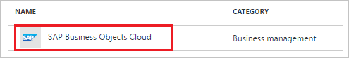
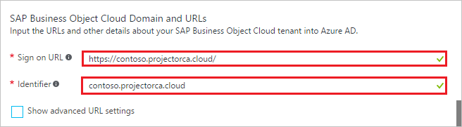
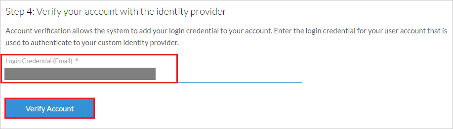
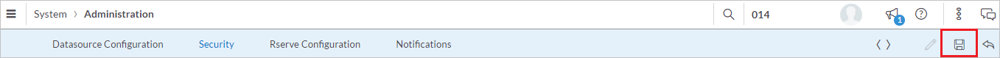
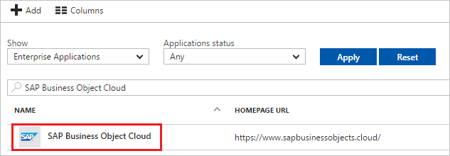

# Tutorial: Azure Active Directory integration with SAP Business Object Cloud

In this tutorial, you learn how to integrate SAP Business Object Cloud with Azure Active Directory (Azure AD).

Integrating SAP Business Object Cloud with Azure AD provides you with the following benefits:

- You can control in Azure AD who has access to SAP Business Object Cloud
- You can enable your users to automatically get signed-on to SAP Business Object Cloud (Single Sign-On) with their Azure AD accounts
- You can manage your accounts in one central location - the Azure portal

If you want to know more details about SaaS app integration with Azure AD, see [what is application access and single sign-on with Azure Active Directory](active-directory-appssoaccess-whatis.md).

## Prerequisites

To configure Azure AD integration with SAP Business Object Cloud, you need the following items:

- An Azure AD subscription
- An SAP Business Object Cloud single-sign on enabled subscription

> [!NOTE]
> To test the steps in this tutorial, we do not recommend using a production environment.

To test the steps in this tutorial, you should follow these recommendations:

- Do not use your production environment, unless it is necessary.
- If you don't have an Azure AD trial environment, you can get a one-month trial [here](https://azure.microsoft.com/pricing/free-trial/).

## Scenario description
In this tutorial, you test Azure AD single sign-on in a test environment. 
The scenario outlined in this tutorial consists of two main building blocks:

1. Adding SAP Business Object Cloud from the gallery
2. Configuring and testing Azure AD single sign-on

## Adding SAP Business Object Cloud from the gallery
To configure the integration of SAP Business Object Cloud into Azure AD, you need to add SAP Business Object Cloud from the gallery to your list of managed SaaS apps.

**To add SAP Business Object Cloud from the gallery, perform the following steps:**

1. In the **[Azure portal](https://portal.azure.com)**, on the left navigation panel, click **Azure Active Directory** icon. 

	![Active Directory][1]

2. Navigate to **Enterprise applications**. Then go to **All applications**.

	![Applications][2]
	
3. To add new application, click **New application** button on the top of dialog.

	![Applications][3]

4. In the search box, type **SAP Business Object Cloud**.

	

5. In the results panel, select **SAP Business Object Cloud**, and then click **Add** button to add the application.

	

##  Configuring and testing Azure AD single sign-on
In this section, you configure and test Azure AD single sign-on with SAP Business Object Cloud based on a test user called "Britta Simon."

For single sign-on to work, Azure AD needs to know what the counterpart user in SAP Business Object Cloud is to a user in Azure AD. In other words, a link relationship between an Azure AD user and the related user in SAP Business Object Cloud needs to be established.

In SAP Business Object Cloud, assign the value of the **user name** in Azure AD as the value of the **Username** to establish the link relationship.

To configure and test Azure AD single sign-on with SAP Business Object Cloud, you need to complete the following building blocks:

1. **[Configuring Azure AD Single Sign-On](#configuring-azure-ad-single-sign-on)** - to enable your users to use this feature.
2. **[Creating an Azure AD test user](#creating-an-azure-ad-test-user)** - to test Azure AD single sign-on with Britta Simon.
3. **[Creating an SAP Business Object Cloud test user](#creating-an-sap-business-object-cloud-test-user)** - to have a counterpart of Britta Simon in SAP Business Object Cloud that is linked to the Azure AD representation of user.
4. **[Assigning the Azure AD test user](#assigning-the-azure-ad-test-user)** - to enable Britta Simon to use Azure AD single sign-on.
5. **[Testing Single Sign-On](#testing-single-sign-on)** - to verify whether the configuration works.

### Configuring Azure AD single sign-on

In this section, you enable Azure AD single sign-on in the Azure portal and configure single sign-on in your SAP Business Object Cloud application.

**To configure Azure AD single sign-on with SAP Business Object Cloud, perform the following steps:**

1. In the Azure portal, on the **SAP Business Object Cloud** application integration page, click **Single sign-on**.

	![Configure Single Sign-On][4]

2. On the **Single sign-on** dialog, select **Mode** as	**SAML-based Sign-on** to enable single sign-on.
 
	

3. On the **SAP Business Object Cloud Domain and URLs** section, perform the following steps:

	

    a. In the **Sign-on URL** textbox, type a URL using the following pattern: `https://<sub-domain>.projectorca.cloud/`

	b. In the **Identifier** textbox, type a URL using the following pattern: `<sub-domain>.projectorca.cloud`

	> [!NOTE] 
	> These values are not real. Update these values with the actual Sign-On URL and Identifier. Contact [SAP Business Object Cloud Client support team](https://www.sap.com/product/analytics/cloud-analytics.support.html) to get Sign-On URL and you can get Identifier downloading the SAP Business Object Cloud metadata from the admin console that is explained later in the tutorial. 
 
4. On the **SAML Signing Certificate** section, click **Metadata XML** and then save the metadata file on your computer.

	 

5. Click **Save** button.

	

6. In a different web browser window, log in to your SAP Business Object Cloud company site as an administrator.

7. Go to **Menu > System > Administration**
    
        
8. On **Security** tab click **[Edit – pen icon]**.
    
        
9. Select **SAML Single Sign-On (SSO)** as Authentication Method.

      

10. Click **Download** to download the Service Provider metadata. Retrieve **entityID** value from the file and paste it in **Identifier** textbox in **SAP Business Object Cloud Domain and URLs** section on Azure portal.

	  

11. In **Upload Identity Provider metadata** step click **Upload..** button to upload the metadata file downloaded from Azure portal. 

	

12. Select the appropriate **User Attribute** you want to use for your implementation from list to map to Identity provider. Use the "Custom SAML Mapping" option to enter a custom attribute in the users page or select either "Email" or "USER ID" as the user Attribute. E.x. **Email** is selected here as we have mapped the user identifier claim with the userprincipalname attribute in the **"User Attributes"** section on Azure portal, which provides unique user email, which is sent to the SAP Business Object Cloud application in every successful SAML Response.

	

13. Enter your Email in **Login Credential (Email)** text box and click **Verify Account** button to allow the system to add your login credential to your account.

    

14. Click **Save icon**

	

> [!TIP]
> You can now read a concise version of these instructions inside the [Azure portal](https://portal.azure.com), while you are setting up the app!  After adding this app from the **Active Directory > Enterprise Applications** section, simply click the **Single Sign-On** tab and access the embedded documentation through the **Configuration** section at the bottom. You can read more about the embedded documentation feature here: [Azure AD embedded documentation]( https://go.microsoft.com/fwlink/?linkid=845985)
> 

### Creating an Azure AD test user
The objective of this section is to create a test user in the Azure portal called Britta Simon.

![Create Azure AD User][100]

**To create a test user in Azure AD, perform the following steps:**

1. In the **Azure portal**, on the left navigation pane, click **Azure Active Directory** icon.

	 

2. To display the list of users, go to **Users and groups** and click **All users**.
	
	 

3. To open the **User** dialog, click **Add** on the top of the dialog.
 
	 

4. On the **User** dialog page, perform the following steps:
 
	 

    a. In the **Name** textbox, type **BrittaSimon**.

    b. In the **User name** textbox, type the **email address** of BrittaSimon.

	c. Select **Show Password** and write down the value of the **Password**.

    d. Click **Create**.
 
### Creating an SAP Business Object Cloud test user

To enable Azure AD users to log in to SAP Business Object Cloud, they must be provisioned into SAP Business Object Cloud.  
In the case of SAP Business Object Cloud, provisioning is a manual task.

**To provision a user account, perform the following steps:**

1. Log in to your SAP Business Object Cloud company site as an administrator.

2. Go to **Menu > Security > Users**

    

3. On the **Users** page, click **“+”** to add new user details and perform the following steps:

	

	a. In the **USER ID** textbox, type user id of the user like Britta.

	b. In the **FIRST NAME** textbox, type first name of the user like Britta.

	c. In the **LAST NAME** textbox, type last name of the user like Simon.

	d. In the **DISPLAY NAME** textbox, type full name of the user like Britta Simon.

	e. In the **E-MAIL** textbox, type email address of the user like brittasimon@contoso.com.

	f. Select the appropriate role for the user.

	  

	g. Click **Save icon**.	

### Assigning the Azure AD test user

In this section, you enable Britta Simon to use Azure single sign-on by granting access to SAP Business Object Cloud.

![Assign User][200] 

**To assign Britta Simon to SAP Business Object Cloud, perform the following steps:**

1. In the Azure portal, open the applications view, and then navigate to the directory view and go to **Enterprise applications** then click **All applications**.

	![Assign User][201] 

2. In the applications list, select **SAP Business Object Cloud**.

	 

3. In the menu on the left, click **Users and groups**.

	![Assign User][202] 

4. Click **Add** button. Then select **Users and groups** on **Add Assignment** dialog.

	![Assign User][203]

5. On **Users and groups** dialog, select **Britta Simon** in the Users list.

6. Click **Select** button on **Users and groups** dialog.

7. Click **Assign** button on **Add Assignment** dialog.
	
### Testing single sign-on

In this section, you test your Azure AD single sign-on configuration using the Access Panel.

When you click the SAP Business Object Cloud tile in the Access Panel, you should get automatically signed-on to your SAP Business Object Cloud application.
For more information about the Access Panel, see [Introduction to the Access Panel](active-directory-saas-access-panel-introduction.md).

## Additional resources

* [List of Tutorials on How to Integrate SaaS Apps with Azure Active Directory](active-directory-saas-tutorial-list.md)
* [What is application access and single sign-on with Azure Active Directory?](active-directory-appssoaccess-whatis.md)

<!--Image references-->

[1]: ./media/active-directory-saas-sapboc-tutorial/tutorial_general_01.png
[2]: ./media/active-directory-saas-sapboc-tutorial/tutorial_general_02.png
[3]: ./media/active-directory-saas-sapboc-tutorial/tutorial_general_03.png
[4]: ./media/active-directory-saas-sapboc-tutorial/tutorial_general_04.png

[100]: ./media/active-directory-saas-sapboc-tutorial/tutorial_general_100.png

[200]: ./media/active-directory-saas-sapboc-tutorial/tutorial_general_200.png
[201]: ./media/active-directory-saas-sapboc-tutorial/tutorial_general_201.png
[202]: ./media/active-directory-saas-sapboc-tutorial/tutorial_general_202.png
[203]: ./media/active-directory-saas-sapboc-tutorial/tutorial_general_203.png

