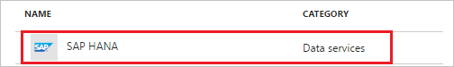
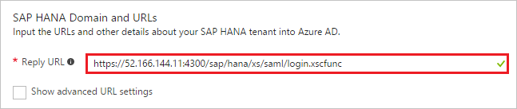
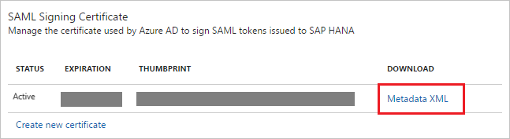
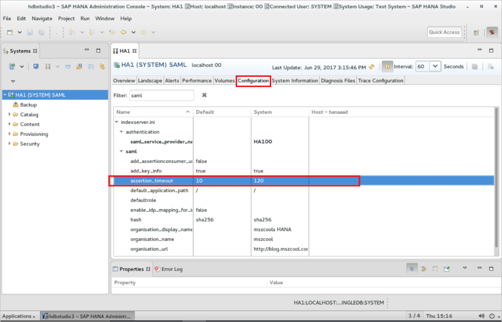
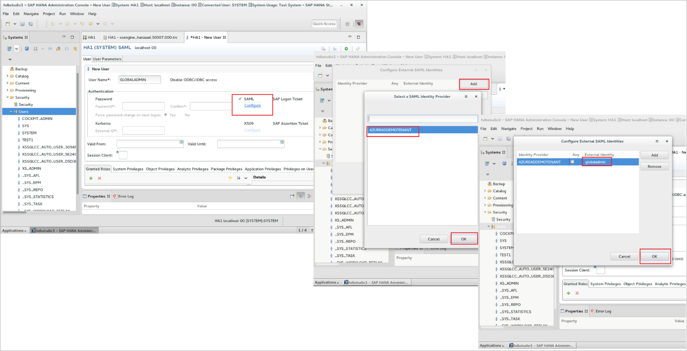
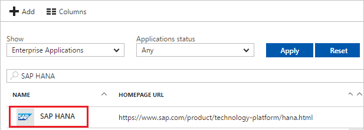

# Tutorial: Azure Active Directory integration with SAP HANA

In this tutorial, you learn how to integrate SAP HANA with Azure Active Directory (Azure AD).

Integrating SAP HANA with Azure AD provides you with the following benefits:

- You can control in Azure AD who has access to SAP HANA
- You can enable your users to automatically get signed-on to SAP HANA (Single Sign-On) with their Azure AD accounts
- You can manage your accounts in one central location - the Azure portal

If you want to know more details about SaaS app integration with Azure AD, see [what is application access and single sign-on with Azure Active Directory](active-directory-appssoaccess-whatis.md).

## Prerequisites

To configure Azure AD integration with SAP HANA, you need the following items:

- An Azure AD subscription
- A SAP HANA single sign-on enabled subscription
- A running HANA Instance either on any public IaaS, on-premises, Azure VMs or SAP Large Instances in Azure
- The XSA Administration Web Interface as well as HANA Studio installed on the HANA instance.

> [!NOTE]
> To test the steps in this tutorial, we do not recommend using a production environment of SAP HANA. Test the integration first in development or staging environment of the application and then use the production environment.

To test the steps in this tutorial, you should follow these recommendations:

- Do not use your production environment, unless it is necessary.
- If you don't have an Azure AD trial environment, you can [get a one-month trial](https://azure.microsoft.com/pricing/free-trial/).

## Scenario description
In this tutorial, you test Azure AD single sign-on in a test environment. 
The scenario outlined in this tutorial consists of two main building blocks:

1. Adding SAP HANA from the gallery
2. Configuring and testing Azure AD single sign-on

## Adding SAP HANA from the gallery
To configure the integration of SAP HANA into Azure AD, you need to add SAP HANA from the gallery to your list of managed SaaS apps.

**To add SAP HANA from the gallery, perform the following steps:**

1. In the **[Azure portal](https://portal.azure.com)**, on the left navigation panel, click **Azure Active Directory** icon. 

	![The Azure Active Directory button][1]

2. Navigate to **Enterprise applications**. Then go to **All applications**.

	![The Enterprise applications blade][2]
	
3. To add new application, click **New application** button on the top of dialog.

	![The New application button][3]

4. In the search box, type **SAP HANA**, select **SAP HANA** from result panel then click **Add** button to add the application. 

	

##  Configuring and testing Azure AD single sign-on
In this section, you configure and test Azure AD single sign-on with SAP HANA based on a test user called "Britta Simon."

For single sign-on to work, Azure AD needs to know what the counterpart user in SAP HANA is to a user in Azure AD. In other words, a link relationship between an Azure AD user and the related user in SAP HANA needs to be established.

In SAP HANA, assign the value of the **user name** in Azure AD as the value of the **Username** to establish the link relationship.

To configure and test Azure AD single sign-on with SAP HANA, you need to complete the following building blocks:

1. **[Configuring Azure AD Single Sign-On](#configuring-azure-ad-single-sign-on)** - to enable your users to use this feature.
2. **[Creating an Azure AD test user](#creating-an-azure-ad-test-user)** - to test Azure AD single sign-on with Britta Simon.
3. **[Creating a SAP HANA test user](#creating-a-sap-hana-test-user)** - to have a counterpart of Britta Simon in SAP HANA that is linked to the Azure AD representation of user.
4. **[Assigning the Azure AD test user](#assigning-the-azure-ad-test-user)** - to enable Britta Simon to use Azure AD single sign-on.
5. **[Testing Single Sign-On](#testing-single-sign-on)** - to verify whether the configuration works.

### Configuring Azure AD single sign-on

In this section, you enable Azure AD single sign-on in the Azure portal and configure single sign-on in your SAP HANA application.

**To configure Azure AD single sign-on with SAP HANA, perform the following steps:**

1. In the Azure portal, on the **SAP HANA** application integration page, click **Single sign-on**.

	![Configure Single Sign-On][4]

2. On the **Single sign-on** dialog, select **Mode** as	**SAML-based Sign-on** to enable single sign-on.
 
	

3. On the **SAP HANA Domain and URLs** section, perform the following steps:

	

	a. In the **Identifier** textbox, type as: `HA100` 

	b. In the **Reply URL** textbox, type a URL using the following pattern: `https://<Customer-SAP-instance-url>/sap/hana/xs/saml/login.xscfunc`

	> [!NOTE] 
	> These values are not real. Update these values with the actual Identifier and Reply URL. Contact [SAP HANA Client support team](https://cloudplatform.sap.com/contact.html) to get these values. 

4. On the **SAML Signing Certificate** section, click **Metadata XML** and then save the metadata file on your computer.

	 

	>[!Note]
	>If certificate is not active then make it active by clicking the “Make new certificate active” checkbox in the Azure AD. 

5. SAP HANA application expects the SAML assertions in a specific format. The following screenshot shows an example for this. Here we have mapped the **User Identifier** with **ExtractMailPrefix()** function of **user.mail**. This gives the prefix value of email of the user which is the unique User ID. This is sent to the SAP HANA application in every successful response.

	

6. In the **User Attributes** section on the **Single sign-on** dialog:

	a. In the **User Identifier** dropdown list, select **ExtractMailPrefix**.
	
	b. In the **Mail** dropdown list, select **user.mail**.

7. Click **Save** button.

	
	
8. To configure single sign-on on **SAP HANA** side, login to your **HANA XSA Web Console**  by browsing to the respective HTTPS-endpoint.

	> [!Note]
	> In the default configuration, the URL redirects the request to a logon screen, which requires the credentials of an authenticated SAP HANA database user to complete the logon process. The user who logs on must have the privileges required to perform SAML administration tasks.

9. In the XSA Web Interface, navigate to **SAML Identity Provider** and from there, click the **“+”** -button on the bottom of the screen to display the Add Identity Provider Info pane and perform the following steps:

	

	a. In the **Add Identity Provider Info** pane, paste the contents of the Metadata XML, which you have downloaded from Azure portal into the **Metadata** textbox.

	

	b. If the contents of the XML document are valid, the parsing process extracts the information required to insert into the **Subject, Entity ID, and Issuer** fields in the General Data screen area, and the URL fields in the Destination screen area, for example, **Base URL and SingleSignOn URL (*)**.

	

	c. In the Name box of the General Data screen area, enter a name for the new SAML SSO identity provider.

	> [!Note]
	> The name of the SAML IDP is mandatory and must be unique; it appears in the list of available SAML IDPs that is displayed, if you select SAML as the authentication method for SAP HANA XS applications to use, for example, in the Authentication screen area of the XS Artifact Administration tool.

10. Save the details of the new SAML identity provider. Choose **Save** to save the details of the SAML identity provider and add the new SAML IDP to the list of known SAML IDPs.

	

11. In HANA Studio within the system properties of the **Configuration** tab, just filter settings by **saml** and adjust the **assertion_timeout** from **10 sec** to **120 sec**.

	

> [!TIP]
> You can now read a concise version of these instructions inside the [Azure portal](https://portal.azure.com), while you are setting up the app!  After adding this app from the **Active Directory > Enterprise Applications** section, simply click the **Single Sign-On** tab and access the embedded documentation through the **Configuration** section at the bottom. You can read more about the embedded documentation feature here: [Azure AD embedded documentation]( https://go.microsoft.com/fwlink/?linkid=845985)
> 

### Creating an Azure AD test user
The objective of this section is to create a test user in the Azure portal called Britta Simon.

![Create Azure AD User][100]

**To create a test user in Azure AD, perform the following steps:**

1. In the **Azure portal**, on the left navigation pane, click **Azure Active Directory** icon.

	 

2. To display the list of users, go to **Users and groups** and click **All users**.
	
	 

3. To open the **User** dialog, click **Add** on the top of the dialog.
 
	 

4. On the **User** dialog page, perform the following steps:
 
	 

    a. In the **Name** textbox, type **BrittaSimon**.

    b. In the **User name** textbox, type the **email address** of BrittaSimon.

	c. Select **Show Password** and write down the value of the **Password**.

    d. Click **Create**.
 
### Creating a SAP HANA test user

To enable Azure AD users to log in to SAP HANA, they must be provisioned into SAP HANA.
SAP HANA supports just-in-time provisioning, which is by default enabled.

If you need to create a user manually, perform the following steps:

>[!Note]
>You can change the external authentication used by the user.
External users are authenticated using an external system, for example a Kerberos system. For detailed information about external identities, contact your [domain administrator](https://cloudplatform.sap.com/contact.html).

1. Open the [SAP HANA Studio](https://help.sap.com/viewer/a2a49126a5c546a9864aae22c05c3d0e/2.0.01/en-us) as an administrator and enable the DB-User for SAML SSO.

	

2. Tick the invisible checkbox to the left of **SAML** and follow the Configure link.

3. Click **Add** to add the SAML IDP and click **OK** selecting the appropriate SAML IDP.

4. Add the **External Identity** (ex. BrittaSimon here) or choose **"Any"** and click **OK**.

	>[!Note]
	>If "ANY" check-box is not checked, then the user name in HANA needs to exactly match the name of the user in the UPN before the domain suffix (i.e. BrittaSimon@contoso.com would become BrittaSimon in HANA).

5. For testing purposes, assign all **"XS"** roles to the user.

	

 	> [!TIP]
  	> You should give those permissions appropriate for your use cases, only.

6. Save the user.

### Assigning the Azure AD test user

In this section, you enable Britta Simon to use Azure single sign-on by granting access to SAP HANA.

![Assign the user role][200] 

**To assign Britta Simon to SAP HANA, perform the following steps:**

1. In the Azure portal, open the applications view, and then navigate to the directory view and go to **Enterprise applications** then click **All applications**.

	![Assign User][201] 

2. In the applications list, select **SAP HANA**.

	 

3. In the menu on the left, click **Users and groups**.

	![The "Users and groups" link][202] 

4. Click **Add** button. Then select **Users and groups** on **Add Assignment** dialog.

	![The Add Assignment pane][203]

5. On **Users and groups** dialog, select **Britta Simon** in the Users list.

6. Click **Select** button on **Users and groups** dialog.

7. Click **Assign** button on **Add Assignment** dialog.
	
### Testing single sign-on

In this section, you test your Azure AD single sign-on configuration using the Access Panel.

When you click the SAP HANA tile in the Access Panel, you should get automatically signed-on to your SAP HANA application.
For more information about the Access Panel, see [Introduction to the Access Panel](active-directory-saas-access-panel-introduction.md).

## Additional resources

* [List of Tutorials on How to Integrate SaaS Apps with Azure Active Directory](active-directory-saas-tutorial-list.md)
* [What is application access and single sign-on with Azure Active Directory?](active-directory-appssoaccess-whatis.md)

<!--Image references-->

[1]: ./media/active-directory-saas-saphana-tutorial/tutorial_general_01.png
[2]: ./media/active-directory-saas-saphana-tutorial/tutorial_general_02.png
[3]: ./media/active-directory-saas-saphana-tutorial/tutorial_general_03.png
[4]: ./media/active-directory-saas-saphana-tutorial/tutorial_general_04.png

[100]: ./media/active-directory-saas-saphana-tutorial/tutorial_general_100.png

[200]: ./media/active-directory-saas-saphana-tutorial/tutorial_general_200.png
[201]: ./media/active-directory-saas-saphana-tutorial/tutorial_general_201.png
[202]: ./media/active-directory-saas-saphana-tutorial/tutorial_general_202.png
[203]: ./media/active-directory-saas-saphana-tutorial/tutorial_general_203.png

