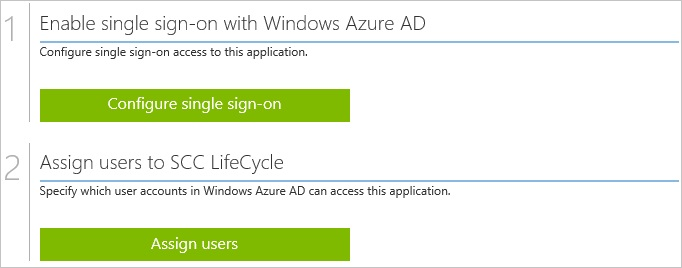
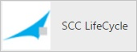
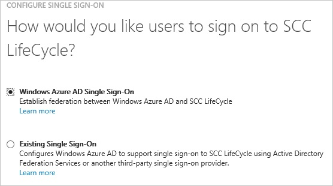
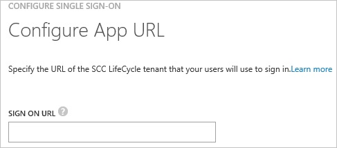
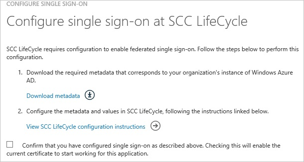
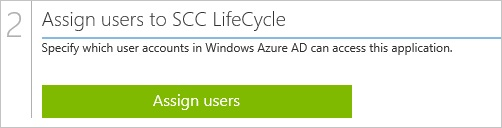

<properties 
    pageTitle="Tutorial: Azure Active Directory integration with SCC LifeCycle | Microsoft Azure" 
    description="Learn how to use SCC LifeCycle with Azure Active Directory to enable single sign-on, automated provisioning, and more!" 
    services="active-directory" 
    authors="jeevansd"  
    documentationCenter="na" 
    manager="femila"/>
<tags 
    ms.service="active-directory" 
    ms.devlang="na" 
    ms.topic="article" 
    ms.tgt_pltfrm="na" 
    ms.workload="identity" 
    ms.date="07/07/2016" 
    ms.author="jeedes" />

#Tutorial: Azure Active Directory integration with SCC LifeCycle
  
The objective of this tutorial is to show the integration of Azure and SCC LifeCycle.  
The scenario outlined in this tutorial assumes that you already have the following items:

-   A valid Azure subscription
-   A SCC LifeCycle single sign-on enabled subscription
  
After completing this tutorial, the Azure AD users you have assigned to SCC LifeCycle will be able to single sign into the application at your SCC LifeCycle company site (service provider initiated sign on), or using the [Introduction to the Access Panel](active-directory-saas-access-panel-introduction.md).
  
The scenario outlined in this tutorial consists of the following building blocks:

1.  Enabling the application integration for SCC LifeCycle
2.  Configuring single sign-on
3.  Configuring user provisioning
4.  Assigning users

##Enabling the application integration for SCC LifeCycle
  
The objective of this section is to outline how to enable the application integration for SCC LifeCycle.

###To enable the application integration for SCC LifeCycle, perform the following steps:

1.  In the Azure classic portal, on the left navigation pane, click **Active Directory**.

    

2.  From the **Directory** list, select the directory for which you want to enable directory integration.

3.  To open the applications view, in the directory view, click **Applications** in the top menu.

    

4.  Click **Add** at the bottom of the page.

    

5.  On the **What do you want to do** dialog, click **Add an application from the gallery**.

    

6.  In the **search box**, type **SCC LifeCycle**.

    

7.  In the results pane, select **SCC LifeCycle**, and then click **Complete** to add the application.

    
##Configuring single sign-on
  
The objective of this section is to outline how to enable users to authenticate to SCC LifeCycle with their account in Azure AD using federation based on the SAML protocol.

###To configure single sign-on, perform the following steps:

1.  In the Azure classic portal, on the **SCC LifeCycle** application integration page, click **Configure single sign-on** to open the **Configure Single Sign On ** dialog.

    

2.  On the **How would you like users to sign on to SCC LifeCycle** page, select **Microsoft Azure AD Single Sign-On**, and then click **Next**.

    

3.  On the **Configure App URL** page, in the **Sign On URL** textbox, type the URL used by your users to sign on to your SCC LifeCycle application using the following pattern "*https://bs1.scc.com/lc7/welcome/customer/PICTtest.aspx*", and then click **Next**.

    

4.  On the **Configure single sign-on at SCC LifeCycle** page, click **Download metadata**, and then save metadata file locally on your computer.

    

5.  Forward that Metadata file to SCC LifeCycle Support team.

    >[AZURE.NOTE]Single sign-on has to be enabled by the SCC LifeCycle support team.

6.  On the Azure classic portal, select the single sign-on configuration confirmation, and then click **Complete** to close the **Configure Single Sign On** dialog.

    
##Configuring user provisioning
  
In order to enable Azure AD users to log into SCC LifeCycle, they must be provisioned into SCC LifeCycle.
  
There is no action item for you to configure user provisioning to SCC LifeCycle.  
When an assigned user tries to log into SCC LifeCycle, an SCC LifeCycle account is automatically created if necessary.

>[AZURE.NOTE]You can use any other SCC LifeCycle user account creation tools or APIs provided by SCC LifeCycle to provision AAD user accounts.

##Assigning users
  
To test your configuration, you need to grant the Azure AD users you want to allow using your application access to it by assigning them.

###To assign users to SCC LifeCycle, perform the following steps:

1.  In the Azure classic portal, create a test account.

2.  On the **SCC LifeCycle **application integration page, click **Assign users**.

    

3.  Select your test user, click **Assign**, and then click **Yes** to confirm your assignment.

    
  
If you want to test your single sign-on settings, open the Access Panel. For more details about the Access Panel, see [Introduction to the Access Panel](active-directory-saas-access-panel-introduction.md).