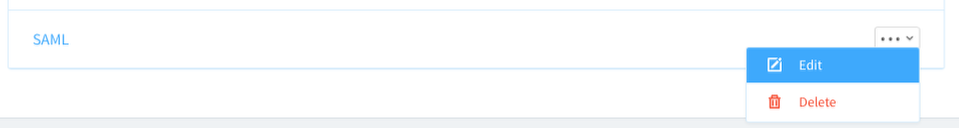

# Tutorial: Azure Active Directory integration with ScreenSteps
The objective of this tutorial is to show the integration of Azure and ScreenSteps.
The scenario outlined in this tutorial assumes that you already have the following items:

* A valid Azure subscription
* A ScreenSteps tenant

After completing this tutorial, the Azure AD users you have assigned to ScreenSteps will be able to sign into the application using single sign-on (SSO) at your ScreenSteps company site (service provider initiated sign on), or using the [Introduction to the Access Panel](active-directory-saas-access-panel-introduction.md).

The scenario outlined in this tutorial consists of the following building blocks:

1. Enabling the application integration for ScreenSteps
2. Configuring single sign-on (SSO) 
3. Configuring user provisioning
4. Assigning users

## Enable the application integration for ScreenSteps
The objective of this section is to outline how to enable the application integration for ScreenSteps.

**To enable the application integration for ScreenSteps, perform the following steps:**

1. In the Azure classic portal, on the left navigation pane, click **Active Directory**.

    
2. From the **Directory** list, select the directory for which you want to enable directory integration.

3. To open the applications view, in the directory view, click **Applications** in the top menu.

    
4. Click **Add** at the bottom of the page.

    
5. On the **What do you want to do** dialog, click **Add an application from the gallery**.

    
6. In the **search box**, type **ScreenSteps**.

    
7. In the results pane, select **ScreenSteps**, and then click **Complete** to add the application.

    
   
## Configure single sign-on
The objective of this section is to outline how to enable users to authenticate to ScreenSteps with their account in Azure AD using federation based on the SAML protocol.

**To configure single sign-on, perform the following steps:**

1. In the Azure classic portal, on the **ScreenSteps** application integration page, click **Configure single sign-on** to open the **Configure Single Sign On** dialog.

    
2. On the **How would you like users to sign on to ScreenSteps** page, select **Microsoft Azure AD Single Sign-On**, and then click **Next**.

    

3. In a different web browser window, log into your ScreenSteps company site as an administrator.

4. Click **Account Management**.

    

5. Click **Single Sign-on**.

    

6. Click **Create Single Sign-on Endpoint**.

    

7. In the **Create Single Sign-on Endpoint** section, perform the following steps:

    

    1. In the **Title** textbox, type a title.
    2. From the **Mode** list, select **SAML**.
    3. Click **Create**.

8. Edit the new endpoint.

    

9. In the **Edit Single Sign-on Endpoint** section, perform the following steps:

    

    1. Copy the **SAML Consumer URL** to the clipboard.

10. On the **Configure App URL** page of the Azure classic portal, in the **ScreenSteps Sign In URL** textbox, paste the **SAML Consumer URL**, and then click **Next**.

    

11. On the **Configure single sign-on at ScreenSteps** page, to download your certificate, click **Download certificate**, and then save the certificate file on your computer.

    

12. Return to the **Edit Single Sign-on Endpoint** section and perform the following steps:

    

    1. Click **Upload new SAML Certificate file**, and then upload the downloaded certificate.
    2. In the Azure classic portal, on the **Configure single sign-on at ScreenSteps** page, copy the **Remote Login URL** value, and then paste it into the **Remote Login URL** textbox.
    3. In the Azure classic portal, on the **Configure single sign-on at ScreenSteps** page, copy the **Remote Logout URL** value, and then paste it into the **Log out URL** textbox.
    4. Select a **Group** to assign users to when they are provisioned.
    5. Click **Update**.
    6. Return to the **Edit Single Sign-on Endpoint**.
    7. Click the **Make default for account** button to use this endpoint for all users who log into ScreenSteps. Alternatively you can click the **Add to Site** button to use this endpoint for specific sites in **ScreenSteps**.

12. On the Azure classic portal, select the single sign-on configuration confirmation, and then click **Complete** to close the **Configure Single Sign On** dialog.

    

## Configuring user provisioning

## Assign users
To test your configuration, you need to grant the Azure AD users you want to allow using your application access to it by assigning them.

**To assign users to ScreenSteps, perform the following steps:**

1. In the Azure classic portal, create a test account.
2. On the **ScreenSteps** application integration page, click **Assign users**.

    
3. Select your test user, click **Assign**, and then click **Yes** to confirm your assignment.

If you want to test your SSO settings, open the Access Panel. For more details about the Access Panel, see [Introduction to the Access Panel](active-directory-saas-access-panel-introduction.md).

