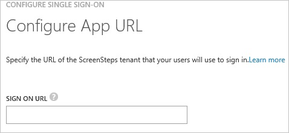
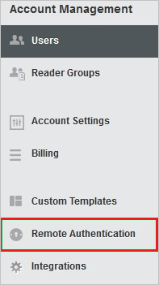
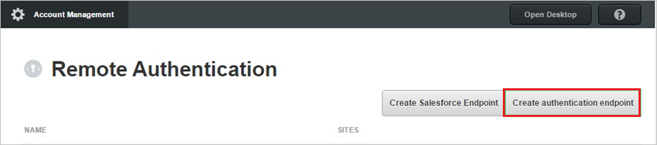
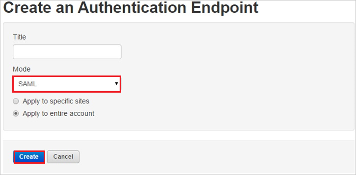
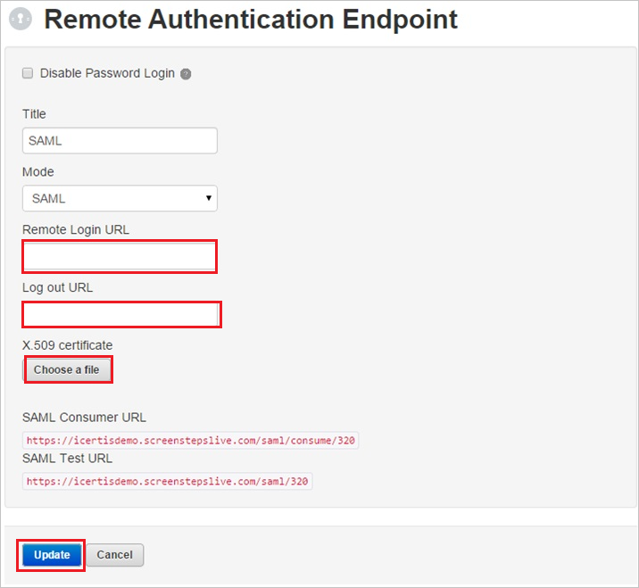
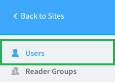
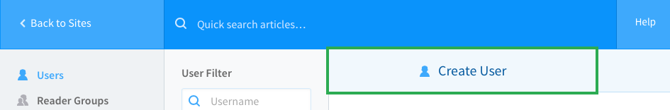
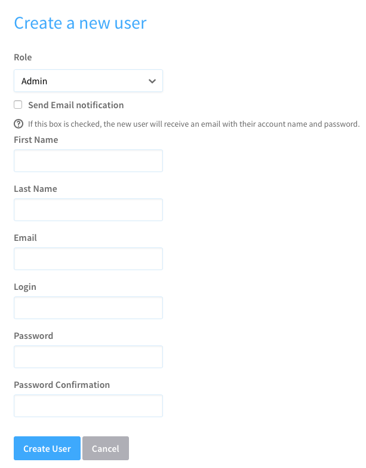
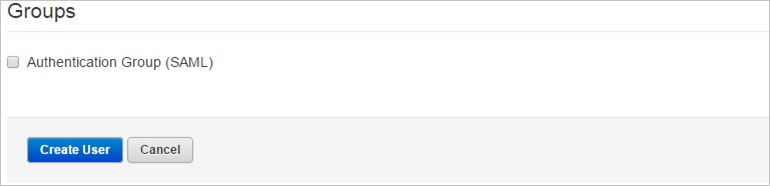

<properties 
    pageTitle="Tutorial: Azure Active Directory integration with ScreenSteps | Microsoft Azure" 
    description="Learn how to use ScreenSteps with Azure Active Directory to enable single sign-on, automated provisioning, and more!" 
    services="active-directory" 
    authors="jeevansd"  
    documentationCenter="na" 
    manager="femila"/>
<tags 
    ms.service="active-directory" 
    ms.devlang="na" 
    ms.topic="article" 
    ms.tgt_pltfrm="na" 
    ms.workload="identity" 
    ms.date="07/07/2016" 
    ms.author="jeedes" />

#Tutorial: Azure Active Directory integration with ScreenSteps
  
The objective of this tutorial is to show the integration of Azure and ScreenSteps.  
The scenario outlined in this tutorial assumes that you already have the following items:

-   A valid Azure subscription
-   A ScreenSteps tenant
  
After completing this tutorial, the Azure AD users you have assigned to ScreenSteps will be able to single sign into the application at your ScreenSteps company site (service provider initiated sign on), or using the [Introduction to the Access Panel](active-directory-saas-access-panel-introduction.md).
  
The scenario outlined in this tutorial consists of the following building blocks:

1.  Enabling the application integration for ScreenSteps
2.  Configuring single sign-on
3.  Configuring user provisioning
4.  Assigning users

##Enabling the application integration for ScreenSteps
  
The objective of this section is to outline how to enable the application integration for ScreenSteps.

###To enable the application integration for ScreenSteps, perform the following steps:

1.  In the Azure classic portal, on the left navigation pane, click **Active Directory**.

    

2.  From the **Directory** list, select the directory for which you want to enable directory integration.

3.  To open the applications view, in the directory view, click **Applications** in the top menu.

    

4.  Click **Add** at the bottom of the page.

    

5.  On the **What do you want to do** dialog, click **Add an application from the gallery**.

    

6.  In the **search box**, type **ScreenSteps**.

    

7.  In the results pane, select **ScreenSteps**, and then click **Complete** to add the application.

    
##Configuring single sign-on
  
The objective of this section is to outline how to enable users to authenticate to ScreenSteps with their account in Azure AD using federation based on the SAML protocol.

###To configure single sign-on, perform the following steps:

1.  In the Azure classic portal, on the **ScreenSteps** application integration page, click **Configure single sign-on** to open the **Configure Single Sign On ** dialog.

    

2.  On the **How would you like users to sign on to ScreenSteps** page, select **Microsoft Azure AD Single Sign-On**, and then click **Next**.

    

3.  On the **Configure App URL** page, in the **ScreenSteps Sign In URL** textbox, type your URL using the following pattern "*https://\<tenant-name\>.ScreenSteps.com*", and then click **Next**.

    

4.  On the **Configure single sign-on at ScreenSteps** page, to download your certificate, click **Download certificate**, and then save the certificate file on your computer.

    

5.  In a different web browser window, log into your ScreenSteps company site as an administrator.

6.  Click **Account Management**.

    

7.  Click **Remote Authentication**.

    

8.  Click **Create authentication endpoint**.

    

9.  In the **Create an Authentication Endpoint** section, perform the following steps:

    

    1.  In the **Title** textbox, type a title.
    2.  From the **Mode** list, select **SAML**.
    3.  Click **Create**.

10. In the **Remote Authentication Endpoint** section, perform the following steps:

    

    1.  In the Azure classic portal, on the **Configure single sign-on at ScreenSteps** page, copy the **Remote Login URL** value, and then paste it into the **Remote Login URL** textbox.
    2.  In the Azure classic portal, on the **Configure single sign-on at ScreenSteps** page, copy the **Remote Logout URL** value, and then paste it into the **Log out URL** textbox.
    3.  Click **Choose a file**, and then upload the downloaded certificate.
    4.  Click **Update**.

11. On the Azure classic portal, select the single sign-on configuration confirmation, and then click **Complete** to close the **Configure Single Sign On** dialog.

    
##Configuring user provisioning
  
In order to enable Azure AD users to log into **ScreenSteps**, they must be provisioned into **ScreenSteps**.  
In the case of **ScreenSteps**, provisioning is a manual task.

###To provision a user account to ScreenSteps, perform the following steps:

1.  Log in to your **ScreenSteps** tenant.

2.  Click **Account Management**.

    

3.  Click **Users**.

    

4.  Click **Create a user**.

    

5.  From the **User Role** list, select a role for your user.

6.  In the User Role section, Type the “**First name**, **Last name**, **Email**, **Login**, **Password** and **Password Confirmation**” of a valid AAD account you want to provision into the related textboxes.

    

7.  In the Groups section, select **Authentication Group (SAML)**, and then click **Create User**.

    

>[AZURE.NOTE]You can use any other ScreenSteps user account creation tools or APIs provided by ScreenSteps to provision AAD user accounts.

##Assigning users
  
To test your configuration, you need to grant the Azure AD users you want to allow using your application access to it by assigning them.

###To assign users to ScreenSteps, perform the following steps:

1.  In the Azure classic portal, create a test account.

2.  On the **ScreenSteps **application integration page, click **Assign users**.

    

3.  Select your test user, click **Assign**, and then click **Yes** to confirm your assignment.

    
  
If you want to test your single sign-on settings, open the Access Panel. For more details about the Access Panel, see [Introduction to the Access Panel](active-directory-saas-access-panel-introduction.md).