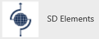
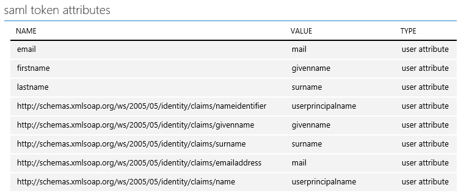
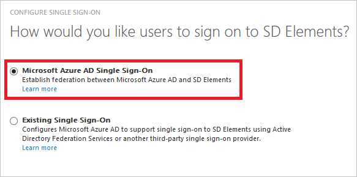
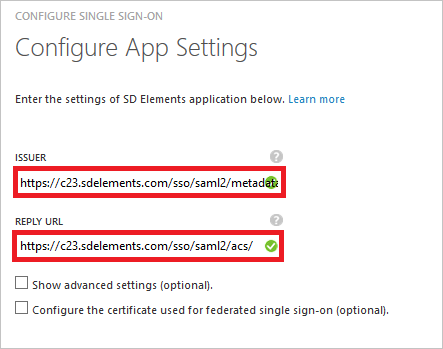
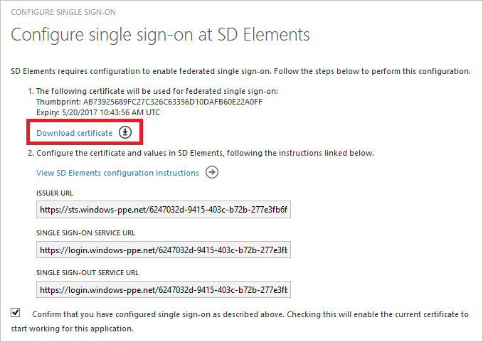
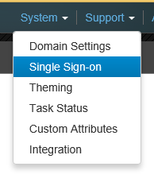
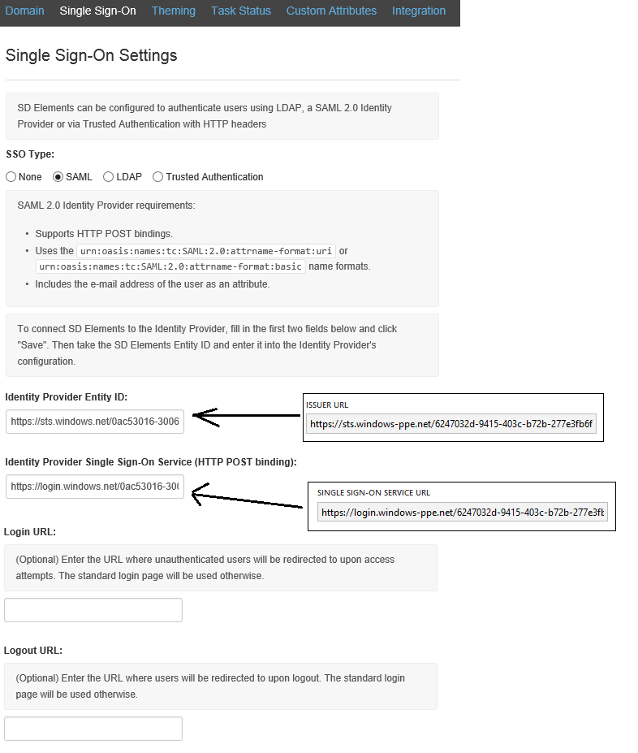
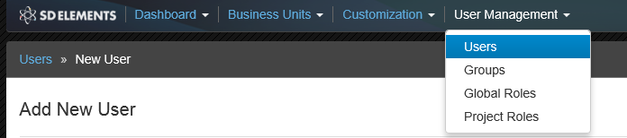
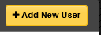
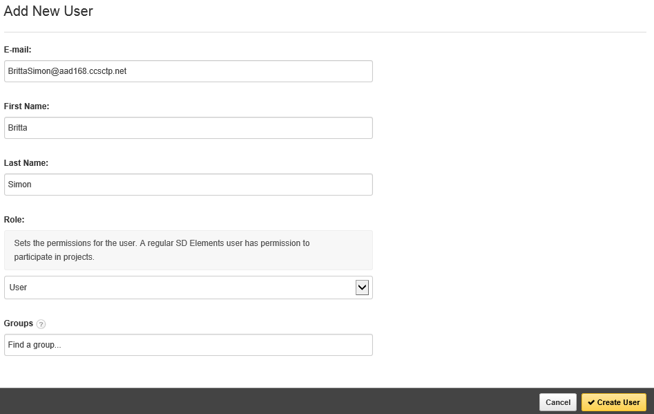

<properties
	pageTitle="Tutorial: Azure Active Directory integration with SD Elements | Microsoft Azure"
	description="Learn how to configure single sign-on between Azure Active Directory and SD Elements."
	services="active-directory"
	documentationCenter=""
	authors="jeevansd"
	manager="femila"
	editor=""/>

<tags
	ms.service="active-directory"
	ms.workload="identity"
	ms.tgt_pltfrm="na"
	ms.devlang="na"
	ms.topic="article"
	ms.date="06/06/2016"
	ms.author="jeedes"/>

# Tutorial: Azure Active Directory integration with SD Elements

The objective of this tutorial is to show you how to integrate SD Elements with Azure Active Directory (Azure AD).  
Integrating SD Elements with Azure AD provides you with the following benefits:

- You can control in Azure AD who has access to SD Elements
- You can enable your users to automatically get signed-on to SD Elements (Single Sign-On) with their Azure AD accounts
- You can manage your accounts in one central location - the Azure Active Directory 

If you want to know more details about SaaS app integration with Azure AD, see [What is application access and single sign-on with Azure Active Directory](active-directory-appssoaccess-whatis.md).

## Prerequisites

To configure Azure AD integration with SD Elements, you need the following items:

- An Azure AD subscription
- A SD Elements single-sign on enabled subscription

> [AZURE.NOTE] To test the steps in this tutorial, we do not recommend using a production environment.

To test the steps in this tutorial, you should follow these recommendations:

- You should not use your production environment, unless this is necessary.
- If you don't have an Azure AD trial environment, you can get a one-month trial [here](https://azure.microsoft.com/pricing/free-trial/).

## Scenario Description
The objective of this tutorial is to enable you to test Azure AD single sign-on in a test environment.  
The scenario outlined in this tutorial consists of two main building blocks:

1. Adding SD Elements from the gallery
2. Configuring and testing Azure AD single sign-on

## Adding SD Elements from the gallery
To configure the integration of SD Elements into Azure AD, you need to add SD Elements from the gallery to your list of managed SaaS apps.

**To add SD Elements from the gallery, perform the following steps:**

1. In the **Azure classic portal**, on the left navigation pane, click **Active Directory**. 

	![Active Directory][1]

2. From the **Directory** list, select the directory for which you want to enable directory integration.

3. To open the applications view, in the directory view, click **Applications** in the top menu.

	![Applications][2]

4. Click **Add** at the bottom of the page.

	![Applications][3]

5. On the **What do you want to do** dialog, click **Add an application from the gallery**.

	![Applications][4]

6. In the search box, type **SD Elements**.
 
	

7. In the results pane, select **SD Elements**, and then click **Complete** to add the application.

	

##  Configuring and testing Azure AD single sign-on
The objective of this section is to show you how to configure and test Azure AD single sign-on with SD Elements based on a test user called "Britta Simon".

For single sign-on to work, Azure AD needs to know what the counterpart user in SD Elements to an user in Azure AD is. In other words, a link relationship between an Azure AD user and the related user in SD Elements needs to be established.  
This link relationship is established by assigning the value of the **user name** in Azure AD as the value of the **Username** in SD Elements.

To configure and test Azure AD single sign-on with SD Elements, you need to complete the following building blocks:

1. **[Configuring Azure AD Single Sign-On](#configuring-azure-ad-single-single-sign-on)** - to enable your users to use this feature.
2. **[Creating an Azure AD test user](#creating-an-azure-ad-test-user)** - to test Azure AD single sign-on with Britta Simon.
4. **[Creating a SD Elements test user](#creating-a-sd-elements-test-user)** - to have a counterpart of Britta Simon in SD Elements that is linked to the Azure AD representation of her.
5. **[Assigning the Azure AD test user](#assigning-the-azure-ad-test-user)** - to enable Britta Simon to use Azure AD single sign-on.
5. **[Testing Single Sign-On](#testing-single-sign-on)** - to verify whether the configuration works.

### Configuring Azure AD Single Sign-On

The objective of this section is to enable Azure AD single sign-on in the Azure classic portal and to configure single sign-on in your SD Elements application.

Your SD Elements application expects the SAML assertions in a specific format, which requires you to add custom attribute mappings to your **saml token attributes** configuration. 
The following screenshot shows an example for this:

 

**To configure Azure AD single sign-on with SD Elements, perform the following steps:**

1. In the Azure classic portal, on the **SD Elements** application integration page, click **Configure single sign-on** to open the **Configure Single Sign-On**  dialog.

	![Configure Single Sign-On][6] 

2. On the **How would you like users to sign on to SD Elements** page, select **Azure AD Single Sign-On**, and then click **Next**.

	 

3. On the **Configure App Settings** dialog page, perform the following steps:.
    
	 

    a. In the **Issuer** textbox, type your tenant's issuer URL using the following pattern: *https://\<your tenant name\>.sdelements.com/sso/saml2/metadata*
   
    b. In the **Reply URL** textbox, type your tenant's reply URL using the following pattern: *https://\<your tenant name\>.sdelements.com/sso/saml2/acs/*       

    > [AZURE.NOTE] If you need the actual Issuer URL and Reply URL for your tenant, contact your [SD Elements support team](mailto:support@sdelements.com).
      
    c. Click **Next**.

4. On the **Configure single sign-on at SD Elements** page, perform the following steps:
   
	 

    a. Click **Download certificate**, and then save the file on your computer.

    b. Click **Next**.

1. To get single sign-on enabled, contact your [SD Elements support team](mailto:support@sdelements.com) and provide them with the downloaded certificate file.

5. In a different browser window, singn-on to your SD Elements tenant as an administrator.

6. In the menu on the top, click System, and then Single Sign-on. 

	 

7. On the **Single Sign-On Settings** dialog, perform the following steps:

	 

    a. As **SSO Type**, select **SAML**.

    b. In the Azure classic portal, on the **Configure single sign-on at SD Elements** dialog page, copy the **Issuer URL** value, and then paste it into the **Identity Provider Entity ID** textbox.

    c. In the Azure classic portal, on the **Configure single sign-on at SD Elements** dialog page, copy the **Single Sign-On Service URL** value, and then paste it into the **Identity Provider Single Sign-On Service** textbox.

    d. Click **Save**.

6. In the Azure classic portal, select the single sign-on configuration confirmation, and then click **Next**.

	![Azure AD Single Sign-On][10]

7. On the **Single sign-on confirmation** page, click **Complete**.  

	![Azure AD Single Sign-On][11]

1. In the menu on the top, click **Attributes** to open the **SAML Token Attributes** dialog. 
    
	![Configure Single Sign-On][21]

2. For each row in the following table, perform the following steps:

    | Attribute Name | Attribute Value |
    | ---            | ---             |
    | email          | user.mail       |
    | firstname      | user.givenname  |
    | lastname       | user.surname    |

    a. Click **add user attribute**. 
    
	![Configure Single Sign-On][23]

    b. In the **Attribute Name** textbox, type the **Attribute Name** and as **Attribute Value**, select the Attribute Value shown for that row.
    
	![Configure Single Sign-On][22]

    c. Click **add user attribute**. 
    
	![Configure Single Sign-On][23]

1. Click **Apply Changes**. 
    
	![Configure Single Sign-On][24]

### Creating an Azure AD test user
The objective of this section is to create a test user in the Azure classic portal called Britta Simon.  

![Create Azure AD User][20]

**To create a test user in Azure AD, perform the following steps:**

1. In the **Azure classic portal**, on the left navigation pane, click **Active Directory**.

	 

2. From the **Directory** list, select the directory for which you want to enable directory integration.

3. To display the list of users, in the menu on the top, click **Users**.

	 

4. To open the **Add User** dialog, in the toolbar on the bottom, click **Add User**.

	 

5. On the **Tell us about this user** dialog page, perform the following steps:

	 

    a. As Type Of User, select New user in your organization.

    b. In the User Name **textbox**, type **BrittaSimon**.

    c. Click **Next**.

6.  On the **User Profile** dialog page, perform the following steps:

	 

    a. In the **First Name** textbox, type **Britta**.  

    b. In the **Last Name** textbox, type, **Simon**.

    c. In the **Display Name** textbox, type **Britta Simon**.

    d. In the **Role** list, select **User**.

    e. Click **Next**.

7. On the **Get temporary password** dialog page, click **create**.

	 

8. On the **Get temporary password** dialog page, perform the following steps:

	 

    a. Write down the value of the **New Password**.

    b. Click **Complete**.   

### Creating a SD Elements test user

The objective of this section is to create a user called Britta Simon in SD Elements. 
In the case of SD Elements, creating SD Elements users is a manual task.

**To create Britta Simon in SD Elements, perform the following steps:**

1.	In a web browser window, sign-on to your SD Elements company site as an administrator.

2.	In the menu on the top, click User Management, and then Users.
 
	 

3.	Click Add New User.
 
     

4.	On the Add New User dialog, perform the following steps:

     

    a. In the **E-mail** textbox, type Britta's email address in Azure AD.

    b. In the **First Name** textbox, type **Britta**.

    c. In the **Last Name** textbox, type **Simon**.

    d. As **Role**, select **User**. 

    e. Click **Create User**.

### Assigning the Azure AD test user

The objective of this section is to enabling Britta Simon to use Azure single sign-on by granting her access to SD Elements.

![Assign User][200] 

**To assign Britta Simon to SD Elements, perform the following steps:**

1. On the Azure classic portal, to open the applications view, in the directory view, click **Applications** in the top menu.

	![Assign User][201] 

2. In the applications list, select **SD Elements**.

	 

1. In the menu on the top, click **Users**.

	![Assign User][203] 

1. In the **Users** list, select **Britta Simon**.

2. In the toolbar on the bottom, click **Assign**.

	![Assign User][205]

### Testing Single Sign-On

The objective of this section is to test your Azure AD single sign-on configuration using the Access Panel.  
When you click the SD Elements tile in the Access Panel, you should get automatically signed-on to your SD Elements application.

## Additional Resources

* [List of Tutorials on How to Integrate SaaS Apps with Azure Active Directory](active-directory-saas-tutorial-list.md)
* [What is application access and single sign-on with Azure Active Directory?](active-directory-appssoaccess-whatis.md)

<!--Image references-->

[1]: ./media/active-directory-saas-sd-elements-tutorial/tutorial_general_01.png
[2]: ./media/active-directory-saas-sd-elements-tutorial/tutorial_general_02.png
[3]: ./media/active-directory-saas-sd-elements-tutorial/tutorial_general_03.png
[4]: ./media/active-directory-saas-sd-elements-tutorial/tutorial_general_04.png

[6]: ./media/active-directory-saas-sd-elements-tutorial/tutorial_general_05.png
[10]: ./media/active-directory-saas-sd-elements-tutorial/tutorial_general_06.png
[11]: ./media/active-directory-saas-sd-elements-tutorial/tutorial_general_07.png
[20]: ./media/active-directory-saas-sd-elements-tutorial/tutorial_general_100.png

[21]: ./media/active-directory-saas-sd-elements-tutorial/tutorial_general_80.png
[22]: ./media/active-directory-saas-sd-elements-tutorial/tutorial_general_82.png
[23]: ./media/active-directory-saas-sd-elements-tutorial/tutorial_general_81.png
[24]: ./media/active-directory-saas-sd-elements-tutorial/tutorial_general_83.png

[200]: ./media/active-directory-saas-sd-elements-tutorial/tutorial_general_200.png
[201]: ./media/active-directory-saas-sd-elements-tutorial/tutorial_general_201.png
[203]: ./media/active-directory-saas-sd-elements-tutorial/tutorial_general_203.png
[204]: ./media/active-directory-saas-sd-elements-tutorial/tutorial_general_204.png
[205]: ./media/active-directory-saas-sd-elements-tutorial/tutorial_general_205.png
