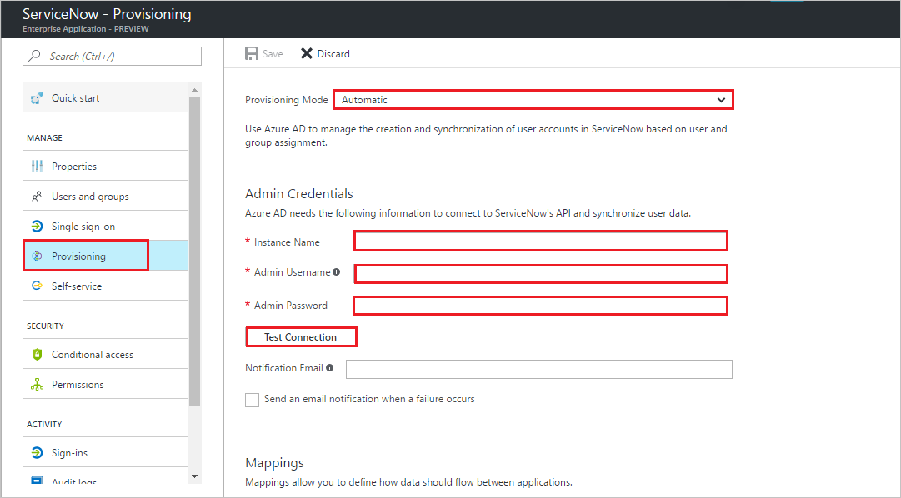

# Tutorial: Configuring ServiceNow for Automatic User Provisioning with Azure Active Directory

The objective of this tutorial is to show you the steps you need to perform in ServiceNow and Azure AD to automatically provision and de-provision user accounts from Azure AD to ServiceNow.

## Prerequisites

The scenario outlined in this tutorial assumes that you already have the following items:

*   An Azure Active directory tenant.
*   You must have a valid tenant for ServiceNow for Work or ServiceNow for Education. You may use a free trial account for either service.
*   A user account in ServiceNow with Team Admin permissions.

## Assigning users to ServiceNow

Azure Active Directory uses a concept called "assignments" to determine which users should receive access to selected apps. In the context of automatic user account provisioning, only the users and groups that have been "assigned" to an application in Azure AD is synchronized.

Before configuring and enabling the provisioning service, you need to decide what users and/or groups in Azure AD represent the users who need access to your ServiceNow app. Once decided, you can assign these users to your ServiceNow app by following the instructions here:
[Assign a user or group to an enterprise app](https://docs.microsoft.com/azure/active-directory/active-directory-coreapps-assign-user-azure-portal)

> [!IMPORTANT]
>*   It is recommended that a single Azure AD user is assigned to ServiceNow to test the provisioning configuration. Additional users and/or groups may be assigned later.
>*   When assigning a user to ServiceNow, you must select a valid user role. The "Default Access" role does not work for provisioning.

## Enable automated user provisioning

This section guides you through connecting your Azure AD to ServiceNow's user account provisioning API, and configuring the provisioning service to create, update, and disable assigned user accounts in ServiceNow based on user and group assignment in Azure AD.

> [!TIP]
>You may also choose to enabled SAML-based Single Sign-On for ServiceNow, following the instructions provided in [Azure portal](https://portal.azure.com). Single sign-on can be configured independently of automatic provisioning, though these two features compliment each other.

### Configure automatic user account provisioning

1. In the [Azure portal](https://portal.azure.com), browse to the **Azure Active Directory > Enterprise Apps > All applications** section.

2. If you have already configured ServiceNow for single sign-on, search for your instance of ServiceNow using the search field. Otherwise, select **Add** and search for **ServiceNow** in the application gallery. Select ServiceNow from the search results, and add it to your list of applications.

3. Select your instance of ServiceNow, then select the **Provisioning** tab.

4. Set the **Provisioning** Mode to **Automatic**. 

    

5. Under the Admin Credentials section, perform the following steps:
   
    a. In the **ServiceNow Instance Name** textbox, type the ServiceNow instance name.

    b. In the **ServiceNow Admin User Name** textbox, type the user name of an administrator.

    c. In the **ServiceNow Admin Password** textbox, the administrator's password.

6. In the Azure portal, click **Test Connection** to ensure Azure AD can connect to your ServiceNow app. If the connection fails, ensure your ServiceNow account has Team Admin permissions and try the **"Admin Credentials"** step again.

7. Enter the email address of a person or group who should receive provisioning error notifications in the **Notification Email** field, and check the checkbox.

8. Click **Save.**

9. Under the Mappings section, select **Synchronize Azure Active Directory Users to ServiceNow.**

10. In the **Attribute Mappings** section, review the user attributes that are synchronized from Azure AD to ServiceNow. The attributes selected as **Matching** properties are used to match the user accounts in ServiceNow for update operations. Select the Save button to commit any changes.

11. To enable the Azure AD provisioning service for ServiceNow, change the **Provisioning Status** to **On** in the Settings section

12. Click **Save.**

It starts the initial synchronization of any users and/or groups assigned to ServiceNow in the Users and Groups section. The initial sync takes longer to perform than subsequent syncs, which occur approximately every 20 minutes as long as the service is running. You can use the **Synchronization Details** section to monitor progress and follow links to provisioning activity reports, which describe all actions performed by the provisioning service on your ServiceNow app.

## Additional resources

* [Managing user account provisioning for Enterprise Apps](active-directory-saas-tutorial-list.md)
* [What is application access and single sign-on with Azure Active Directory?](active-directory-appssoaccess-whatis.md)
* [Configure Single Sign-on](active-directory-saas-servicenow-tutorial.md)

