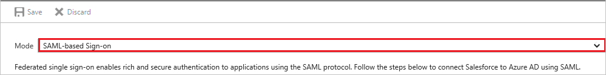
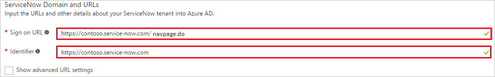
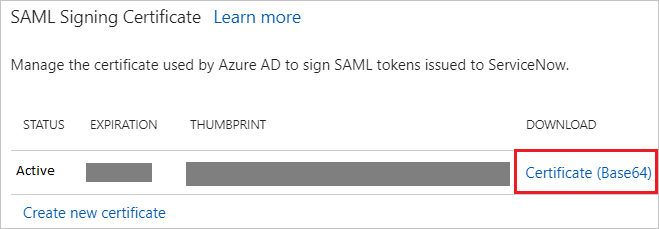
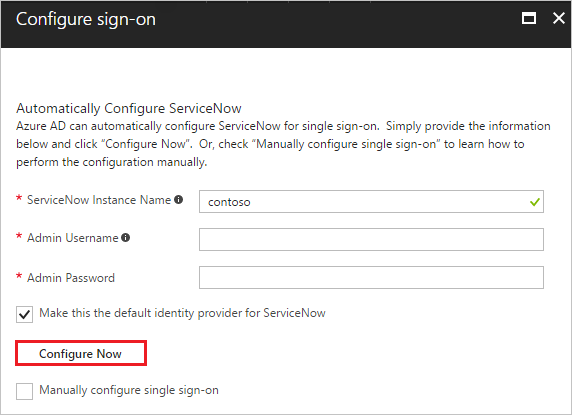
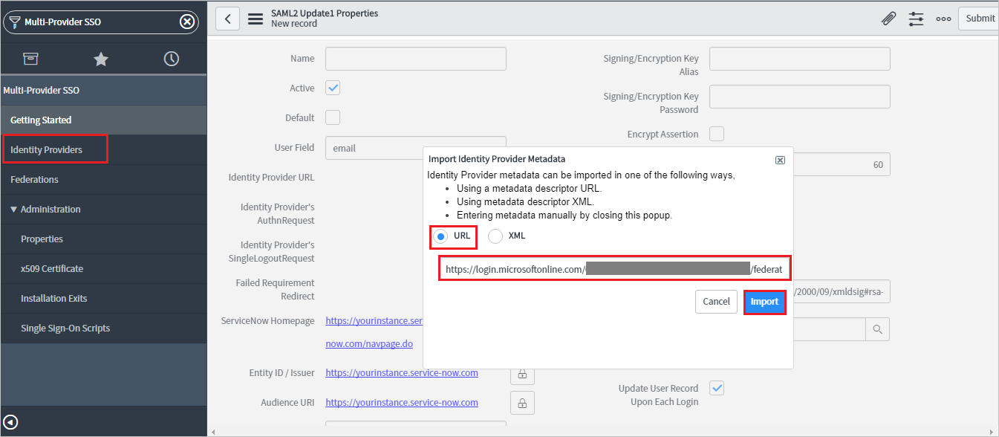
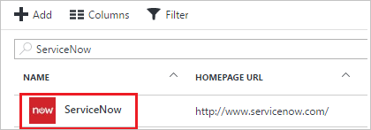

# Tutorial: Azure Active Directory integration with ServiceNow

In this tutorial, you learn how to integrate ServiceNow with Azure Active Directory (Azure AD).

Integrating ServiceNow with Azure AD provides you with the following benefits:

- You can control in Azure AD who has access to ServiceNow
- You can enable your users to automatically get signed-on to ServiceNow (Single Sign-On) with their Azure AD accounts
- You can manage your accounts in one central location - the Azure portal

If you want to know more details about SaaS app integration with Azure AD, see [what is application access and single sign-on with Azure Active Directory](active-directory-appssoaccess-whatis.md).

## Prerequisites

To configure Azure AD integration with ServiceNow, you need the following items:

* An Azure AD subscription
* For ServiceNow, an instance or tenant of ServiceNow, Calgary version or higher
* For ServiceNow Express, an instance of ServiceNow Express, Helsinki version or higher
* The ServiceNow tenant must have the [Multiple Provider Single Sign On Plugin](http://wiki.servicenow.com/index.php?title=Multiple_Provider_Single_Sign-On#gsc.tab=0) enabled. This can be done by [submitting a service request](https://hi.service-now.com). 

> [!NOTE]
> To test the steps in this tutorial, we do not recommend using a production environment.

To test the steps in this tutorial, you should follow these recommendations:

- Do not use your production environment, unless it is necessary.
- If you don't have an Azure AD trial environment, you can [get a one-month trial](https://azure.microsoft.com/pricing/free-trial/).

## Scenario description
In this tutorial, you test Azure AD single sign-on in a test environment. 
The scenario outlined in this tutorial consists of two main building blocks:

1. Adding ServiceNow from the gallery
2. Configuring and testing Azure AD single sign-on

## Adding ServiceNow from the gallery
To configure the integration of ServiceNow into Azure AD, you need to add ServiceNow from the gallery to your list of managed SaaS apps.

**To add ServiceNow from the gallery, perform the following steps:**

1. In the **[Azure portal](https://portal.azure.com)**, on the left navigation panel, click **Azure Active Directory** icon. 

	![The Azure Active Directory button][1]

2. Navigate to **Enterprise applications**. Then go to **All applications**.

	![The Enterprise applications blade][2]
	
3. Click **New Application** button on the top of the dialog.

	![The New application button][3]

4. In the search box, type **ServiceNow**, select **ServiceNow** from result panel then click **Add** button to add the application.

	

##  Configuring and testing Azure AD single sign-on
In this section, you configure and test Azure AD single sign-on with ServiceNow based on a test user called "Britta Simon."

For single sign-on to work, Azure AD needs to know what the counterpart user in ServiceNow is to a user in Azure AD. In other words, a link relationship between an Azure AD user and the related user in ServiceNow needs to be established.

This link relationship is established by assigning the value of the **user name** in Azure AD as the value of the **Username** in ServiceNow.

To configure and test Azure AD single sign-on with ServiceNow, you need to complete the following building blocks:

1. **[Configuring Azure AD Single Sign-On for ServiceNow](#configuring-azure-ad-single-sign-on-for-servicenow)** - to enable your users to use this feature.
2. **[Configuring Azure AD Single Sign-On for ServiceNow Express](#configuring-azure-ad-single-sign-on-for-servicenow-express)** - to enable your users to use this feature.
3. **[Creating an Azure AD test user](#creating-an-azure-ad-test-user)** - to test Azure AD single sign-on with Britta Simon.
4. **[Creating a ServiceNow test user](#creating-a-servicenow-test-user)** - to have a counterpart of Britta Simon in ServiceNow that is linked to the Azure AD representation of her.
5. **[Assigning the Azure AD test user](#assigning-the-azure-ad-test-user)** - to enable Britta Simon to use Azure AD single sign-on.
6. **[Testing Single Sign-On](#testing-single-sign-on)** - to verify whether the configuration works.

> [!NOTE]
> If you want to configure ServiceNow omit step 2. Likewise, if you want to configure ServiceNow Express omit step 1.
> 
> 

### Configuring Azure AD single sign-on for ServiceNow

In this section, you enable Azure AD single sign-on in the Azure portal and configure single sign-on in your ServiceNow application.

**To configure Azure AD single sign-on with ServiceNow, perform the following steps:**

1. In the Azure portal, on the **ServiceNow** application integration page, click **Single sign-on**.

	![Configure Single Sign-On][4]

2. On the **Single sign-on** dialog, select **Mode** as	**SAML-based Sign-on** to enable single sign-on.
 
	

3. On the **ServiceNow Domain and URLs** section, perform the following steps:

	

    a. In the **Sign-on URL** textbox, type the value using the following pattern: `https://<instance-name>.service-now.com/navpage.do`

	b. In the **Identifier** textbox, type a URL using the following pattern: `https://<instance-name>.service-now.com`

	> [!NOTE] 
	> These values are not real. You'll need to update these value from actual Sign-on URL and Identifier which is explained later in the tutorial.
 
4. On the **SAML Signing Certificate** section, click **Certificate(Base64)** and then save the certificate file on your computer.

	 

5. Click **Save** button.

	

6. To generate the **Metadata** url, perform the following steps:

    a. Click **App registrations**.
    
    
   
    b. Click **Endpoints** to open **Endpoints** dialog box.  
    
    

    c. Click the copy button to copy **FEDERATION METADATA DOCUMENT** url and paste it into notepad.
    
    
     
    d. Now go to **ServiceNow** properties and copy the **Application ID** using **Copy** button and paste it into notepad.
 
    

    e. Generate the **Metadata URL** using the following pattern: `<FEDERATION METADATA DOCUMENT url>?appid=<application id>`.
    Copy the generated value in notepad as this metadata URL will be used later in the tutorial.

7. One click configure service is provided for ServiceNow that is, to have Azure AD automatically configure ServiceNow for SAML-based authentication. To enable this service go to **ServiceNow Configuration** section, click **Configure ServiceNow** to open Configure sign-on window. 

	 

8. Enter your ServiceNow instance name, admin username, and admin password in the **Configure sign-on** form and click **Configure Now**. Note that the admin username provided must have the **security_admin** role assigned in ServiceNow for this to work. Otherwise, to manually configure ServiceNow to use Azure AD as a SAML identity provider, click **Manually configure single sign-on** and copy the **Sign-Out URL, SAML Entity ID, and SAML Single Sign-On Service URL** from the Quick Reference section.
   
    

9. Sign on to your ServiceNow application as an administrator.

10. Activate the *Integration - Multiple Provider Single Sign-On Installer* plugin by following the next steps:
   
    a. In the navigation pane on the left side, search **System Definition** section from the search bar and then click **Plugins**.
   
    
   
    b. Search for *Integration - Multiple Provider Single Sign-On Installer*.
   
    
   
    c. Select the plugin. Right click and select **Activate/Upgrade**.
   
    d. Click the **Activate** button.

11. In the navigation pane on the left side, search **Multi-Provider SSO** section from the search bar and then click **Properties**.  
   
    

12. On the **Multiple Provider SSO Properties** dialog, perform the following steps:
   
    
   
    a. As **Enable multiple provider SSO**, select **Yes**.
   
    b. As **Enable Auto Importing of users from all identity providers into the user table**, select **Yes**.

    c. As **Enable debug logging for the multiple provider SSO integration**, select **Yes**.
   
    d. In **The field on the user table that...** textbox, type **user_name**.
   
    e. Click **Save**.

13. In the navigation pane on the left side, search **Multi-Provider SSO** section from the search bar and then click **x509 Certificates**.
    
     

14. On the **X.509 Certificates** dialog, click **New**.
    
     

15. On the **X.509 Certificates** dialog, perform the following steps:
    
     
    
     a. In the **Name** textbox, type a name for your configuration (for example: **TestSAML2.0**).
    
     b. Select **Active**.
    
     c. As **Format**, select **PEM**.
    
     d. As **Type**, select **Trust Store Cert**.
    
     e. Open your Base64 encoded certificate downloaded from Azure in notepad, copy the content of it into your clipboard, and then paste it to the **PEM Certificate** textbox.
    
     f. Click **Submit**.

16. In the navigation pane on the left side, click **Identity Providers**.
    
     

17. On the **Identity Providers** dialog, click **New**
    
     

18. On the **Identity Providers** dialog, click **SAML2 Update1?**
    
     

19. On the SAML2 Update1 Properties dialog, perform the following steps:
    
     

    a. Select **URL** option in **Import Identity Provider Metadata** dialogue box.

    b. Enter the **Metadata URL** generated from Azure portal.

    c. Click **Import**.

20. It reads the IdP metadata URL and populates all the fields information.

     

    a. In the **Name** textbox, type a name for your configuration (for example, **SAML 2.0**).

    b. In the **User Field** textbox, type **email** or **user_name**, depending on which field is used to uniquely identify users in your ServiceNow deployment. 

    > [!NOTE] 
    > You can configure Azure AD to emit either the Azure AD user ID (user principal name) or the email address as the unique identifier in the SAML token by going to the **ServiceNow > Attributes > Single Sign-On** section of the Azure portal and mapping the desired field to the **nameidentifier** attribute. The value stored for the selected attribute in Azure AD (for example, user principal name) must match the value stored in ServiceNow for the entered field (for example, user_name)

    c. Copy **ServiceNow Homepage** value, paste it in the **Sign-on URL** textbox in **ServiceNow Domain and URLs** section on Azure portal.

    > [!NOTE] 
    > The ServiceNow instance homepage is a concatenation of your **ServieNow tenant URL** and **/navpage.do** (for example:`https://fabrikam.service-now.com/navpage.do`).

    d. Copy **Entity ID / Issuer** value, paste it in **Identifier** textbox in **ServiceNow Domain and URLs** section on Azure portal.

    e. Under **x509 Certificate**, lists the certificate you have created in the previous step.
    
> [!TIP]
> You can now read a concise version of these instructions inside the [Azure portal](https://portal.azure.com), while you are setting up the app!  After adding this app from the **Active Directory > Enterprise Applications** section, simply click **Single Sign-On** tab and access the embedded documentation through the **Configuration** section at the bottom. You can read more about the embedded documentation feature here: [Azure AD embedded documentation]( https://go.microsoft.com/fwlink/?linkid=845985)

### Configuring Azure AD Single Sign-On for ServiceNow Express

1. In the Azure portal, on the **ServiceNow** application integration page, click **Single sign-on**.

	![Configure Single Sign-On][4]

2. On the **Single sign-on** dialog, select **Mode** as	**SAML-based Sign-on** to enable single sign-on.
 
	

3. On the **ServiceNow Domain and URLs** section, perform the following steps:

	

    a. In the **Sign-on URL** textbox, type the value using the following pattern: `https://<instance-name>.service-now.com/navpage.do`

	b. In the **Identifier** textbox, type a URL using the following pattern: `https://<instance-name>.service-now.com`

	> [!NOTE] 
	> These values are not real. Update these values with the actual Sign-on URL and Identifier. Contact [ServiceNow Client support team](https://www.servicenow.com/support/contact-support.html) to get these values. 
 

4. On the **SAML Signing Certificate** section, click **Certificate(Base64)** and then save the certificate file on your computer.

	 

5. Click **Save** button.

	

6. One click configure service is provided for ServiceNow that is, to have Azure AD automatically configure ServiceNow for SAML-based authentication. To enable this service go to **ServiceNow Configuration** section, click **Configure ServiceNow** to open Configure sign-on window. 

	 

7. Enter your ServiceNow instance name, admin username, and admin password in the **Configure sign-on** form and click **Configure Now**. Note that the admin username provided must have the **security_admin** role assigned in ServiceNow for this to work. Otherwise, to manually configure ServiceNow to use Azure AD as a SAML identity provider, click **Manually configure single sign-on** and copy the **Sign-Out URL, SAML Entity ID, and SAML Single Sign-On Service URL** from the Quick Reference section.
   
    

8. Sign on to your ServiceNow Express application as an administrator.

9. In the navigation pane on the left side, click **Single Sign-On**.  
   
    

10. On the **Single Sign-On** dialog, click the configuration icon on the upper right and set the following properties:
   
    
   
    a. Toggle **Enable multiple provider SSO** to the right.
   
    b. Toggle **Enable debug logging for the multiple provider SSO integration** to the right.
   
    c. In **The field on the user table that...** textbox, type **user_name**.

11. On the **Single Sign-On** dialog, click **Add New Certificate**.
   
    

12. On the **X.509 Certificates** dialog, perform the following steps:
    
    
    
    a. In the **Name** textbox, type a name for your configuration (for example: **TestSAML2.0**).
    
    b. Select **Active**.
    
    c. As **Format**, select **PEM**.
    
    d. As **Type**, select **Trust Store Cert**.
    
    e. Open your Base64 encoded certificate downloaded from Azure portal in notepad, copy the content of it into your clipboard, and then paste it to the **PEM Certificate** textbox.
    
    f. Click **Update**.

13. On the **Single Sign-On** dialog, click **Add New IdP**.
    
    

14. On the **Add New Identity Provider** dialog, under **Configure Identity Provider**, perform the following steps:
    
    

    a. In the **Name** textbox, type a name for your configuration (for example: **SAML 2.0**).

    b. In the Azure AD  portal, copy the **Identity Provider ID** value, and then paste it into the **Identity Provider URL** textbox.

    c. In the Azure AD  portal, copy the **Authentication Request URL** value, and then paste it into the **Identity Provider's AuthnRequest** textbox.

    d. In the Azure AD portal, copy the **Single Sign-Out Service URL** value, and then paste it into the **Identity Provider's SingleLogoutRequest** textbox.

    e. As **Identity Provider Certificate**, select the certificate you have created in the previous step.

15. Click **Advanced Settings**, and under **Additional Identity Provider Properties**, perform the following steps:
   
    
   
    a. In the **Protocol Binding for the IDP's SingleLogoutRequest** textbox, type **urn:oasis:names:tc:SAML:2.0:bindings:HTTP-Redirect**.
   
    b. In the **NameID Policy** textbox, type **urn:oasis:names:tc:SAML:1.1:nameid-format:unspecified**.    
   
    c. In the **AuthnContextClassRef Method**, type `http://schemas.microsoft.com/ws/2008/06/identity/authenticationmethod/password`.
   
    d. Deselect **Create an AuthnContextClass**.

16. Under **Additional Service Provider Properties**, perform the following steps:
   
    
   
    a. In the **ServiceNow Homepage** textbox, type the URL of your ServiceNow instance homepage.
   
    > [!NOTE]
    > The ServiceNow instance homepage is a concatenation of your **ServieNow tenant URL** and **/navpage.do** (for example: `https://fabrikam.service-now.com/navpage.do`).
   
    b. In the **Entity ID / Issuer** textbox, type the URL of your ServiceNow tenant.
   
    c. In the **Audience URI** textbox, type the URL of your ServiceNow tenant. 
   
    d. In **Clock Skew** textbox, type **60**.
   
    e. In the **User Field** textbox, type **email** or **user_name**, depending on which field is used to uniquely identify users in your ServiceNow deployment.
   
    > [!NOTE]
    > You can configure Azure AD to emit either the Azure AD user ID (user principal name) or the email address as the unique identifier in the SAML token by going to the **ServiceNow > Attributes > Single Sign-On** section of the Azure portal and mapping the desired field to the **nameidentifier** attribute. The value stored for the selected attribute in Azure AD (for example, user principal name) must match the value stored in ServiceNow for the entered field (for example, user_name)

    f. Click **Save**. 

> [!TIP]
> You can now read a concise version of these instructions inside the [Azure portal](https://portal.azure.com), while you are setting up the app!  After adding this app from the **Active Directory > Enterprise Applications** section, simply click **Single Sign-On** tab and access the embedded documentation through the **Configuration** section at the bottom. You can read more about the embedded documentation feature here: [Azure AD embedded documentation]( https://go.microsoft.com/fwlink/?linkid=845985)

### Creating an Azure AD test user
The objective of this section is to create a test user in the Azure portal called Britta Simon.

![Create Azure AD User][100]

**To create a test user in Azure AD, perform the following steps:**

1. In the **Azure portal**, on the left navigation pane, click **Azure Active Directory** icon.

	 

2. Go to **Users and groups** and click **All users** to display the list of users.
	
	 

3. At the top of the dialog, click **Add** to open the **User** dialog.
 
	 

4. On the **User** dialog page, perform the following steps:
 
	 

    a. In the **Name** textbox, type **BrittaSimon**.

    b. In the **User name** textbox, type the **email address** of BrittaSimon.

	c. Select **Show Password** and write down the value of the **Password**.

    d. Click **Create**.
 
### Creating a ServiceNow test user

In this section, you create a user called Britta Simon in ServiceNow. If you don't know how to add a user in your ServiceNow or ServiceNow Express account, contact [ServiceNow Client support team](https://www.servicenow.com/support/contact-support.html)

### Assigning the Azure AD test user

In this section, you enable Britta Simon to use Azure single sign-on by granting her access to ServiceNow.

![Assign User][200] 

**To assign Britta Simon to ServiceNow, perform the following steps:**

1. In the Azure portal, open the applications view, and then navigate to the directory view and go to **Enterprise applications** then click **All applications**.

	![Assign User][201] 

2. In the applications list, select **ServiceNow**.

	 

3. In the menu on the left, click **Users and groups**.

	![Assign User][202] 

4. Click **Add** button. Then select **Users and groups** on **Add Assignment** dialog.

	![Assign User][203]

5. On **Users and groups** dialog, select **Britta Simon** in the Users list.

6. Click **Select** button on **Users and groups** dialog.

7. Click **Assign** button on **Add Assignment** dialog.
	
### Testing single sign-on

The objective of this section is to test your Azure AD single sign-on configuration using the Access Panel.

When you click the ServiceNow tile in the Access Panel, you should get automatically signed-on to your ServiceNow application.

## Additional resources

* [List of Tutorials on How to Integrate SaaS Apps with Azure Active Directory](active-directory-saas-tutorial-list.md)
* [What is application access and single sign-on with Azure Active Directory?](active-directory-appssoaccess-whatis.md)
* [Configure User Provisioning](active-directory-saas-servicenow-provisioning-tutorial.md)

<!--Image references-->

[1]: ./media/active-directory-saas-servicenow-tutorial/tutorial_general_01.png
[2]: ./media/active-directory-saas-servicenow-tutorial/tutorial_general_02.png
[3]: ./media/active-directory-saas-servicenow-tutorial/tutorial_general_03.png
[4]: ./media/active-directory-saas-servicenow-tutorial/tutorial_general_04.png

[100]: ./media/active-directory-saas-servicenow-tutorial/tutorial_general_100.png

[200]: ./media/active-directory-saas-servicenow-tutorial/tutorial_general_200.png
[201]: ./media/active-directory-saas-servicenow-tutorial/tutorial_general_201.png
[202]: ./media/active-directory-saas-servicenow-tutorial/tutorial_general_202.png
[203]: ./media/active-directory-saas-servicenow-tutorial/tutorial_general_203.png

