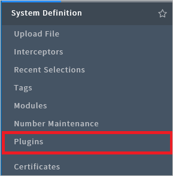
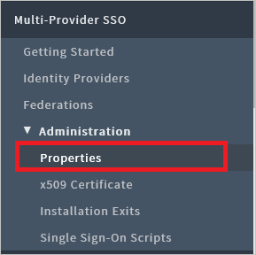
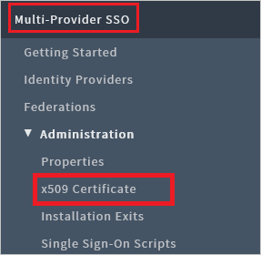
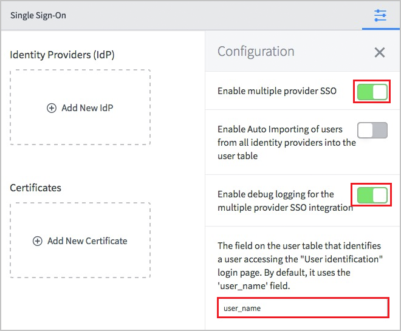
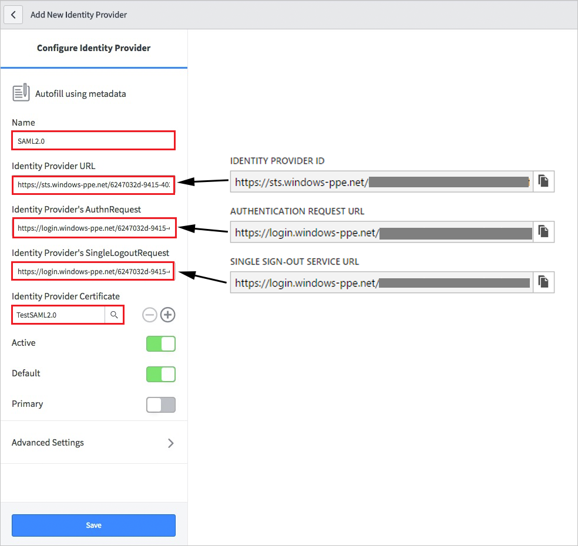
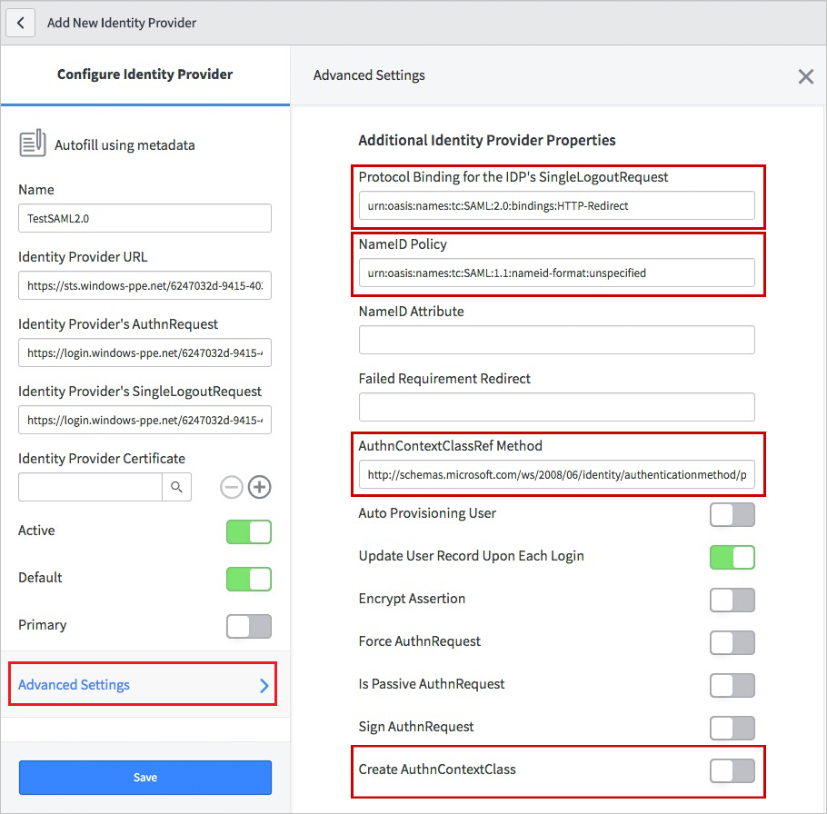
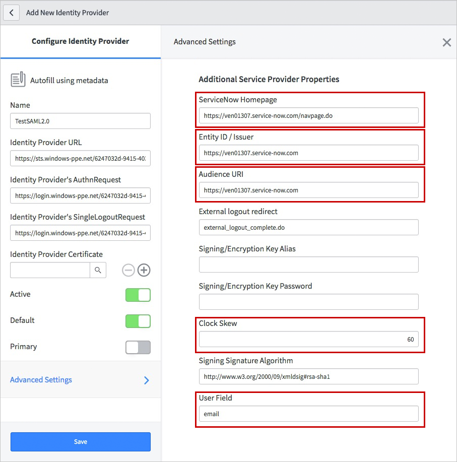

# Tutorial: Azure Active Directory integration with ServiceNow
In this tutorial, you learn how to integrate ServiceNow and ServiceNow Express with Azure Active Directory (Azure AD).

Integrating ServiceNow and ServiceNow Express with Azure AD provides you with the following benefits:

* You can control in Azure AD who has access to ServiceNow and ServiceNow Express
* You can enable your users to automatically get signed-on to ServiceNow and ServiceNow Express (Single Sign-On) with their Azure AD accounts
* You can manage your accounts in one central location - the Azure classic portal

If you want to know more details about SaaS app integration with Azure AD, see [What is application access and single sign-on with Azure Active Directory](active-directory-appssoaccess-whatis.md).

## Prerequisites
To configure Azure AD integration with ServiceNow and ServiceNow Express, you need the following items:

* An Azure AD subscription
* For ServiceNow, an instance or tenant of ServiceNow, Calgary version or higher
* For ServiceNow Express, an instance of ServiceNow Express, Helsinki version or higher
* The ServiceNow tenant must have the [Multiple Provider Single Sign On Plugin](http://wiki.servicenow.com/index.php?title=Multiple_Provider_Single_Sign-On#gsc.tab=0) enabled. This can be done by [submitting a service request](https://hi.service-now.com). 

> [!NOTE]
> To test the steps in this tutorial, we do not recommend using a production environment.
> 
> 

To test the steps in this tutorial, you should follow these recommendations:

* You should not use your production environment, unless this is necessary.
* If you don't have an Azure AD trial environment, you can get a one-month trial [here](https://azure.microsoft.com/pricing/free-trial/).

## Scenario description
In this tutorial, you test Azure AD single sign-on in a test environment. 
The scenario outlined in this tutorial consists of two main building blocks:

1. Adding ServiceNow from the gallery
2. Configuring and testing Azure AD single sign-on for ServiceNow or ServiceNow Express

## Adding ServiceNow from the gallery
To configure the integration of ServiceNow or ServiceNow Express into Azure AD, you need to add ServiceNow from the gallery to your list of managed SaaS apps. 

**To add ServiceNow from the gallery, perform the following steps:**

1. In the **Azure classic portal**, on the left navigation pane, click **Active Directory**. 
   
    ![Active Directory][1]
2. From the **Directory** list, select the directory for which you want to enable directory integration.
3. To open the applications view, in the directory view, click **Applications** in the top menu.
   
    ![Applications][2]
4. Click **Add** at the bottom of the page.
   
    ![Applications][3]
5. On the **What do you want to do** dialog, click **Add an application from the gallery**.
   
    ![Applications][4]
6. In the search box, type **ServiceNow**.
   
    
7. In the results pane, select **ServiceNow**, and then click **Complete** to add the application.
   
    

## Configuring and testing Azure AD single sign-on
In this section, you configure and test Azure AD single sign-on with ServiceNow or ServiceNow Express based on a test user called "Britta Simon".

For single sign-on to work, Azure AD needs to know what the counterpart user in ServiceNow is to a user in Azure AD. In other words, a link relationship between an Azure AD user and the related user in ServiceNow needs to be established.
This link relationship is established by assigning the value of the **user name** in Azure AD as the value of the **Username** in ServiceNow. To configure and test Azure AD single sign-on with ServiceNow, you need to complete the following building blocks:

1. **[Configuring Azure AD Single Sign-On for ServiceNow](#configuring-azure-ad-single-sign-on-for-servicenow)** - to enable your users to use this feature.
2. **[Configuring Azure AD Single Sign-On for ServiceNow Express](#configuring-azure-ad-single-sign-on-for-servicenow-express)** - to enable your users to use this feature.
3. **[Creating an Azure AD test user](#creating-an-azure-ad-test-user)** - to test Azure AD single sign-on with Britta Simon.
4. **[Creating a ServiceNow test user](#creating-a-servicenow-test-user)** - to have a counterpart of Britta Simon in ServiceNow that is linked to the Azure AD representation of her.
5. **[Assigning the Azure AD test user](#assigning-the-azure-ad-test-user)** - to enable Britta Simon to use Azure AD single sign-on.
6. **[Testing Single Sign-On](#testing-single-sign-on)** - to verify whether the configuration works.

> [!NOTE]
> If you want to configure ServiceNow omit step 2. Likewise, if you want to configure ServiceNow Express omit step 1.
> 
> 

### Configuring Azure AD Single Sign-On for ServiceNow
1. In the Azure AD classic portal, on the **ServiceNow** application integration page, click **Configure single sign-on** to open the **Configure Single Sign On** dialog.
   
    

2. On the **How would you like users to sign on to ServiceNow** page, select **Microsoft Azure AD Single Sign-On**, and then click **Next**.
   
    

3. On the **Configure App Settings** page, perform the following steps:
   
    
   
    a. in the **ServiceNow Sign On URL** textbox, type your URL used by your users to sign-on to your ServiceNow application following the pattern: `https://<instance-name>.service-now.com`.
   
    b. In the **Identifier** textbox,type your URL used by your users to sign-on to your ServiceNow application following the pattern: `https://<instance-name>.service-now.com`.
   
    c. Click **Next**

4. To have Azure AD automatically configure ServiceNow for SAML-based authentication, enter your ServiceNow instance name, admin username, and admin password in the **Auto configure single sign-on** form and click *Configure*. Note that the admin username provided must have the **security_admin** role assigned in ServiceNow for this to work. Otherwise, to manually configure ServiceNow to use Azure AD as a SAML identity provider, click **Manually configure the application for single sign-on**, then click **Next** and complete the following steps.
   
    

5. On the **Configure single sign-on at ServiceNow** page, click **Download certificate**, save the certificate file locally on your computer.
   
    

6. Sign-on to your ServiceNow application as an administrator.

7. Activate the *Integration - Multiple Provider Single Sign-On Installer* plugin by following the next steps:
   
    a. In the navigation pane on the left side, go to **System Definition** section and then click **Plugins**.
   
    
   
    b. Search for *Integration - Multiple Provider Single Sign-On Installer*.
   
    
   
    c. Select the plugin. Rigth click and select **Activate/Upgrade**.
   
    d. Click the **Activate** button.

8. In the navigation pane on the left side, click **Properties**.  
   
    

9. On the **Multiple Provider SSO Properties** dialog, perform the following steps:
   
    
   
    a. As **Enable multiple provider SSO**, select **Yes**.
   
    b. As **Enable debug logging got the multiple provider SSO integration**, select **Yes**.
   
    c. In **The field on the user table that...** textbox, type **user_name**.
   
    d. Click **Save**.

10. In the navigation pane on the left side, click **x509 Certificates**.
    
     

11. On the **X.509 Certificates** dialog, click **New**.
    
     

12. On the **X.509 Certificates** dialog, perform the following steps:
    
     
    
     a. Click **New**.
    
     b. In the **Name** textbox, type a name for your configuration (e.g.: **TestSAML2.0**).
    
     c. Select **Active**.
    
     d. As **Format**, select **PEM**.
    
     e. As **Type**, select **Trust Store Cert**.
    
     f. Open your Base64 encoded certificate in notepad, copy the content of it into your clipboard, and then paste it to the **PEM Certificate** textbox.
    
     g. Click **Update**.

13. In the navigation pane on the left side, click **Identity Providers**.
    
     

14. On the **Identity Providers** dialog, click **New**:
    
     

15. On the **Identity Providers** dialog, click **SAML2 Update1?**:
    
     

16. On the SAML2 Update1 Properties dialog, perform the following steps:
    
     

    a. in the **Name** textbox, type a name for your configuration (e.g.: **SAML 2.0**).

    b. In the **User Field** textbox, type **email** or **user_name**, depending on which field is used to uniquely identify users in your ServiceNow deployment. 

    > [!NOTE] 
    > You can configue Azure AD to emit either the Azure AD user ID (user principal name) or the email address as the unique identifier in the SAML token by going to the **ServiceNow > Attributes > Single Sign-On** section of the Azure classic portal and mapping the desired field to the **nameidentifier** attribute. The value stored for the selected attribute in Azure AD (e.g. user principal name) must match the value stored in ServiceNow for the entered field (e.g. user_name)

    c. In the Azure AD classic portal, copy the **Identity Provider ID** value, and then paste it into the **Identity Provider URL** textbox.

    d. In the Azure AD classic portal, copy the **Authentication Request URL** value, and then paste it into the **Identity Provider's AuthnRequest** textbox.

    e. In the Azure AD classic portal, copy the **Single Sign-Out Service URL** value, and then paste it into the **Identity Provider's SingleLogoutRequest** textbox.

    f. In the **ServiceNow Homepage** textbox, type the URL of your ServiceNow instance homepage.

    > [!NOTE] 
    > The ServiceNow instance homepage is a concatenation of your **ServieNow tenant URL** and **/navpage.do** (e.g.:`https://fabrikam.service-now.com/navpage.do`).

    g. In the **Entity ID / Issuer** textbox, type the URL of your ServiceNow tenant.

    h. In the **Audience URL** textbox, type the URL of your ServiceNow tenant. 

    i. In the **Protocol Binding for the IDP's SingleLogoutRequest** textbox, type **urn:oasis:names:tc:SAML:2.0:bindings:HTTP-Redirect**.

    j. In the NameID Policy textbox, type **urn:oasis:names:tc:SAML:1.1:nameid-format:unspecified**.

    k. Deselect **Create an AuthnContextClass**.

    l. In the **AuthnContextClassRef Method**, type `http://schemas.microsoft.com/ws/2008/06/identity/authenticationmethod/password`. This is only needed if you are cloud only organization. If you are using on premise ADFS or MFA for authentication then you should not configure this value. 

    m. In **Clock Skew** textbox, type **60**.

    n. As **Single Sign On Script**, select **MultiSSO_SAML2_Update1**.

    o. As **x509 Certificate**, select the certificate you have created in the previous step.

    p. Click **Submit**. 

1. On the Azure AD classic portal, select the single sign-on configuration confirmation, and then click **Next**. 
   
    

2. On the **Single sign-on confirmation** page, click **Complete**.
   
    

### Configuring Azure AD Single Sign-On for ServiceNow Express
1. In the Azure AD classic portal, on the **ServiceNow** application integration page, click **Configure single sign-on** to open the **Configure Single Sign On** dialog.
   
    

2. On the **How would you like users to sign on to ServiceNow** page, select **Microsoft Azure AD Single Sign-On**, and then click **Next**.
   
    

3. On the **Configure App Settings** page, perform the following steps:
   
    
   
    a. in the **ServiceNow Sign On URL** textbox, type your URL used by your users to sign-on to your ServiceNow application following the pattern: `https://<instance-name>.service-now.com`.
   
    b. In the **Issuer URL** textbox,type your URL used by your users to sign-on to your ServiceNow application following the pattern `https://<instance-name>.service-now.com`.
   
    c. Click **Next**

4. Click **Manually configure the application for single sign-on**, then click **Next** and complete the following steps.
   
    

5. On the **Configure single sign-on at ServiceNow** page, click **Download certificate**, save the certificate file locally on your computer, and then click **Next**.
   
    

6. Sign-on to your ServiceNow Express application as an administrator.

7. In the navigation pane on the left side, click **Single Sign-On**.  
   
    

8. On the **Single Sign-On** dialog, click the configuration icon on the upper right and set the following properties:
   
    
   
    a. Toggle **Enable multiple provider SSO** to the right.
   
    b. Toggle **Enable debug logging for the multiple provider SSO integration** to the right.
   
    c. In **The field on the user table that...** textbox, type **user_name**.
9. On the **Single Sign-On** dialog, click **Add New Certificate**.
   
    
10. On the **X.509 Certificates** dialog, perform the following steps:
    
    
    
    a. In the **Name** textbox, type a name for your configuration (e.g.: **TestSAML2.0**).
    
    b. Select **Active**.
    
    c. As **Format**, select **PEM**.
    
    d. As **Type**, select **Trust Store Cert**.
    
    e. Create a Base64 encoded file from your downloaded certificate.
    
    > [!NOTE]
    > For more details, see [How to convert a binary certificate into a text file](http://youtu.be/PlgrzUZ-Y1o).
    > 
    > 
    
    f. Open your Base64 encoded certificate in notepad, copy the content of it into your clipboard, and then paste it to the **PEM Certificate** textbox.
    
    g. Click **Update**.
11. On the **Single Sign-On** dialog, click **Add New IdP**.
    
    
12. On the **Add New Identity Provider** dialog, under **Configure Identity Provider**, perform the following steps:
    
    

    a. In the **Name** textbox, type a name for your configuration (e.g.: **SAML 2.0**).

    b. In the Azure AD classic portal, copy the **Identity Provider ID** value, and then paste it into the **Identity Provider URL** textbox.

    c. In the Azure AD classic portal, copy the **Authentication Request URL** value, and then paste it into the **Identity Provider's AuthnRequest** textbox.

    d. In the Azure AD classic portal, copy the **Single Sign-Out Service URL** value, and then paste it into the **Identity Provider's SingleLogoutRequest** textbox.

    e. As **Identity Provider Certificate**, select the certificate you have created in the previous step.

1. Click **Advanced Settings**, and under **Additional Identity Provider Properties**, perform the following steps:
   
    
   
    a. In the **Protocol Binding for the IDP's SingleLogoutRequest** textbox, type **urn:oasis:names:tc:SAML:2.0:bindings:HTTP-Redirect**.
   
    b. In the **NameID Policy** textbox, type **urn:oasis:names:tc:SAML:1.1:nameid-format:unspecified**.    
   
    c. In the **AuthnContextClassRef Method**, type **http://schemas.microsoft.com/ws/2008/06/identity/authenticationmethod/password**.
   
    d. Deselect **Create an AuthnContextClass**.

2. Under **Additional Service Provider Properties**, perform the following steps:
   
    
   
    a. In the **ServiceNow Homepage** textbox, type the URL of your ServiceNow instance homepage.
   
    > [!NOTE]
    > The ServiceNow instance homepage is a concatenation of your **ServieNow tenant URL** and **/navpage.do** (e.g.: `https://fabrikam.service-now.com/navpage.do`).
    > 
    > 
   
    b. In the **Entity ID / Issuer** textbox, type the URL of your ServiceNow tenant.
   
    c. In the **Audience URI** textbox, type the URL of your ServiceNow tenant. 
   
    d. In **Clock Skew** textbox, type **60**.
   
    e. In the **User Field** textbox, type **email** or **user_name**, depending on which field is used to uniquely identify users in your ServiceNow deployment.
   
    > [!NOTE]
    > You can configue Azure AD to emit either the Azure AD user ID (user principal name) or the email address as the unique identifier in the SAML token by going to the **ServiceNow > Attributes > Single Sign-On** section of the Azure classic portal and mapping the desired field to the **nameidentifier** attribute. The value stored for the selected attribute in Azure AD (e.g. user principal name) must match the value stored in ServiceNow for the entered field (e.g. user_name)
    > 
    > 
   
    f. Click **Save**. 

3. On the Azure AD classic portal, select the single sign-on configuration confirmation, and then click **Next**. 
   
    

4. On the **Single sign-on confirmation** page, click **Complete**.
   
    

## Configuring user provisioning
The objective of this section is to outline how to enable user provisioning of Active Directory user accounts to ServiceNow.

### To configure user provisioning, perform the following steps:
1. In the Azure Management classic portal, on the **ServiceNow** application integration page, click **Configure user provisioning**. 
   
    

2. On the **Enter your ServiceNow credentials to enable automatic user provisioning** page, provide the following configuration settings:
   
     a. In the **ServiceNow Instance Name** textbox, type the ServiceNow instance name.
   
     b. In the **ServiceNow Admin User Name** textbox, type the name of the ServiceNow admin account.
   
     c. In the **ServiceNow Admin Password** textbox, type the password for this account.
   
     d. Click **validate** to verify your configuration.
   
     e. Click the **Next** button to open the **Next steps** page.
   
     f. If you want to provision all users to this application, select “**Automatically provision all user accounts in the directory to this application**”. 
   
    
   
     g. On the **Next steps** page, click **Complete** to save your configuration.

### Creating an Azure AD test user
In this section, you create a test user in the classic portal called Britta Simon.

![Create Azure AD User][20]

**To create a test user in Azure AD, perform the following steps:**

1. In the **Azure classic portal**, on the left navigation pane, click **Active Directory**.
   
     

2. From the **Directory** list, select the directory for which you want to enable directory integration.

3. To display the list of users, in the menu on the top, click **Users**.
   
     

4. To open the **Add User** dialog, in the toolbar on the bottom, click **Add User**.
   
     

5. On the **Tell us about this user** dialog page, perform the following steps:
   
     
   
    a. As Type Of User, select New user in your organization.
   
    b. In the User Name **textbox**, type **BrittaSimon**.
   
    c. Click **Next**.

6. On the **User Profile** dialog page, perform the following steps:
   
    
   
   a. In the **First Name** textbox, type **Britta**.  
   
   b. In the **Last Name** textbox, type, **Simon**.
   
   c. In the **Display Name** textbox, type **Britta Simon**.
   
   d. In the **Role** list, select **User**.
   
   e. Click **Next**.

7. On the **Get temporary password** dialog page, click **create**.
   
     

8. On the **Get temporary password** dialog page, perform the following steps:
   
     
   
    a. Write down the value of the **New Password**.
   
    b. Click **Complete**.   

### Creating a ServiceNow test user
In this section, you create a user called Britta Simon in ServiceNow. In this section, you create a user called Britta Simon in ServiceNow. If you don't know how to add a user in your ServiceNow or ServiceNow Express account, contact ServiceNow support team.

### Assigning the Azure AD test user
In this section, you enable Britta Simon to use Azure single sign-on by granting her access to ServiceNow.

![Assign User][200] 

**To assign Britta Simon to ServiceNow, perform the following steps:**

1. On the classic portal, to open the applications view, in the directory view, click **Applications** in the top menu.
   
    ![Assign User][201] 

2. In the applications list, select **ServiceNow**.
   
     

3. In the menu on the top, click **Users**.
   
    ![Assign User][203] 

4. In the All Users list, select **Britta Simon**.

5. In the toolbar on the bottom, click **Assign**.
   
    ![Assign User][205]

### Testing single sign-on
The objective of this section is to test your Azure AD single sign-on configuration using the Access Panel.

When you click the ServiceNow tile in the Access Panel, you should get automatically signed-on to your ServiceNow application.

## Additional resources
* [List of Tutorials on How to Integrate SaaS Apps with Azure Active Directory](active-directory-saas-tutorial-list.md)
* [What is application access and single sign-on with Azure Active Directory?](active-directory-appssoaccess-whatis.md)

<!--Image references-->

[1]: ./media/active-directory-saas-servicenow-tutorial/tutorial_general_01.png
[2]: ./media/active-directory-saas-servicenow-tutorial/tutorial_general_02.png
[3]: ./media/active-directory-saas-servicenow-tutorial/tutorial_general_03.png
[4]: ./media/active-directory-saas-servicenow-tutorial/tutorial_general_04.png

[5]: ./media/active-directory-saas-servicenow-tutorial/tutorial_general_05.png
[6]: ./media/active-directory-saas-servicenow-tutorial/tutorial_general_06.png
[7]:  ./media/active-directory-saas-servicenow-tutorial/tutorial_general_050.png
[10]: ./media/active-directory-saas-servicenow-tutorial/tutorial_general_060.png
[11]: ./media/active-directory-saas-servicenow-tutorial/tutorial_general_070.png
[20]: ./media/active-directory-saas-servicenow-tutorial/tutorial_general_100.png

[200]: ./media/active-directory-saas-servicenow-tutorial/tutorial_general_200.png
[201]: ./media/active-directory-saas-servicenow-tutorial/tutorial_general_201.png
[203]: ./media/active-directory-saas-servicenow-tutorial/tutorial_general_203.png
[204]: ./media/active-directory-saas-servicenow-tutorial/tutorial_general_204.png
[205]: ./media/active-directory-saas-servicenow-tutorial/tutorial_general_205.png
