<properties 
    pageTitle="Tutorial: Azure Active Directory integration with ServiceNow | Microsoft Azure" 
    description="Learn how to use ServiceNow with Azure Active Directory to enable single sign-on, automated provisioning, and more!" 
    services="active-directory" 
    authors="jeevansd"  
    documentationCenter="na" 
    manager="femila"/>
<tags 
    ms.service="active-directory" 
    ms.devlang="na" 
    ms.topic="article" 
    ms.tgt_pltfrm="na" 
    ms.workload="identity" 
    ms.date="07/07/2016" 
    ms.author="jeedes" />

#Tutorial: Azure Active Directory integration with ServiceNow
  
The objective of this tutorial is to show the integration of Azure and ServiceNow.  
The scenario outlined in this tutorial assumes that you already have the following items:

-   A valid Azure subscription
-   A tenant in ServiceNow, Calgary version or higher
-   ServiceNow tenant must have the [Multiple Provider Single Sign On Plugin](http://wiki.servicenow.com/index.php?title=Multiple_Provider_Single_Sign-On#gsc.tab=0) enabled. This can be done by submitting a service request at https://hi.service-now.com/ 
  
After completing this tutorial, the Azure AD users you have assigned to ServiceNow will be able to single sign into the application at your ServiceNow company site (service provider initiated sign on), or using the [Introduction to the Access Panel](active-directory-saas-access-panel-introduction.md)
  
The scenario outlined in this tutorial consists of the following building blocks:

1.  Enabling the application integration for ServiceNow
2.  Configuring single sign-on
3.  Configuring user provisioning
4.  Assigning users

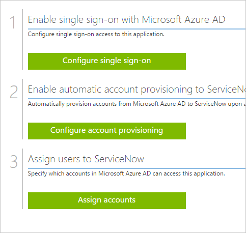
##Enabling the application integration for ServiceNow
  
The objective of this section is to outline how to enable the application integration for ServiceNow.

###To enable the application integration for ServiceNow, perform the following steps:

1.  In the Azure classic portal, on the left navigation pane, click **Active Directory**.

    

2.  From the **Directory** list, select the directory for which you want to enable directory integration.

3.  To open the applications view, in the directory view, click **Applications** in the top menu.

    

4.  Click **Add** at the bottom of the page.

    

5.  On the **What do you want to do** dialog, click **Add an application from the gallery**.

    

6.  In the **search box**, type **ServiceNow**.

    

7.  In the results pane, select **ServiceNow**, and then click **Complete** to add the application.

    
##Configuring single sign-on
  
The objective of this section is to outline how to enable users to authenticate to ServiceNow with their account in Azure AD using federation based on the SAML protocol.

As part of this procedure, you are required to upload a base-64 encoded certificate to your Dropbox for Business tenant. If you are not familiar with this procedure, see [How to convert a binary certificate into a text file](http://youtu.be/PlgrzUZ-Y1o).

###To configure single sign-on, perform the following steps:

1.  In the Azure AD classic portal, on the **ServiceNow** application integration page, click **Configure single sign-on** to open the **Configure Single Sign On ** dialog.

    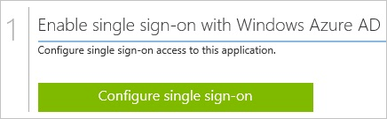

2.  On the **How would you like users to sign on to ServiceNow** page, select **Microsoft Azure AD Single Sign-On**, and then click **Next**.

    

3.  On the **Configure App Settings** page, perform the following steps:

    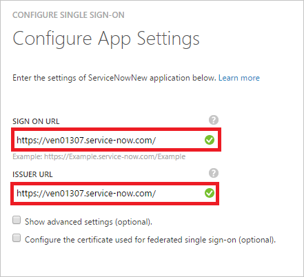

    a. in the **ServiceNow Sign On URL** textbox, type your URL used by your users to sign-on to your ServiceNow application (e.g.: *https://\<InstanceName\>.service-now.com*).

    b. In the **Issuer URL** textbox,type your URL used by your users to sign-on to your ServiceNow application (e.g.: *https://\<InstanceName\>.service-now.com*).

    c. Click **Next**

4.  To have Azure AD automatically configure ServiceNow for SAML-based authentication, enter your ServiceNow instance name, admin username, and admin password in the **Auto configure single sign-on** form and click *Configure*. Note that the admin username provided must have the **security_admin** role assigned in ServiceNow for this to work. Otherwise, to manually configure ServiceNow to use Azure AD as a SAML identity provider, click **Manually configure the application for single sign-on**, then click **Next** and complete the following steps.

    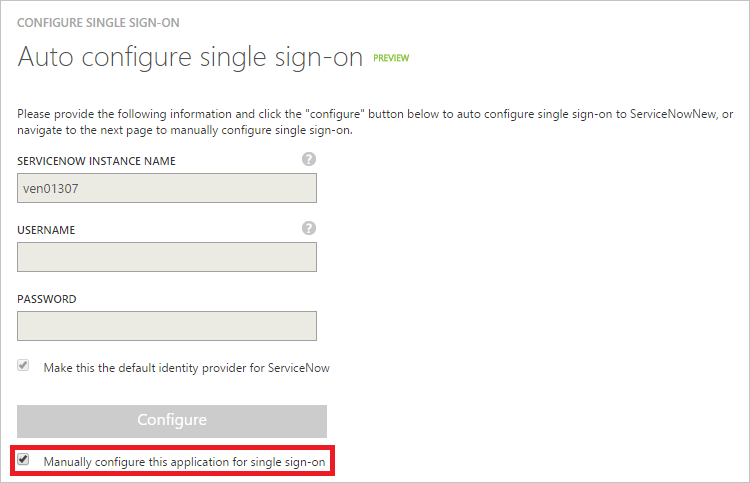

5.  On the **Configure single sign-on at ServiceNow** page, click **Download certificate**, save the certificate file locally on your computer, and then click **Next**.

    

1. Sign-on to your ServiceNow application as an administrator.

2. In the navigation pane on the left side, click **Properties**.  

    

3. On the **Multiple Provider SSO Properties** dialog, perform the following steps:

    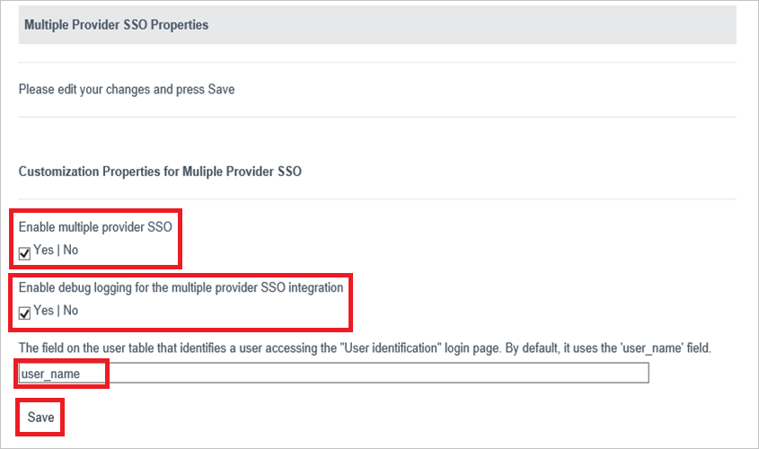

    a. As **Enable multiple provider SSO**, select **Yes**.

    b. As **Enable debug logging got the multiple provider SSO integration**, select **Yes**.

    c. In **The field on the user table that...** textbox, type **user_name**.

    d. Click **Save**.

1. In the navigation pane on the left side, click **x509 Certificates**.

    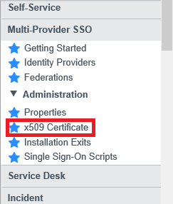

1. On the **X.509 Certificates** dialog, click **New**.

    

1. On the **X.509 Certificates** dialog, perform the following steps:

    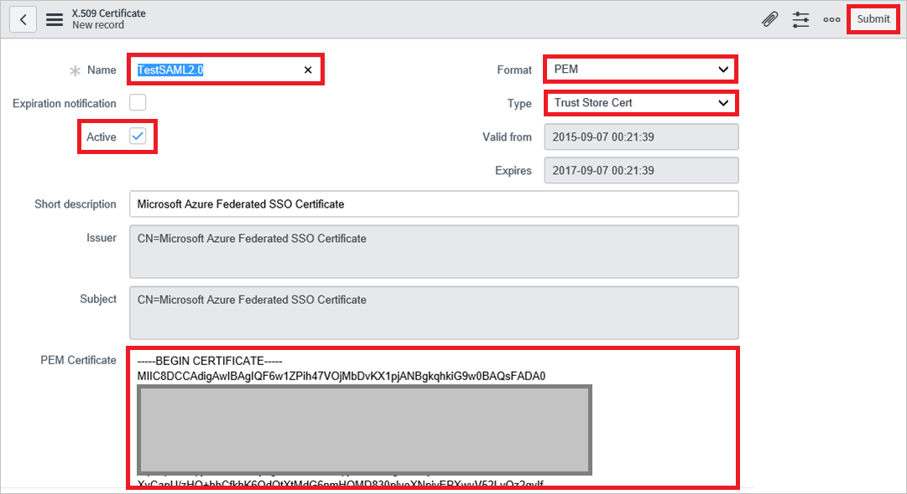

    a. Click **New**.

    b. In the **Name** textbox, type a name for your configuration (e.g.: **TestSAML2.0**).

    c. Select **Active**.

    d. As **Format**, select **PEM**.

    e. As **Type**, select **Trust Store Cert**.

    f. Create a Base-64 encoded file from your downloaded certificate.
   
	> [AZURE.NOTE] For more details, see [How to convert a binary certificate into a text file](http://youtu.be/PlgrzUZ-Y1o).
    
    g. Open your base-64 encoded certificate in notepad, copy the content of it into your clipboard, and then paste it to the **PEM Certificate** textbox.

    h. Click **Update**.

1. In the navigation pane on the left side, click **Identity Providers**.

    

1. On the **Identity Providers** dialog, click **New**:

    

1. On the **Identity Providers** dialog, click **SAML2 Update1?**:

    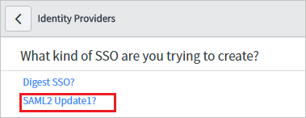

1. On the SAML2 Update1 Properties dialog, perform the following steps:

    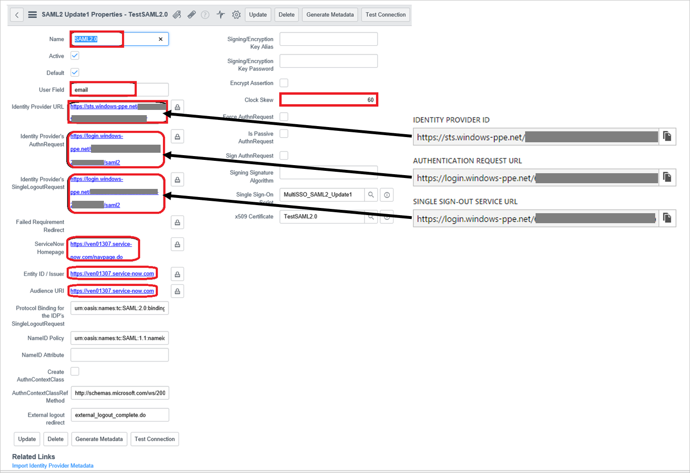

    a. in the **Name** textbox, type a name for your configuration (e.g.: **SAML 2.0**).

    b. In the **User Field** textbox, type **email** or **user_id**, depending on which field is used to uniquely identify users in your ServiceNow deployment. 
    
    **Note:** You can configue Azure AD to emit either the Azure AD user ID (user principal name) or the email address as the unique identifier in the SAML token by going to the **ServiceNow > Attributes > Single Sign-On** section of the Azure classic portal and mapping the desired field to the **nameidentifier** attribute. The value stored for the selected attribute in Azure AD (e.g. user principal name) must match the value stored in ServiceNow for the entered field (e.g. user_id)

    c. In the Azure AD classic portal, copy the **Identity Provider ID** value, and then paste it into the **Identity Provider URL** textbox.

    d. In the Azure AD classic portal, copy the **Authentication Request URL** value, and then paste it into the **Identity Provider's AuthnRequest** textbox.

    e. In the Azure AD classic portal, copy the **Single Sign-Out Service URL** value, and then paste it into the **Identity Provider's SingleLogoutRequest** textbox.

    f. In the **ServiceNow Homepage** textbox, type the URL of your ServiceNow instance homepage.

    > [AZURE.NOTE] The ServiceNow instance homepage is a concatenation of your **ServieNow tenant URL** and **/navpage.do** (e.g.: *https://fabrikam.service-now.com/navpage.do*).
 

    g. In the **Entity ID / Issuer** textbox, type the URL of your ServiceNow tenant.

    h. In the **Audience URL** textbox, type the URL of your ServiceNow tenant. 

    i. In the **Protocol Binding for the IDP's SingleLogoutRequest** textbox, type **urn:oasis:names:tc:SAML:2.0:bindings:HTTP-Redirect**.

    j. In the NameID Policy textbox, type **urn:oasis:names:tc:SAML:1.1:nameid-format:unspecified**.

    k. Deselect **Create an AuthnContextClass**.

    l. In the **AuthnContextClassRef Method**, type **http://schemas.microsoft.com/ws/2008/06/identity/authenticationmethod/password**.

    m. In **Clock Skew** textbox, type **60**.

    n. As **Single Sign On Script**, select **MultiSSO_SAML2_Update1**.

    o. As **x509 Certificate**, select the certificate you have created in the previous step.

    p. Click **Submit**. 

6. On the Azure AD classic portal, select the single sign-on configuration confirmation, and then click **Next**. 

    

7. On the **Single sign-on confirmation** page, click **Complete**.
 
    

##Configuring user provisioning
  
The objective of this section is to outline how to enable user provisioning of Active Directory user accounts to ServiceNow.

### To configure user provisioning, perform the following steps:

1. In the Azure Management classic portal, on the **ServiceNow** application integration page, click **Configure user provisioning**. 

	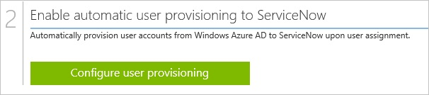

2. On the **Enter your ServiceNow credentials to enable automatic user provisioning** page, provide the following configuration settings:
Configure User Provisioning 

     a. In the **ServiceNow Instance Name** textbox, type the ServiceNow instance name.

     b. In the **ServiceNow Admin User Name** textbox, type the name of the ServiceNow admin account.

     c. In the **ServiceNow Admin Password** textbox, type the password for this account.

     d. Click **validate** to verify your configuration.

     e. Click the **Next** button to open the **Next steps** page.

     f. If you want to provision all users to this application, select “**Automatically provision all user accounts in the directory to this application**”. 

	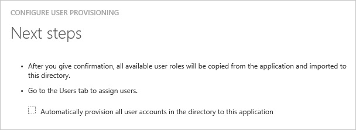

     g. On the **Next steps** page, click **Complete** to save your configuration.

##Assigning users
  
To test your configuration, you need to grant the Azure AD users you want to allow using your application access to it by assigning them.

###To assign users to ServiceNow, perform the following steps:

1.  In the Azure AD classic portal, create a test account.

2.  On the **ServiceNow **application integration page, click **Assign users**.

    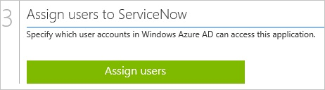

3.  Select your test user, click **Assign**, and then click **Yes** to confirm your assignment.

    
  
If you want to test your single sign-on settings, open the Access Panel. For more details about the Access Panel, see [Introduction to the Access Panel](active-directory-saas-access-panel-introduction.md).

## Additional Resources

* [List of Tutorials on How to Integrate SaaS Apps with Azure Active Directory](active-directory-saas-tutorial-list.md)
* [What is application access and single sign-on with Azure Active Directory?](active-directory-appssoaccess-whatis.md)
