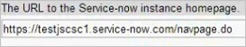
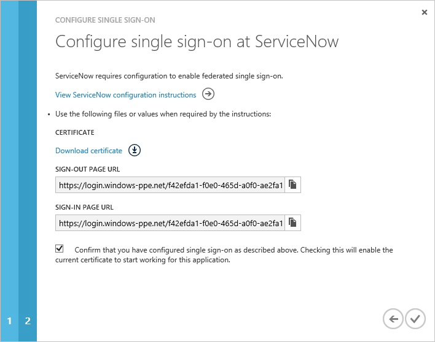

<properties pageTitle="Tutorial: Azure Active Directory integration with ServiceNow | Microsoft Azure" description="Learn how to use ServiceNow with Azure Active Directory to enable single sign-on, automated provisioning, and more!." services="active-directory" authors="MarkusVi"  documentationCenter="na" manager="stevenpo"/>
<tags ms.service="active-directory" ms.devlang="na" ms.topic="article" ms.tgt_pltfrm="na" ms.workload="identity" ms.date="08/01/2015" ms.author="markvi" />
#Tutorial: Azure Active Directory integration with ServiceNow
>[AZURE.TIP]For feedback, click [here](http://go.microsoft.com/fwlink/?LinkId=521880).
  
The objective of this tutorial is to show the integration of Azure and ServiceNow.  
The scenario outlined in this tutorial assumes that you already have the following items:

-   A valid Azure subscription
-   A tenant in ServiceNow
  
After completing this tutorial, the Azure AD users you have assigned to ServiceNow will be able to single sign into the application at your ServiceNow company site (service provider initiated sign on), or using the [Introduction to the Access Panel](active-directory-saas-access-panel-introduction.md)
  
The scenario outlined in this tutorial consists of the following building blocks:

1.  Enabling the application integration for ServiceNow
2.  Configuring single sign-on
3.  Configuring user provisioning
4.  Assigning users

##Enabling the application integration for ServiceNow
  
The objective of this section is to outline how to enable the application integration for ServiceNow.

###To enable the application integration for ServiceNow, perform the following steps:

1.  In the Azure Management Portal, on the left navigation pane, click **Active Directory**.

    

2.  From the **Directory** list, select the directory for which you want to enable directory integration.

3.  To open the applications view, in the directory view, click **Applications** in the top menu.

    

4.  Click **Add** at the bottom of the page.

    

5.  On the **What do you want to do** dialog, click **Add an application from the gallery**.

    

6.  In the **search box**, type **ServiceNow**.

    

7.  In the results pane, select **ServiceNow**, and then click **Complete** to add the application.

    
##Configuring single sign-on
  
The objective of this section is to outline how to enable users to authenticate to ServiceNow with their account in Azure AD using federation based on the SAML protocol.

As part of this procedure, you are required to upload a base-64 encoded certificate to your Dropbox for Business tenant. If you are not familiar with this procedure, see [How to convert a binary certificate into a text file](http://youtu.be/PlgrzUZ-Y1o).

###To configure single sign-on, perform the following steps:

1.  In the Azure AD portal, on the **ServiceNow** application integration page, click **Configure single sign-on** to open the **Configure Single Sign On ** dialog.

    

2.  On the **How would you like users to sign on to ServiceNow** page, select **Microsoft Azure AD Single Sign-On**, and then click **Next**.

    

3.  On the **Configure App URL** page, in the **ServiceNow Sign In URL** textbox, type your URL using the following pattern "*https://<InstanceName>.servicenow.com*", and then click **Next**.

    

4.  On the **Configure single sign-on at ServiceNow** page, click **Download certificate**, save the certificate file locally on your computer, and then click **Next**.

    

5.  In your ServiceNow tenant, on the navigation bar at the left side, click **Properties** to open the **SAML 2.0 Single Sign on properties** page.

6. On the **SAML 2.0 Single Sign-on properties** page, perform the following steps:

     6.1. As **Enable external authentication**, select **Yes**.

     6.2. In **The Identity Provider URL which will issue the SAML2 security token with user info** textbox, type **https://sts.windows.net/<your tenant’s GUID>/**.

     6.3. In **The base URL to the Identity Provider’s AuthnRequest service** textbox, type **https://login.windows.net/<your tenant’s GUID>/saml2**.

     6.4. In **The base URL to the Identity Provider’s SingleLogoutRequest service** textbox, type **https://login.windows.net/<your tenant’s GUID>/saml2**.

     6.5. In **The protocol binding for the Identity Provider’s SingleLogoutRequest service** textbox, type **urn:oasis:names:tc:SAML:2.0:bindings:HTTP-Redirect**.

     6.6. As **Sign LogoutRequest**, select **Yes**.

     6.7. In the **When SAML 2.0 single sign-on fails because the session is not authenticated, or this is the first login, redirect to this URL** textbox, type **https://login.windows.net/<your tenant’s GUID>/saml2**.

  

7. In the **Service Provider (Service-Now) properties **section, perform the following steps:

     7.1. In **The URL to Service-now instance homepage** textbox, type the URL to your ServiceNow instance homepage. The URL of the ServiceNow instance homepage is a concatenation of your **ServiceNow tenant URL** and **/navpage.do**: **https://<InstanceName>.service-now.com/navpage.do**      

     7.2. In **The entity identification, or the issuer** textbox, type the URL of your tenant.

     7.3. In **The audience uri that accepts SAML2 token** textbox, type the URL of your tenant.

     7.4. In **The User table field to match with the Subject’s NameID element in the SAMLResponse** textbox, type **email**.

     7.5. In **The NameID policy to use for returning the Subject’s NameID in the SAMLResponse** textbox, type **urn:oasis:names:tc:SAML:1.1:nameid-format:unspecified**.

     7.6 Leave **Create an AuthnContextClass request in the AuthnRequest statement** unchecked.

     7.7 In **The AuthnContextClassRef method that will be included in our SAML 2.0 AuthnRequest to the Identity Provider** textbox, type **http://schemas.microsoft.com/ws/2008/06/identity/authenticationmethod/password**.

8. In the **Advanced settings** section perform the following steps:

     8.1. In **The number in seconds before “notBefore” constraint, or after “notOnOrAfter” constraint to consider still valid** textbox, type **60**.

9. To save the configuration, click **Save**.

10. On the navigation bar at the left side, click **Certificate** to open the **Certificate** page.

11. To upload your certificate, on the certificate page, perform the following steps:

     11.1. Click **New**.

     11.2. In the **Name** textbox, type **SAML 2.0**.

     11.3. Select **Active**.

     11.4. As **Format**, select **PEM**.

     11.5. Create a Base-64 encoded file from your downloaded certificate.  > [AZURE.NOTE] For more details, see [How to convert a binary certificate into a text file](http://youtu.be/PlgrzUZ-Y1o).

     11.6. In **Notepad**, open your Base-64 encoded file, and then copy the content of this file into the clipboard.

     11.7. Paste the content of your clipboard into the **PEM Certificate** textbox.

     11.8. Click **Submit**.

12. On the Azure AD portal, select the single sign-on configuration confirmation, and then click Complete to close the Configure Single Sign On dialog.    

##Configuring user provisioning
  
The objective of this section is to outline how to enable user provisioning of Active Directory user accounts to ServiceNow.

### To configure user provisioning, perform the following steps:

1. In the Azure Management Portal, on the **ServiceNow** application integration page, click **Configure user provisioning**.    

2. On the **Enter your ServiceNow credentials to enable automatic user provisioning** page, provide the following configuration settings:
Configure User Provisioning 

     2.1. In the **ServiceNow Instance Name** textbox, type the ServiceNow instance name.

     2.2. In the **ServiceNow Admin User Name** textbox, type the name of the ServiceNow admin account.

     2.3. In the **ServiceNow Admin Password** textbox, type the password for this account.

     2.4. Click **validate** to verify your configuration.

     2.5. Click the **Next** button to open the **Next steps** page.

     2.6. If you want to provision all users to this application, select “**Automatically provision all user accounts in the directory to this application**”.    

     2.7. On the **Next steps** page, click **Complete** to save your configuration.

##Assigning users
  
To test your configuration, you need to grant the Azure AD users you want to allow using your application access to it by assigning them.

###To assign users to ServiceNow, perform the following steps:

1.  In the Azure AD portal, create a test account.

2.  On the **ServiceNow **application integration page, click **Assign users**.

    

3.  Select your test user, click **Assign**, and then click **Yes** to confirm your assignment.

    
  
If you want to test your single sign-on settings, open the Access Panel. For more details about the Access Panel, see [Introduction to the Access Panel](active-directory-saas-access-panel-introduction.md).

## Additional Resources

* [List of Tutorials on How to Integrate SaaS Apps with Azure Active Directory](active-directory-saas-tutorial-list.md)
* [What is application access and single sign-on with Azure Active Directory?](active-directory-appssoaccess-whatis.md)