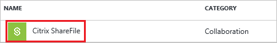
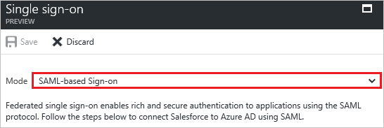
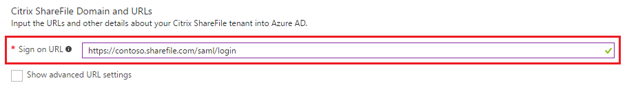
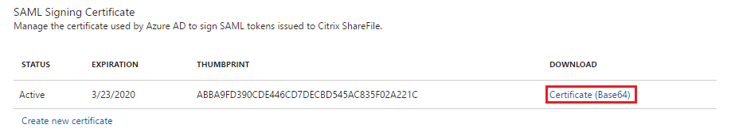
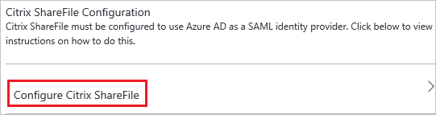
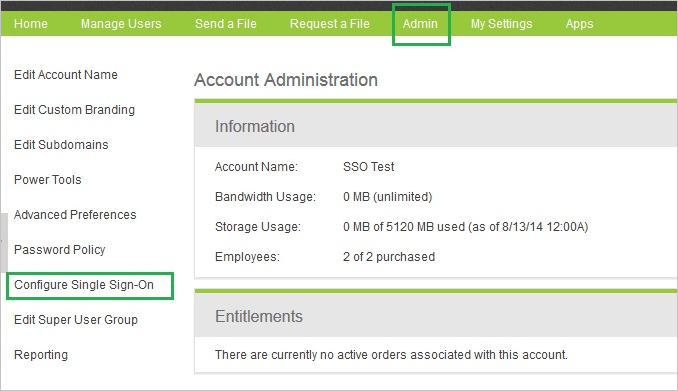
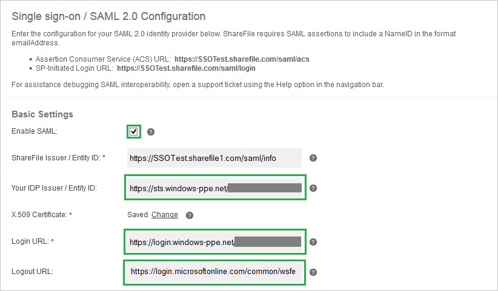

# Tutorial: Azure Active Directory integration with Citrix ShareFile

In this tutorial, you learn how to integrate Citrix ShareFile with Azure Active Directory (Azure AD).

Integrating Citrix ShareFile with Azure AD provides you with the following benefits:

- You can control in Azure AD who has access to Citrix ShareFile
- You can enable your users to automatically get signed-on to Citrix ShareFile (Single Sign-On) with their Azure AD accounts
- You can manage your accounts in one central location - the Azure Management portal

If you want to know more details about SaaS app integration with Azure AD, see [What is application access and single sign-on with Azure Active Directory](active-directory-appssoaccess-whatis.md).

## Prerequisites

To configure Azure AD integration with Citrix ShareFile, you need the following items:

- An Azure AD subscription
- A Citrix ShareFile single-sign on enabled subscription

> [!NOTE]
> To test the steps in this tutorial, we do not recommend using a production environment.

To test the steps in this tutorial, you should follow these recommendations:

- You should not use your production environment, unless this is necessary.
- If you don't have an Azure AD trial environment, you can get an one-month trial [here](https://azure.microsoft.com/pricing/free-trial/).

## Scenario description
In this tutorial, you test Azure AD single sign-on in a test environment. 
The scenario outlined in this tutorial consists of two main building blocks:

1. Adding Citrix ShareFile from the gallery
2. Configuring and testing Azure AD single sign-on

## Adding Citrix ShareFile from the gallery
To configure the integration of Citrix ShareFile into Azure AD, you need to add Citrix ShareFile from the gallery to your list of managed SaaS apps.

**To add Citrix ShareFile from the gallery, perform the following steps:**

1. In the **[Azure Management Portal](https://portal.azure.com)**, on the left navigation panel, click **Azure Active Directory** icon. 

	![Active Directory][1]

2. Navigate to **Enterprise applications**. Then go to **All applications**.

	![Applications][2]
	
3. Click **Add** button on the top of the dialog.

	![Applications][3]

4. In the search box, type **Citrix ShareFile**.

	

5. In the results panel, select **Citrix ShareFile**, and then click **Add** button to add the application.

	

##  Configuring and testing Azure AD single sign-on
In this section, you configure and test Azure AD single sign-on with Citrix ShareFile based on a test user called "Britta Simon".

For single sign-on to work, Azure AD needs to know what the counterpart user in Citrix ShareFile is to a user in Azure AD. In other words, a link relationship between an Azure AD user and the related user in Citrix ShareFile needs to be established.

This link relationship is established by assigning the value of the **user name** in Azure AD as the value of the **Username** in Citrix ShareFile.

To configure and test Azure AD single sign-on with Citrix ShareFile, you need to complete the following building blocks:

1. **[Configuring Azure AD Single Sign-On](#configuring-azure-ad-single-sign-on)** - to enable your users to use this feature.
2. **[Creating an Azure AD test user](#creating-an-azure-ad-test-user)** - to test Azure AD single sign-on with Britta Simon.
3. **[Creating a Citrix ShareFile test user](#creating-a-citrix-sharefile-test-user)** - to have a counterpart of Britta Simon in Citrix ShareFile that is linked to the Azure AD representation of her.
4. **[Assigning the Azure AD test user](#assigning-the-azure-ad-test-user)** - to enable Britta Simon to use Azure AD single sign-on.
5. **[Testing Single Sign-On](#testing-single-sign-on)** - to verify whether the configuration works.

### Configuring Azure AD single sign-on

In this section, you enable Azure AD single sign-on in the Azure Management portal and configure single sign-on in your Citrix ShareFile application.

**To configure Azure AD single sign-on with Citrix ShareFile, perform the following steps:**

1. In the Azure Management portal, on the **Citrix ShareFile** application integration page, click **Single sign-on**.

	![Configure Single Sign-On][4]

2. On the **Single sign-on** dialog, as **Mode** select **SAML-based Sign-on** to enable single sign on.
 
	

3. On the **Citrix ShareFile Domain and URLs** section, perform the following steps:

	

    a. In the **Sign On URL** textbox, type a URL using the following pattern: `https://<tenant-name>.sharefile.com/saml/login`	

	> [!NOTE] 
	> Please note that these are not the real values. You have to update these values with the actual Sign On URL and Identifier. If you don't know about these URLs, type sample URLs with example pattern and then you will get the actual URLs after you complete step 13.

4. On the **SAML Signing Certificate** section, click **Certificate (base64)** and then save the certificate file on your computer.

	 

5. On the **Citrix ShareFile Configuration** section, click **Configure Citrix ShareFile** to open **Configure sign-on** window.

	 

	

6. In a different web browser window, log into your Citrix ShareFile company site as an administrator.

7. In the toolbar on the top, click **Admin**.

8. In the left navigation pane, select **Configure Single Sign-On**.

	

9. On the **Single Sign-On/ SAML 2.0 Configuration** dialog page under **Basic Settings**, perform the following steps:

	

	a. Click **Enable SAML**.

	b. In the **Your IDP Issuer/ Entity ID** textbox, put the value of **SAML Entity ID** from Azure AD application configuration window.

	c. Click **Change** next to the **X.509 Certificate** field and then upload your downloaded certificate file. 

	d. In the **Login URL** textbox, put the value of **SAML Single Sign-On Service URL** from Azure AD application configuration window.

	e. In the **Logout URL** textbox, put the value of **Sign-Out URL** from Azure AD application configuration window.

10. Click **Save** on the Citrix ShareFile management portal.
	
 

### Creating an Azure AD test user
The objective of this section is to create a test user in the Azure Management portal called Britta Simon.

![Create Azure AD User][100]

**To create a test user in Azure AD, perform the following steps:**

1. In the **Azure Management portal**, on the left navigation pane, click **Azure Active Directory** icon.

	 

2. Go to **Users and groups** and click **All users** to display the list of users.
	
	 

3. At the top of the dialog click **Add** to open the **User** dialog.
 
	 

4. On the **User** dialog page, perform the following steps:
 
	 

    a. In the **Name** textbox, type **BrittaSimon**.

    b. In the **User name** textbox, type the **email address** of BrittaSimon.

	c. Select **Show Password** and write down the value of the **Password**.

    d. Click **Create**. 

### Creating a Citrix ShareFile test user

In order to enable Azure AD users to log into Citrix ShareFile, they must be provisioned into Citrix ShareFile. In the case of Citrix ShareFile, provisioning is a manual task.

####To provision a user account, perform the following steps:

1. Log into your Citrix ShareFile company site as an administrator.

2. In the toolbar on the top, click **Manage Users**. Then go to **Manage Users Home** and click **Create Employee**.

    

3. On the **Basic Information** section, perform below steps:

	

	a. In the **Email Address** textbox, type the email address of Britta Simon account.  

    b. In the **First Name** textbox, type **Britta**.  

    c. In the **Last Name** textbox, type **Simon**.

4. Click **Add User**.

	> [!NOTE]
	> The AAD account holder will receive an email and follow a link to confirm their account before it becomes active. You can use any other Citrix ShareFile user account creation tools or APIs provided by Citrix ShareFile to provision AAD user accounts.

### Assigning the Azure AD test user

In this section, you enable Britta Simon to use Azure single sign-on by granting her access to Citrix ShareFile.

![Assign User][200] 

**To assign Britta Simon to Citrix ShareFile, perform the following steps:**

1. In the Azure Management portal, open the applications view, and then navigate to the directory view and go to **Enterprise applications** then click **All applications**.

	![Assign User][201] 

2. In the applications list, select **Citrix ShareFile**.

	 

3. In the menu on the left, click **Users and groups**.

	![Assign User][202] 

4. Click **Add** button. Then select **Users and groups** on **Add Assignment** dialog.

	![Assign User][203]

5. On **Users and groups** dialog, select **Britta Simon** in the Users list.

6. Click **Select** button on **Users and groups** dialog.

7. Click **Assign** button on **Add Assignment** dialog.
	

### Testing single sign-on

In this section, you test your Azure AD single sign-on configuration using the Access Panel.

When you click the Citrix ShareFile tile in the Access Panel, you should get automatically signed-on to your Citrix ShareFile application.

## Additional resources

* [List of Tutorials on How to Integrate SaaS Apps with Azure Active Directory](active-directory-saas-tutorial-list.md)
* [What is application access and single sign-on with Azure Active Directory?](active-directory-appssoaccess-whatis.md)

<!--Image references-->

[1]: ./media/active-directory-saas-sharefile-tutorial/tutorial_general_01.png
[2]: ./media/active-directory-saas-sharefile-tutorial/tutorial_general_02.png
[3]: ./media/active-directory-saas-sharefile-tutorial/tutorial_general_03.png
[4]: ./media/active-directory-saas-sharefile-tutorial/tutorial_general_04.png

[100]: ./media/active-directory-saas-sharefile-tutorial/tutorial_general_100.png

[200]: ./media/active-directory-saas-sharefile-tutorial/tutorial_general_200.png
[201]: ./media/active-directory-saas-sharefile-tutorial/tutorial_general_201.png
[202]: ./media/active-directory-saas-sharefile-tutorial/tutorial_general_202.png
[203]: ./media/active-directory-saas-sharefile-tutorial/tutorial_general_203.png