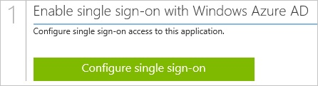
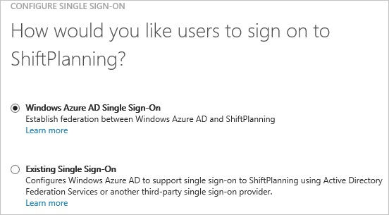
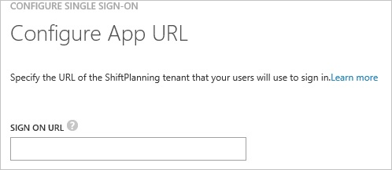
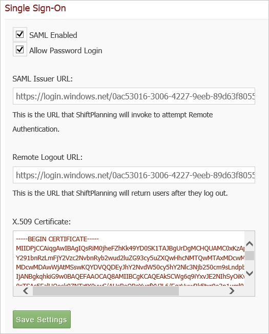
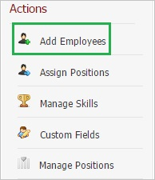

<properties 
    pageTitle="Tutorial: Azure Active Directory integration with ShiftPlanning | Microsoft Azure" 
    description="Learn how to use ShiftPlanning with Azure Active Directory to enable single sign-on, automated provisioning, and more!" 
    services="active-directory" 
    authors="jeevansd"  
    documentationCenter="na" 
    manager="femila"/>
<tags 
    ms.service="active-directory" 
    ms.devlang="na" 
    ms.topic="article" 
    ms.tgt_pltfrm="na" 
    ms.workload="identity" 
    ms.date="07/07/2016" 
    ms.author="jeedes" />

#Tutorial: Azure Active Directory integration with ShiftPlanning
  
The objective of this tutorial is to show the integration of Azure and ShiftPlanning.  
The scenario outlined in this tutorial assumes that you already have the following items:

-   A valid Azure subscription
-   A ShiftPlanning single sign-on enabled subscription
  
After completing this tutorial, the Azure AD users you have assigned to ShiftPlanning will be able to single sign into the application at your ShiftPlanning company site (service provider initiated sign on), or using the [Introduction to the Access Panel](active-directory-saas-access-panel-introduction.md).
  
The scenario outlined in this tutorial consists of the following building blocks:

1.  Enabling the application integration for ShiftPlanning
2.  Configuring single sign-on
3.  Configuring user provisioning
4.  Assigning users

##Enabling the application integration for ShiftPlanning
  
The objective of this section is to outline how to enable the application integration for ShiftPlanning.

###To enable the application integration for ShiftPlanning, perform the following steps:

1.  In the Azure classic portal, on the left navigation pane, click **Active Directory**.

    

2.  From the **Directory** list, select the directory for which you want to enable directory integration.

3.  To open the applications view, in the directory view, click **Applications** in the top menu.

    

4.  Click **Add** at the bottom of the page.

    

5.  On the **What do you want to do** dialog, click **Add an application from the gallery**.

    

6.  In the **search box**, type **ShiftPlanning**.

    

7.  In the results pane, select **ShiftPlanning**, and then click **Complete** to add the application.

    
##Configuring single sign-on
  
The objective of this section is to outline how to enable users to authenticate to ShiftPlanning with their account in Azure AD using federation based on the SAML protocol.  
As part of this procedure, you are required to create a base-64 encoded certificate file.  
If you are not familiar with this procedure, see [How to convert a binary certificate into a text file](http://youtu.be/PlgrzUZ-Y1o)

###To configure single sign-on, perform the following steps:

1.  In the Azure classic portal, on the **ShiftPlanning** application integration page, click **Configure single sign-on** to open the **Configure Single Sign On ** dialog.

    

2.  On the **How would you like users to sign on to ShiftPlanning** page, select **Microsoft Azure AD Single Sign-On**, and then click **Next**.

    

3.  On the **Configure App URL** page, in the **ShiftPlanning Sign On URL** textbox, type your URL using the following pattern "*https://company.shiftplanning.com/includes/saml/*", and then click **Next**.

    

4.  On the **Configure single sign-on at ShiftPlanning** page, to download your certificate, click **Download certificate**, and then save the certificate file on your computer.

    

5.  In a different web browser window, log into your **ShiftPlanning** company site as an administrator.

6.  In the menu on the top, click **Admin**.

    

7.  Under **Integration**, click **Single Sign-On**.

    

8.  In the **Single Sign-On** section, perform the following steps:

    

    1.  Select **SAML Enabled**.
    2.  Select **Allow Password Login**
    3.  In the Azure classic portal, on the **Configure single sign-on at ShiftPlanning** dialog page, copy the **Remote Login URL** value, and then paste it into the **SAML Issuer URL** textbox.
    4.  In the Azure classic portal, on the **Configure single sign-on at ShiftPlanning** dialog page, copy the **Remote Logout URL** value, and then paste it into the **Remote Logout URL** textbox.
    5.  Create a **base-64 encoded** file from your downloaded certificate.  

        >[AZURE.TIP]For more details, see [How to convert a binary certificate into a text file](http://youtu.be/PlgrzUZ-Y1o)

    6.  Open your base-64 encoded certificate in notepad, copy the content of it into your clipboard, and then paste it to the **X.509 Certificate** textbox
    7.  Click **Save Settings**.

9.  On the Azure classic portal, select the single sign-on configuration confirmation, and then click **Complete** to close the **Configure Single Sign On** dialog.

    
##Configuring user provisioning
  
In order to enable Azure AD users to log into ShiftPlanning, they must be provisioned into ShiftPlanning.  
In the case of ShiftPlanning, provisioning is a manual task.

###To provision a user accounts, perform the following steps:

1.  Log in to your **ShiftPlanning** company site as an administrator.

2.  Click **Admin**.

    

3.  Click **Staff**.

    

4.  Under **Actions**, click **Add Employee**.

    

5.  In the **Add Employees** section, perform the following steps:

    

    1.  Type the **First Name**, **Last Name** and **Email** of a valid AAD account you want to provision into the related textboxes.
    2.  Click **Save Employees**.

>[AZURE.NOTE]You can use any other ShiftPlanning user account creation tools or APIs provided by ShiftPlanning to provision AAD user accounts.

##Assigning users
  
To test your configuration, you need to grant the Azure AD users you want to allow using your application access to it by assigning them.

###To assign users to ShiftPlanning, perform the following steps:

1.  In the Azure classic portal, create a test account.

2.  On the **ShiftPlanning **application integration page, click **Assign users**.

    

3.  Select your test user, click **Assign**, and then click **Yes** to confirm your assignment.

    
  
If you want to test your single sign-on settings, open the Access Panel. For more details about the Access Panel, see [Introduction to the Access Panel](active-directory-saas-access-panel-introduction.md).