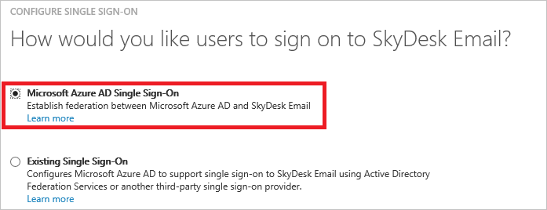
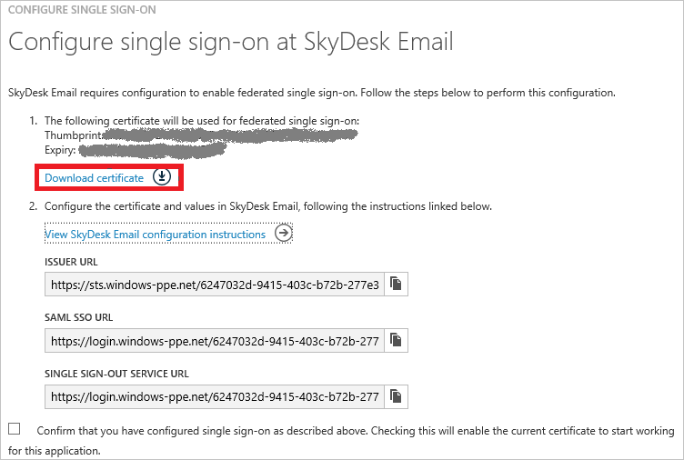
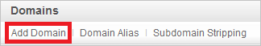
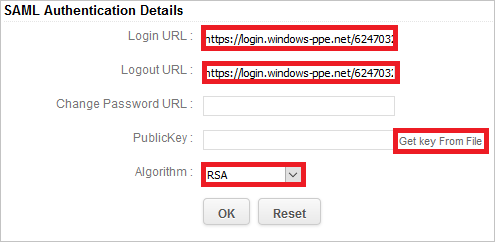

# Tutorial: Azure Active Directory integration with SkyDesk Email
The objective of this tutorial is to show you how to integrate SkyDesk Email with Azure Active Directory (Azure AD).

Integrating SkyDesk Email with Azure AD provides you with the following benefits:

* You can control in Azure AD who has access to SkyDesk Email
* You can enable your users to automatically get signed-on to SkyDesk Email single sign-on (SSO) with their Azure AD accounts
* You can manage your accounts in one central location - the Azure Active Directory classic portal

If you want to know more details about SaaS app integration with Azure AD, see [What is application access and single sign-on with Azure Active Directory](active-directory-appssoaccess-whatis.md).

## Prerequisites
To configure Azure AD integration with SkyDesk Email, you need the following items:

* An Azure AD subscription
* A SkyDesk Email single sign-on (SSO) enabled subscription

>[!NOTE]
>To test the steps in this tutorial, we do not recommend using a production environment.
> 
> 

To test the steps in this tutorial, you should follow these recommendations:

* You should not use your production environment, unless this is necessary.
* If you don't have an Azure AD trial environment, you can get a [one-month trial](https://azure.microsoft.com/pricing/free-trial/).

## Scenario Description
The objective of this tutorial is to enable you to test Azure AD SSO in a test environment. 

The scenario outlined in this tutorial consists of two main building blocks:

1. Adding SkyDesk Email from the gallery
2. Configuring and testing Azure AD SSO

## Add SkyDesk Email from the gallery
To configure the integration of SkyDesk Email into Azure AD, you need to add SkyDesk Email from the gallery to your list of managed SaaS apps.

**To add SkyDesk Email from the gallery, perform the following steps:**

1. In the **Azure classic portal**, on the left navigation pane, click **Active Directory**. 
   
    ![Active Directory][1]
2. From the **Directory** list, select the directory for which you want to enable directory integration.
3. To open the applications view, in the directory view, click **Applications** in the top menu.
   
    ![Applications][2]
4. Click **Add** at the bottom of the page.
   
    ![Applications][3]
5. On the **What do you want to do** dialog, click **Add an application from the gallery**.
   
    ![Applications][4]
6. In the search box, type **SkyDesk Email**.
   
    
7. In the results pane, select **SkyDesk Email**, and then click **Complete** to add the application.
   
    

## Configure and test Azure AD single sign-on
The objective of this section is to show you how to configure and test Azure AD SSO with SkyDesk Email based on a test user called "Britta Simon".

For SSO to work, Azure AD needs to know what the counterpart user in SkyDesk Email to an user in Azure AD is. In other words, a link relationship between an Azure AD user and the related user in SkyDesk Email needs to be established.

This link relationship is established by assigning the value of the **user name** in Azure AD as the value of the **Username** in SkyDesk Email.

To configure and test Azure AD SSO with SkyDesk Email, you need to complete the following building blocks:

1. **[Configuring Azure AD single sign-on](#configuring-azure-ad-single-single-sign-on)** - to enable your users to use this feature.
2. **[Creating an Azure AD test user](#creating-an-azure-ad-test-user)** - to test Azure AD single sign-on with Britta Simon.
3. **[Creating aSkyDesk Email test user](#creating-a-Skydesk-Email-test-user)** - to have a counterpart of Britta Simon in SkyDesk Email that is linked to the Azure AD representation of her.
4. **[Assigning the Azure AD test user](#assigning-the-azure-ad-test-user)** - to enable Britta Simon to use Azure AD single sign-on.
5. **[Testing single sign-on](#testing-single-sign-on)** - to verify whether the configuration works.

### Configure Azure AD single sign-on
The objective of this section is to enable Azure AD SSO in the Azure classic portal and to configure single sign-on in your SkyDesk Email application.

**To configure Azure AD single sign-on with SkyDesk Email, perform the following steps:**

1. In the Azure classic portal, on the **SkyDesk Email** application integration page, click **Configure single sign-on** to open the **Configure Single Sign-On**  dialog.
   
    ![Configure Single Sign-On][6] 
2. On the **How would you like users to sign on to SkyDesk Email** page, select **Azure AD Single Sign-On**, and then click **Next**.
   
     
3. On the **Configure App Settings** dialog page, perform the following steps:
   
     

   1. In the Sign On URL textbox, type the URL used by your users to sign-on to your SkyDesk Email application using the following pattern: **“https://mail.skydesk.jp/portal/\<company name\>”**.
   2. Click **Next**.

4. On the **Configure single sign-on at SkyDesk Email** page, perform the following steps:
   
     
   
  1. Click **Download certificate**, and then save the file on your computer.
  2. Click **Next**.
5. To enable SSO in **SkyDesk Email**, perform the following steps:
  1. Sign-on to your SkyDesk Email account as administrator.
  2. In the menu on the top, click Setup, and select Org. 
    
        
  3. Click on Domains from the left panel.
    
      
  4. Click on Add Domain.
    
      
  5. Enter your Domain name, and then verify the Domain.
    
      
  6. Click on **SAML Authentication** from the left panel.
    
      
6. On the **SAML Authentication** dialog page, perform the following steps:
   
      
   
    >[!NOTE]
    >To use SAML based authentication, you should either have **verified domain** or **portal URL** setup. You can set the portal URL with the unique name.
    > 
    > 
   
    

   1. In Azure AD classic portal, copy the **SAML SSO URL** value, and then paste it into the **Login URL** textbox.
   2. In Azure AD classic portal, copy the **Single Sign-Out Service URL** value, and then paste it into the **Logout** URL textbox.
   3. **Change Password URL** is optional so leave it blank.
   4. Click on **Get Key From File** to select your downloaded SkyDesk Email certificate, and then click **Open** to upload the certificate.
   5. As **Algorithm**, select **RSA**.
   6. Click **Ok** to save the changes.

7. In the Azure classic portal, select the single sign-on configuration confirmation, and then click **Next**.
   
    ![Azure AD Single Sign-On][10]
8. On the **Single sign-on confirmation** page, click **Complete**.  
   
    ![Azure AD Single Sign-On][11]

### Create an Azure AD test user
The objective of this section is to create a test user in the Azure classic portal called Britta Simon.

![Create Azure AD User][20]

**To create a test user in Azure AD, perform the following steps:**

1. In the **Azure classic portal**, on the left navigation pane, click **Active Directory**.
   
     
2. From the **Directory** list, select the directory for which you want to enable directory integration.
3. To display the list of users, in the menu on the top, click **Users**.
   
     
4. To open the **Add User** dialog, in the toolbar on the bottom, click **Add User**.
   
     
5. On the **Tell us about this user** dialog page, perform the following steps:
   
     
  1. As Type Of User, select New user in your organization.
  2. In the User Name **textbox**, type **BrittaSimon**.
  3. Click **Next**.
6. On the **User Profile** dialog page, perform the following steps:
   
    
   
   1. In the **First Name** textbox, type **Britta**. 
   2. In the **Last Name** textbox, type, **Simon**.  
   3. In the **Display Name** textbox, type **Britta Simon**.
   4. In the **Role** list, select **User**.
   5. Click **Next**.
7. On the **Get temporary password** dialog page, click **create**.
   
     
8. On the **Get temporary password** dialog page, perform the following steps:
   
     
   
   1. Write down the value of the **New Password**.
   2. Click **Complete**.   

### Create a SkyDesk Email test user
In this section, you create a user called Britta Simon in SkyDesk Email.

1. Click on **User Access** from the left panel in SkyDesk Email and then enter your username. 

>[!NOTE] 
>If you need to create bulk users, you need to contact the SkyDesk Email support team.
>

### Assign the Azure AD test user
The objective of this section is to enabling Britta Simon to use Azure single sign-on by granting her access to SkyDesk Email.

![Assign User][200] 

**To assign Britta Simon to SkyDesk Email, perform the following steps:**

1. On the Azure classic portal, to open the applications view, in the directory view, click **Applications** in the top menu.
   
    ![Assign User][201] 
2. In the applications list, select **SkyDesk Email**.
   
     
3. In the menu on the top, click **Users**.
![Assign User][203] 
4. In the Users list, select **Britta Simon**.
5. In the toolbar on the bottom, click **Assign**.
   
   ![Assign User][205]

### Test single sign-on
The objective of this section is to test your Azure AD SSO configuration using the Access Panel.

When you click the SkyDesk Email tile in the Access Panel, you should get automatically signed-on to your SkyDesk Email application.

## Additional Resources
* [List of Tutorials on How to Integrate SaaS Apps with Azure Active Directory](active-directory-saas-tutorial-list.md)
* [What is application access and single sign-on with Azure Active Directory?](active-directory-appssoaccess-whatis.md)

<!--Image references-->

[1]: ./media/active-directory-saas-skydeskemail-tutorial/tutorial_general_01.png
[2]: ./media/active-directory-saas-skydeskemail-tutorial/tutorial_general_02.png
[3]: ./media/active-directory-saas-skydeskemail-tutorial/tutorial_general_03.png
[4]: ./media/active-directory-saas-skydeskemail-tutorial/tutorial_general_04.png

[6]: ./media/active-directory-saas-skydeskemail-tutorial/tutorial_general_05.png
[10]: ./media/active-directory-saas-skydeskemail-tutorial/tutorial_general_06.png
[11]: ./media/active-directory-saas-skydeskemail-tutorial/tutorial_general_07.png
[20]: ./media/active-directory-saas-skydeskemail-tutorial/tutorial_general_100.png

[200]: ./media/active-directory-saas-skydeskemail-tutorial/tutorial_general_200.png
[201]: ./media/active-directory-saas-skydeskemail-tutorial/tutorial_general_201.png
[203]: ./media/active-directory-saas-skydeskemail-tutorial/tutorial_general_203.png
[204]: ./media/active-directory-saas-skydeskemail-tutorial/tutorial_general_204.png
[205]: ./media/active-directory-saas-skydeskemail-tutorial/tutorial_general_205.png
