# Tutorial: Azure Active Directory integration with Slack

In this tutorial, you learn how to integrate Slack with Azure Active Directory (Azure AD).

When you integrate Slack with Azure AD, you can:

* Control in Azure AD who has access to Slack.
* Enable users to sign in automatically to Slack with single sign-on (SSO) with their Azure AD accounts.
* Manage your accounts in one central location, the Azure portal.

To learn about software as a service (SaaS) app integration with Azure AD, see [What is application access and single sign-on with Azure Active Directory?](active-directory-appssoaccess-whatis.md).

## Prerequisites

To configure Azure AD integration with Slack, you need the following items:

* An Azure AD subscription
* A Slack SSO-enabled subscription

>[!NOTE]
>We do not recommend testing the steps in this tutorial using a production environment.
>
>

To test the steps in this tutorial, follow these recommendations:

* Use your production environment only if necessary.
* If you don't have an Azure AD trial environment, get a [one-month trial](https://azure.microsoft.com/pricing/free-trial/).

## Scenario description
In this tutorial, you test Azure AD SSO in a test environment. The scenario to be followed consists of two main building blocks:

* Adding Slack from the gallery
* Configuring and testing Azure AD SSO

## Add Slack from the gallery
To configure the integration of Slack with Azure AD, add Slack from the gallery to your list of managed SaaS apps by doing the following:

1. Open the [Azure portal](https://portal.azure.com).
2. In the left pane, click the **Azure Active Directory** button.

	![The "Azure Active Directory" button][1]

3. Go to **Enterprise applications**, and then select **All applications**.

	![The "All applications" button on the "Enterprise applications" blade][2]

4. At the top of the **All applications** dialog box, click **Add**.

	![The "Add" button in the "All applications" dialog box][3]

5. In the search box, type **Slack**.

	

6. In the results pane, select **Slack**, and then click the **Add** button to add the application.

 	

## Configure and test Azure AD SSO
In this section, you configure and test Azure AD SSO with Slack by using the test user "Britta Simon."

For SSO to work, Azure AD must establish a link relationship between the Azure AD user and its counterpart user in Slack. You establish this link relationship by assigning the value of the **user name** in Azure AD as the value of the **Username** in Slack.

To configure and test Azure AD SSO with Slack, complete the following building blocks:

1. [Configure Azure AD single sign-on](#configuring-azure-ad-single-sign-on) to enable the user to use this feature.
2. [Create an Azure AD test user](#creating-an-azure-ad-test-user) to test Azure AD SSO with user Britta Simon.
3. [Create a Slack test user](#creating-a-slack-test-user) to give Azure AD user Britta Simon a Slack counterpart to link to.
4. [Assign the Azure AD test user](#assigning-the-azure-ad-test-user) to enable user Britta Simon to use Azure AD SSO.
5. [Test single sign-on](#testing-single-sign-on) to verify that the configuration works.

### Configure Azure AD single sign-on

In this section, you enable Azure AD SSO in the Azure portal and configure SSO in your Slack application by doing the following:

1. In the Azure portal, on the **Slack** application integration page, click **Single sign-on**.

	![The Slack application integration page][4]

2. In the **Single sign-on** dialog box, in the **Mode** list, select **SAML-based Sign-on** to enable SSO.

	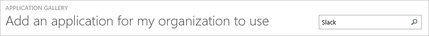

3. Under **Slack Domain and URLs**, perform the following steps:

	
  1. In the **Sign on URL** box, type a URL that uses the naming convention _https://<company name>.slack.com_.
  2. In the **Identifier** box, type **https://slack.com**.

     >[!NOTE]
     >The preceding values are not real values. Here we recommend that you use unique values for the URL and identifier. Later, you will update the values with the actual URL and identifier. To obtain the values, contact the [Slack support team](https://slack.com/help/contact).
     >
     >

4. The Slack application expects the Security Assertion Markup Language (SAML) assertions to be displayed in a specific format. Configure the claims and manage the values of the attributes in the **User Attributes** section of the Slack application integration page, as shown in the following screenshot:

	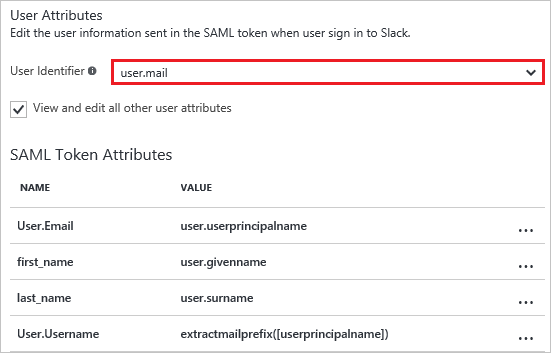

5. In the **Single sign-on** dialog box, in the **User Attributes** section, select **user.mail** as **User Identifier**. For each row in the table, perform the following steps:

	| Attribute name | Attribute value |
	| --- | --- |    
    | User.Email | user.userprincipalname |
	| first_name | user.givenname |
	| last_name | user.surname |
	| User.Username | extractmailprefix([userprincipalname]) |

	1. Click the **Add attribute** button.

	
	2. In the **Add Attribute** dialog box, in the **Name** box, enter the first name from the table's **Attribute name** column.

	
	3. In the **Value** box, enter the first value from the table's **Attribute value** column.
	4. Click **OK**.
	5. Repeat steps "a" through "d" for the next three table rows.

6. Under **SAML Signing Certificate**, click **Create new certificate**.

	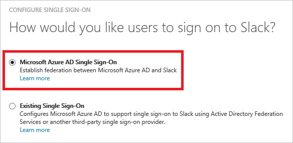 	

7. In the **Create New Certificate** dialog box, click the **Calendar** button, select an expiration (expiry) date, and then click **Save**.

	

8. Under **SAML Signing Certificate**, select the **Make new certificate active** check box, and then click **Save**.

	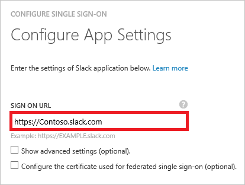

9. In the **Rollover certificate** pop-up window, click **OK**.

	

10. Under **SAML Signing Certificate**, click **Certificate (base64)**, and then save the certificate file to your local drive.

	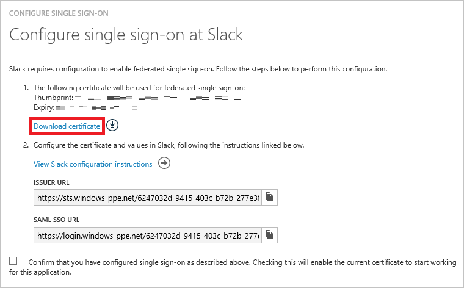

11. Under **Slack Configuration**, click **Configure Slack** to open the **Configure sign-on** window.

	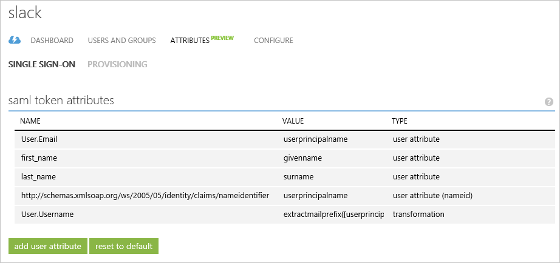

	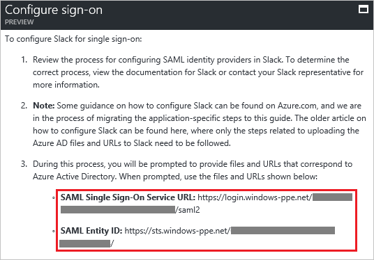

12. Open a new browser window, and then sign in to your Slack company site as an administrator.

13. Go to **Microsoft Azure AD**, and then go to **Team Settings**.

    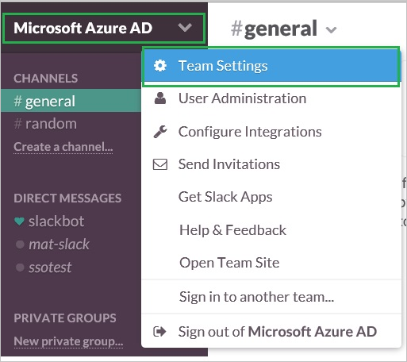

14. Under **Team Settings**, click the **Authentication** tab, and then click **Change Settings**.

    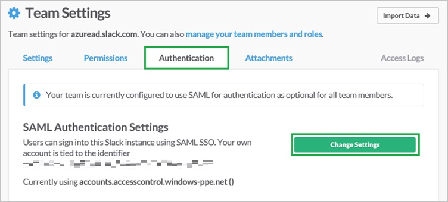

15. In the **SAML Authentication Settings** dialog box, perform the following steps:

    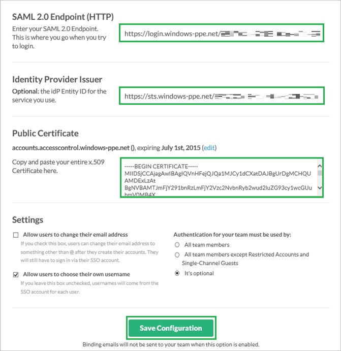
  1. In the **SAML 2.0 Endpoint (HTTP)** box, enter the **SAML Single Sign-On Service URL** value from the Azure AD application configuration window.
  2. In the **Identity Provider Issuer** box, enter the **SAML Entity ID** value from the Azure AD application configuration window.
  3. Open the downloaded certificate file in Notepad, copy the content, and then paste it in the **Public Certificate** box.
  4. Configure the preceding three settings as appropriate for your Slack team. For more information about the settings, see the [Guide to single sign-on with Slack](https://get.slack.help/hc/en-us/articles/220403548-Guide-to-single-sign-on-with-Slack).
  5. Click **Save Configuration**.
  6. Deselect **Allow users to change their email address**.
  7. Select **Allow users to choose their own username**.
  8. As **Authentication for your team must be used by**, select **It’s optional**.
  
### Create an Azure AD test user
In this section, you create a test user in the Azure portal called Britta Simon by doing the following:

1. In the Azure portal, in the left pane, click the **Azure Active Directory** button.

	

2. Go to **Users and groups**, and then click **All users** to display the list of users.

	

3. At the top of the **All users** dialog box, click **Add**.

	

4. In the **User** dialog box, enter the following information:

	
  1. In the **Name** box, type **BrittaSimon**.
  2. In the **User name** box, type the email address of user Britta Simon.
  3. Select the **Show Password** check box, and then write down the value that's shown in the **Password** box.
  4. Click **Create**.

### Create a Slack test user

In this section, a user called Britta Simon is created in Slack. Slack supports just-in-time provisioning, which is enabled by default.

There is no action item for you in this section. If a user doesn't already exist in Slack, a new one is created when you attempt to access Slack.

>[!NOTE]
>If you need to create a user manually, contact the [Slack support team](https://slack.com/help/contact).
>
>

### Assign the Azure AD test user

In this section, you enable user Britta Simon to use Azure SSO by granting it access to Slack.

![Assign a user of Azure SSO][200]

To assign user Britta Simon to Slack, perform the following steps:

1. In the Azure portal, open the applications view, go to the directory view, go to **Enterprise applications**, and then click **All applications**.

	![Assign User][201]

2. In the **Applications** list, select **Slack**.

	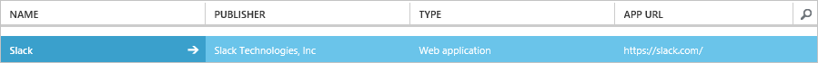

3. In the left pane, click **Users and groups**.

	![Left-pane "Users and groups" button][202]

4. Click the **Add** button and then, on the **Add Assignment** blade, select **Users and groups**.

	![The "Add" button and "Add Assignment" blade][203]

5. In the **Users and groups** dialog box, in the **Users** list, select **Britta Simon**.

6. Click the **Select** button.

7. On the **Add Assignment** blade, click the **Assign** button.

### Test single sign-on

In this section, you test your Azure AD SSO configuration by using the Access Panel.

To test the configuration, go to the Access Panel, and then click the **Slack** tile. The user should be automatically signed in to the Slack application.

## Additional resources

* [List of tutorials on how to integrate SaaS apps with Azure Active Directory](active-directory-saas-tutorial-list.md)
* [What is application access and single sign-on with Azure Active Directory?](active-directory-appssoaccess-whatis.md)

<!--Image references-->

[1]: ./media/active-directory-saas-slack-tutorial/tutorial_general_01.png
[2]: ./media/active-directory-saas-slack-tutorial/tutorial_general_02.png
[3]: ./media/active-directory-saas-slack-tutorial/tutorial_general_03.png
[4]: ./media/active-directory-saas-slack-tutorial/tutorial_general_04.png

[100]: ./media/active-directory-saas-slack-tutorial/tutorial_general_100.png

[200]: ./media/active-directory-saas-slack-tutorial/tutorial_general_200.png
[201]: ./media/active-directory-saas-slack-tutorial/tutorial_general_201.png
[202]: ./media/active-directory-saas-slack-tutorial/tutorial_general_202.png
[203]: ./media/active-directory-saas-slack-tutorial/tutorial_general_203.png
