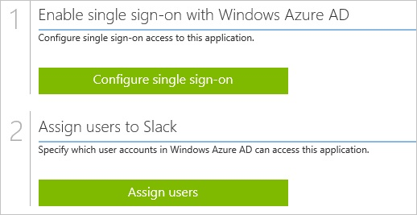
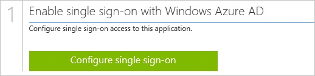
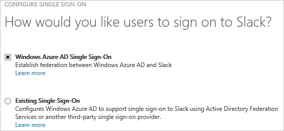
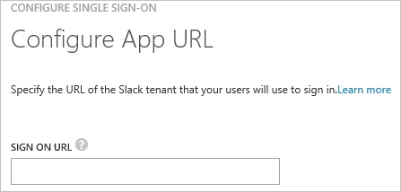
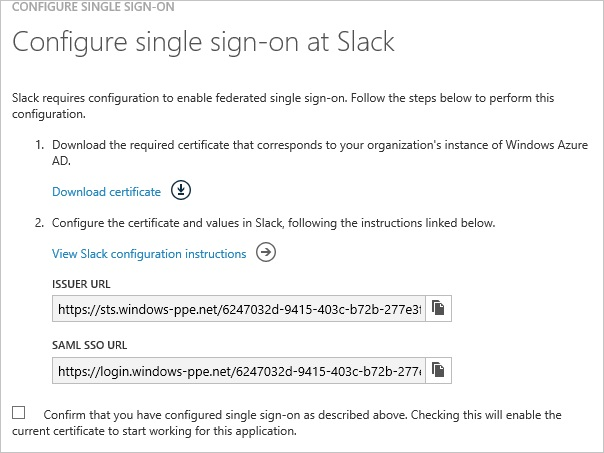
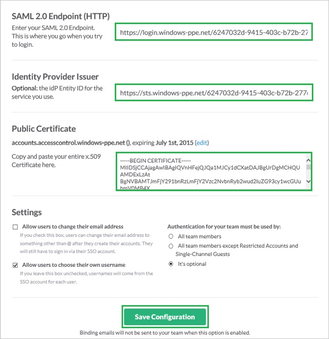
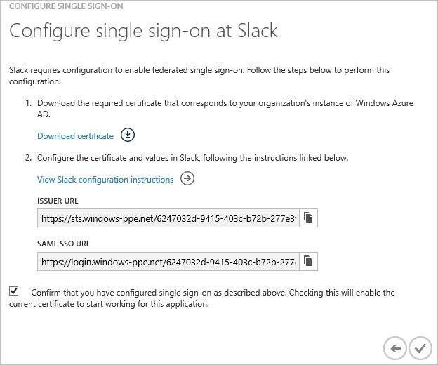
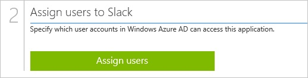

<properties 
    pageTitle="Tutorial: Azure Active Directory integration with Slack | Microsoft Azure" 
    description="Learn how to use Slack with Azure Active Directory to enable single sign-on, automated provisioning, and more!" 
    services="active-directory" 
    authors="jeevansd"  
    documentationCenter="na" 
    manager="femila"/>
<tags 
    ms.service="active-directory" 
    ms.devlang="na" 
    ms.topic="article" 
    ms.tgt_pltfrm="na" 
    ms.workload="identity" 
    ms.date="06/29/2016" 
    ms.author="jeedes" />

#Tutorial: Azure Active Directory integration with Slack
  
The objective of this tutorial is to show the integration of Azure and Slack.  
The scenario outlined in this tutorial assumes that you already have the following items:

-   A valid Azure subscription
-   A Slack single sign-on enabled subscription
  
After completing this tutorial, the Azure AD users you have assigned to Slack will be able to single sign into the application at your Slack company site (service provider initiated sign on), or using the [Introduction to the Access Panel](active-directory-saas-access-panel-introduction.md).
  
The scenario outlined in this tutorial consists of the following building blocks:

1.  Enabling the application integration for Slack
2.  Configuring single sign-on
3.  Configuring user provisioning
4.  Assigning users

##Enabling the application integration for Slack
  
The objective of this section is to outline how to enable the application integration for Slack.

###To enable the application integration for Slack, perform the following steps:

1.  In the Azure classic portal, on the left navigation pane, click **Active Directory**.

    

2.  From the **Directory** list, select the directory for which you want to enable directory integration.

3.  To open the applications view, in the directory view, click **Applications** in the top menu.

    

4.  Click **Add** at the bottom of the page.

    

5.  On the **What do you want to do** dialog, click **Add an application from the gallery**.

    

6.  In the **search box**, type **Slack**.

    

7.  In the results pane, select **Slack**, and then click **Complete** to add the application.

    

##Configuring single sign-on
  
The objective of this section is to outline how to enable users to authenticate to Slack with their account in Azure AD using federation based on the SAML protocol.  
As part of this procedure, you are required to create a base-64 encoded certificate file.  
If you are not familiar with this procedure, see [How to convert a binary certificate into a text file](http://youtu.be/PlgrzUZ-Y1o)

###To configure single sign-on, perform the following steps:

1.  In the Azure classic portal, on the **Slack** application integration page, click **Configure single sign-on** to open the **Configure Single Sign On ** dialog.

    

2.  On the **How would you like users to sign on to Slack** page, select **Microsoft Azure AD Single Sign-On**, and then click **Next**.

    

3.  On the **Configure App URL** page, in the **Slack Sign In URL** textbox, type the URL of your Slack tenant (e.g.: "*https://azuread.slack.com*"), and then click **Next**.

    

4.  On the **Configure single sign-on at Slack** page, to download your certificate, click **Download certificate**, and then save the certificate file locally on your computer.

    

5.  In a different web browser window, log into your Slack company site as an administrator.

6.  Go to **to Microsoft Azure AD \> Team Settings**.

    

7.  In the **Team Settings** section, click the **Authentication** tab, and then click **Change Settings**.

    

8.  On the **SAML Authentication Settings** dialog, perform the following steps:

    

    1.  In the Azure classic portal, on the **Configure single sign-on at Slack** dialog page, copy the **SAML SSO URL** value, and then paste it into the **SAML 2.0 Endpoint (HTTP)** textbox.
    2.  In the Azure classic portal, on the **Configure single sign-on at Slack** dialog page, copy the **Issuer URL** value, and then paste it into the **Identity Provider Issuer** textbox.
    3.  Create a **base-64 encoded** file from your downloaded certificate.
    
        >[AZURE.TIP] For more details, see [How to convert a binary certificate into a text file](http://youtu.be/PlgrzUZ-Y1o)

    4.  Open your base-64 encoded certificate in notepad, copy the content of it into your clipboard, and then paste it to the **Public Certificate** textbox.
    5.  Deselect **Allow users to change their email address**.
    6.  Select **Allow users to choose their own username**.
    7.  As **Authentication for your team must be used by**, select **It’s optional**.
    8.  Click **Save Configuration**.

9.  On the Azure classic portal, select the single sign-on configuration confirmation, and then click **Complete** to close the **Configure Single Sign On** dialog.

    

##Configuring user provisioning
  
In order to enable Azure AD users to log into Slack, they must be provisioned into Slack.
  
There is no action item for you to configure user provisioning to Slack.  
When an assigned user tries to log into Slack, a Slack account is automatically created if necessary.

##Assigning users
  
To test your configuration, you need to grant the Azure AD users you want to allow using your application access to it by assigning them.

###To assign users to Slack, perform the following steps:

1.  In the Azure classic portal, create a test account.

2.  On the **Slack **application integration page, click **Assign users**.

    

3.  Select your test user, click **Assign**, and then click **Yes** to confirm your assignment.

    
  
If you want to test your single sign-on settings, open the Access Panel. For more details about the Access Panel, see [Introduction to the Access Panel](active-directory-saas-access-panel-introduction.md).