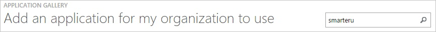
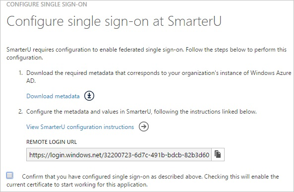
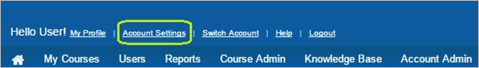
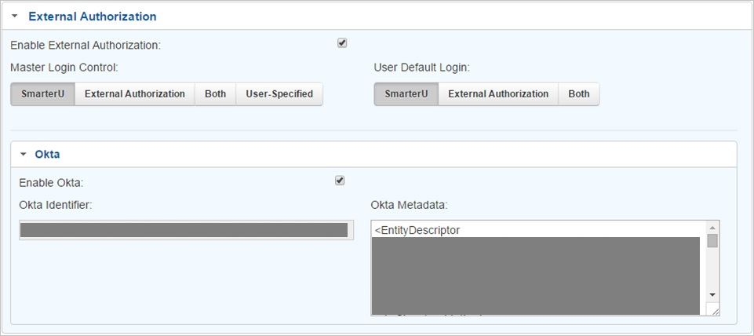
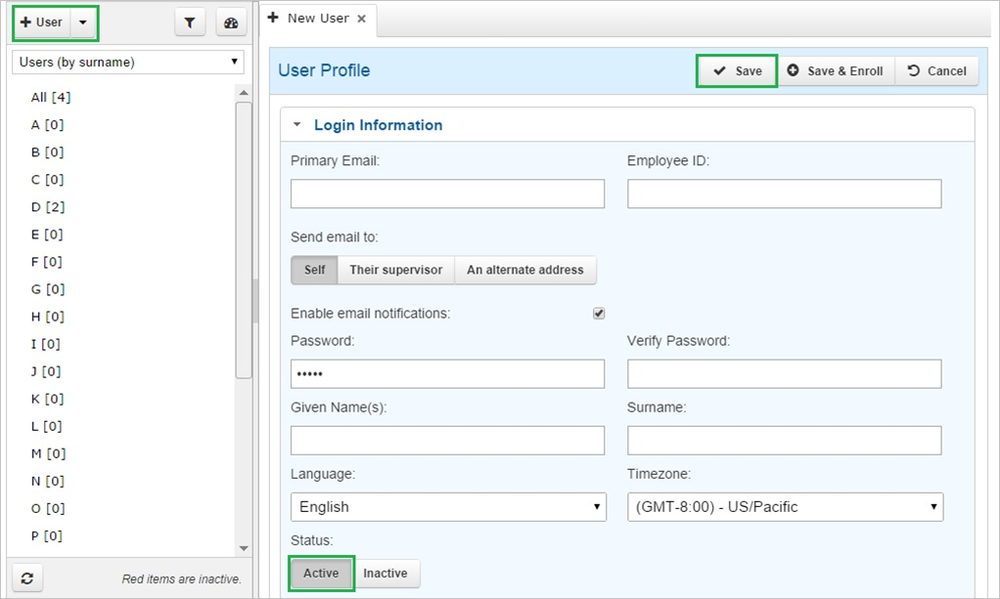
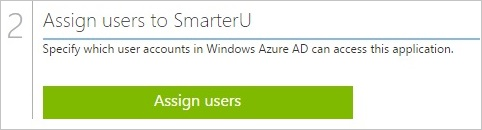

<properties 
    pageTitle="Tutorial: Azure Active Directory integration with SmarterU | Microsoft Azure" 
    description="Learn how to use SmarterU with Azure Active Directory to enable single sign-on, automated provisioning, and more!" 
    services="active-directory" 
    authors="jeevansd"  
    documentationCenter="na" 
    manager="femila"/>
<tags 
    ms.service="active-directory" 
    ms.devlang="na" 
    ms.topic="article" 
    ms.tgt_pltfrm="na" 
    ms.workload="identity" 
    ms.date="06/29/2016" 
    ms.author="jeedes" />

#Tutorial: Azure Active Directory Integration with SmarterU
  
The objective of this tutorial is to show the integration of Azure and SmarterU.  
The scenario outlined in this tutorial assumes that you already have the following items:

-   A valid Azure subscription
-   A SmarterU tenant
  
After completing this tutorial, the Azure AD users you have assigned to SmarterU will be able to single sign into the application at your SmarterU company site (service provider initiated sign on), or using the [Introduction to the Access Panel](active-directory-saas-access-panel-introduction.md).
  
The scenario outlined in this tutorial consists of the following building blocks:

1.  Enabling the application integration for SmarterU
2.  Configuring single sign-on
3.  Configuring user provisioning
4.  Assigning users

##Enabling the application integration for SmarterU
  
The objective of this section is to outline how to enable the application integration for SmarterU.

###To enable the application integration for SmarterU, perform the following steps:

1.  In the Azure classic portal, on the left navigation pane, click **Active Directory**.

    

2.  From the **Directory** list, select the directory for which you want to enable directory integration.

3.  To open the applications view, in the directory view, click **Applications** in the top menu.

    

4.  Click **Add** at the bottom of the page.

    

5.  On the **What do you want to do** dialog, click **Add an application from the gallery**.

    

6.  In the **search box**, type **SmarterU**.

    

7.  In the results pane, select **SmarterU**, and then click **Complete** to add the application.

    

##Configuring single sign-on
  
The objective of this section is to outline how to enable users to authenticate to SmarterU with their account in Azure AD using federation based on the SAML protocol.

###To configure single sign-on, perform the following steps:

1.  In the Azure classic portal, on the **SmarterU** application integration page, click **Configure single sign-on** to open the **Configure Single Sign On ** dialog.

    

2.  On the **How would you like users to sign on to SmarterU** page, select **Microsoft Azure AD Single Sign-On**, and then click **Next**.

    

3.  On the **Configure single sign-on at SmarterU** page, to download your metadata, click **Download metadata**, and then the data file locally as **c:\\SmarterUMetaData.cer**.

    

4.  In a different web browser window, log into your SmarterU company site as an administrator.

5.  In the toolbar on the top, click **Account Settings**.

    

6.  On the account configuration page, perform the following steps:

    

    1.  Select **Enable External Authorization**.
    2.  In the **Master Login Control** section, select the **SmarterU** tab.
    3.  In the **User Default Login** section, select the **SmarterU** tab.
    4.  Select **Enable Okta**.
    5.  Copy the content of the downloaded metadata file, and then paste it into the **Okta Metadata** textbox.
    6.  Click **Save**.

7.  On the Azure classic portal, select the single sign-on configuration confirmation, and then click **Complete** to close the **Configure Single Sign On** dialog.

    

##Configuring user provisioning
  
In order to enable Azure AD users to log into SmarterU, they must be provisioned into SmarterU.  
In the case of SmarterU, provisioning is a manual task.

###To provision a user accounts, perform the following steps:

1.  Log in to your **SmarterU** tenant.

2.  Go to **Users**.

3.  In the user section, perform the following steps:

    

    1.  Click **+User**.
    2.  Type the related attribute values of the Azure AD user account into the following textboxes: **Primary Email**, **Employee ID**, **Password**, **Verify Password**, **Given Name**, **Surname**.
    3.  Click **Active**.
    4.  Click **Save**.

>[AZURE.NOTE] You can use any other SmarterU user account creation tools or APIs provided by SmarterU to provision AAD user accounts.

##Assigning users
  
To test your configuration, you need to grant the Azure AD users you want to allow using your application access to it by assigning them.

###To assign users to SmarterU, perform the following steps:

1.  In the Azure classic portal, create a test account.

2.  On the **SmarterU **application integration page, click **Assign users**.

    

3.  Select your test user, click **Assign**, and then click **Yes** to confirm your assignment.

    
  
If you want to test your single sign-on settings, open the Access Panel. For more details about the Access Panel, see [Introduction to the Access Panel](active-directory-saas-access-panel-introduction.md).