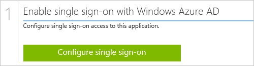
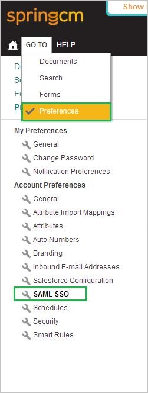

<properties 
    pageTitle="Tutorial: Azure Active Directory integration with Spring CM | Microsoft Azure" 
    description="Learn how to use Spring CM with Azure Active Directory to enable single sign-on, automated provisioning, and more!" 
    services="active-directory" 
    authors="jeevansd"  
    documentationCenter="na" 
    manager="femila"/>
<tags 
    ms.service="active-directory" 
    ms.devlang="na" 
    ms.topic="article" 
    ms.tgt_pltfrm="na" 
    ms.workload="identity" 
    ms.date="06/29/2016" 
    ms.author="jeedes" />

#Tutorial: Azure Active Directory integration with Spring CM
  
The objective of this tutorial is to show how to set up single sign-on between Azure Active Directory and SpringCM.
  
The scenario outlined in this tutorial assumes that you already have the following items:

-   A valid Azure subscription
-   A SpringCM single sign-on enabled subscription
  
After completing this tutorial, the Azure Active Directory users you have assigned to SpringCM will be able to single sign-on using the AAD Access Panel.

1.  Enabling the application integration for SpringCM
2.  Configuring Single Sign-On
3.  Configuring user provisioning
4.  Assigning users

##Enabling the application integration for SpringCM
  
The objective of this section is to outline how to enable the application integration for SpringCM.

###To enable the application integration for SpringCM, perform the following steps:

1.  In the Azure classic portal, on the left navigation pane, click **Active Directory**.

    

2.  From the **Directory** list, select the directory for which you want to enable directory integration.

3.  To open the applications view, in the directory view, click **Applications** in the top menu.

    

4.  Click **Add** at the bottom of the page.

    

5.  On the **What do you want to do** dialog, click **Add an application from the gallery**.

    

6.  In the **search box**, type **SpringCM**.

    

7.  In the results pane, select **SpringCM**, and then click **Complete** to add the application.

    

##Configuring Single Sign-On
  
This section outlines how to enable users to authenticate to SpringCM with their account in Azure Active Directory, using federation based on the SAML protocol.

###To configure single sign-on, perform the following steps:

1.  In the Azure classic portal, on the **SpringCM** application integration page, click **Configure single sign-on** to open the **Configure Single Sign On ** dialog.

    

2.  On the **How would you like users to sign on to SpringCM** page, select **Microsoft Azure AD Single Sign-On**, and then click **Next**.

    

3.  On the **Configure App URL** page, in the **SpringCM Sign On URL** textbox, type the URL used by your users to sign on to your SpringCM application, and then click **Next**. 

    The app URL is your SpringCM tenant URL (e.g.: *https://na11.springcm.com/atlas/SSO/SSOEndpoint.ashx?aid=16826*):

    

4.  On the **Configure single sign-on at SpringCM** page, to download your certificate, click **Download certificate**, and then save the certificate file locally to your computer.

    

5.  In a different web browser window, sign on to your **SpringCM** company site as administrator.

6.  In the menu on the top, click **GO TO**, click **Preferences**, and then, in the **Account Preferences** section, click **SAML SSO**.

    

7.  In the Identity Provider Configuration section, perform the following steps:

    

    1.  To upload your downloaded Azure Active Directory certificate, click **Select Issuer Certificate** or **Change Issuer Certificate**.
    2.  In the Azure classic portal, on the **Configure single sign-on at SpringCM** page, copy the **Issuer URL** value, and then paste it into the **Issuer** textbox.
    3.  In the Azure classic portal, on the **Configure single sign-on at SpringCM** page, copy the **Singel Sign-On Service URL** value, and then paste it into the **Service Provider (SP) Initiated Endpoint** textbox.
    4.  As **SAML Enabled**, select **Enable**.
    5.  Click **Save**.

8.  On the Azure classic portal, select the single sign-on configuration confirmation, and then click **Complete** to close the **Configure Single Sign On** dialog.

    

##Configuring user provisioning
  
In order to enable Azure Active Directory users to log into SpringCM, they must be provisioned into SpringCM.  
In the case of SpringCM, provisioning is a manual task.

>[AZURE.NOTE] For more details, see [Create and Edit a SpringCM User](http://knowledge.springcm.com/create-and-edit-a-springcm-user)

###To provision a user account to SpringCM, perform the following steps:

1.  Log in to your **SpringCM** company site as administrator.

2.  Click **GOTO**, and then click **Address Book**.

    

3.  Click **Create User**.

4.  Select a **User Role**.

5.  Select **Send Activation Email**.

6.  Type the first name, last name and email address of a valid Azure Active Directory user account you want to provision into the related textboxes.

7.  Add the user to a **Security group**.

8.  Click **Save**.

>[AZURE.NOTE] You can use any other SpringCM user account creation tools or APIs provided by SpringCM to provision AAD user accounts.

##Assigning users
  
To test your configuration, you need to grant the Azure AD users you want to allow using your application access to it by assigning them.

###To assign users to SpringCM, perform the following steps:

1.  In the Azure classic portal, create a test account.

2.  On the **SpringCM** application integration page, click **Assign users**.

    

3.  Select your test user, click **Assign**, and then click **Yes** to confirm your assignment.

    
  
If you want to test your single sign-on settings, open the Access Panel. For more details about the Access Panel, see [Introduction to the Access Panel](active-directory-saas-access-panel-introduction.md).

