<properties 
    pageTitle="Tutorial: Azure Active Directory integration with Sprinklr | Microsoft Azure" 
    description="Learn how to use Sprinklr with Azure Active Directory to enable single sign-on, automated provisioning, and more!" 
    services="active-directory" 
    authors="jeevansd"  
    documentationCenter="na" 
    manager="femila"/>
<tags 
    ms.service="active-directory" 
    ms.devlang="na" 
    ms.topic="article" 
    ms.tgt_pltfrm="na" 
    ms.workload="identity" 
    ms.date="06/29/2016" 
    ms.author="jeedes" />

#Tutorial: Azure Active Directory integration with Sprinklr
  
The objective of this tutorial is to show the integration of Azure and Sprinklr.  
The scenario outlined in this tutorial assumes that you already have the following items:

-   A valid Azure subscription
-   A Sprinklr tenant
  
After completing this tutorial, the Azure AD users you have assigned to Sprinklr will be able to single sign into the application at your Sprinklr company site (service provider initiated sign on), or using the [Introduction to the Access Panel](active-directory-saas-access-panel-introduction.md).
  
The scenario outlined in this tutorial consists of the following building blocks:

1.  Enabling the application integration for Sprinklr
2.  Configuring single sign-on
3.  Configuring user provisioning
4.  Assigning users

##Enabling the application integration for Sprinklr
  
The objective of this section is to outline how to enable the application integration for Sprinklr.

###To enable the application integration for Sprinklr, perform the following steps:

1.  In the Azure classic portal, on the left navigation pane, click **Active Directory**.

    

2.  From the **Directory** list, select the directory for which you want to enable directory integration.

3.  To open the applications view, in the directory view, click **Applications** in the top menu.

    

4.  Click **Add** at the bottom of the page.

    

5.  On the **What do you want to do** dialog, click **Add an application from the gallery**.

    

6.  In the **search box**, type **Sprinklr**.

    

7.  In the results pane, select **Sprinklr**, and then click **Complete** to add the application.

    

##Configuring single sign-on
  
The objective of this section is to outline how to enable users to authenticate to Sprinklr with their account in Azure AD using federation based on the SAML protocol.  
As part of this procedure, you are required to create a base-64 encoded certificate file.  
If you are not familiar with this procedure, see [How to convert a binary certificate into a text file](http://youtu.be/PlgrzUZ-Y1o).

###To configure single sign-on, perform the following steps:

1.  In the Azure classic portal, on the **Sprinklr** application integration page, click **Configure single sign-on** to open the **Configure Single Sign On ** dialog.

    

2.  On the **How would you like users to sign on to Sprinklr** page, select **Microsoft Azure AD Single Sign-On**, and then click **Next**.

    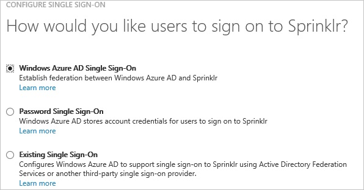

3.  On the **Configure App URL** page, in the **Sprinklr Sign In URL** textbox, type your URL using the following pattern "*https://\<tenant-name\>.sprinklr.com*", and then click **Next**.

    

4.  On the **Configure single sign-on at Sprinklr** page, to download your certificate, click **Download certificate**, and then save the certificate file on your computer.

    

5.  In a different web browser window, log into your Sprinklr company site as an administrator.

6.  Go to **Administration \> Settings**.

    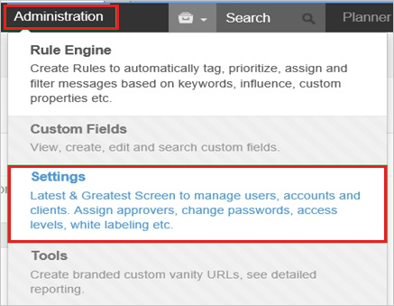

7.  Go to **Manage Partner \> Single Sign** on from the left pane.

    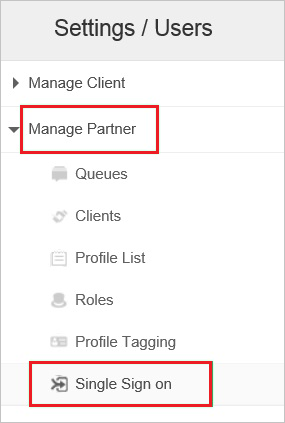

8.  Click **+Add Single Sign Ons**.

    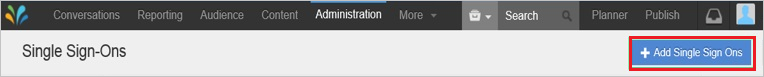

9.  On the **Single Sign on** page, perform the following steps:

    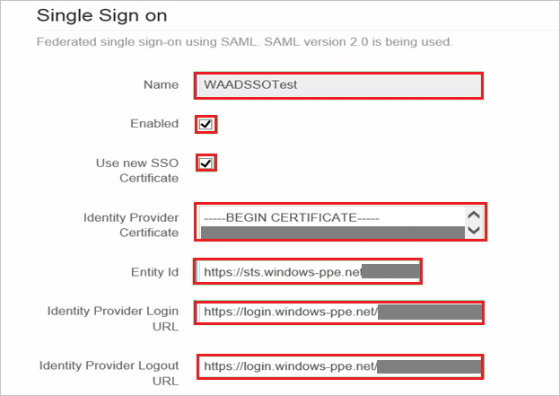

    1.  In the **Name** textbox, type a name for your configuration (e.g.: *WAADSSOTest*).
    2.  Select **Enabled**.
    3.  Select **Use new SSO Certificate**.
    4.  Create a **base-64 encoded** file from your downloaded certificate.  

        >[AZURE.TIP] For more details, see [How to convert a binary certificate into a text file](http://youtu.be/PlgrzUZ-Y1o)

    5.  Open your base-64 encoded certificate in notepad, copy the content of it into your clipboard, and then paste it to the **Identity Provider Certificate** textbox,
    6.  In the Azure classic portal, on the **Configure single sign-on at Sprinklr** dialog page, copy the **Identity Provider ID** value, and then paste it into the **Entity Id** textbox.
    7.  In the Azure classic portal, on the **Configure single sign-on at Sprinklr** dialog page, copy the **Remote Login URL** value, and then paste it into the **Identity Provider Login URL** textbox.
    8.  In the Azure classic portal, on the **Configure single sign-on at Sprinklr** dialog page, copy the **Remote Logout URL** value, and then paste it into the **Identity Provider Logout URL** textbox.
    9.  As **SAML User ID Type**, select **Assertion contains User”s sprinklr.com username**.
    10. As **SAML User ID Location**, select **User ID is in the Name Identifier element of the Subject statement**.
    11. Close **Save**.

        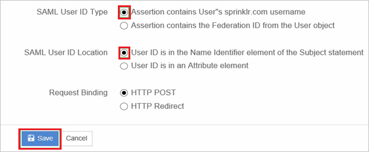

10. On the Azure classic portal, select the single sign-on configuration confirmation, and then click **Complete** to close the **Configure Single Sign On** dialog.

    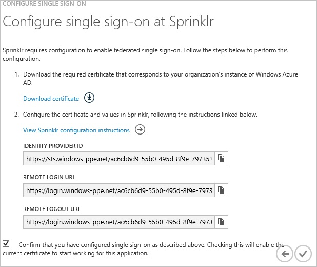

##Configuring user provisioning
  
For AAD users to be able to sign in, they must be provisioned for access inside the Sprinklr application.  
This section describes how to create AAD user accounts inside Sprinklr.

###To provision a user account in Sprinklr, perform the following steps:

1.  Log into your Sprinklr company site as an administrator.

2.  Go to **Administration \> Settings**.

    

3.  Go to **Manage Client \> Users** from the left pane.

    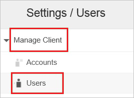

4.  Click **Add User**.

    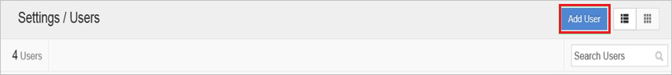

5.  On the **Edit user** dialog, perform the following steps:

    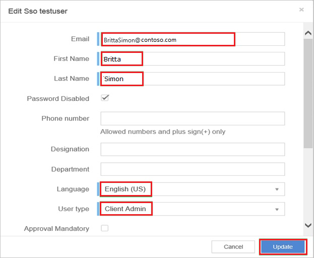

    1.  In the **Email**, **First Name** and **Last Name** textboxes, type the information of an Azure AD user account you want to provision.
    2.  Select **Password Disabled**.
    3.  Select a **Language**.
    4.  Select a **User Type**.
    5.  Click **Update**.

    >[AZURE.IMPORTANT] **Password Disabled** must be selected to enable a user to log in via an Identity provider.

6.  Go to **Role**, and then perform the following steps:

    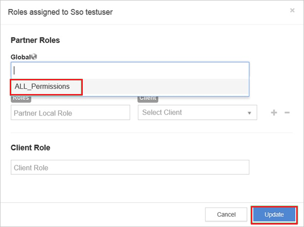

    1.  From the **Global** list, select **ALL\_Permissions**.
    2.  Click **Update**.

>[AZURE.NOTE] You can use any other Sprinklr user account creation tools or APIs provided by Sprinklr to provision Azure AD user accounts.

##Assigning users
  
To test your configuration, you need to grant the Azure AD users you want to allow using your application access to it by assigning them.

###To assign users to Sprinklr, perform the following steps:

1.  In the Azure classic portal, create a test account.

2.  On the **Sprinklr **application integration page, click **Assign users**.

    

3.  Select your test user, click **Assign**, and then click **Yes** to confirm your assignment.

    
  
If you want to test your single sign-on settings, open the Access Panel. For more details about the Access Panel, see [Introduction to the Access Panel](active-directory-saas-access-panel-introduction.md).