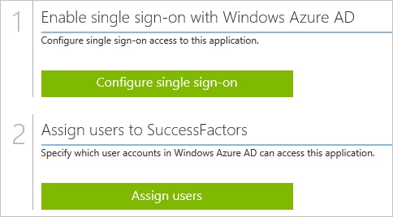
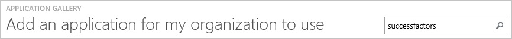
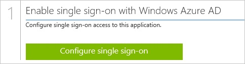
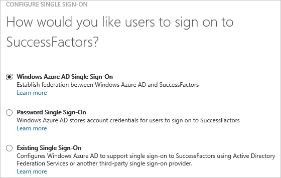
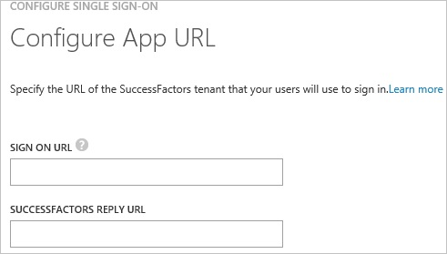
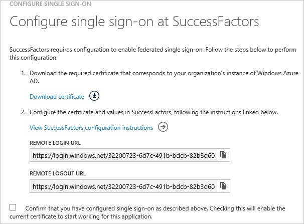
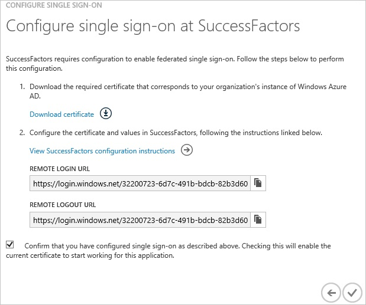
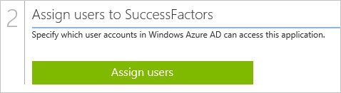

<properties 
    pageTitle="Tutorial: Azure Active Directory integration with SuccessFactors | Microsoft Azure"
    description="Learn how to use SuccessFactors with Azure Active Directory to enable single sign-on, automated provisioning, and more!" 
    services="active-directory" 
    authors="jeevansd"  
    documentationCenter="na" 
    manager="femila"/>
<tags 
    ms.service="active-directory" 
    ms.devlang="na" 
    ms.topic="article" 
    ms.tgt_pltfrm="na" 
    ms.workload="identity" 
    ms.date="06/29/2016" 
    ms.author="jeedes" />

#Tutorial: Azure ActiveDirectory integration with SuccessFactors
  
The objective of this tutorial is to show the integration of Azure and SuccessFactors in **SP initiated single sign-on mode**.  
The scenario outlined in this tutorial assumes that you already have the following items:

-   A valid Azure subscription
-   A SuccessFactors single sign-on enabled subscription in SP initiated mode
  
After completing this tutorial, the Azure AD users you have assigned to SuccessFactors will be able to single sign into the application at your SuccessFactors company site (service provider initiated sign on), or using the [Introduction to the Access Panel](active-directory-saas-access-panel-introduction.md).
  
The scenario outlined in this tutorial consists of the following building blocks:

1.  Enabling the application integration for SuccessFactors
2.  Configuring single sign-on
3.  Configuring user provisioning
4.  Assigning users

##Enabling the application integration for SuccessFactors
  
The objective of this section is to outline how to enable the application integration for SuccessFactors.

###To enable the application integration for SuccessFactors, perform the following steps:

1.  In the Azure classic portal, on the left navigation pane, click **Active Directory**.

    

2.  From the **Directory** list, select the directory for which you want to enable directory integration.

3.  To open the applications view, in the directory view, click **Applications** in the top menu.

    

4.  Click **Add** at the bottom of the page.

    

5.  On the **What do you want to do** dialog, click **Add an application from the gallery**.

    

6.  In the **search box**, type **SuccessFactors**.

    

7.  In the results pane, select **SuccessFactors**, and then click **Complete** to add the application.

    

##Configuring single sign-on
  
The objective of this section is to outline how to enable users to authenticate to SuccessFactors with their account in Azure AD using federation based on the SAML protocol.
  
To get single sign-on configured, you will have to contact your SuccessFactors support team.

###To configure single sign-on, perform the following steps:

1.  In the Azure classic portal, on the **SuccessFactors** application integration page, click **Configure single sign-on** to open the **Configure Single Sign On ** dialog.

    

2.  On the **How would you like users to sign on to SuccessFactors** page, select **Microsoft Azure AD Single Sign-On**, and then click **Next**.

    

3.  On the **Configure App URL** page, perform the following steps, and then click **Next**.

    

    1.  In the **SuccessFactors Sign On URL** textbox, type your URL used by your users to sign on to your SuccessFactors application (e.g.: "*https://performancemanager4.successfactors.com/sf/home?company=CompanyName&loginMethod=SSO*").
    2.  In the **SuccessFactors Reply URL** textbox, type **https://performancemanager4.successfactors.com/saml2/SAMLAssertionConsumer?company=CompanyName**.

        >[AZURE.NOTE] This value is only a temporary placeholder.  
        >You get the actual value from your SuccessFactors support team.  
        >Later in this tutorial, you find instructions for contacting your SuccessFactors support team.  
        >In the context of this conversation, you will receive your actual SuccessFactors Reply URL.

4.  On the **Configure single sign-on at SuccessFactors** page, to download your certificate, click **Download certificate**, and then save the certificate file on your computer.

    

5.  To get SAML based single sign-on configured, contact your SuccessFactors support team and provide them with the following items:

    1.  The downloaded certificate
    2.  The Remote Login URL
    3.  The Remote Logout URL

    >[AZURE.IMPORTANT] Please ask your SuccessFactors support team to set the NameId Format parameter to "*Unspecified*".

    Your Successfactors support team will send you the correct **Successfactors Reply URL** you need for the **Configure App URL** dialog.

6.  On the Azure classic portal, select the single sign-on configuration confirmation, and then click **Complete** to close the **Configure Single Sign On** dialog.

    

##Configuring user provisioning
  
In order to enable Azure AD users to log into SuccessFactors, they must be provisioned into SuccessFactors.  
In the case of SuccessFactors, provisioning is a manual task.
  
To get users created in SuccessFactors, you need to contact the SuccessFactors’ support team.

##Assigning users
  
To test your configuration, you need to grant the Azure AD users you want to allow using your application access to it by assigning them.

###To assign users to SuccessFactors, perform the following steps:

1.  In the Azure classic portal, create a test account.

2.  On the **SuccessFactors **application integration page, click **Assign users**.

    

3.  Select your test user, click **Assign**, and then click **Yes** to confirm your assignment.

    
  
If you want to test your single sign-on settings, open the Access Panel. For more details about the Access Panel, see [Introduction to the Access Panel](active-directory-saas-access-panel-introduction.md).