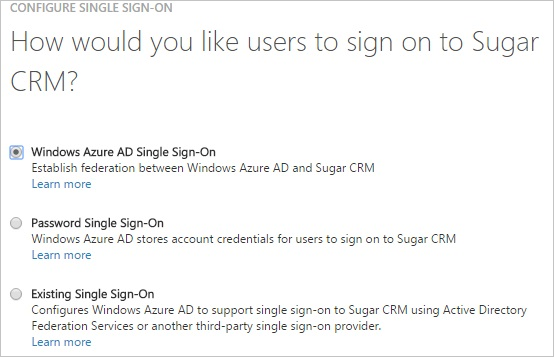
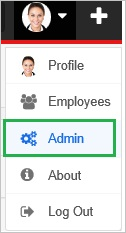
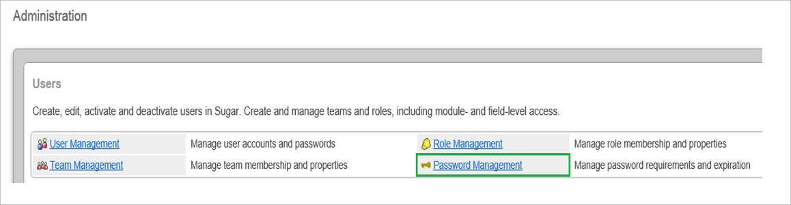
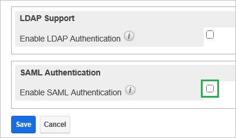
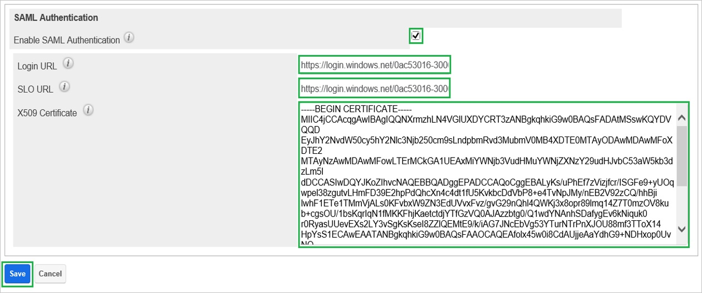
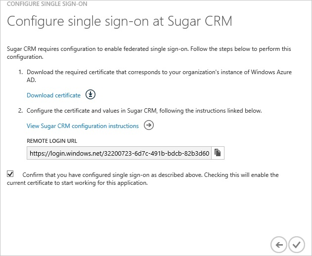
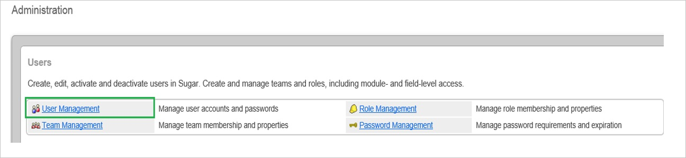
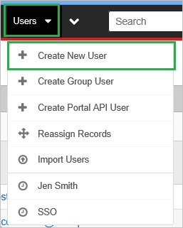
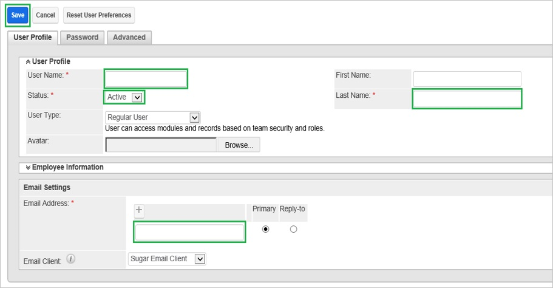
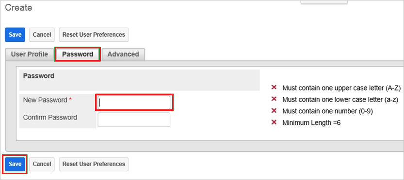

<properties 
    pageTitle="Tutorial: Azure Active Directory integration integration with SugarCRM | Microsoft Azure" 
    description="Learn how to use SugarCRM with Azure Active Directory to enable single sign-on, automated provisioning, and more!" 
    services="active-directory" 
    authors="jeevansd"  
    documentationCenter="na" 
    manager="femila"/>
<tags 
    ms.service="active-directory" 
    ms.devlang="na" 
    ms.topic="article" 
    ms.tgt_pltfrm="na" 
    ms.workload="identity" 
    ms.date="06/29/2016" 
    ms.author="jeedes" />

#Tutorial: Azure Active Directory integration integration with SugarCRM
  
The objective of this tutorial is to show the integration of Azure and Sugar CRM.  
The scenario outlined in this tutorial assumes that you already have the following items:

-   A valid Azure subscription
-   A Sugar CRM single sign-on enabled subscription
  
After completing this tutorial, the Azure AD users you have assigned to Sugar CRM will be able to single sign into the application at your Sugar CRM company site (service provider initiated sign on), or using the [Introduction to the Access Panel](active-directory-saas-access-panel-introduction.md).
  
The scenario outlined in this tutorial consists of the following building blocks:

1.  Enabling the application integration for Sugar CRM
2.  Configuring single sign-on
3.  Configuring user provisioning
4.  Assigning users

##Enabling the application integration for Sugar CRM
  
The objective of this section is to outline how to enable the application integration for Sugar CRM.

###To enable the application integration for Sugar CRM, perform the following steps:

1.  In the Azure classic portal, on the left navigation pane, click **Active Directory**.

    

2.  From the **Directory** list, select the directory for which you want to enable directory integration.

3.  To open the applications view, in the directory view, click **Applications** in the top menu.

    

4.  Click **Add** at the bottom of the page.

    

5.  On the **What do you want to do** dialog, click **Add an application from the gallery**.

    

6.  In the **search box**, type **Sugar CRM**.

    

7.  In the results pane, select **Sugar CRM**, and then click **Complete** to add the application.

    

##Configuring single sign-on
  
The objective of this section is to outline how to enable users to authenticate to Sugar CRM with their account in Azure AD using federation based on the SAML protocol.  
As part of this procedure, you are required to upload a base-64 encoded certificate to your Sugar CRM tenant.  
If you are not familiar with this procedure, see [How to convert a binary certificate into a text file](http://youtu.be/PlgrzUZ-Y1o)

###To configure single sign-on, perform the following steps:

1.  In the Azure classic portal, on the **Sugar CRM** application integration page, click **Configure single sign-on** to open the **Configure Single Sign On ** dialog.

    

2.  On the **How would you like users to sign on to Sugar CRM** page, select **Microsoft Azure AD Single Sign-On**, and then click **Next**.

    

3.  On the **Configure App URL** page, in the **Sugar CRM Sign On URL** textbox, type the URL used by your users to sign-on to your Sugar CRM application (e.g.: "*http://company.sugarondemand.com*", and then click **Next**.

    

4.  On the **Configure single sign-on at Sugar CRM** page, to download your certificate, click **Download certificate**, and then save the certificate file on your computer.

    

5.  In a different web browser window, log into your Sugar CRM company site as an administrator.

6.  Go to **Admin**.

    

7.  In the **Administration** section, click **Password Management**.

    

8.  Select **Enable SAML Authentication**.

    

9.  In the **SAML Authentication** section, perform the following steps:

    

    1.  In the Azure classic portal, on the **Configure single sign-on at Sugar CRM** dialog page, copy the **Remote Login URL** value, and then paste it into the **Login URL** textbox.
    2.  In the Azure classic portal, on the **Configure single sign-on at Sugar CRM** dialog page, copy the **Remote Login URL** value, and then paste it into the **SLO URL** textbox.
    3.  Create a **Base-64 encoded** file from your downloaded certificate.

        >[AZURE.TIP] For more details, see [How to convert a binary certificate into a text file](http://youtu.be/PlgrzUZ-Y1o)

    4.  Open your base-64 encoded certificate in notepad, copy the content of it into your clipboard, and then paste the entire Certificate into **X.509 Certificate** textbox.
    5.  Click **Save**.

10. In the Azure classic portal, on the **Configure single sign-on at Sugar CRM** dialog page, select the single sign-on configuration confirmation, and then click **Complete**.

    

##Configuring user provisioning
  
In order to enable Azure AD users to log into Sugar CRM, they must be provisioned to Sugar CRM.  
In the case of Sugar CRM, provisioning is a manual task.

###To provision a user accounts, perform the following steps:

1.  Log in to your **Sugar CRM** company site as administrator.

2.  Go to **Admin**.

    

3.  In the **Administration** section, click **User Management**.

    

4.  Go to **Users \> Create New User**.

    

5.  On the **User Profile** tab, perform the following steps:

    

    1.  Type the user name, last name and email address of a valid Azure Active Directory user into the related textboxes.

6.  As **Status**, select **Active**.

7.  On the Password tab, perform the following steps:

    

    1.  Type the password into the related textbox.
    2.  Click **Save**.

>[AZURE.NOTE] You can use any other Sugar CRM user account creation tools or APIs provided by Sugar CRM to provision AAD user accounts.

##Assigning users
  
To test your configuration, you need to grant the Azure AD users you want to allow using your application access to it by assigning them.

###To assign users to Sugar CRM, perform the following steps:

1.  In the Azure classic portal, create a test account.

2.  On the **Sugar CRM** application integration page, click **Assign users**.

    

3.  Select your test user, click **Assign**, and then click **Yes** to confirm your assignment.

    
  
If you want to test your single sign-on settings, open the Access Panel. For more details about the Access Panel, see [Introduction to the Access Panel](active-directory-saas-access-panel-introduction.md).