<properties 
    pageTitle="Tutorial: Azure Active Directory integration with SumoLogic | Microsoft Azure" 
    description="Learn how to use SumoLogic with Azure Active Directory to enable single sign-on, automated provisioning, and more!" 
    services="active-directory" 
    authors="jeevansd"  
    documentationCenter="na" 
    manager="femila"/>
<tags 
    ms.service="active-directory" 
    ms.devlang="na" 
    ms.topic="article" 
    ms.tgt_pltfrm="na" 
    ms.workload="identity" 
    ms.date="06/29/2016" 
    ms.author="jeedes" />

#Tutorial: Azure Active Directory Integration with SumoLogic
  
The objective of this tutorial is to show the integration of Azure and SumoLogic.  
The scenario outlined in this tutorial assumes that you already have the following items:

-   A valid Azure subscription
-   A SumoLogic tenant
  
After completing this tutorial, the Azure AD users you have assigned to SumoLogicwill be able to single sign into the application at your SumoLogic company site (service provider initiated sign on), or using the [Introduction to the Access Panel](active-directory-saas-access-panel-introduction.md).
  
The scenario outlined in this tutorial consists of the following building blocks:

1.  Enabling the application integration for SumoLogic
2.  Configuring single sign-on
3.  Configuring user provisioning
4.  Assigning users

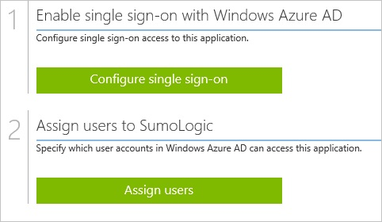

##Enabling the application integration for SumoLogic
  
The objective of this section is to outline how to enable the application integration for SumoLogic.

###To enable the application integration for SumoLogic, perform the following steps:

1.  In the Azure classic portal, on the left navigation pane, click **Active Directory**.

    

2.  From the **Directory** list, select the directory for which you want to enable directory integration.

3.  To open the applications view, in the directory view, click **Applications** in the top menu.

    

4.  Click **Add** at the bottom of the page.

    

5.  On the **What do you want to do** dialog, click **Add an application from the gallery**.

    

6.  In the **search box**, type **sumologic**.

    

7.  In the results pane, select **SumoLogic**, and then click **Complete** to add the application.

    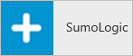

##Configuring single sign-on
  
The objective of this section is to outline how to enable users to authenticate to SumoLogic with their account in Azure AD using federation based on the SAML protocol.  
As part of this procedure, you are required to upload a base-64 encoded certificate to your SumoLogictenant.  
If you are not familiar with this procedure, see [How to convert a binary certificate into a text file](http://youtu.be/PlgrzUZ-Y1o)

###To configure single sign-on, perform the following steps:

1.  In the Azure classic portal, on the **SumoLogic** application integration page, click **Configure single sign-on** to open the **Configure Single Sign On ** dialog.

    

2.  On the **How would you like users to sign on to SumoLogic** page, select **Microsoft Azure AD Single Sign-On**, and then click **Next**.

    

3.  On the **Configure App URL** page, in the **SumoLogic Sign In URL** textbox, type your URL using the following pattern "*https://\<tenant-name\>.SumoLogic.com*", and then click **Next**.

    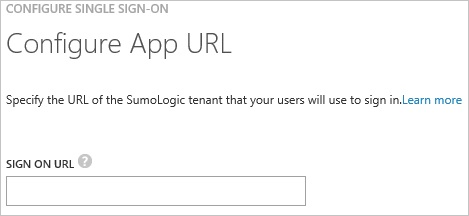

4.  On the **Configure single sign-on at SumoLogic** page, to download your certificate, click **Download certificate**, and then save the certificate file on your computer.

    

5.  In a different web browser window, log into your SumoLogic company site as an administrator.

6.  Go to **Manage \> Security**.

    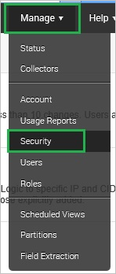

7.  Click **SAML**.

    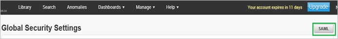

8.  From the **Select a configuration or create a new one** list, select **Azure AD**, and then click **Configure**.

    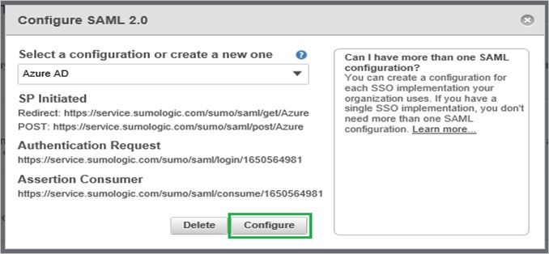

9.  On the **Configure SAML 2.0** dialog, perform the following steps:

    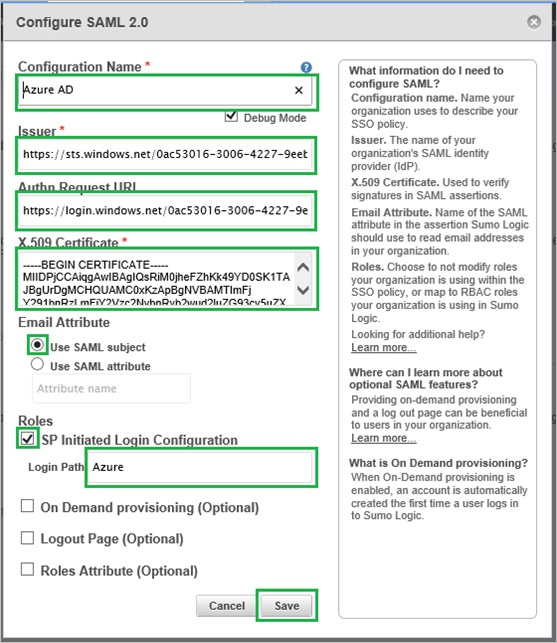

    1.  In the **Configuration Name** textbox, type **Azure AD**.
    2.  Select **Debug Mode**.
    3.  In the Azure classic portal, on the **Configure single sign-on at SumoLogic** dialogue page, copy the **Issuer URL** value, and then paste it into the **Issuer** textbox.
    4.  In the Azure classic portal, on the **Configure single sign-on at SumoLogic** dialogue page, copy the **Authentication Request URL** value, and then paste it into the **Authn Request URL** textbox.
    5.  Create a **Base-64 encoded** file from your downloaded certificate.  

        >[AZURE.TIP] For more details, see [How to convert a binary certificate into a text file](http://youtu.be/PlgrzUZ-Y1o)

    6.  Open your base-64 encoded certificate in notepad, copy the content of it into your clipboard, and then paste the entire Certificate into **X.509 Certificate** textbox.
    7.  As **Email Attribute**, select **Use SAML subject**.
    8.  Select **SP initiated Login Configuration**.
    9.  In the **Login Path** textbox, type **Azure**.
    10. Click **Save**.

10. In the Azure classic portal, on the **Configure single sign-on at SumoLogic** dialogue page, select the single sign-on configuration confirmation, and then click **Complete**.

    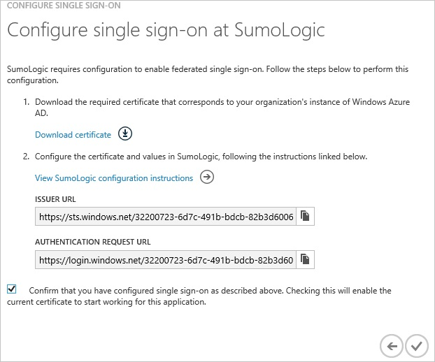

##Configuring user provisioning
  
In order to enable Azure AD users to log into SumoLogic, they must be provisioned to SumoLogic.  
In the case of SumoLogic, provisioning is a manual task.

###To provision a user accounts, perform the following steps:

1.  Log in to your **SumoLogic** tenant.

2.  Go to **Manage \> Users**.

    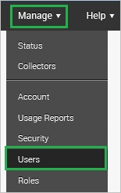

3.  Click **Add**.

    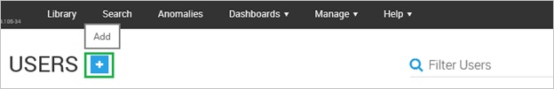

4.  On the **New User** dialog, perform the following steps:

    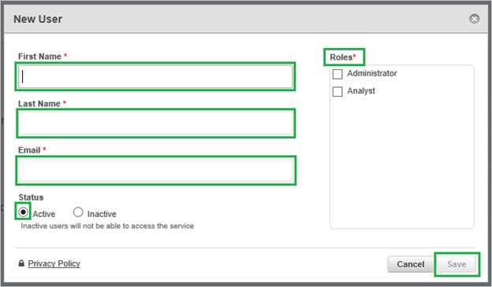

    1.  Type the related information of the Azure AD account you want to provision into the **First Name**, **Last Name** and **Email** textboxes.
    2.  Select a role.
    3.  As **Status**, select **Active**.
    4.  Click **Save**.

>[AZURE.NOTE] You can use any other SumoLogic user account creation tools or APIs provided by SumoLogic to provision AAD user accounts.

##Assigning users
  
To test your configuration, you need to grant the Azure AD users you want to allow using your application access to it by assigning them.

###To assign users to SumoLogic, perform the following steps:

1.  In the Azure classic portal, create a test account.

2.  On the **SumoLogic** application integration page, click **Assign users**.

    

3.  Select your test user, click **Assign**, and then click **Yes** to confirm your assignment.

    
  
If you want to test your single sign-on settings, open the Access Panel. For more details about the Access Panel, see [Introduction to the Access Panel](active-directory-saas-access-panel-introduction.md).